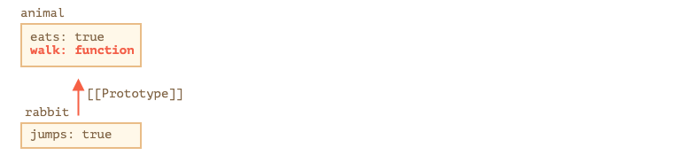

# 现代javascript教程

## 第1部分：JavaScript 编程语言

### 第七章、原型，继承

#### 7.1原型继承

在编程中，我们经常想要获取并扩展一些事情。

例如，我们有一个 `user` 对象及其属性和方法。而且希望将 `admin` 和 `guest` 作为它稍加修改的变体。我们希望重用 `user` 所拥有的内容，而不是复制/实现它的方法，只需要在其上创建一个新的对象。

**原型继承**的语言特性可以帮助我们实现这一需求。

##### [[[Prototype\]]](https://zh.javascript.info/prototype-inheritance#prototype)

在 JavaScript 中，对象有一个特殊的隐藏属性 `[[Prototype]]`（如规范中所命名的），其取值为 `null` 或者是另一个对象的引用。该对象称为“原型”：


`[[Prototype]]` 有一个“神奇”的意义。当我们想要从 `object` 中读取一个缺失的属性时，JavaScript 会自动从原型中获取它。在编程中，这称为“原型继承”。许多很酷的语言特性和编程技巧都是基于它的。

属性 `[[Prototype]]` 是内部的而且隐藏的，但是设置它的方法却有很多种。

其中之一是使用 `__proto__`，就像这样：

```javascript
let animal = {
  eats: true
};
let rabbit = {
  jumps: true
};

rabbit.__proto__ = animal;
```

请注意 `__proto__` 与 `[[Prototype]]` **不一样**。这是一个 getter/setter。我们之后会讨论如何设置它，但是现在 `__proto__` 工作的很好。

如果我们在 `rabbit` 中查找一个缺失的属性，JavaScript 会自动从 `animal` 中获取它。

例如：

```javascript
let animal = {
  eats: true
};
let rabbit = {
  jumps: true
};

rabbit.__proto__ = animal; // (*)

// we can find both properties in rabbit now:
alert( rabbit.eats ); // true (**)
alert( rabbit.jumps ); // true
```

这里的 `(*)` 行将 `animal` 设置为 `rabbit` 的原型。

当 `alert` 试图读取 `rabbit.eats` `(**)` 时，因为它不存在于 `rabbit`，JavaScript 会遵循 `[[Prototype]]` 引用，并在 `animal` 中查找（自下而上）：


我们可以说 "`animal` 是 `rabbit`" 的原型或者说 "`rabbit` 的原型继承自 `animal`"。

因此如果 `animal` 有许多有用的属性和方法，那么它们在 `rabbit` 中会自动变为可用的。这种属性行为称为“继承”。

如果我们在 `animal` 中有一种方法，它可以在 `rabbit` 中被调用：

```javascript
let animal = {
  eats: true,
  walk() {
    alert("Animal walk");
  }
};

let rabbit = {
  jumps: true,
  __proto__: animal
};

// walk is taken from the prototype
rabbit.walk(); // Animal walk
```

该方法自动从原型中提取，如下所示：



原型链可以很长：

```javascript
let animal = {
  eats: true,
  walk() {
    alert("Animal walk");
  }
};

let rabbit = {
  jumps: true,
  __proto__: animal
};

let longEar = {
  earLength: 10,
  __proto__: rabbit
}

// walk is taken from the prototype chain
longEar.walk(); // Animal walk
alert(longEar.jumps); // true (from rabbit)
```


实际上只有两个限制：

1. 引用不能形成闭环。如果我们试图在一个闭环中分配 `__proto__`，JavaScript 会抛出异常。
2. `__proto__` 的值可以是对象，也可以是 `null`。所有其他的值（例如原语）都会被忽略。

这也可能是显而易见的，即：只能有一个 `[[Prototype]]`。对象不能继承自其他两个对象。

##### [读写规则](https://zh.javascript.info/prototype-inheritance#du-xie-gui-ze)

原型仅用于读取属性。

对于数据属性（不是 getters/setters）写/删除操作直接在对象上进行操作。

在以下示例中，我们将 `walk` 方法分配给 `rabbit`：

```javascript
let animal = {
  eats: true,
  walk() {
    /* this method won't be used by rabbit */
  }
};

let rabbit = {
  __proto__: animal
}

rabbit.walk = function() {
  alert("Rabbit! Bounce-bounce!");
};

rabbit.walk(); // Rabbit! Bounce-bounce!
```

从现在开始，`rabbit.walk()` 调用将立即在对象中找到方法并执行它，而不是使用原型：


对于 getters/setters —— 如果我们读写一个属性，就会在原型中查找并调用它们。

例如，在以下代码中检查出 `admin.fullName` 属性：

```javascript
let user = {
  name: "John",
  surname: "Smith",

  set fullName(value) {
    [this.name, this.surname] = value.split(" ");
  },

  get fullName() {
    return `${this.name} ${this.surname}`;
  }
};

let admin = {
  __proto__: user,
  isAdmin: true
};

alert(admin.fullName); // John Smith (*)

// setter triggers!
admin.fullName = "Alice Cooper"; // (**)
```

这里的 `(*)` 属性 `admin.fullName` 在原型 `user` 中有一个 getter，因此它会被调用。在 `(**)` 中，属性在原型中有一个 setter，因此它会被调用。

**要注意继承的obj读写一个属性都是在读写自己的属性，不会影响父对象。**

##### [“this” 的值](https://zh.javascript.info/prototype-inheritance#this-de-zhi)

在上面的例子中可能会出现一个有趣的现象：在 `set fullName(value)` 中 `this` 的值是什么？属性 `this.name` 和 `this.surname` 写在哪里： `user` 还是 `admin`？

答案很简单：`this` 根本不受原型的影响。

**无论在哪里找到方法：在对象或者原型中。调用方法时，`this` 始终是点之前的对象。**

因此，实际上 setter 使用 `admin` 作为 `this`，而不是 `user`。

这是一件非常重要的事情，因为我们可能有一个有很多方法而且继承它的大对象。然后我们可以在继承的对象上运行它的方法，它们将修改这些对象的状态，而不是大对象的。

例如，这里的 `animal` 代表“方法存储”，而且 `rabbit` 在使用它。

调用 `rabbit.sleep()`，在 `rabbit` 对象上设置 `this.isSleeping`：

```javascript
// animal has methods
let animal = {
  walk() {
    if (!this.isSleeping) {
      alert(`I walk`);
    }
  },
  sleep() {
    this.isSleeping = true;
  }
};

let rabbit = {
  name: "White Rabbit",
  __proto__: animal
};

// modifies rabbit.isSleeping
rabbit.sleep();

alert(rabbit.isSleeping); // true
alert(animal.isSleeping); // undefined (no such property in the prototype)
```

结果：


如果我们从 `animal` 继承像 `bird`、`snake` 等其他对象，他们也将获取 `animal` 的方法。但是每个方法 `this` 都是相应的对象，而不是 `animal`，在调用时（在点之前）确定。因此当我们将数据写入 `this` 时，它会被存储进这些对象中。

因此，**<u>方法是共享的，但对象状态不是</u>**。

##### [总结](https://zh.javascript.info/prototype-inheritance#zong-jie)

- JavaScript 中，所有的对象都有一个隐藏的 `[[Prototype]]` 属性，它可以是另一个对象或者 `null`。
- 我们可以使用 `obj.__proto__` 进行访问（还有其他方法，但很快就会被覆盖）。
- `[[Prototype]]` 引用的对象称为“原型”。
- 如果我们想要读取 `obj` 属性或者调用一个方法，而且它不存在，那么 JavaScript 就会尝试在原型中查找它。写/删除直接在对象上进行操作，它们不使用原型（除非属性实际上是一个 setter）。
- 如果我们调用 `obj.method()`，而且 `method` 是从原型中获取的，`this` 仍然会引用 `obj`。因此方法重视与当前对象一起工作，即使它们是继承的。

##### 习题

###### [为什么两只仓鼠都饱了？](https://zh.javascript.info/prototype-inheritance#wei-shi-mo-liang-zhi-cang-shu-du-bao-le)

我们有两只仓鼠：`speedy` 和 `lazy` 都继承自普通的 `hamster` 对象。

当我们喂一只的同时，另一只也吃饱了。为什么？如何修复这件事？

```javascript
let hamster = {
  stomach: [],

  eat(food) {
    this.stomach.push(food);
  }
};

let speedy = {
  __proto__: hamster
};

let lazy = {
  __proto__: hamster
};

// This one found the food
speedy.eat("apple");
alert( speedy.stomach ); // apple

// This one also has it, why? fix please.
alert( lazy.stomach ); // apple
```

**解决方案**

我们仔细研究一下在调用 `speedy.eat("apple")` 的时候，发生了什么。

1. `speedy.eat` 方法在原型（`=hamster`）中被发现，然后执行 `this=speedy`（在点之前的对象）。
2. `this.stomach.push()` 需要查找到 `stomach` 属性，然后调用 `push` 来处理。它在 `this` (`=speedy`) 中查找 `stomach`，但并没有找到。
3. 然后它顺着原型链，在 `hamster` 中找到 `stomach`。
4. 然后它调用 `push` ，将食物添加到**胃的原型链**中。

因此所有的仓鼠都有共享一个胃！

每次 `stomach` 从原型中获取，然后 `stomach.push` 修改它的“位置”。

请注意，这种情况在 `this.stomach=` 进行简单的赋值情况下不会发生：

```javascript
let hamster = {
  stomach: [],

  eat(food) {
    // assign to this.stomach instead of this.stomach.push
    this.stomach = [food];
  }
};

let speedy = {
   __proto__: hamster
};

let lazy = {
  __proto__: hamster
};

// Speedy one found the food
speedy.eat("apple");
alert( speedy.stomach ); // apple

// Lazy one's stomach is empty
alert( lazy.stomach ); // <nothing>
```

现在，所有的都在正常运行，因为 `this.stomach=` 不会在 `stomach` 中执行查找。该值会被直接写入 `this`对象。

此外，我们还可以通过确保每只仓鼠都有自己的胃来完全回避这个问题：

```javascript
let hamster = {
  stomach: [],

  eat(food) {
    this.stomach.push(food);
  }
};

let speedy = {
  __proto__: hamster,
  stomach: []
};

let lazy = {
  __proto__: hamster,
  stomach: []
};

// Speedy one found the food
speedy.eat("apple");
alert( speedy.stomach ); // apple

// Lazy one's stomach is empty
alert( lazy.stomach ); // <nothing>
```

作为一种常见的解决方案，描述特定对象状态的所有属性，如上述的 `stomach`，通常都被写入到该对象中。这防止了类似问题的出现。

#### 7.2函数原型

正如我们已经知道的那样，`new F()` 创建一个新对象。

当用 `new F()` 创建一个新对象时，该对象的 `[[Prototype]]` 被设置为 `F.prototype`。

------

**请注意：**

JavaScript 从一开始就有了原型继承。这是该语言的核心特征之一。

但在过去，我们是无法直接对其进行访问的。唯一可靠的设置方法是使用构造函数的“prototype”属性。我们将在本章对其进行讨论。即使现在，还是有很多使用它的脚本。

------

请注意，`F.prototype` 意味着在 `F` 上有一个名为 `"prototype"` 的常规属性。这听起来与“原型”这个术语很相似，但在这里我们的意思是指有这个名字的常规属性。

这是一个例子：

```javascript
let animal = {
  eats: true
};

function Rabbit(name) {
  this.name = name;
}

Rabbit.prototype = animal;

let rabbit = new Rabbit("White Rabbit"); //  rabbit.__proto__ == animal

alert( rabbit.eats ); // true
```

设置 `Rabbit.prototype = animal` 的这段代码表达的意思是：“当 `new Rabbit` 创建时，把它的 `[[Prototype]]`赋值为 `animal`” 。

这是结果图：


在图片上，`"prototype"` 是一个水平箭头，它是一个常规属性，`[[Prototype]]` 是垂直的，意味着是继承自 `animal`的 `rabbit`。

------

**`F.prototype`仅用于`new F`时**

`F.prototype` 属性仅在 `new F` 调用时使用，它为新对象的 `[[Prototype]]` 赋值。在此之后，`F.prototype` 和新对象之间就分道扬镳了。可以将其看为一个“单次赠与”效果。

如果在创建之后 `F.prototype` 属性有了变化(`F.prototype = `)，那么 `new F` 创建的新对象也将随之拥有新的 `[[Prototype]]`。但已经存在的对象将保持旧有的值。

##### [默认的函数原型，构造函数属性](https://zh.javascript.info/function-prototype#mo-ren-de-han-shu-yuan-xing-gou-zao-han-shu-shu-xing)

每个函数都有 `"prototype"` 属性，即使我们不设置它。

默认的 `"prototype"` 是一个只有属性 `constructor` 的对象，它指向函数本身。

像这样：

```javascript
function Rabbit() {}

/* default prototype
Rabbit.prototype = { constructor: Rabbit };
*/
```


我们可以检查一下：

```javascript
function Rabbit() {}
// by default:
// Rabbit.prototype = { constructor: Rabbit }

alert( Rabbit.prototype.constructor == Rabbit ); // true
```

当然，如果我们什么都不做，`constructor` 属性可以通过 `[[Prototype]]` 给所有 rabbits 对象使用：

```javascript
function Rabbit() {}
// by default:
// Rabbit.prototype = { constructor: Rabbit }

let rabbit = new Rabbit(); // inherits from {constructor: Rabbit}

alert(rabbit.constructor == Rabbit); // true (from prototype)
```


我们可以用 `constructor` 属性使用与现有构造函数相同的构造函数创建一个新对象。

像这样：

```javascript
function Rabbit(name) {
  this.name = name;
  alert(name);
}

let rabbit = new Rabbit("White Rabbit");

let rabbit2 = new rabbit.constructor("Black Rabbit");
```

当我们有一个对象，但不知道为它使用哪个构造函数（比如它来自第三方库），而且我们需要创建另一个相似的函数时，用这种方法就很方便。

但关于 `"constructor"` 最重要的是……

**…JavaScript 本身并不能确保正确的 `"constructor"` 函数值。**

是的，它存在于函数的默认 `"prototype"` 中，但仅此而已。之后会发生什么 —— 完全取决于我们自己。

特别是，如果我们将整个默认原型替换掉，那么其中就不会有构造函数。

例如：

```javascript
function Rabbit() {}
Rabbit.prototype = {
  jumps: true
};

let rabbit = new Rabbit();
alert(rabbit.constructor === Rabbit); // false
```

因此，为了确保正确的 `"constructor"`，我们可以选择添加/删除属性到默认 `"prototype"` 而不是将其整个覆盖：

```javascript
function Rabbit() {}

// Not overwrite Rabbit.prototype totally
// just add to it
Rabbit.prototype.jumps = true
// the default Rabbit.prototype.constructor is preserved
```

或者，也可以手动重新创建 `constructor` 属性：

```javascript
Rabbit.prototype = {
  jumps: true,
  constructor: Rabbit
};

// 这样的 constructor 也是正确的，因为我们手动添加了它
```

写一个更复杂的例子：

```javascript
let animal = {
  eats: true
};

function Rabbit(name) {
  this.name = name;
}

Rabbit.prototype = {
  jumps: true,
  ...animal, // 继承animal的属性
  constructor: Rabbit // 手动添加constructor
};

let rabbit = new Rabbit("White Rabbit");
alert(rabbit.constructor === Rabbit); // true
console.log( rabbit.__proto__ ); // [object Object]
console.log( rabbit.eats ); // true
console.log( rabbit.jumps ); // true
```

##### [总结](https://zh.javascript.info/function-prototype#zong-jie)

在本章中，我们简要介绍了如何为通过构造函数创建的对象设置一个 `[[Prototype]]`。稍后我们将看到更多依赖于它的高级编程模式。

一切都很简单，只需要几条笔记就能说清楚：

- `F.prototype` 属性与 `[[Prototype]]` 不同。`F.prototype` 唯一的作用是：当 `new F()` 被调用时，它设置新对象的 `[[Prototype]]`。
- `F.prototype` 的值应该是一个对象或 null：其他值将不起作用。
- `"prototype"` 属性在设置为构造函数时仅具有这种特殊效果，并且用 `new` 调用。

在常规对象上，`prototype` 没什么特别的：

```javascript
let user = {
  name: "John",
  prototype: "Bla-bla" // 没什么神秘的
};
```

默认情况下，所有函数都有 `F.prototype = {constructor：F}`，所以我们可以通过访问它的 `"constructor"` 属性来获得对象的构造函数。

##### 习题

###### [Changing "prototype"](https://zh.javascript.info/function-prototype#changingprototype)

在下面的代码中，我们创建了 `new Rabbit`，然后尝试修改其原型。

一开始，我们有这样的代码：

```javascript
function Rabbit() {}
Rabbit.prototype = {
  eats: true
};

let rabbit = new Rabbit();

alert( rabbit.eats ); // true
```

1. 我们增加了一个字符串（强调），`alert` 现在会显示什么？

   ```javascript
   function Rabbit() {}
   Rabbit.prototype = {
     eats: true
   };
   
   let rabbit = new Rabbit();
   
   Rabbit.prototype = {};
   
   alert( rabbit.eats ); // ?
   ```

2. …如果代码是这样的（换了一行）？

   ```javascript
   function Rabbit() {}
   Rabbit.prototype = {
     eats: true
   };
   
   let rabbit = new Rabbit();
   
   Rabbit.prototype.eats = false;
   
   alert( rabbit.eats ); // ?
   ```

3. 像这样呢（换了一行）？

   ```javascript
   function Rabbit() {}
   Rabbit.prototype = {
     eats: true
   };
   
   let rabbit = new Rabbit();
   
   delete rabbit.eats;
   
   alert( rabbit.eats ); // ?
   ```

4. 最后一种情况：

   ```javascript
   function Rabbit() {}
   Rabbit.prototype = {
     eats: true
   };
   
   let rabbit = new Rabbit();
   
   delete Rabbit.prototype.eats;
   
   alert( rabbit.eats ); // ?
   ```

**解决方案**

   Answers:

   1. `true`。

      赋值操作 `Rabbit.prototype` 为新对象设置了 `[[Prototype]]`，但它不影响现有的对象。

   2. `false`。

      对象通过引用进行赋值。来自 `Rabbit.prototype` 的对象没有被复制，它仍然是由 `Rabbit.prototype`和 `rabbit` 的 `[[Prototype]]` 引用的单个对象。

      所以当我们通过一个引用来改变它的上下文时，它对其他引用来说是可见的。

   3. `true`。

      所有 `delete` 操作都直接应用于对象。这里 `delete rabbit.eats` 试图从 `rabbit` 中删除 `eats` 属性，但 `rabbit` 对象并没有 `eats` 属性。所以这个操作不会有任何 副作用。

   4. `undefined`。

      属性 `eats` 从原型中删除，它不再存在。

**个人理解**

只有`prototype`被重新定义后，修改新定义的`prototype`的具体属性才不会影响之前创建的对象，也就是说`prototype`只与使用它`new`出的对象存在引用关系，但是我们只能显示修改最新一次定义的`prototype`的属性。讲的有点乱，看个扩展栗子：

```javascript
function Rabbit() {}
Rabbit.prototype = {
  eats: true
};

let rabbit1 = new Rabbit(); // 引用了上面的prototype

Rabbit.prototype = {
  eats: false
};

let rabbit2 = new Rabbit(); // 引用了新定义的的prototype
delete Rabbit.prototype.eats; // 删除新定义的prototype的eats
alert( rabbit1.eats ); // 从之前引用的prototype取值 true
alert( rabbit2.eats ); // 从新的prototype取值 undefined
```

#### 7.3原生的原型

`"prototype"` 属性在 JavaScript 自身的核心模块中被广泛应用。所有的内置构造函数都用到了它。

我们将会首先看到原型对于简单对象是什么样的，然后对于更多的复杂对象又是什么样的。

##### [Object.prototype](https://zh.javascript.info/native-prototypes#objectprototype)

假设我们输出一个空对象：

```javascript
let obj = {};
alert( obj ); // "[object Object]" ?
```

生成字符串 `"[object Object]"` 的代码在哪里？那就是内置的一个 `toString` 方法，但是它在哪里呢？`obj` 是空的！

…然而简短的表达式 `obj = {}` 和 `obj = new Object()` 是一个意思，其中 `Object` 是一个内置的对象构造函数。并且这个方法有一个 `Object.prototype` 属性，这个属性引用了一个庞大的对象，这个庞大的对象有 `toString` 方法和其他的一些方法。

就像这样（所有的这些都是内置的）：


当 `new Object()` 被调用来创建一个对象（或者一个字面量对象 `{...}` 被创建），按照前面章节的讨论规则，这个对象的 `[[Prototype]]` 属性被设置为 `Object.prototype`：


之后当 `obj.toString()` 被调用时，这个方法是在 `Object.prototype` 中被取到的。

我们可以这样验证它：

```javascript
let obj = {};

alert(obj.__proto__ === Object.prototype); // true
// obj.toString === obj.__proto__.toString == Object.prototype.toString
```

请注意在 `Object.prototype` 上没有额外的 `[[Prototype]]` 属性：

```javascript
alert(Object.prototype.__proto__); // null
```

##### [其他内置原型](https://zh.javascript.info/native-prototypes#qi-ta-nei-zhi-yuan-xing)

像 `Array`、`Date`、`Function` 和其他的内置对象都在原型对象上挂载方法。

例如，当我们创建一个数组 `[1, 2, 3]`，内部使用默认的 `new Array()` 构造函数。因此这个数组数据被写进了这个新的数组对象，并且 `Array.prototype` 成为这个数组对象的原型且为数组对象提供数组的操作方法。这样内存的存储效率是很高的。

按照规范，所有的内置原型顶端都是 `Object.prototype`。有些时候人们说“一切都从对象上继承而来”。

下面是完整的示意图（3 个内置对象）：


让我们手动验证原型：

```javascript
let arr = [1, 2, 3];

// it inherits from Array.prototype?
alert( arr.__proto__ === Array.prototype ); // true

// then from Object.prototype?
alert( arr.__proto__.__proto__ === Object.prototype ); // true

// and null on the top.
alert( arr.__proto__.__proto__.__proto__ ); // null
```

一些方法可能在原型上发生重叠，例如，`Array.prototype` 有自己的 `toString` 方法来列举出来数组的所有元素并用逗号分隔每一个元素。

```javascript
let arr = [1, 2, 3]
alert(arr); // 1,2,3 <-- the result of Array.prototype.toString
```

正如我们之前看到的那样，`Object.prototype` 也有 `toString` 方法，但是 `Array.prototype` 在原型链上是更近的，所以数组对象原型上的方法会被使用。


像 Chrome 开发者控制台这样的浏览器内置工具也显示继承关系的（可能需要对内置对象使用 `console.dir`）：


其他内置对象以同样的方式运行。即使是函数。它们是内置构造函数 `Function` 创建出来的对象，并且他们的方法：`call/apply` 和其他方法都来自 `Function.prototype`。函数也有自己的 `toString` 方法。

```javascript
function f() {}

alert(f.__proto__ == Function.prototype); // true
alert(f.__proto__.__proto__ == Object.prototype); // true, inherit from objects
```

##### [基本数据类型](https://zh.javascript.info/native-prototypes#ji-ben-shu-ju-lei-xing)

最复杂的事情发生在字符串、数字和布尔值上。

正如我们记忆中的那样，它们并不是对象。但是如果我们试图访问它们的属性，那么临时的包装对象将会被内置的构造函数`String`、 `Number` 或 `Boolean`创建，它们提供给我们操作字符串、数字和布尔值的方法然后藏匿起来。（译者注：这里的“隐匿起来”应该是指我们在打印这些值的时候看不到对象的方法）

这些对象对我们来说是被无形的创造出来的且大多数引擎优化了它们，而规范精准的描述了这种方式。这些对象的方法也驻留在它们的原型 `String.prototype`、`Number.prototype` 和 `Boolean.prototype` 中。

------

**值 `null` 和 `undefined` 没有对象包装**

特殊值 `null` 和 `undefined` 要被区分看待。它们没有对象包装，所以它们没有自己的方法和属性。并且它们没有相应的原型。

##### [更改原生原型](https://zh.javascript.info/native-prototypes#原生-原型-更改)

原生的原型是可以被修改的。例如，我们在 `String.prototype` 中添加一个方法，这个方法对所有的字符串都是可用的：

```javascript
String.prototype.show = function() {
  alert(this);
};

"BOOM!".show(); // BOOM!
```

在开发的过程中我们可能会想在内置对象上创建一个我们想要的方法。把他们添加到原生对象的原型中可能看起来不错，但那样通常来说是个坏主意。

原型是全局的，所以很容易造成冲突。如果有两个代码段都添加了 `String.prototype.show` 方法，那么其中一个将覆盖另外一个。

在现代编程中，只有一种情况下修改原生原型是被允许的。那就是在做 polyfills （译者注：兼容）的时候。换句话说，如果有一个 JavaScript 规范还没有被我们的 JavaScript 引擎支持（或者我们希望被支持的那些规范），那么需要手动实现这些规范并且把这些手动实现填充到内置对象的原型上。

例如：

```javascript
if (!String.prototype.repeat) { //假设没有这个方法
  //把它添加到原型上

  String.prototype.repeat = function(n) {
    //重复字符串 n 次

    //实际上代码是比这个更复杂的，
    //当 "n" 的值为负数的时候抛出异常
    //完整的算法在规范中
    return new Array(n + 1).join(this);
  };
}

alert( "La".repeat(3) ); // LaLaLa
```

##### [从原型中借用](https://zh.javascript.info/native-prototypes#cong-yuan-xing-zhong-jie-yong)

在 [装饰和转发，call/apply](https://zh.javascript.info/call-apply-decorators#method-borrowing) 章节中我们讨论的方法借用：

```javascript
function showArgs() {
  // 从数组借用 join 方法并在 arguments 的上下文中调用
  alert( [].join.call(arguments, " - ") );
}

showArgs("John", "Pete", "Alice"); // John - Pete - Alice
```

因为 `join` 方法在 `Array.prototype` 对象上，我们可以直接调用它并且重写上面的代码：

```javascript
function showArgs() {
  alert( Array.prototype.join.call(arguments, " - ") );
}
```

这样是更有效率的，因为它避免了一个额外数组对象 `[]` 的创建。另一方面，这样做，需要更长的时间来编写。

##### [总结](https://zh.javascript.info/native-prototypes#zong-jie)

- 所有的内置对象都遵循一样的模式：
  - 方法都存储在原型对象上（`Array.prototype`、`Object.prototype`、`Date.prototype` 等）。
  - 对象本身只存储数据（数组元素、对象属性、日期）。
- 基本数据类型同样在包装对象的原型上存储方法：`Number.prototype`、`String.prototype` 和 `Boolean.prototype`。只有 `undefined` 和 `null` 没有包装对象。
- 内置对象的原型可以被修改或者被新的方法填充。但是这样做是不被推荐的。只有当添加一个还没有被 JavaScript 引擎支持的新方法的时候才可能允许这样做。

#### 7.4原型方法

本章节我们会讨论原型（prototype）的附加方法。

获取/设置原型的方式有很多，我们已知的有：

- [Object.create(proto[, descriptors\])](https://developer.mozilla.org/zh/docs/Web/JavaScript/Reference/Global_Objects/Object/create) —— 利用 `proto` 作为 `[[Prototype]]` 和可选的属性描述来创建一个空对象。
- [Object.getPrototypeOf(obj)](https://developer.mozilla.org/zh/docs/Web/JavaScript/Reference/Global_Objects/Object/getPrototypeOf) —— 返回 `obj` 对象的 `[[Prototype]]`。
- [Object.setPrototypeOf(obj, proto)](https://developer.mozilla.org/zh/docs/Web/JavaScript/Reference/Global_Objects/Object/setPrototypeOf) —— 将 `obj` 对象的 `[[Prototype]]` 设置为 `proto`。

举个例子：

```javascript
let animal = {
  eats: true
};

// 以 animal 为原型创建一个新对象
let rabbit = Object.create(animal);

alert(rabbit.eats); // true
alert(Object.getPrototypeOf(rabbit) === animal); // 获取 rabbit 的原型

Object.setPrototypeOf(rabbit, {}); // 将 rabbit 的原型更改为 {}
```

`Object.create` 有一个可选的第二参数：属性描述。我们可以给新对象提供额外的属性，就像这样：

```javascript
let animal = {
  eats: true
};

let rabbit = Object.create(animal, {
  jumps: {
    value: true
  }
});

alert(rabbit.jumps); // true
```

参数的格式同 [属性的标志和描述符](https://zh.javascript.info/property-descriptors) 章节中讨论的相同。

我们可以利用 `Object.create` 来实现比 `for..in` 循环赋值属性方式更强大的对象复制功能：

```javascript
// obj 对象的浅复制
let clone = Object.create(Object.getPrototypeOf(obj), Object.getOwnPropertyDescriptors(obj));
```

这样实现了 `obj` 的完整复制，包含了所有属性：可枚举的和不可枚举的，数据属性以及 seeters/getters —— 所有属性，以及正确的 `[[Prototype]]`。

##### [原型简史](https://zh.javascript.info/prototype-methods#yuan-xing-jian-shi)

如果我们计算有多少种方式来管理 `[[Prototype]]`，答案是很多！很多种方式！

为什么会出现这样的情况？

这里有历史遗留问题。

- 在上古时代 `prototype` 作为一个构造函数的属性来运行。
- 之后在 2012 年： `Object.create` 出现在标准中。它允许利用给定的原型来创建对象，但是不能 get/set 原型。因此许多浏览器厂商实现了非标准属性 `__proto__`，允许任何时候 get/set 原型。
- 之后在 2015 年： `Object.setPrototypeOf` 和 `Object.getPrototypeOf` 被加入到标准中。 `__proto__` 在几乎所有地方都得到实现，因此它成了标准以外的替代方案 B，在非浏览器环境下，它的支持性是不确定的，可选的。

目前为止，我们拥有了所有这些方式。

从技术上来讲，我们可以在任何时候 get/set `[[Prototype]]`。但是通常我们只在创建对象的时候设置它一次，自那之后不再修改：`rabbit` 继承自 `animal`，之后不再改变。对此 JavaScript 引擎做了高度的优化。运行中利用 `Object.setPrototypeOf` 或者 `obj.__proto__=` 来更改 prototype 是一个非常缓慢的操作。但是，这是可行的。

##### [「极简」对象](https://zh.javascript.info/prototype-methods#ji-jian-dui-xiang)

我们知道，对象可以当做关联数组来存储键值对。

…但是如果我们尝试存储**用户提供的**键（比如说：一个用户输入的字典），我们可以发现一个有趣的错误：所有的键都运行正常，除了 `"__proto__"`。

看一下这个例子：

```javascript
let obj = {};

let key = prompt("What's the key?", "__proto__");
obj[key] = "some value";

alert(obj[key]); // [object Object]，而不是 "some value"！
```

这里如果用户输入 `__proto__`，那么赋值将会被忽略！

我们不应该感到惊讶。`__proto__` 属性很特别：它必须是对象或者 `null` 值，字符串不能成为 prototype。

但是我们并不想实现这样的行为，对吗？我们想要存储键值对，然而键名为 `"__proto__"` 没有被正确存储。所以这是一个错误。在这里，结果并没有很严重。但是在其他用例中，prototype 可能被改变，因此可能导致完全意想不到的结果。

最可怕的是 —— 通常开发者完全不会考虑到这一点。这让类似的 bug 很难被发现，甚至使得它们容易遭到攻击，特别是当 JavaScript 被用在服务端的时候。

这样的情况只出现在 `__proto__` 上，所有其他的属性都是正常被「赋值」。

怎么样避免这个错误呢？

首先，我们可以改用 `Map`，那么一切都迎刃而解。

但是 `Object` 同样可以运行得很好，因为语言制造者很早以前就注意到这一点。

`__proto__` 根本不是一个对象的属性，只是 `Object.prototype` 的访问属性：


因此，如果 `obj.__proto__` 被读取或者赋值，那么对应的 getter/setter 从它的原型被调用，它会获取/设置 `[[Prototype]]`。

就像开头所说：`__proto__` 是访问 `[[Prototype]]` 的方式，而不是 `[[prototype]]` 本身。

现在，我们想要使用一个对象作为关联数组，我们可以用一个小技巧：

```javascript
let obj = Object.create(null);

let key = prompt("What's the key?", "__proto__");
obj[key] = "some value";

alert(obj[key]); // "some value"
```

`Object.create(null)` 创建了一个空对象，这个对象没有原型（`[[Prototype]]` 是 `null`）：


因此，它没有继承 `__proto__` 的 getter/setter 方法。现在它像正常的数据属性一样运行，因此以上的例子运行正确。

我们可以叫这样的对象「极简」或者「纯字典对象」，因此它们甚至比通常的简单对象 `{...}` 还要简单。

这样的对象有一个缺点是缺少内置的对象方法，比如说 `toString`：

```javascript
let obj = Object.create(null);

alert(obj); // Error （没有 toString 方法）
```

…但是它们通常对关联数组而言还是很友好。

请注意，和对象关系最密切的方法是 `Object.something(...)`，比如 `Object.keys(obj)` —— 它们不在 prototype 中，因此在极简对象中它们还是可以继续使用：

```javascript
let chineseDictionary = Object.create(null);
chineseDictionary.hello = "ni hao";
chineseDictionary.bye = "zai jian";

alert(Object.keys(chineseDictionary)); // hello,bye
```

##### [获取所有属性](https://zh.javascript.info/prototype-methods#huo-qu-suo-you-shu-xing)

获取一个对象的键/值有很多种方法。

我们已知的有：

- [Object.keys(obj)](https://developer.mozilla.org/zh/docs/Web/JavaScript/Reference/Global_Objects/Object/keys) / [Object.values(obj)](https://developer.mozilla.org/zh/docs/Web/JavaScript/Reference/Global_Objects/Object/values) / [Object.entries(obj)](https://developer.mozilla.org/zh/docs/Web/JavaScript/Reference/Global_Objects/Object/entries) – 返回一个数组，包含所有可枚举字符串属性名称/值/键值对。这些方法只会列出**可枚举**属性，而且它们**键名为字符串形式**。

如果我们想要 symbol 属性：

- [Object.getOwnPropertySymbols(obj)](https://developer.mozilla.org/zh/docs/Web/JavaScript/Reference/Global_Objects/Object/getOwnPropertySymbols) —— 返回包含所有 symbol 属性名称的数组。

如果我们想要非可枚举属性：

- [Object.getOwnPropertyNames(obj)](https://developer.mozilla.org/zh/docs/Web/JavaScript/Reference/Global_Objects/Object/getOwnPropertyNames) —— 返回包含所有字符串属性名的数组。

如果我们想要**所有**属性：

- [Reflect.ownKeys(obj)](https://developer.mozilla.org/zh/docs/Web/JavaScript/Reference/Global_Objects/Reflect/ownKeys) —— 返回包含所有属性名称的数组。

这些方法和它们返回的属性有些不同，但它们都是对对象本身进行操作。prototype 的属性没有包含在内。

`for...in` 循环有所不同：它会对继承得来的属性也进行循环。

举个例子：

```javascript
let animal = {
  eats: true
};

let rabbit = {
  jumps: true,
  __proto__: animal
};

// 这里只有自身的键
alert(Object.keys(rabbit)); // jumps

// 这里包含了继承得来的键
for(let prop in rabbit) alert(prop); // jumps，然后 eats
```

如果我们想要区分继承属性，有一个内置方法 [obj.hasOwnProperty(key)](https://developer.mozilla.org/zh/docs/Web/JavaScript/Reference/Global_Objects/Object/hasOwnProperty)：如果 `obj` 有名为 `key` 的自身属性（而非继承），返回值为 `true`。

因此我们可以找出继承属性（或者对它们进行一些操作）：

```javascript
let animal = {
  eats: true
};

let rabbit = {
  jumps: true,
  __proto__: animal
};

for(let prop in rabbit) {
  let isOwn = rabbit.hasOwnProperty(prop);
  alert(`${prop}: ${isOwn}`); // jumps:true, then eats:false
}
```

这个例子中我们有以下继承链：`rabbit`，然后 `animal`，然后 `Object.prototype` （因为 `animal` 是个字面量对象 `{...}`，因此默认是这样），然后最终到达 `null`：


请注意：这里有一个有趣的现象。`rabbit.hasOwnProperty` 这个方法来自哪里？观察继承链我们发现这个方法由 `Object.prototype.hasOwnProperty` 提供。换句话说，它是继承得来的。

…但是如果说 `for...in` 列出了所有继承属性，为什么 `hasOwnProperty` 这个方法没有出现在其中？答案很简单：它是不可枚举的。就像所有其他在 `Object.prototype` 中的属性一样。这是为什么它们没有被列出的原因。

##### [小结](https://zh.javascript.info/prototype-methods#xiao-jie)

以下是我们在本章节讨论的方法 —— 作为一个总结：

- [Object.create(proto[, descriptors\])](https://developer.mozilla.org/zh/docs/Web/JavaScript/Reference/Global_Objects/Object/create) —— 利用给定的 `proto` 作为 `[[Prototype]]` 来创建一个空对象。
- [Object.getPrototypeOf(obj)](https://developer.mozilla.org/zh/docs/Web/JavaScript/Reference/Global_Objects/Object.getPrototypeOf) —— 返回 `obj` 的 `[[Prototype]]`（和 `__proto__` getter 相同）。
- [Object.setPrototypeOf(obj, proto)](https://developer.mozilla.org/zh/docs/Web/JavaScript/Reference/Global_Objects/Object.setPrototypeOf) —— 将 `obj` 的 `[[Prototype]]` 设置为 `proto`（和 `__proto__` setter 相同）。
- [Object.keys(obj)](https://developer.mozilla.org/zh/docs/Web/JavaScript/Reference/Global_Objects/Object/keys) / [Object.values(obj)](https://developer.mozilla.org/zh/docs/Web/JavaScript/Reference/Global_Objects/Object/values) / [Object.entries(obj)](https://developer.mozilla.org/zh/docs/Web/JavaScript/Reference/Global_Objects/Object/entries) —— 返回包含自身属性的名称/值/键值对的数组。
- [Object.getOwnPropertySymbols(obj)](https://developer.mozilla.org/zh/docs/Web/JavaScript/Reference/Global_Objects/Object/getOwnPropertySymbols) —— 返回包含所有自身 symbol 属性名称的数组。
- [Object.getOwnPropertyNames(obj)](https://developer.mozilla.org/zh/docs/Web/JavaScript/Reference/Global_Objects/Object/getOwnPropertyNames) —— 返回包含所有自身字符串属性名称的数组。
- [Reflect.ownKeys(obj)](https://developer.mozilla.org/zh/docs/Web/JavaScript/Reference/Global_Objects/Reflect/ownKeys) —— 返回包含所有自身属性名称的数组。
- [obj.hasOwnProperty(key)](https://developer.mozilla.org/zh/docs/Web/JavaScript/Reference/Global_Objects/Object/hasOwnProperty)：如果 `obj` 拥有名为 `key` 的自身属性（非继承得来），返回 `true`。

同时我们还明确了 `__proto__` 是 `[[Prototype]]` 的 getter/setter，位置在 `Object.prototype`，和其他方法相同。

我们可以不借助 prototype 创建一个对象，那就是 `Object.create(null)`。这些对象被用作是「纯字典」，对于它们而言 `"__proto__"` 作为键没有问题。

所有返回对象属性的方法（如 `Object.keys` 以及其他）—— 都返回「自身」属性。如果我们想继承它们，我们可以使用 `for...in`。

#### 个人例子

```javascript
let animal = {
  eats: true
};

function Rabbit(name) {
  this.name = name;
}

Rabbit.prototype = animal; // 这里设置后constructor就不是Rabbit了，丢失了，正确方法如下
// Rabbit.prototype = {...animal, constructor: Rabbit}; 

let rabbit = new Rabbit("White Rabbit"); //  rabbit.__proto__ == animal
let rabbit2 = new rabbit.constructor("Black Rabbit");
console.log(rabbit.constructor === Object) // true 这里已经不是Rabbit，是Object,可能默认指向？这个还是有疑惑
// 注意这里rabbit.constructor既然是Object,所以构造函数可以传入各种类型的东西并定义，因为js中对象是顶级的了

console.log(rabbit); // Object { name: "White Rabbit" }

console.log(rabbit2); // String { "Black Rabbit" } 因为这里constructor已经不再指向Rabbit了

console.log( rabbit.eats ); // true，这里是去外层引用中找到的
console.log(rabbit2.eats); // undefined, 因为这里的constructor已经不是Rabbit，自然原型引用也没设置上

console.log(rabbit.__proto__ === animal) // true， 牢记这个__proto__其实是个getter和setter
console.log(Object.entries(rabbit.__proto__)) // Array [Array ["eats", true]]


animal.eats = false;
console.log( rabbit.eats ); // false 外层引用的值变了，这里获取的也就跟着变了

animal = {
  eats: true
};
console.log( rabbit.eats ); // false 这里animal被重新定义了，但是旧的animal因为被rabbit引用了，没有进行垃圾回收，rabbit这里环境中还是当初创建的那个animal
```

