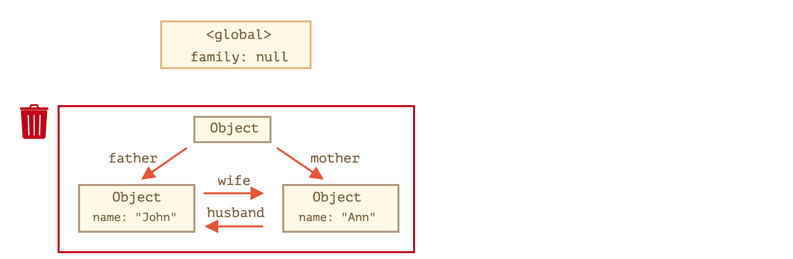

# 现代javascript教程

## 第1部分：JavaScript 编程语言

### 第三章、Objects（对象）：基础知识

#### 3.1对象

正如我们从《引言：类型》那章中知道的那样，JavaScript 中有七种数据类型。有六种原始类型，因为他们的值只包含一种东西（字符串，数值或者其他）。 相反，对象用来存储键值对和更复杂的实体。在 JavaScript 中，对象深入到这门语言的方方面面。所以在我们深入理解这门语言之前，必须先理解对象。

对象可以通过花括号 `{…}` 和其中包含一些可选的**属性**来创建。属性是一个键值对，键是一个字符串（也叫做属性名），值可以是任何类型。

我们可以用下面两种语法的任一种来创建一个空的对象：

```javascript
let user = new Object(); // “构造函数” 的语法
let user = {};  // “字面量” 的语法，通常用该方式
```

##### 文本和属性

我们可以在创建的时候立即给对象一些属性，在 `{...}` 里面放置一些键值对。

```javascript
let user = {     // 一个对象
  name: "John",  // 键 "name"，值 "John"
  age: 30        // 键 "age"，值 30
};
```

属性有键（或者也可以叫做名字，标识符），在冒号的前面 `":"`，值在冒号的右边。

在 `user` 对象中, 有两个属性：

1. 第一个的键是 `"name"` 值是 `"John"`。
2. 第二个的键是 `"age"` 值是 `30`。

任何时候我们都可以添加，删除，读取文件。

可以通过点语法来使用属性：

```javascript
// 读取文件的属性：
alert( user.name ); // John
alert( user.age ); // 30
```

属性的值可以是任意类型，让我们加个布尔类型：

```javascript
user.isAdmin = true;
```

移除一个属性，我们用 `delete` 操作：

```javascript
delete user.age;
```

我们也可以用多字词语来作为属性名，但是他们必须加上引号：

```javascript
let user = {
  name: "John",
  age: 30,
  "likes birds": true  // 多词属性名必须加引号
};
```

##### 方括号

对于多词属性，点操作就不能用了：

```javascript
// 语法错误
user.likes birds = true
```

这是因为点操作需要的键是一个有效的标识符，不能有空格和其他的一些限制。

有另一种方法，就是使用方括号，可以对任何字符串有效：

```javascript
let user = {};

// set
user["likes birds"] = true;

// get
alert(user["likes birds"]); // true

// delete
delete user["likes birds"];
```

现在一切都很可行了。注意方括号中的字符串要放在引号中，单引号双引号都可以的。

方括号同样提供了通过其他表达式来获取属性名的方式 —— 跟语义上的字符串不同 —— 比如像下面一样的变量：

```javascript
let key = "likes birds";

// 跟 user["likes birds"] = true; 一样
user[key] = true;
```

在这里，变量 `key` 根据用户的输入在运行的时候计算，我们根据它来获取属性。这给了我们很大的灵活性，点属性就用不了了。例如：

```javascript
let user = {
  name: "John",
  age: 30
};

let key = prompt("What do you want to know about the user?", "name");

// 获取变量
alert( user[key] ); // John (如果输入 "name" )
```

##### 计算属性

我们可以在对象字面量中使用方括号。这叫做**计算属性**。例如：

```javascript
let fruit = prompt("Which fruit to buy?", "apple");

let bag = {
  [fruit]: 5, // 属性名从 fruit 变量中计算
};

alert( bag.apple ); // 5 如果 fruit="apple"
```

计算属性的含义很简单：`[fruit]` 含义是这个值从 `fruit` 变量中获取。

所以，如果一个人输入 `"apple"`，`bag` 将是 `{apple: 5}`。本质上，这跟下面的语法相同：

```javascript
let fruit = prompt("Which fruit to buy?", "apple");
let bag = {};

// 从 fruit 变量中获取值
bag[fruit] = 5;
```

…但是看起来好多了。我们在方括号中可以用更复杂的表达式：

```javascript
let fruit = 'apple';
let bag = {
  [fruit + 'Computers']: 5 // bag.appleComputers = 5
};
```

方括号比点符号更强大。它允许任何属性名和变量，但写起来也更加麻烦。

大部分时间里，当属性名是已知且简单的时候，用点方法。如果有一些复杂的操作，那么就用方括号。

------

注意：变量名不能用保留字段，像：“for”, “let”, “return” 等。对于对象的属性，没有这些限制，都可以的。**基本上，什么都可以，只有一个特殊的：`"__proto__"` 因为历史原因要特别对待**。

有一种让对象把 `__proto__` 作为属性的方法，在后面章节会讲到，现在我们先来学习对象的更多知识。 还有另外一种数据结构`Map`，我们会在后面章节学到，它支持任意的键值。

##### 属性值简写

在实际应用中，我们通常用存在的变量当做属性名。例如：

```javascript
function makeUser(name, age) {
  return {
    name: name,
    age: age
    // 其他的属性
  };
}

let user = makeUser("John", 30);
alert(user.name); // John
```

在上面的例子中，属性名跟变量名一样。这种应用场景很常见，所以提供一种很便利的方式来定义对象的属性值。可以用 `name` 来代替 `name:name` 像下面那样：

```javascript
function makeUser(name, age) {
  return {
    name, // 与 name: name 相同
    age   // 与 age: age 相同
    // ...
  };
}
```

注意我们可以把简写方式和正常方式混用。

##### 存在值检查

对象的一个显著的特点就是可以访问任何属性，如果这个属性名没有值也不会有错误。访问一个不存在的属性会返回 `undefined`。它提供一种普遍的方法去检查属性是否存在 —— 获得值来与 undefined 比较：

```javascript
let user = {};

alert( user.noSuchProperty === undefined ); // true 意思是没有这个属性
```

同样也有一个特别的操作符 `"in"` 来检查是否属性存在。语法是：

```javascript
"key" in object
```

注意 `in` 的左边必须是**属性名**。通常是一个字符串，如果不用字符串，那就是一个字符串变量。

------

通常，严格比较 `"=== undefined"` 就够用，但是也有一些特殊情况，`"in"` 就可以胜任。那就是属性存在，但是存储 `undefined`：

```javascript
let obj = {
  test: undefined
};

alert( obj.test ); //  它是 undefined，所以难道它不存在吗？

alert( "test" in obj ); // true，属性存在！
```

在上面的代码中，属性 `obj.test` 事实上是存在的，所以 `in` 操作符可以。这种情况很少发生，因为 undefined 通常情况下是不会被赋值到对象的，我们经常会用 `null` 来表示未知的或者空的值。

##### “for…in” 循环

为了使用对象所有的属性，就可以利用 `for..in` 循环。这跟 `for(;;)` 是完全不一样的东西。语法：

```javascript
for(key in object) {
  // 各个属性键值的执行区
}
```

##### 像对象一样排序

对象有顺序吗？换句话说，如果我们遍历一个对象，我们会按照赋值属性的顺序来获得属性吗？这靠谱吗？

简短的回答是：”有特别的顺序“：整数属性有顺序，其他是按照创建的顺序，细节如下：

例如，让我们考虑一个带有电话号码的对象：

```javascript
let codes = {
  "49": "Germany",
  "41": "Switzerland",
  "44": "Great Britain",
  // ..,
  "1": "USA"
};

for(let code in codes) {
  alert(code); // 1, 41, 44, 49
}
```

------

这里的“整数属性”术语指的是一个字符串，可以在不改变的情况下对整数进行转换。

所以，“49” 是一个整数属性名，因为我们把它转换成整数，再转换回来，它还是一样。但是 “+49” 和 “1.2” 就不行了

```javascript
// Math.trunc 是内置的去除小数部分的方法。
alert( String(Math.trunc(Number("49"))) ); // "49"，同样，整数属性
alert( String(Math.trunc(Number("+49"))) ); // "49"，不同于 "+49" ⇒ 不是整数属性
alert( String(Math.trunc(Number("1.2"))) ); // "1"，不同于 "1.2" ⇒ 不是整数属性
```

------

另外一边，如果属性名不是整数，那它们就按照创建时候的顺序来排序。

所以，这就解决了电话号码的问题，我们把整数属性转换成非整数的，在前面增加一个 `"+"` 就行了。像这样：

```javascript
let codes = {
  "+49": "Germany",
  "+41": "Switzerland",
  "+44": "Great Britain",
  // ..,
  "+1": "USA"
};

for(let code in codes) {
  alert( +code ); // 49, 41, 44, 1
}
```

##### 引用复制

对象和其他原始的类型相比有一个很重要的区别，对象都是按引用存储复制的。

原始类型：字符串，数字，布尔类型 – 是被整个赋值的。例如：

```javascript
let message = "Hello!";
let phrase = message;
```

结果是我们得到了两个独立变量，每个变量存的都是 `"Hello!"`。

对象跟这个不一样。**变量存储的不是对象本身，而是对象的“内存地址”，是对象的引用。**

```javascript
let user = { name: "John" };

let admin = user; // 复制引用
```

现在我们有了两个变量，但是都指向同一个对象，我们可以用任何变量去获取对象内容，改变它的内容：

```javascript
let user = { name: 'John' };

let admin = user;

admin.name = 'Pete'; //  改变 "admin" 的引用

alert(user.name); // 'Pete', changes are seen from the "user" reference
```

##### 比较引用

等号 `==` 和严格等 `===` 对于对象来说没差别。

**当两个引用指向同一个对象的时候他们相等。**

例如，两个引用指向同一个对象，他们相等：

```javascript
let a = {};
let b = a; // 复制引用

alert( a == b ); // true，两个变量指向同一个对象
alert( a === b ); // true
```

如果是两个不同的属性，他们就不相等，即使都是空的。

```javascript
let a = {};
let b = {}; // 两个独立的对象

alert( a == b ); // false
```

如果比较两个对象 `obj1 > obj2` 或者用一个对象比较原始值 `obj == 5`，对象被转换成原始值。我们不久就会学习到对象的转化是如何实现的，但是事实上，上面的比较真的极少用到，要不就是你代码写错了。

##### 常量对象

一个被 `const` 修饰的对象**可以**被修改。例如：

```javascript
const user = {
  name: "John"
};

user.age = 25; // (*)

alert(user.age); // 25
```

看起来好像 `(*)` 这行会报错，但是不是的，这完全没问题。这是因为 `const` 仅仅修饰 `user`。在这里 `user`始终存储的都是同一个对象的引用。引用的地址没有变，只是引用的对象被修改了。

如果你想把 `user` 赋值给其他的什么，那就会报错了，例如：

```javascript
const user = {
  name: "John"
};

// 错误（不能再给 User 赋值）
user = {
  name: "Pete"
};
```

那么我们应该怎么样创建不可变的对象属性呢？如果想让 `user.age = 25` 这样的赋值报错呢。这也是可以的，我们会在 属性的标志和描述符这章讲解。

##### 复制和合并，Object.assign

复制一个对象的变量也等同于创建了此对象的另一个引用。

那么我们该怎么复制一个对象呢？创建一份独立的拷贝，一份复制？

这也是可行的，但是有一点麻烦，因为JS并没有原生的方法支持这么做。实际上，我们很少这么做。复制引用很多时候是好用的。

如果我们真的想这么做，就需要创建一个新的对象，遍历现有对象的属性，在原始值的状态下复制给新的对象。像这样：

```javascript
let user = {
  name: "John",
  age: 30
};

let clone = {}; // 新的空对象

// 复制所有的属性值
for (let key in user) {
  clone[key] = user[key];
}

// 现在复制是独立的复制了
clone.name = "Pete"; // 改变它的值

alert( user.n我们也可以用ame ); // 原对象属性值不变
```

我们也可以用[Object.assign](https://developer.mozilla.org/zh/docs/Web/JavaScript/Reference/Global_Objects/Object/assign) 来实现。语法是：

```javascript
Object.assign(dest,[ src1, src2, src3...])
```

- 参数 `dest` 和 `src1, ..., srcN`（可以有很多个）是对象。
- 这个方法复制了 `src1, ..., srcN` 的所有对象到 `dest`。换句话说，从第二个参数开始，所有对象的属性都复制给了第一个参数对象，然后返回 `dest`。

例如，我们可以用这个方法来把几个对象合并成一个：

```javascript
let user = { name: "John" };

let permissions1 = { canView: true };
let permissions2 = { canEdit: true };

// 把 permissions1 和 permissions2 的所有属性都拷贝给 user
Object.assign(user, permissions1, permissions2);

// 现在 user = { name: "John", canView: true, canEdit: true }
```

如果接收的对象（`user`）已经有了同样属性名的属性，前面的会被覆盖：

```javascript
let user = { name: "John" };

// 覆盖 name，增加 isAdmin
Object.assign(user, { name: "Pete", isAdmin: true });

// 现在 user = { name: "Pete", isAdmin: true }
```

我们可以用 `Object.assign` 来代理简单的复制方法：

```javascript
let user = {
  name: "John",
  age: 30
};

let clone = Object.assign({}, user);
```

**深拷贝问题**直到现在，我们是假设所有的 `user` 属性都是原始值，但是如果对象属性指向对象呢？像这样：

```javascript
let user = {
  name: "John",
  sizes: {
    height: 182,
    width: 50
  }
};

alert( user.sizes.height ); // 182
```

现在，并不能拷贝 `clone.sizes = user.sizes`，因为 `user.sizes` 是一个对象，它按引用拷贝。所以 `clone` 和 `user` 共享了一个对象。像这样：

```javascript
let user = {
  name: "John",
  sizes: {
    height: 182,
    width: 50
  }
};

let clone = Object.assign({}, user);

alert( user.sizes === clone.sizes ); // true，同一个对象

// user 和 clone 共享 sizes 对象
user.sizes.width++;       // 在这里改变一个属性的值
alert(clone.sizes.width); // 51，在这里查看属性的值
```

为了解决上面的的问题，我们在复制的时候应该检查 `user[key]` 的每一个值，如果是一个对象，我们再复制一遍这个对象，这叫做深拷贝。

有一个标准的深拷贝算法，解决上面和一些更复杂的情况，叫做 [Structured cloning algorithm](https://w3c.github.io/html/infrastructure.html#internal-structured-cloning-algorithm)。为了不重复造轮子，我们使用它的一个 JS 实现的库 [lodash](https://lodash.com/), 方法名叫做 [_.cloneDeep(obj)](https://lodash.com/docs#cloneDeep)。

##### 总结

对象是具有一些特殊特性的关联数组。

他们存储键值对，其中：

- 属性的键必须是字符串或者Symbol（通常是字符串）。
- 值可以是任何类型。

我们可以用下面的方法获取属性：

- 点符号: `obj.property`。
- 方括号 `obj["property"]`，方括号中可以使用变量 `obj[varWithKey]`。

其他操作：

- 删除属性：`delete obj.prop`。
- 检查属性是否存在：`"key" in obj`。
- 遍历对象：`for(let key in obj)` 循环。

对象根据引用来赋值或者复制。换句话说，变量存的不是对象的"值"，而是值的 “引用”（内存地址）。 所以复制变量或者传递变量到方法中只是复制了对象的引用。 所有的引用操作（像增加，删除属性）都作用于同一个对象。

深拷贝的话我们可以使用 `Object.assign` 或者 [_.cloneDeep(obj)](https://lodash.com/docs#cloneDeep)。

我们在这一章学习的叫做“基本对象” — 对象。

JavaScript 中还有很多其他类型的对象：

- `Array` 存储有序数据集合。
- `Date` 存储时间日期。
- `Error` 存储错误信息
- …等等。

他们有一些特别的特性，我们将在后面学习到。有时候大家说“数组类型”，“时间类型”，他们都属于对象类型的一种，都以不同的方式对对象类型做了一些扩展。

对象在 JavaScript 中是很强大的，这里我们只接触了冰山一角。我们将在后面的章节更进一步学习。

#### 3.2垃圾回收

对于开发者来说，JavaScript 的内存管理是自动的、无形的。我们创建的原始值、对象、函数……这一切都会占用内存。

当某个东西我们不再需要时会发生什么？JavaScript 引擎如何发现它、清理它？

##### 可达性

JavaScript 中主要的内存管理概念是**可达性**。

简而言之，『可达』值是那些以某种方式可访问或可用的值。它们保证存储在内存中。

1. 这里列出固有的可达值基本集合，这些值明显不能被释放。

   比方说：

   - 当前函数的局部变量和参数。
   - 嵌套调用时，当前调用链上所有函数的变量与参数。
   - 全局变量。
   - （还有一些内部的）

   这些值被称作**根**。

2. 如果一个值可以通过引用或引用链，从根值访问到，则认为这个值是可达的。

   比方说，如果局部变量中有一个对象，并且该对象具有引用另一个对象的 property，则该对象被认为是可达的。而且它引用的内容也是可达的。下面是详细的例子。

在 JavaScript 引擎中有一个被称作[垃圾回收器](https://en.wikipedia.org/wiki/Garbage_collection_(computer_science))的东西在后台执行。它监控着所有对象的状态，并删除掉那些已经不可达的。

##### A sample example

这里有一个最简的例子：

```javascript
// user 引用了这个对象
let user = {
  name: "John"
};
```

这里的箭头描述了一个对象引用。全局变量 `"user"` 引用了对象 `{name："John"}`（为简洁起见，我们称它为 John）。John 的 `"name"` 属性存储一个原始值，所以它被写在对象内部。

如果 `user` 的值被覆盖了，这个引用就没了：

```javascript
user = null;
```

现在 John 变成不可达的了。因为没有引用了，就不能访问到它了。垃圾回收器会认为它是垃圾数据，然后释放内存。

##### 两个引用

现在让我们想象下，我们把 `user` 的引用复制给 `admin`：

```javascript
// user 对对象有一个引用
let user = {
  name: "John"
};

let admin = user;
```

现在如果像刚才一样：

```javascript
user = null;
```

……然后对象仍然可以通过 `admin` 这个全局变量访问到，所以对象还在内存中。如果我们又覆盖了 `admin`，对象就会被删除。

##### 相互关联的对象

现在来看一个更复杂的例子。这是个家庭：

```javascript
function marry(man, woman) {
  woman.husband = man;
  man.wife = woman;

  return {
    father: man,
    mother: woman
  }
}

let family = marry({
  name: "John"
}, {
  name: "Ann"
});
```

`marry` 方法通过两个对象的引用，让它们『结婚』了，并返回了一个包含这两个对象的新对象。

由此产生的内存结构：


到目前位置，所有对象都是可达的。

现在让我们移除两个引用：

```javascript
delete family.father;
delete family.mother.husband;
```


仅删除这两个引用中的一个是不够的，因为所有的对象仍然可以访问。

但是，如果我们把这两个都删除，那么我们可以看到再也没有对 John 的引用：


对外引用不重要，只有传入引用才可以使对象可达。所以，John 现在无法访问，并且将从内存中释放，同时 John 的所有数据也变得无法访问。

经过垃圾回收：


##### 无法到达的岛屿

几个对象相互引用，但外部没有对其任意对象的引用，这些对象可能是不可达的，并会从内存中释放。

源对象与上面相同。然后：

```javascript
family = null;
```

内存内部状态将变成：



这个例子展示了可达性概念的重要性。

显而易见，John 和 Ann 仍然连着，都有传入的引用。但是，这样还是不够。

前面说的 `"family"` 对象已经不再连着根，再也没有引用，所以它将变成一座『孤岛』并且将被移除。

##### 内部算法

垃圾回收的基本算法被称为 “mark-and-sweep”。

定期执行以下“垃圾回收”步骤：

- 垃圾收集器找到所有的根，并“标记”（记住）它们。
- 然后它遍历并"标记"来自它们的所有参考。
- 然后它遍历到标记的对象并标记**他们的**引用。所有被遍历到的对象都会被记住，以免将来再次遍历到同一个对象。
- …一直这样，直到有未访问的引用（从根访问到）。
- 没有被标记的所有对象都被删除。

JavaScript 引擎做了许多优化，使其运行速度更快，并且不会影响代码运行。一些优化点：

- **分代收集** —— 对象被分成两组：『新的』和『旧的』。许多对象出现，完成他们的工作并快速释放，他们可以很快被清理。那些长期存活下来的对象会变得『老旧』，而且检查的次数也会减少。
- **增量收集** —— 如果有许多对象，并且我们试图一次遍历并标记整个对象集，则可能需要一些时间并在执行过程中带来明显的延迟。所以引擎试图将垃圾收集工作分成几部分来做，然后将这几部分逐一处理。这需要他们之间额外的标记来追踪变化，但是会有许多微小的延迟而不是大的延迟。
- **闲时收集** —— 垃圾收集器只会在 CPU 空闲时尝试运行，以减少可能对代码执行的影响。

还有其他垃圾收集算法的优化和风格。尽管我想在这里描述它们，但我必须打住了，因为不同的引擎会有不同的调整和技巧。而且，更重要的是，随着引擎的发展，情况会发生变化，所以除非必须，我们了解那么多可能就不值得。当然，后面会给出一些链接可以供你了解参考。

##### 总结

主要需要掌握的东西：

- 垃圾回收是自动完成的，我们不能强制执行或是阻止执行。
- 当对象是可达状态时，它在内存中是可达的。
- 被引用与可访问（从一个根）不同：一组相互连接的对象可能整体都无法访问。

现代引擎实现了垃圾回收的高级算法。

有一本通用的书，叫《The Garbage Collection Handbook: The Art of Automatic Memory Management》（R. Jones 等人著）讲到了一些。

如果你熟悉低级编程，关于 V8 引擎垃圾回收器的更详细信息请参阅文章 [V8 的垃圾回收：垃圾回收](http://jayconrod.com/posts/55/a-tour-of-v8-garbage-collection)。

[V8 博客](http://v8project.blogspot.com/)还不时发布关于内存管理变化的文章。当然，为了学习垃圾收集，你最好通过学习 V8 引擎内部知识来进行准备，并阅读一个叫 [Vyacheslav Egorov](http://mrale.ph/) 的 V8 引擎工程师的博客。我之所以说『V8』，因为它最容易在互联网上找到文章。对于其他引擎，许多方法是相似的，但在垃圾收集上许多方面有所不同。

当你需要低级别的优化时，对引擎的深入了解是很好的。在熟悉了该语言之后，把熟悉引擎作为下一步是明智的。

#### 3.3Symbol类型

##### Symbol

“Symbol” 值表示唯一的标识符。

可以使用 `Symbol()` 来创建这种类型的值：

```javascript
// id 是 symbol 的一个实例化对象
let id = Symbol();
```

我们可以给 Symbol 一个描述（也称为 Symbol 名），这对于调试非常有用：

```javascript
// id 是描述为 "id" 的 Symbol
let id = Symbol("id");
```

Symbol 保证是唯一的。即使我们创建了许多具有相同描述的 Symbol，它们的值也是不同。描述只是一个不影响任何东西的标签。

例如，这里有两个描述相同的 Symbol —— 它们不相等：

```javascript
let id1 = Symbol("id");
let id2 = Symbol("id");

alert(id1 == id2); // false
```

------

JavaScript 中的大多数值都支持 string 的隐式转换。例如，我们可以 `alert` 任何值，这会起作用。Symbol 是特别的，它无法自动转换。

例如，这个 `alert` 将会显示错误：

```javascript
let id = Symbol("id");
alert(id); // 类型错误：无法将 Symbol 值转换为 String。
```

如果我们真的想显示一个 Symbol，我们需要在它上面调用 `.toString()`，如下所示：

```javascript
let id = Symbol("id");
alert(id.toString()); // Symbol(id)，现在它起作用了
```

这是一种防止混乱的“语言保护”，因为 String 和 Symbol 有本质上的不同，而且不应该偶尔将它们相互转化。

##### “隐藏”属性

Symbol 允许我们创建对象的“隐藏”属性，代码的任何其他部分都不能偶尔访问或重写这些属性。

例如，如果我们想存储 object `user` 的“标识符”，我们可以使用 Symbol 作为它的键：

```javascript
let user = { name: "John" };
let id = Symbol("id");

user[id] = "ID Value";
alert( user[id] ); // 我们可以使用 Symbol 作为键来访问数据。
```

在 string `"id"` 上使用 `Symbol("id")` 有什么好处？

我们用更深入一点的示例来说明这一点。

假设另一个脚本希望 `user` 中有它自己的 “id” 属性可以操作。这可能是另一个 JavaScript 库，所以这些脚本完全不知道对方是谁。

然后该脚本可以创建自己的 `Symbol("id")`，如下所示：

```javascript
// ...
let id = Symbol("id");

user[id] = "Their id value";
```

不会冲突，因为 Symbol 总是不同的，即使它们有相同的名称。

现在请注意，如果我们使用 String `"id"` 而不是用 symbol，那么**就会**出现冲突：

```javascript
let user = { name: "John" };

//我们的脚本使用 "id" 属性。
user.id = "ID Value";

// ...如果之后另一个脚本为其目的使用 "id"...

user.id = "Their id value"
// 砰！无意中重写了 id！他不是故意伤害同事的，而是这样做了！
```

如果我们要在 object 字面量中使用 Symbol，则需要方括号。就像这样：

```javascript
let id = Symbol("id");

let user = {
  name: "John",
  [id]: 123 // 不仅仅是 "id：123"
};
```

这是因为我们需要变量 `id` 的值作为键，而不是 String “id”。

Symbolic 属性不参与 `for..in` 循环。例如：

```javascript
let id = Symbol("id");
let user = {
  name: "John",
  age: 30,
  [id]: 123
};

for (let key in user) alert(key); // name, age (no symbols)

// 被 Symbol 任务直接访问
alert( "Direct: " + user[id] );
```

这是一般“隐藏”概念的一部分。如果另一个脚本或库在我们的对象上循环，它不会访问一个 Symbol 类型的属性。

相反，[Object.assign](https://developer.mozilla.org/zh/docs/Web/JavaScript/Reference/Global_Objects/Object/assign) 同时复制字符串和符号属性：

```javascript
let id = Symbol("id");
let user = {
  [id]: 123
};

let clone = Object.assign({}, user);

alert( clone[id] ); // 123
```

这里并不矛盾，就是这样设计的。我们的想法是当我们克隆一个 object 或合并 object 时，通常希望**所有**属性被复制（包括像 `id` 这样的 Symbol）。

##### 全局Symbol

正如我们所看到的，通常所有的 Symbol 都是不同的，即使它们有相同的名字。但有时我们想要同一个名字的 Symbol 是相同的实体。

比如，我们希望在应用程序的不同部分访问相同的 Symbol `"id"` 属性。

为此，存在一个**全局 symbol 注册表**。我们可以在其中创建 Symbol 并在稍后访问它们，它可以确保每次访问相同名称都会返回相同的 Symbol。

为了在注册表中创建或读取 Symbol，请使用 `Symbol.for(key)`。

该调用会检查全局注册表，如果有一个描述为 `key` 的 Symbol，则返回该 Symbol，否则将创建一个新 Symbol（`Symbol(key)`），并通过给定的 `key` 将其存储在注册表中。例如：

```javascript
// 从全局注册表中读取
let id = Symbol.for("id"); // 如果该 Symbol 不存在，则创建它

// 再次读取
let idAgain = Symbol.for("id");

// 相同的 Symbol
alert( id === idAgain ); // true
```

注册表内的 Symbol 称为**全局 Symbol**。如果我们想要一个应用程序范围内的 Symbol，可以在代码中随处访问 —— 这就是它们的用途。

对于全局 symbol，`Symbol.for(key)` 不仅按名称返回一个 symbol，而且还有一个反向调用：`Symbol.keyFor(sym)`，反过来：通过全局 symbol 返回一个名称。例如：

```javascript
let sym = Symbol.for("name");
let sym2 = Symbol.for("id");

// 从 symbol 中获取 name
alert( Symbol.keyFor(sym) ); // name
alert( Symbol.keyFor(sym2) ); // id
```

`Symbol.keyFor` 在内部使用全局 symbol 注册表来查找 symbol 的键。所以它不适用于非全局 symbol。如果 symbol 不是全局的，它将无法找到它并返回 `undefined`。例如：

```javascript
alert( Symbol.keyFor(Symbol.for("name")) ); // name, 全局 Symbol

alert( Symbol.keyFor(Symbol("name2")) ); // undefined, 参数不是一个全局 Symbol
```

##### 系统Symbol

JavaScript 内部存在很多“系统” Symbol，我们可以使用它们来微调对象的各个方面。

它们列在[熟悉的 Symbol](https://tc39.github.io/ecma262/#sec-well-known-symbols) 表的规范中：

- `Symbol.hasInstance`
- `Symbol.isConcatSpreadable`
- `Symbol.iterator`
- `Symbol.toPrimitive`
- …等等。

例如，`Symbol.toPrimitive` 允许我们将对象描述为原始值转换，我们很快就会看到它的使用。

当我们研究相应的语言特征时，其他 Symbol 也会变得熟悉起来。

##### 总结

`Symbol` 是唯一标识符的基本类型

Symbol 使用 `Symbol()` 创建的，调用带有一个可选的描述。

Symbol 总是不同的值，即使它们有相同的名称。如果我们希望同名 Symbol 相等，那么我们应该使用全局注册表：`Symbol.for(key)` 返回（如果需要的话创建）一个以 `key` 作为名称的全局 Symbol。`Symbol.for` 的多次调用完全返回相同的 Symbol。

Symbol 有两个主要的使用场景：

1. “隐藏” 对象属性。如果需要将属性添加到 “属于” 另一个脚本或库的对象中，则可以创建 Symbol 并将其用作属性键。Symbol 属性不出现在 `for..in`中，因此不会无心列出。另外，它不会被直接访问，因为另一个脚本没有我们的符号，所以它不会不小心干预它的操作。

   因此我们可以使用 Symbol 属性“秘密地”将一些东西隐藏到我们需要的对象中，但其他人不会以对象属性的形式看到它。

2. JavaScript 使用了许多系统 Symbol，这些 Symbol 可以作为 `Symbol.*` 访问。我们可以使用它们来改变一些内置行为。例如，在本教程的后面部分，我们将使用 `Symbol.iterator` 来[迭代](https://zh.javascript.info/iterable)，`Symbol.toPrimitive`来设置[对象原始值的转换](https://zh.javascript.info/object-toprimitive)等等。

从技术上说，Symbol 不是 100% 隐藏的。有一个内置方法 [Object.getOwnPropertySymbols(obj)](https://developer.mozilla.org/zh/docs/Web/JavaScript/Reference/Global_Objects/Object/getOwnPropertySymbols) 允许我们获取所有的 Symbol。还有一个名为 [Reflect.ownKeys(obj)](https://developer.mozilla.org/zh/docs/Web/JavaScript/Reference/Global_Objects/Reflect/ownKeys) 返回**所有**键，包括 Symbol。所以它们不是真正的隐藏。但是大多数库、内置方法和语法结构都遵循一个共同的协议。而明确调用上述方法的人可能很清楚他在做什么。

#### 3.4对象方法与“this”

对象通常被用来表示真实世界中的实体，比如用户、订单等等：

```javascript
let user = {
  name: "John",
  age: 30
};
```

另外，在现实世界中，用户可以**操作**：从购物车中挑选某物、登录、注销等。

在 JavaScript 中，操作通过属性中的函数来表示。

##### 方法示例

刚开始，我们来让 `user` 说 hello：

```javascript
let user = {
  name: "John",
  age: 30
};

user.sayHi = function() {
  alert("Hello!");
};

user.sayHi(); // Hello!
```

这里我们使用函数表达式创建了函数，并将其指定给对象的 `user.sayHi` 属性。

随后我们调用它。用户现在可以说话了！

作为对象属性的函数称之为**方法**。

那么，现在 `user` 对象有了一个 `sayHi` 方法。

当然我们也可以使用预先定义的函数作为方法，就像这样：

```javascript
let user = {
  // ...
};

// 首先声明
function sayHi() {
  alert("Hello!");
};

// 然后将其作为一个方法
user.sayHi = sayHi;

user.sayHi(); // Hello!
```

##### 方法简写

在对象字面量中，有一种更短的（声明）方法的语法：

```javascript
// 这些对象作用一样

let user = {
  sayHi: function() {
    alert("Hello");
  }
};

// 方法简写看起来更好，对吧？
let user = {
  sayHi() { // 与 "sayHi: function()" 一样
    alert("Hello");
  }
};
```

如所示，我们可以省略 `"function"` 只写了 `sayHi()`。

说实话，这种表示法还是有些不同。与对象继承有关的细微差别（稍后将会介绍），但现在它们无关紧要。在几乎所有的情况下，较短的语法是最好的

##### 方法中的“this”

在很多时候，对象方法需要访问对象中的存储的信息来完成其工作。

举个例子，`user.sayHi()` 中的代码可能需要用到 `user` 的 name 属性。

**为了访问该对象，方法中可以使用 this 关键字。**

`this` 的值就是在点之前的这个对象，即调用该方法的对象。举个例子：

```javascript
let user = {
  name: "John",
  age: 30,

  sayHi() {
    alert(this.name);
  }

};

user.sayHi(); // John
```

在这里 `user.sayHi()` 执行过程中，`this` 的值是 `user`。

技术上讲，也可以在不使用 `this` 的情况下，通过外部变量名来引用它：

```javascript
let user = {
  name: "John",
  age: 30,

  sayHi() {
    alert(user.name); // "user" 替代 "this"
  }

};
```

但这样的代码是不可靠的。如果我们将 `user` 复制给另一个变量。例如 `admin = user`，并赋另外的值给 `user`，那么它将访问到错误的对象。如下所示：

```javascript
let user = {
  name: "John",
  age: 30,

  sayHi() {
    alert( user.name ); // 导致错误
  }

};


let admin = user;
user = null; // 覆盖让其更易懂

admin.sayHi(); // 噢哟！在 sayHi() 使用了旧的变量名。错误！
```

如果在 `alert` 中以 `this.name` 替换 `user.name`，那么代码就会正常运行。

##### “this”不受限制

在 JavaScript 中，“this” 关键字与大多数其他编程语言中的不同。首先，它可以用于任何函数。

这样的代码没有语法错误：

```javascript
function sayHi() {
  alert( this.name );
}
```

`this` 是在运行时求值的。它可以是任何值。

例如，从不同的对象中调用同一个函数可能会有不同的 “this” 值：

```javascript
let user = { name: "John" };
let admin = { name: "Admin" };

function sayHi() {
  alert( this.name );
}

// 在两个对象中使用的是相同的函数
user.f = sayHi;
admin.f = sayHi;

// 它们调用时有不同的 this 值。
// 函数内部的 "this" 是点之前的这个对象。
user.f(); // John  (this == user)
admin.f(); // Admin  (this == admin)

admin['f'](); // Admin（使用点或方括号语法来访问这个方法，都没有关系。）
```

实际上，我们可以在没有任何对象的情况下调用函数：

```javascript
function sayHi() {
  alert(this);
}

sayHi(); // undefined
```

在这种情况下，严格模式下的 `this` 值为 `undefined`。如果我们尝试访问 `this.name`，将会出现错误。

在非严格模式（没有使用 `use strict`）的情况下，`this` 将会是**全局对象**（浏览器中的 `window`，我们稍后会进行讨论）。`"use strict"` 可以修复这个历史行为。

请注意，通常在没有对象的情况下使用 `this` 的函数调用是不常见的，会（导致）编程错误。如果函数中有 `this`，那么通常意味着它是在对象上下文环境中被调用的。

##### 内部：引用类型

『复杂』的方法调用可能会失去 `this`，比如：

```javascript
let user = {
  name: "John",
  hi() { alert(this.name); },
  bye() { alert("Bye"); }
};

user.hi(); // John (the simple call works)

// 现在我们要判断 name 属性，来决定调用 user.hi 或是 user.bye。
(user.name == "John" ? user.hi : user.bye)(); // Error!
```

最后一行中有一个三元运算符，它要判断是 `user.hi` 或 `user.bye`。在这种情况下，结果会是 `user.hi`。

该方法立即被括号 `()` 调用。但它无效。

你可以看到该调用导致了错误，因为调用中的 `"this"` 为 `undefined`。

这样是正确的（对象点方法）：

```javascript
user.hi();
```

这样没有效果（对方法求值）：

```javascript
(user.name == "John" ? user.hi : user.bye)(); // 错误！
```

原因是什么？如果我们想了解为什么会这样，那么我们要深入理解 `obj.method()` 调用的原理。

仔细看，我们可能注意到 `obj.method()` 语句中有两个操作符。

1. 首先，点 `'.'` 取得这个 `obj.method` 属性。
2. 其后的括号 `()` 调用它。

那么，`this` 是如何从第一部分传递到第二部分的呢？

如果把这些操作分离开，那么 `this` 肯定会丢失：

```javascript
let user = {
  name: "John",
  hi() { alert(this.name); }
}

// 将赋值与方法调用拆分为两行
let hi = user.hi;
hi(); // 错误，因为 this 未定义
```

这里 `hi = user.hi` 把函数赋值给变量，其后的最后一行是完全独立的，所以它没有 `this`。

**为了让 user.hi() 有效，JavaScript 用一个技巧 —— 这个 '.' 点返回的不是一个函数，而是一种特殊的引用类型的值。**

引用类型是一种『规范中有的类型』。我们不能明确地指定它，但是可以在语言内部使用。

引用类型的值是三点的结合 `(base, name, strict)`，如下：

- `base` 是对象。
- `name` 是属性。
- 当 `use strict` 生效，`strict` 为真。

`user.hi` 属性访问的值不是函数，而是引用类型的值。在严格模式下，`user.hi` 是：

```javascript
// 引用类型值
(user, "hi", true)
```

`()` 被引用类型调用时，将接收关于该对象及其方法的所有信息，并且设定正确的 `this` 值（这里等于 `user`）。

`hi = user.hi` 赋值等其他的操作，将引用类型作为一个整体丢弃，只获取 `user.hi`（一个函数）的值进行传递。因此，进一步操作『失去』了 `this`（值）。

所以如果直接使用点 `obj.method()` 或方括号语法 `obj[method]()`（它们在这里并无差别）调用函数，那么作为结果，`this` 值会以正确的方式进行传递。

##### 箭头函数没有自己的“this”

箭头函数有些特别：它们没有自己的 `this`。如果我们在这样的函数中引用 `this`，`this` 值取决于外部『正常的』函数。

举个例子，这里的 `arrow()` 使用的 `this` 来自外部的 `user.sayHi()` 方法：

```javascript
let user = {
  firstName: "Ilya",
  sayHi() {
    let arrow = () => alert(this.firstName);
    arrow();
  }
};

user.sayHi(); // Ilya
```

这是箭头函数的一个特征，当我们并不想要一个独立的 `this` 值，反而想从外部上下文中获取时，它很有用。在后面的章节 [深入研究箭头函数](https://zh.javascript.info/arrow-functions) 中我们将更深入地介绍箭头函数。

##### 总结

- 存储在对象中函数称之为『方法』。
- 对象执行方法进行『操作』，比如 `object.doSomething()`。
- 方法可以将该对象引用为 `this`。

`this` 的值是在运行时求值的。

- 函数声明使用的 `this` 只有等到调用时才会有值。
- 函数可以在对象之间进行共用。
- 当函数使用『方法』语法 `object.method()` 调用时，调用过程中的 `this` 总是指向 `object`。

请注意箭头函数有些特别：它们没有 `this`。在箭头函数内部访问的都是来自外部的 `this` 值。

#### 3.5对象原始值转换

当对象相加 `obj1 + obj2`，相减 `obj1 - obj2`，或者使用 `alert(obj)` 打印时会发生什么？

在对象中有特殊的方法用来做转换。

在 [类型转换](https://zh.javascript.info/type-conversions) 一章中，我们已经看到了数值，字符串和布尔转换的规则。但是我们给对象的原始值转换留下了一点疑问。正如我们所知道的方法和符号一样，现在我们可以解决这个问题了。

对于对象，不存在 to-boolean 转换，因为所有对象在布尔上下文中都是 `true`。所以只有字符串和数值转换。

数值转换发生在对象相减或应用数学函数时。例如，Date 对象（将在 [日期和时间](https://zh.javascript.info/date) 章节中介绍）可以相减，而 `date1 - date2` 的结果是两个日期之间的时间差。

至于字符串转换 —— 它通常发生在我们输出像 `alert(obj)` 这样的对象和类似的上下文中。

##### ToPrimitive

当一个对象被用在需要原始值的上下文中时，例如，在 `alert` 或数学运算中，它会使用 `ToPrimitive` 算法转换为原始值（[标准](https://tc39.github.io/ecma262/#sec-toprimitive)）。

该算法允许我们使用特殊的对象方法自定义转换。

取决于上下文，转换具有所谓的“暗示”。

这里有三种变体：

- `"string"`

  当一个操作期望一个字符串时，对于对象到字符串的转换，比如 `alert`：

  ```javascript
  // output
  alert(obj);
  
  // 使用对象作为属性键
  anotherObj[obj] = 123;
  ```

- `"number"`

  当一个操作需要一个数字时，用于对象到数字的转换，如 `maths`：

  ```javascript
  // 显式转换
  let num = Number(obj);
  
  // maths（除了二进制加法）
  let n = +obj; // 一元加法
  let delta = date1 - date2;
  
  // 小于/大于的比较
  let greater = user1 > user2;
  ```

- `"default"`

  在少数情况下发生，当操作者“不确定”期望的类型时。

  例如，二进制加 `+` 可以和字符串（连接）和数字（相加）发生作用，所以类型是字符串和数字都可以。或者当一个对象用 `==` 与一个字符串、数字或符号进行比较时。

  ```javascript
  // 二进制加
  let total = car1 + car2;
  
  // obj == string/number/symbol
  if (user == 1) { ... };
  ```

请注意 —— 只有三种暗示。就这么简单。没有 “boolean” 暗示（所有对象在布尔上下文中都是 `true`）或其他任何东西。如果我们将 `"default"` 和 `"number"` 视为相同，就像大多数内置函数一样，那么只有两种转换了。

**为了进行转换，JavaScript 尝试查找并调用三个对象方法：**

1. 调用 `obj[Symbol.toPrimitive](hint)` 如果这个方法存在的话，
2. 否则如果暗示是`"string`"
   - 尝试 `obj.toString()` 和 `obj.valueOf()`，无论哪个存在。
3. 否则，如果暗示`"number"`或者`"default"`
   - 尝试 `obj.valueOf()` 和 `obj.toString()`，无论哪个存在。

##### Symbol.toPrimitive

我们从第一个方法开始。有一个名为 `Symbol.toPrimitive` 的内置符号应该用来命名转换方法，像这样：

```javascript
obj[Symbol.toPrimitive] = function(hint) {
  // 返回一个原始值
  // hint = "string"，"number" 和 "default" 中的一个
}
```

例如，这里 `user` 对象实现它：

```javascript
let user = {
  name: "John",
  money: 1000,

  [Symbol.toPrimitive](hint) {
    alert(`hint: ${hint}`);
    return hint == "string" ? `{name: "${this.name}"}` : this.money;
  }
};

// 转换演示：
alert(user); // hint: string -> {name: "John"}
alert(+user); // hint: number -> 1000
alert(user + 500); // hint: default -> 1500
```

从代码中我们可以看到，根据转换的不同，`user` 变成一个自描述字符串或者一个金额。单个方法 `user[Symbol.toPrimitive]` 处理所有的转换情况。

##### toString/valueOf

方法 `toString` 和 `valueOf` 来自上古时代。它们不是符号（那时候还没有符号这个概念），而是“常规的”字符串命名的方法。它们提供了一种可替换的“老派”的方式来实现转换。

如果没有 `Symbol.toPrimitive` 那么 JavaScript 尝试找到它们并且按照下面的顺序进行尝试：

- 对于"string"暗示，`toString -> valueOf`。
- 其他情况，`valueOf -> toString`。

例如，在这里 `user` 使用 `toString` 和 `valueOf` 的组合，上面的效果相同：

```javascript
let user = {
  name: "John",
  money: 1000,

  // 对于 hint="string"
  toString() {
    return `{name: "${this.name}"}`;
  },

  // 对于 hint="number" 或 "default"
  valueOf() {
    return this.money;
  }

};

alert(user); // toString -> {name: "John"}
alert(+user); // valueOf -> 1000
alert(user + 500); // valueOf -> 1500
```

通常我们希望有一个“全能”的地方来处理所有原始转换。在这种情况下，我们可以只实现 `toString`，就像这样：

```javascript
let user = {
  name: "John",

  toString() {
    return this.name;
  }
};

alert(user); // toString -> John
alert(user + 500); // toString -> John500
```

如果没有 `Symbol.toPrimitive` 和 `valueOf`，`toString` 将处理所有原始转换。

##### ToPrimitive 和 ToString/ToNumber

关于所有原始转换方法，有一个重要的点需要知道，就是它们不一定会返回“暗示的”原始值。

没有限制 `toString()` 是否返回字符串，或 `Symbol.toPrimitive` 方法是否为 “number” 暗示返回数字。

**唯一强制性的事情是：这些方法必须返回一个原始值。**

发起转换的操作获取该原始值，然后继续使用该原始值，并在必要时应用进一步的转换。

例如：

- 数学运算（二进制加法除外）执行 `ToNumber` 转换：

  ```javascript
  let obj = {
    toString() { // toString 在没有其他方法的情况下处理所有转换
      return "2";
    }
  };
  
  alert(obj * 2); // 4，ToPrimitive 输出 "2"，然后就变成了 2。
  ```

- 二进制加法会检查原始值 —— 如果它是一个字符串，那么它会进行级联，否则它会执行 `ToNumber` 并使用数字。

  字符串例子：

  ```javascript
  let obj = {
    toString() {
      return "2";
    }
  };
  
  alert(obj + 2); // 22 (ToPrimitive 返回字符串 => 级联操作)
  ```

  数值例子：

  ```javascript
  let obj = {
    toString() {
      return true;
    }
  };
  
  alert(obj + 2); // 3 (ToPrimitive 返回布尔值，非字符串 => ToNumber)
  ```

##### 概要

对象到原始值的转换，是由许多内置函数和操作符自动调用的，这些函数使用一个原始值作为返回值的。

它有三种类型（暗示）：

- `"string"`（对于 `alert` 和其他字符串转换）
- `"number"`（对于 `maths`）
- `"default"`（少数操作）

规范明确描述了哪个操作符使用哪个暗示。极少数操作者“不知道期望什么”并使用 `"default"` 暗示。通常对于内置对象，`"default"` 暗示的处理方式与 `"number"` 相同，因此在实践中最后两个通常合并在一起。

转换算法是：

1. 调用 `obj[Symbol.toPrimitive](hint)` 如果这个方法存在的话，
2. 否则如果暗示是`"string"`
   - 尝试 `obj.toString()` 和 `obj.valueOf()`，无论哪个存在。
3. 否则，如果暗示`"number"`或者`"default"`
   - 尝试 `obj.valueOf()` 和 `obj.toString()`，无论哪个存在。

在实践中，为了记录或调试目的，仅实现 `obj.toString()` 作为“全捕获"方法通常就够了，这样所有转换都能返回一种“人类可读”的对象表达形式。

#### 3.6构造函数和操作符 "new"

常规的 `{...}` 语法允许创建一个对象。但是我们经常需要创建许多类似的对象，例如多个用户或菜单项等等。这可以使用构造函数和 `"new"` 操作符。

##### 构造函数

构造函数在技术上是常规函数。不过有两个约定：

1. 他们首先用大写字母命名。
2. 它们只能用 `"new"` 操作符来执行。

例如：

```javascript
function User(name) {
  this.name = name;
  this.isAdmin = false;
}

let user = new User("Jack");

alert(user.name); // Jack
alert(user.isAdmin); // false
```

当一个函数作为 `new User(...)`执行时，它执行以下步骤：

1. 一个新的空对象被创建并分配给 `this`。
2. 函数体执行。通常它会修改 `this`，为其添加新的属性。
3. 返回 `this` 的值。

换句话说，`new User(...)` 做类似的事情：

```javascript
function User(name) {
  // this = {};（隐式创建）

  // 添加属性到 this
  this.name = name;
  this.isAdmin = false;

  // return this;（隐式返回）
}
```

所以 `new User("Jack")` 的结果是相同的对象：

```javascript
let user = {
  name: "Jack",
  isAdmin: false
};
```

现在，如果我们想创建其他用户，我们可以调用 `new User("Ann")`，`new User("Alice")` 等等。比每次使用字面量创建要短得多，而且易于阅读。

这是构造函数的主要目的 — 实现可重用的对象创建代码

让我们再次注意 — 从技术上讲，任何函数都可以用作构造函数。即：任何函数都可以运行 `new`，它会执行上面的算法。 “首字母大写”是一个共同的约定，以明确表示一个函数将被使用 `new` 运行。

------

如果我们有许多关于创建单个复杂对象的代码行，我们可以将它们封装在构造函数中，如下所示：

```javascript
let user = new function() {
  this.name = "John";
  this.isAdmin = false;

  // ...用户创建的其他代码
  // 也许是复杂的逻辑和陈述
  // 局部变量等
};
```

构造函数不能被再次调用，因为它不保存在任何地方，只是被创建和调用。所以这个技巧的目的是封装构建单个对象的代码，而不是将来重用。

##### 双语法构造函数：new.target

在一个函数内部，我们可以使用 `new.target` 属性来检查它被调用时，是否使用了 `new`。

常规调用为空，如果通过 `new` 调用，则等于函数：

```javascript
function User() {
  alert(new.target);
}

// 不带 new：
User(); // undefined

// 带 new：
new User(); // function User { ... }
```

这可以使 `new` 和常规语法的工作原理相同：

```javascript
function User(name) {
  if (!new.target) { // 如果你没有运行 new
    return new User(name); // ...会为你添加 new
  }

  this.name = name;
}

let john = User("John"); // 重新调用 new User
alert(john.name); // Jo
hn
```

这种方法有时用在库中以使语法更加灵活。但因为省略 `new` 使得它不易阅读，这可不是一件好事。 而通过 `new`我们可以都知道这个新对象正在创建。

##### 构造函数 Return

通常，构造函数没有 `return` 语句。他们的任务是将所有必要的东西写入 `this`，并自动转换。

但是，如果有 `return` 语句，那么规则很简单：

- 如果 `return` 对象，则返回它，而不是 `this`。
- 如果 `return` 一个原函数，则忽略。

换一种说法，带有对象的 `return` 返回该对象，在所有其他情况下返回 `this`。

例如，这里 `return` 通过返回一个对象覆盖 `this`：

```javascript
function BigUser() {

  this.name = "John";

  return { name: "Godzilla" };  // <-- returns 一个 object
}

alert( new BigUser().name );  // 哇哦，得到了对象，name 属性值为 Godzilla ^^
```

这里有一个 `return` 空的例子（或者我们可以在它之后放置一个原函数）：

```javascript
function SmallUser() {

  this.name = "John";

  return; // 完成执行，returns this

  // ...

}

alert( new SmallUser().name );  // John
```

通常构造函数没有 `return` 语句。这里我们主要为了完整性而提及返回对象的特殊行为。

------

顺便说一下，如果没有参数我们 `new` 可以省略括号：

```javascript
let user = new User; // <-- no parentheses
// same as
let user = new User();
```

这里省略括号不被认为是一种“好风格”，但是规范允许使用该语法。

##### 构造函数中的方法

使用构造函数来创建对象会带来很大的灵活性。通过构造函数的参数传递定义构造对象。

当然，我们不仅可以将属性添加到 this 中，而且还可以添加方法。

例如，`new User(name)` 下面用给定的 `name` 和方法 `sayHi` 创建一个对象：

```javascript
function User(name) {
  this.name = name;

  this.sayHi = function() {
    alert( "My name is: " + this.name );
  };
}

let john = new User("John");

john.sayHi(); // My name is: John

/*
john = {
   name: "John",
   sayHi: function() { ... }
}
*/
```

##### 总结

- 构造函数或简言之，就是常规函数，但构造函数有个共同的约定，命名它们首字母要大写。
- 构造函数只能使用 `new` 来调用。这样的调用意味着在开始时创建空的 `this`，并在最后返回填充的对象。

我们可以使用构造函数来创建多个类似的对象。

JavaScript 为许多内置的对象提供了构造函数：比如日期 Date，设置集合 Set 以及其他我们计划学习的内容。

##### **不错的练习题**

创建一个构造函数 `Calculator` 创建可扩展的 calculator 对象。

该任务由两部分组成。

1. 首先，实现 `calculate(str)` 方法，“NUMBER operator NUMBER”（空格分隔），其格式为“1 + 2”，并返回结果。所以要实现加`+`和减`-`。

   用法示例：

   ```javascript
   let calc = new Calculator;
   
   alert( calc.calculate("3 + 7") ); // 10
   ```

2. 然后添加 calculate 新操作的方法 `addOperator(name, func)`。它需要运算符 `name` 和实现它的双参数函数 `func(a,b)`。

   例如，我们添加乘法`*`，除法`/`和求幂`**`：

   ```javascript
   let powerCalc = new Calculator;
   powerCalc.addMethod("*", (a, b) => a * b);
   powerCalc.addMethod("/", (a, b) => a / b);
   powerCalc.addMethod("**", (a, b) => a ** b);
   
   let result = powerCalc.calculate("2 ** 3");
   alert( result ); // 8
   ```

- 此任务中没有括号或复杂的表达式。
- 数字和运算符用一个空格分隔。
- 添加错误处理。

```javascript
// 错误处理看实际需求可自行添加
function Calculator() {
  this.ops = [{
    op: "+",
    callback: (a, b) => a + b,
  }, {
    op: "-",
    callback: (a, b) => a - b,
  }];
  this.calculate = function (str) {
    let splitStr = str.split(' ');
    let a = Number(splitStr[0]);
    let b = Number(splitStr[2]);
    let op = splitStr[1];
    let res = null;
    this.ops.forEach(item => {
      if (item.op === op) {
        res = item.callback(a, b);
        return;
      }
    });
    return res;
  };

  this.addMethod = function(op, callback) {
    this.ops.push({
      op,
      callback
    });
  };
}
let powerCalc = new Calculator;
alert(powerCalc.calculate("3 + 7")); // 10
powerCalc.addMethod("*", (a, b) => a * b);
powerCalc.addMethod("/", (a, b) => a / b);
powerCalc.addMethod("**", (a, b) => a ** b);

let result = powerCalc.calculate("2 ** 3");
alert( result ); // 8
```

