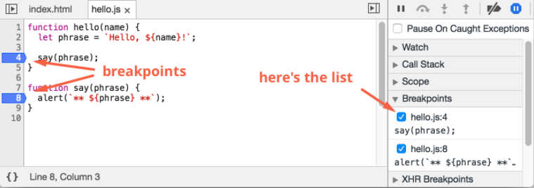
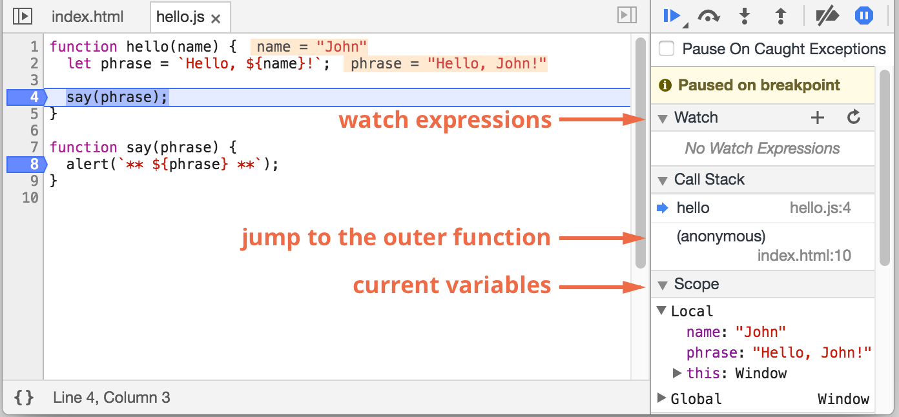

# 现代javascript教程

## 第1部分：JavaScript 编程语言

### 第二章、代码质量

#### 2.1 在Chrome中调试

##### “sources（资源）” 面板

- 在 Chrome 中打开[示例页面](https://zh.javascript.info/article/debugging-chrome/debugging/index.html)。
- 使用快捷键 F12 (Mac: Cmd+Opt+I) 打开开发者工具。
- 选择 `sources（资源）` 面板。

让我们在预览树中点击和选择 `index.html` 和 `hello.js`。应该会出现这个视图：


我们可以看到三个区域：

1. **资源区域**列出了 html、javascript、css 和包括图片在内的页面需要的其他文件。Chrome 扩展的资源也会出现在这。
2. **源区域**展示源码。
3. **信息和控制区域**是用来调试的，我们很快就会来探讨它。

##### Console（控制台）

在控制台中我们可以输入一些命令然后按下 Enter 来执行。语句执行之后，会将其结果显示在下面。

例如，`1+2` 将会返回 `3`，`hello("debugger")` 函数什么也不返回，因此结果是 `undefined`：


##### Breakpoints（断点）

**断点**是调试器会自动暂停 JavaScript 执行的地方。

在 `hello.js` 中，点击第 `4` 行。是的，就点击数字 `"4"` 上，不是点击代码。恭喜你！你已经设置了一个断点。现在，请在第 `8` 行的数字上也点击一下。效果图如下：



**条件断点**

在行号上**右键单击**允许你创建一个**条件**断点。只有当给定的条件为真（即满足条件）时才会被触发。

当我们在特定的变量值或参数的情况下需要停止程序执行时，这种调试方法就很有用了。

##### Debugger命令

我们也可以使用 `debugger` 命令来暂停代码，像这样：

```javascript
function hello(name) {
  let phrase = `Hello, ${name}!`;
  debugger;  // <-- 调试器会在这停止
  say(phrase);
}
```

##### 暂停并查看

在我们的例子中，`hello()` 函数在页面加载期间被调用，因此激活调试器的最简单的方法就是 —— 重新加载页面。因此让我们按下 F5 (Windows, Linux) 或 Cmd+R (Mac) 吧。

设置断点之后，程序会在第 4 行暂停执行：



请打开右侧的信息下拉列表（箭头指示出的地方）。这里允许你查看当前的代码状态：

1. **Watch —— 显示各种表达式的当前值。**

   你可以点击加号 `+` 然后输入一个表达式。调试器将随时显示它的值，并在执行过程中自动重新计算。

2. **Call Stack（调用栈） —— 显示嵌套的调用链。**

   此时，调试器正在 `hello()` 的调用链中，被 `index.html` 中的一个脚本调用（这里没有函数，因此显示 “anonymous”）

   如果你点击了一个堆栈项，调试器将调到相应的代码那，并且还可以查看其所有的变量。

3. **Scope（作用域） —— 显示当前的变量。**

   `Local` 显示当前函数中的变量，你还可以在源代码中看到它们的值高亮显示了出来。

   `Global` 显示全局变量（不在任何函数中）。

   还有一个 `this` 关键字目前我们还没有学到，不过我们很快就会讨论它了。

##### 跟踪执行[详细内容链接](https://zh.javascript.info/debugging-chrome#gen-zong-zhi-hang)

调试部分不再进行过多详细记录，请直接参照现代JavaScript教程。

##### 日志记录[详细内容链接](https://zh.javascript.info/debugging-chrome#ri-zhi-ji-lu)

#### 2.2代码风格

[详细内容链接](https://zh.javascript.info/coding-style)

#### 2.3注释

[详细内容链接](https://zh.javascript.info/comments)

#### 2.4NinJaCode

[详细内容链接](https://zh.javascript.info/ninja-code)

#### 2.5使用 mocha 进行自动化测试

[详细内容链接](https://zh.javascript.info/testing-mocha)

#### 2.6Polyfills

[详细内容链接](https://zh.javascript.info/polyfills)
