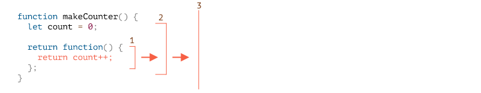

# 现代javascript教程

## 第1部分：JavaScript 编程语言

### 第五章、Advanced working with functions（高级功能）

#### 5.1递归和堆栈

我们回到函数，深入研究一下。

我们的第一个主题是**递归**。

如果你不是刚接触编程，那么你可能已经很熟悉它，可以跳过这一章了。

递归是一种编程模式，用于一个任务可以被分割为多个相似的更简单的任务的场景。或者用于一个任务可以被简化为一个容易的行为加上更简单的任务变体。或者像我们随后会看到的，用来处理特定类型的数据结构。

当一个函数解决一个任务时，在该过程中它可以调用很多其它函数。那么当一个函数调用**自身**时，就称其为**递归**。

##### [两种思考方式](https://zh.javascript.info/recursion#liang-zhong-si-kao-fang-shi)

简单起见，我们写一个函数 `pow(x, n)`，它可以计算 `x` 的 `n` 次方，即用 `x` 乘以自身 `n` 次。

```javascript
pow(2, 2) = 4
pow(2, 3) = 8
pow(2, 4) = 16
```

有两种实现方式。

1. 迭代思路：`for` 循环：

   ```javascript
   function pow(x, n) {
     let result = 1;
   
     // 在循环中用 x 乘以 result
     for (let i = 0; i < n; i++) {
       result *= x;
     }
   
     return result;
   }
   
   alert( pow(2, 3) ); // 8
   ```

2. 递归思路：简化任务，调用自身：

   ```javascript
   function pow(x, n) {
     if (n == 1) {
       return x;
     } else {
       return x * pow(x, n - 1);
     }
   }
   
   alert( pow(2, 3) ); // 8
   ```

注意递归方式完全不相同。

当 `pow(x, n)` 被调用时，执行分为两个分支：

```javascript
              if n==1  = x
             /
pow(x, n) =
             \
              else     = x * pow(x, n - 1)
```

1. 如果 `n == 1`，所有事情都会很简单，这叫做递归的**基础**，因为它立即得到显而易见的结果：`pow(x, 1)` 等于 `x`。
2. 否则，我们可以用 `x * pow(x, n - 1)` 表示 `pow(x, n)`。在数学里，可能会这么写 `xn = x * xn-1`。这叫做**一个递归步骤**：我们将任务转变为更简单的行为（`x` 的乘法）和更简单的同类任务调用（更小的 `n` 给 `pow`）。后面步骤继续简化直到 `n` 等于 `1`。

我们也可以说 `pow` **递归的调用自身** 直到 `n == 1`。

比如，为了计算 `pow(2, 4)`，递归变体经过了下面几个步骤：

1. `pow(2, 4) = 2 * pow(2, 3)`
2. `pow(2, 3) = 2 * pow(2, 2)`
3. `pow(2, 2) = 2 * pow(2, 1)`
4. `pow(2, 1) = 2`

所以，递归生成了更简单的函数调用，然后 —— 更加简单，继续，直到结果变得很明显。

------

**递归一般更简洁**

递归解决方案一般比迭代更简洁。

这里我们可以使用三元运算符 `?` 来替换 `if` 语句，从而让 `pow(x, n)` 更简洁并且可读性依然很高：

```javascript
function pow(x, n) {
  return (n == 1) ? x : (x * pow(x, n - 1));
}
```

------

最大的嵌套调用次数（包括首次）称为**递归深度**。在我们的例子中，它正好等于 `n`。

最大递归深度受限于 JavaScript 引擎。我们可以确信基本是 10000，有些引擎可能允许更大，但是 100000 很可能就超过了限制。有一些自动优化能够缓解这个（「尾部调用优化」），但是它们还没有被完全支持，只能用于简单场景。

这就限制了递归的应用，但是递归仍然被广泛使用。有很多任务使用递归思路会让代码更简单，更容易维护。

##### [执行堆栈](https://zh.javascript.info/recursion#zhi-hang-dui-zhan)

现在我们来研究下递归调用如何工作的。为此，我们会先看看函数底层工作原理。

一个函数运行的信息被存储在它的**执行上下文**里。

[执行上下文](https://tc39.github.io/ecma262/#sec-execution-contexts)是一个内部数据结构，它包含一个函数执行时的细节：当前工作流在哪里，当前的变量，`this` 的值（这里我们不使用它），以及其它一些内部细节。

每个函数调用都有与其相关联的执行上下文。

当一个函数有嵌套调用时，下面的事情会发生：

- 当前函数被暂停；
- 与它关联的执行上下文被一个叫做**执行上下文堆栈**的特殊数据结构保存；
- 执行嵌套调用；
- 嵌套调用结束后，之前的执行上下文从堆栈中恢复，外部函数从停止的地方继续执行。

我们看看调用 `pow(2, 3)` 都发生了什么。

###### [pow(2, 3)](https://zh.javascript.info/recursion#pow-2-3)

在调用 `pow(2, 3)` 的开始，执行上下文会存储变量：`x = 2, n = 3`，执行流程在函数的第 `1` 行。

我们将其描绘如下：

- Context: { x: 2, n: 3, at line 1 } pow(2, 3)

这是函数开始执行的时候。条件 `n == 1` 结果为否，所以流程进入 `if` 的第二分支。

```javascript
function pow(x, n) {
  if (n == 1) {
    return x;
  } else {
    return x * pow(x, n - 1);
  }
}

alert( pow(2, 3) );
```

变量相同，但是函数变化了，所以现在上下文是：

- Context: { x: 2, n: 3, at line 5 } pow(2, 3)

为了计算 `x * pow(x, n - 1)`，我们需要用新的参数 `pow(2, 2)` 子调用 `pow`。

###### [pow（2, 2)](https://zh.javascript.info/recursion#pow-2-2)

为了执行嵌套调用，JavaScript 会记住**执行上下文堆栈**中的当前执行上下文。

这里我们调用相同的函数 `pow`，但是没关系。所有函数的处理都是一样的：

1. 当前上下文被「记录」在堆栈的顶部；
2. 为子调用创建新上下文；
3. 当子调用结束后 —— 前一上下文从堆栈弹出，继续执行。

下面是进入子调用 `pow(2, 2)` 的上下文堆栈：

- Context: { x: 2, n: 2, at line 1 } pow(2, 2)
- Context: { x: 2, n: 3, at line 5 } pow(2, 3)

新的当前执行上下文位于顶部（加粗），前面的在下方。

当我们完成子调用后 —— 很容恢复前面的上下文，因为它保留这变量和代码停止时的准确位置。图中我们使用了单词「行」，但实际比这更精确。

###### [pow(2, 1)](https://zh.javascript.info/recursion#pow-2-1)

重复该过程：在第 `5` 行生成新的子调用，现在使用参数 `x=2`，`n=1`。

新的执行上下文被创建，前一个被压入堆栈顶部：

- Context: { x: 2, n: 1, at line 1 } pow(2, 1)
- Context: { x: 2, n: 2, at line 5 } pow(2, 2)
- Context: { x: 2, n: 3, at line 5 } pow(2, 3)

此时，有 2 个旧的上下文和 1 个当前正在运行的给 `pow(2, 1)` 的上下文。

###### [出口](https://zh.javascript.info/recursion#chu-kou)

在 `pow(2, 1)` 时，不像之前，条件 `n == 1` 成了是，所以 `if` 的第一分支生效：

```javascript
function pow(x, n) {
  if (n == 1) {
    return x;
  } else {
    return x * pow(x, n - 1);
  }
}
```

此时不再有嵌套调用，所以函数结束，返回 `2`。

函数结束后，它的执行上下文不再有用，会从内存中移除。前一上下文从栈顶恢复：

- Context: { x: 2, n: 2, at line 5 } pow(2, 2)
- Context: { x: 2, n: 3, at line 5 } pow(2, 3)

恢复执行 `pow(2, 2)`，它有子调用 `pow(2, 1)` 的结果，所以它也可以结束 `x * pow(x, n - 1)` 的执行，返回 `4`。

然后前一上下文被恢复：

- Context: { x: 2, n: 3, at line 5 } pow(2, 3)

当它结束后，我们得到结果 `pow(2, 3) = 8`。

递归深度是：**3**。

从上面的图解可以看到，递归深度等于堆栈中上下文的最大个数。

注意内存要求。上下文消耗内存，在我们的例子中，求 `n` 次方需要存储 `n` 个上下文，以便减一后的 `n` 使用。

而循环算法更省内存：

```javascript
function pow(x, n) {
  let result = 1;

  for (let i = 0; i < n; i++) {
    result *= x;
  }

  return result;
}
```

迭代 `pow` 仅使用一个上下文，在处理中修改 `i` 和 `result`。它的内存要求比较小，且固定不依赖 `n`。

**任何递归都可以用循环来重写。循环变体一般更加有效。**

…但有时重写很难，尤其是函数根据条件使用不同的子调用，然后合并它们的结果，或者分支比较复杂。而且有些优化可能没有必要，完全不值得。

递归能提供更简洁的代码，容易理解和维护。优化并不是处处需要，大多数时候我们需要一个好代码，这就是它被使用的原因。

##### [递归遍历](https://zh.javascript.info/recursion#di-gui-bian-li)

递归另一个重要应用就是递归遍历。

设想，有一家公司。职员结构可以用这个对象描述：

```javascript
let company = {
  sales: [{
    name: 'John',
    salary: 1000
  }, {
    name: 'Alice',
    salary: 600
  }],

  development: {
    sites: [{
      name: 'Peter',
      salary: 2000
    }, {
      name: 'Alex',
      salary: 1800
    }],

    internals: [{
      name: 'Jack',
      salary: 1300
    }]
  }
};
```

或者说，一家公司有很多部门。

- 一个部门有员工列表，比如，`销售`部有 2 名员工：John 和 Alice。

- 或者一个部门可能划分为几个子部门，比如`开发`有两个分支：`网站`和`内部`，它们都有自己的员工。

- 当一个子部门增长时，它可能会划分为子部门（或者团队）。

  比如，`网站`部门在未来可能会分为`网站 A` 和 `网站 B`。它们可能还会再分，没有图示，脑补一下吧。

现在，如果我们需要获得所有薪酬总数，我们该如何做？

迭代方式并不容易，因为结构比较复杂。首先想到是使用 `for` 循环 `公司`，然后嵌套子循环第 1 层部门。然后我们需要更多嵌套子循环来迭代第 2 层部门，比如 `网站`。…然后另一个嵌套子循环给将来会有的第 3 层部门？我们应该在第 3 或第 4 层循环停止吗？如果我们将 3-4 嵌套子循环放到代码里来遍历单个对象，它会变得很丑。

我们试试递归。

可以看到，当函数计算一个部门的和时，有两种可能情况：

1. 这个部门是有**一组人**的『简单』部门 —— 这样我们就可以使用简单循环来求薪酬总额。
2. 或者它是**一个有 `N` 个子部门的对象** —— 这样我们可以用 `N` 个递归调用来求每一个子部门的总额然后合并它们。

(1) 是递归的基础，简单的情况。

(2) 是递归步骤。复杂的任务被划分为适于更小部门的子任务。它们可能还会在划分，但是最终都会在 (1) 那里完成。

算法从代码来看会更简单些：

```javascript
let company = { // 是同样的对象，简洁起见做了压缩
  sales: [{name: 'John', salary: 1000}, {name: 'Alice', salary: 600 }],
  development: {
    sites: [{name: 'Peter', salary: 2000}, {name: 'Alex', salary: 1800 }],
    internals: [{name: 'Jack', salary: 1300}]
  }
};

// 用来完成作业的函数
function sumSalaries(department) {
  if (Array.isArray(department)) { // 情况 (1)
    return department.reduce((prev, current) => prev + current.salary, 0); // 求数组的和
  } else { // 情况 (2)
    let sum = 0;
    for (let subdep of Object.values(department)) {
      sum += sumSalaries(subdep); // 递归调用子部门，对结果求和
    }
    return sum;
  }
}

alert(sumSalaries(company)); // 6700
```

代码很短也容易理解（希望是这样）。这就是递归的能力。它对任何层次的子部门嵌套都有效。

以下是调用图：


很容易可以看到原理：对对象 `{...}` 会生成子调用，而数组 `[...]` 因为是递归树的「叶子」，它们会立即得到结果。

注意这段代码使用了我们之前讲过的便利特性：

- 章节 [数组方法](https://zh.javascript.info/array-methods) 中的 `arr.reduce` 方法做数组求和。
- 循环 `for(val of Object.values(obj))` 迭代对象的（属性）值：`Object.values` 返回它们组成的数组。

##### [递归结构](https://zh.javascript.info/recursion#di-gui-jie-gou)

递归（递归定义的）数据结构是一种复制自身的结构。

我们在上面公司结构的例子中已经见过。

一个公司的**部门**是：

- 不是一组人。
- 就是一个**部门**对象。

对 web 开发者而言，有更熟知的例子：HTML 和 XML 文档。

在 HTML 文档中，一个 **HTML 标签**可能包括一组：

- 文本片段。
- HTML 注释。
- 其它 **HTML 标签**（它有可能又包括文本片段、注释或其它标签等等）

那就是一个递归定义。

为了更好的理解，我们会再讲一个递归结构的例子「链表」，在某些情况下，它是优于数组的选择。

###### [链表](https://zh.javascript.info/recursion#lian-biao)

想象一下，我们要存储一个有序的对象列表。

自然选择将是一个数组：

```javascript
let arr = [obj1, obj2, obj3];
```

…但是用数组有个问题。「删除元素」和「插入元素」操作代价非常大。例如，`arr.unshift(obj)` 操作必须对所有元素重新编号以便为新的元素 `obj` 腾出空间，而且如果数组很大，会很耗时。`arr.shift()` 同理。

唯一对数组结构做修改而不需要大量重排的操作就是在数组的末端：`arr.push/pop`。所以对大队列来说，数组会很慢。

如果我们真的需要快速插入、删除的话，我们可以选择另一种叫做[链表](https://en.wikipedia.org/wiki/Linked_list)的数据结构。

**链表元素**是一个被递归定义的对象，它有：

- `value`。
- `next` 属性引用下一个**链表元素**或者代表末尾的 `null`。

举个例子：

```javascript
let list = {
  value: 1,
  next: {
    value: 2,
    next: {
      value: 3,
      next: {
        value: 4,
        next: null
      }
    }
  }
};
```

列表的图形表示：


一段用来创建的代码：

```javascript
let list = { value: 1 };
list.next = { value: 2 };
list.next.next = { value: 3 };
list.next.next.next = { value: 4 };
```

这里我们清楚的看到有很多个对象，每一个都有 `value` 和 指向邻居的 `next`。`list` 是链条的第一个对象，顺着 `next` 指针，我们可以抵达任何元素。

列表可以很容易被分为几个部分，然后重新组装回去：

```javascript
let secondList = list.next.next;
list.next.next = null;
```


合并：

```javascript
list.next.next = secondList;
```

当然我们可以在任何位置插入或移除元素。

比如，为了在前面增加一个新值，我们需要更新列表的头：

```javascript
let list = { value: 1 };
list.next = { value: 2 };
list.next.next = { value: 3 };
list.next.next.next = { value: 4 };

// 将新值添加到列表头部
list = { value: "new item", next: list };
```

为了移除中间的一个值，修改前一个元素的 `next`：

```javascript
list.next = list.next.next;
```

我们让 `list.next` 从 `1` 跳到值 `2`。值 `1` 就从链上被去除。如果没有被存储在其它地方，那么它会自动的从内存中被移除。

与数组不同，没有大规模重排，我们可以很容易的重新排列元素。

当然，链表不总是优于数组。不然大家都去使用链表了。

主要的不足就是我们无法轻易通过它的编号获取元素。在数组中却很容易：`arr[n]` 是一个直接引用。而在列表中，我们需要从起点元素顺着 `next` 找 `N` 次才能获取到第 N 个元素。

…但是我们并不总需要这样的操作。比如，当我们需要一个队列或者甚至一个[双向队列](https://en.wikipedia.org/wiki/Double-ended_queue) —— 有序结构必须可以快速的从两端添加、移除元素。

有时也值得添加一个名为 `tail` 的变量来跟踪列表的末尾元素（并且当从尾部添加、删除元素时更新它）。对大型数据集来说，它与数组的速度差异巨大。

##### [总结](https://zh.javascript.info/recursion#zong-jie)

术语：

- **递归**是函数「自调用」的编程术语。这种函数可以被用来优雅解决特定的任务。

  当一个函数调用自身时，我们称其为**递归步骤**。递归**基础**是函数参数使得任务很简单，不需要其它更进一步调用。

- 一个[递归定义](https://en.wikipedia.org/wiki/Recursive_data_type)的数据结构是指可以使用自身来定义的数据结构。

  比如，链表可以被定义为由对象引用一个列表（或 `null`）的组成的数据结构。

  ```javascript
  list = { value, next -> list }
  ```

  像 HTML 元素树或者本章的部门树等树结构本质上也是递归：它们有分支，而且分支又可以有分支。

  如我们在例子 `sumSalary` 中看到的，递归函数可以被用来遍历它们。

任何递归函数都可以被重写为迭代形式。这是优化时做的事情。对多数任务，递归解决方式足够快且容易编写和维护。

#### 5.2Rest 参数与 Spread 操作符

在 JavaScript 中，很多内建函数都支持传入任意个参数。

例如：

- `Math.max(arg1, arg2, ..., argN)` —— 返回入参中的最大值。
- `Object.assign(dest, src1, ..., srcN)` —— 依次合并 `src1..N` 的属性到 `dest`。
- …等等。

在本章中我们会学会如何编写实现上述功能的代码，更重要的是，我们要学会如何得心应手地处理及使用这些函数和数组。

##### [Rest 参数（剩余参数）`...`](https://zh.javascript.info/rest-parameters-spread-operator#rest-can-shu-sheng-yu-can-shu)

在 JavaScript 中，无论函数定义了多少个形参，你都可以传入任意个实参进行调用。

如下：

```javascript
function sum(a, b) {
  return a + b;
}

alert( sum(1, 2, 3, 4, 5) );
```

虽然这里不会因为传入“过多”的参数而报错，但是多余的参数也不会起任何作用，函数只会返回前两个参数相加的结果。

针对上例，我们可以在定义函数时使用 Rest 参数，Rest 参数的操作符表示为3个点 `...`。直白地讲，它的意思就是“把剩余的参数都放到一个数组中”。

举个例子，我们需要把所有的参数都放到数组 `args` 中：

```javascript
function sumAll(...args) { // 数组变量名为 args
  let sum = 0;

  for (let arg of args) sum += arg;

  return sum;
}

alert( sumAll(1) ); // 1
alert( sumAll(1, 2) ); // 3
alert( sumAll(1, 2, 3) ); // 6
```

我们也可以显式地定义和取用前面部分的参数，而把后面部分的参数收集起来。

下面的例子即把前两个参数定义为变量，同时把剩余的参数收集到 `titles` 数组中：

```javascript
function showName(firstName, lastName, ...titles) {
  alert( firstName + ' ' + lastName ); // Julius Caesar

  // titles 数组中包含了剩余的参数
  // 也就是有 titles = ["Consul", "Imperator"]
  alert( titles[0] ); // Consul
  alert( titles[1] ); // Imperator
  alert( titles.length ); // 2
}

showName("Julius", "Caesar", "Consul", "Imperator");
```

------

**Rest 参数必须放到参数列表的末尾**

Rest 参数会收集参数列表中剩余的所有参数，所以下面这种用法是行不通的：

```javascript
function f(arg1, ...rest, arg2) { // ...rest 后面还有个 arg2？！
  // error
}
```

`...rest` 必须是最后一个参数哦。

##### [“arguments” 变量](https://zh.javascript.info/rest-parameters-spread-operator#arguments-bian-liang)

函数的上下文会提供一个非常特殊的类数组对象 `arguments`，所有的参数被按序放置。

例如：

```javascript
function showName() {
  alert( arguments.length );
  alert( arguments[0] );
  alert( arguments[1] );

  // 它是可遍历的
  // for(let arg of arguments) alert(arg);
}

// 依次弹出提示：2，Julius，Caesar
showName("Julius", "Caesar");

// 依次弹出提示：1，Ilya，undefined（不存在第二个参数）
showName("Ilya");
```

在 JavaScript 引入 Rest 参数之前，无论入参数是多是少，想获取所有的入参只能使用 `arguments`。

时至今日，这仍是一个可用的方法。

即使 `arguments` 是一个类数组且可遍历的变量，但它终究不是数组。它没有数组原型链上的函数，我们没法直接调用诸如 `arguments.map(...)` 等这样的函数。

同样的，因为它总是包含所有的参数，我们并不能像使用 Rest 参数一样，期望它只截取入参的一部分。

因此如果你不想受困于以上“缺点”，那么赶紧使用 Rest 参数吧。

------

**箭头函数是没有 `"arguments"` 的**

如果我们在箭头函数中访问 `arguments`，此时的 `arguments` 并不属于箭头函数，而是属于箭头函数外部的“普通”函数。

请看下例：

```javascript
function f() {
  let showArg = () => alert(arguments[0]);
  showArg();
}

f(1); // 1
```

我们已经知道箭头函数自身是没有 `this` 的，现在我们更进一步还知道它缺少 `arguments` 这个特殊的对象。

##### [Spread 操作符（展开操作符）](https://zh.javascript.info/rest-parameters-spread-operator#spread-operator)

我们已经学会了如何把一系列的参数收集到数组中。

不过有时候我们也需要做与之相反的事情。

比如，内建函数 [Math.max](https://developer.mozilla.org/zh/docs/Web/JavaScript/Reference/Global_Objects/Math/max) 会返回参数中最大的值：

```javascript
alert( Math.max(3, 5, 1) ); // 5
```

假如我们已有数组 `[3, 5, 1]`，我们该如何用它调用 `Math.max` 呢？

直接把数组“原样”传入是不会奏效的，因为 `Math.max` 期待你传入一系列的数值型参数，而不是单一的数组：

```javascript
let arr = [3, 5, 1];

alert( Math.max(arr) ); // NaN
```

毫无疑问我们不可能手动地去一一设置参数 `Math.max(arg[0], arg[1], arg[2])`，因为我们不确定需要设置多少个参数。待代码最终执行时，这个参数数组可能很大，也可能啥也没用。这样手动设置实为下策。

**Spread 操作符** 来拯救你了！它看起来和 Rest 参数操作符很像，都表示为 `...`，但是二者完全做了相反的事。

当在函数调用时使用 `...arr`，它会把可迭代的对象 `arr` “展开”为参数列表。

例如使用 `Math.max`：

```javascript
let arr = [3, 5, 1];

alert( Math.max(...arr) ); // 5（Spread 操作符把数组转为参数列表）
```

我们同样可以传递多个被展开的迭代对象：

```javascript
let arr1 = [1, -2, 3, 4];
let arr2 = [8, 3, -8, 1];

alert( Math.max(...arr1, ...arr2) ); // 8
```

我们甚至可以在普通的参数间使用展开操作符：

```javascript
let arr1 = [1, -2, 3, 4];
let arr2 = [8, 3, -8, 1];

alert( Math.max(1, ...arr1, 2, ...arr2, 25) ); // 25
```

同样，我们可以使用 Spread 操作符合并数组：

```javascript
let arr = [3, 5, 1];
let arr2 = [8, 9, 15];

let merged = [0, ...arr, 2, ...arr2];

alert(merged); // 0,3,5,1,2,8,9,15（0，然后是 arr 的值，2，然后是 arr2 的值）
```

在上面的例子中，我们都是使用数组来讲解 Spread 操作符的，其实其他可遍历的对象也同样适用。

如下例所示，我们可以使用 Spread 操作符把字符串展开为字符数组：

```javascript
let str = "Hello";

alert( [...str] ); // H,e,l,l,o
```

JavaScript 内部使用了遍历器来实现 Spread 操作符，因此使用 Spread 操作符展开对象与使用 `for..of`遍历该对象是一致的。

所以，针对一个字符串，`for..of` 会逐位返回该字符串中的字符，`...str` 也同理会得到 `"H","e","l","l","o"` 这样的结果。再将上一步所得的字符串序列传入数组初始化操作符 `[...str]`，一个字符数组就这样生成了。

我们还可以使用 `Array.from` 实现上述功能，因为该操作符会将可遍历对象（如字符串）转换为数组：

```javascript
let str = "Hello";

// Array.from 会将可遍历对象转为数组
alert( Array.from(str) ); // H,e,l,l,o
```

运行结果与 `[...str]` 结果一致。

不过需要注意的是使用 `Array.from(obj)` 和使用 `[...obj]` 还是存在细微差别：

- `Array.from` 同时适用于类数组对象和可遍历对象。
- Spread 操作符只能操作可遍历对象。

因此，若希望把一些“东西”转为数组，使用 `Array.from` 将更为通用。

##### [小结](https://zh.javascript.info/rest-parameters-spread-operator#xiao-jie)

当我们在代码中遇到 `"..."` 时，它不是 Rest 参数就是 Spread 操作符。

我们可以使用下列方法区分二者：

- 若 `...` 出现在函数的参数列表，那它表示的就是 Rest 参数，它会把函数多余的实参收集到一个数组中。
- 若 `...` 出现在函数调用或类似的表达式中，那它就是 Spread 操作符，它会把一个数组展开为逗号分隔的元素列表。

使用场景：

- Rest 参数用于创建可接收任意个参数的函数。
- Spread 操作符可以在函数调用传参时，把含有参数的数组展开为函数需要的参数列表形式。

这两个操作符的出现方便了我们在参数数组和参数列表间来回转换。

“旧式”的 `arguments`（类数组对象）也依然能够帮助我们获取函数调用时的所有参数。

#### 5.3闭包

JavaScript 是一种非常面向函数的语言。它给我们很大的发挥空间。函数创建后，可以赋值给其他变量或作为参数传递给另一个函数，并在完全不同的位置进行调用。

我们知道函数可以访问其外部变量；这是一个常用的特性。

但是当外部变量变化时会发生什么呢？函数获得的是最新的值还是创建时的值呢？

另外，函数移动到其他位置调用会如何呢——它是否可以访问新位置处的外部变量呢？

不同的语言在这里行为不同，在本章中，我们将介绍 JavaScript 的行为。

##### [几个问题](https://zh.javascript.info/closure#ji-ge-wen-ti)

一开始让我们考虑两种情况，然后逐步学习其内部机制，这样你就可以回答下列问题和未来更难的问题。

1. 函数 `sayHi` 用到 `name` 这个外部变量 。当函数执行时，它会使用哪一个值呢？

   ```javascript
   let name = "John";
   
   function sayHi() {
     alert("Hi, " + name);
   }
   
   name = "Pete";
   
   sayHi(); // 它会显示 "John" 还是 "Pete" 呢？
   ```

   这种情况在浏览器端和服务端的开发中都很常见。函数可能会在创建后一段时间才调度执行，比如在用户操作或网络请求之后。

   所以，问题是：它是否接收到的是最新的值呢？

2. 函数 `makeWorker` 生成并返回另一个函数。这个新的函数可以在其他位置进行调用。它访问的是创建位置还是调用位置的外部变量呢，还是都可以？

   ```javascript
   function makeWorker() {
     let name = "Pete";
   
     return function() {
       alert(name);
     };
   }
   
   let name = "John";
   
   // 创建一个函数
   let work = makeWorker();
   
   // call it
   work(); // 它显示的是什么呢？"Pete"（创建位置的 name）还是"John"（调用位置的 name）呢？
   ```

这里自然都是Pete啦。

##### [词法环境](https://zh.javascript.info/closure#ci-fa-huan-jing)

要了解究竟发生了什么，首先我们要来讨论一下『变量』究竟是什么？

在 JavaScript 中，每个运行的函数、代码块或整个程序，都有一个称为 **词法环境（Lexical Environment）** 的关联对象。

词法环境对象由两部分组成：

1. **环境记录（Environment Record）**—— 一个把所有局部变量作为其属性（包括一些额外信息，比如 `this`值）的对象。
2. **外部词法环境（outer lexical environment）** 的引用 —— 通常是嵌套当前代码（当前花括号之外）之外代码的词法环境。

所以，『变量』只是环境记录这个特殊内部对象的属性。『访问或修改变量』意味着『访问或改变词法环境的一个属性』。

举个例子，这段简单的代码中只有一个词法环境：


这是一个所谓的与整个程序关联的全局词法环境。在浏览器中，所有的 `` 标签都同享一个全局（词法）环境。

在上图中，矩形表示环境记录（存放变量），箭头表示外部（词法环境）引用。全局词法环境没有外部（词法环境）引用，所以它指向了 `null`。

这是关于 `let` 变量（如何变化）的全程展示：


右侧的矩形演示在执行期间全局词法环境是如何变化的：

1. 执行开始时，词法环境为空。
2. `let phrase` 定义出现。它没有被赋值，所以存为 `undefined`。
3. `phrase` 被赋予了一个值。
4. `phrase` 引用了一个新值。

现在一切看起来都相当简单易懂，是吧？

总结一下：

- 变量是特定内部对象的属性，与当前执行的（代码）块/函数/脚本有关。
- 操作变量实际上操作的是该对象的属性。

###### [函数声明](https://zh.javascript.info/closure#han-shu-sheng-ming)

函数声明不像 `let` （声明的）变量，代码执行到它们时，它们并不会执行，而是在词法环境创建完成后才会执行。对于全局词法环境来说，它意味着脚本启动的那一刻。

这就是为什么可以在（函数声明）的定义之前调用函数声明。

下面的代码的词法环境一开始并不为空。因为 `say` 是一个函数声明，所以它里面有 `say`。后面它获得了用 `let`定义的 `phrase`（属性）。


###### [内部和外部的词法环境](https://zh.javascript.info/closure#nei-bu-he-wai-bu-de-ci-fa-huan-jing)

在调用中，`say()`用到了一个外部变量，那么让我们了解一下其中的细节。

首先，当函数运行时，会自动创建一个新的函数词法环境。这是一条对于所有函数通用的规则。这个词法环境用于存储调用的局部变量和参数。

下面是`say("John")`内执行时词汇环境的图示，线上标有一个箭头：


在调用中，`say()`用到了一个外部变量，那么让我们了解一下其中的细节。

首先，当函数运行时，会自动创建一个新的函数词法环境。这是一条对于所有函数通用的规则。这个词法环境用于存储调用的局部变量和参数。

下面是`say("John")`内执行时词汇环境的图示，线上标有一个箭头：

在这个函数的执行中，有两个词法环境：内部一个（用于函数调用）和外部一个（全局）：

- 内部词法环境对应于 `say` 的当前执行。它有一个单独的变量：`name`，它是一个函数参数。我们执行 `say("John")`，那么 `name` 的值为 `"John"`。
- 它的外部词法环境就是全局词法环境。

它的内部词法环境有**外部**引用（指向）外部的那个。

**当代码试图访问一个变量时 —— 它首先会在内部词法环境中进行搜索，然后是外部环境，然后是更外部的环境，直到（词法环境）链的末尾。**

在严格模式下，变量未定义会导致错误。在非严格模式下，为了向后兼容，给未定义的变量赋值会创建一个全局变量。

让我们看看例子中的查找是如何进行的：

- 当 `say` 中的 `alert` 试图访问 `name` 时，它立即在函数词法环境中被找到。
- 当它试图访问 `phrase` 时，然而内部没有 `phrase` ，所以它追踪**外部**引用并在全局中找到它。


现在我们可以回答本章开头第一个问题了。

**函数访问外部变量；它使用的是最新的值。**

这是因为上述的机制。旧的变量不会被存储。当函数需要它们时，它会从外部词法环境中或自身（内部词法环境）中获得当前值。

所以第一个问题的答案是 `Pete`：

```javascript
let name = "John";

function sayHi() {
  alert("Hi, " + name);
}

name = "Pete"; // (*)

sayHi(); // Pete
```

上述代码的执行流程：

1. 全局词法环境中有 `name: "John"`。
2. 在 `(*)` 那一行，全局变量已经变化，现在它为 `name: "Pete"`。
3. 当函数 `say()` 执行时，它从外部获得 `name`。它取自全局词法环境，它已经变为 `"Pete"` 了。

------

**一次调用 —— 一个词法环境**

请记住，每次函数运行会都会创建一个新的函数词法环境。

如果一个函数被调用多次，那么每次调用也都会此创建一个拥有指定局部变量和参数的词法环境。

------

**词法环境是一个规范对象**

『词法环境』是一个规范对象。我们不能在代码中获取或直接操作该对象。但 JavaScript 引擎同样可以优化它，比如清除未被使用的变量以节省内存和执行其他内部技巧等，但显性行为应该是和上述的无差。

##### [嵌套函数](https://zh.javascript.info/closure#qian-tao-han-shu)

当在函数中创建函数时，这就是所谓的『嵌套』。

在 JavaScript 中是很容易实现的。

我们可以使用嵌套来组织代码，比如这样：

```javascript
function sayHiBye(firstName, lastName) {

  // 辅助嵌套函数如下
  function getFullName() {
    return firstName + " " + lastName;
  }

  alert( "Hello, " + getFullName() );
  alert( "Bye, " + getFullName() );

}
```

这里创建的**嵌套**函数 `getFullName()` 是为了方便说明。它可以访问外部变量，因此可以返回全名。

更有意思的是，可以返回一个嵌套函数：把它作为一个新对象的属性（如果外部函数创建一个有方法的对象）或是将其直接作为结果返回。其后可以在别处调用它。不论在哪里调用，它都可以访问同样的外部变量。

一个构造函数的例子（请参考 [构造函数和操作符 "new"](https://zh.javascript.info/constructor-new)）：

```javascript
// 构造函数返回一个新对象
function User(name) {

  // 这个对象方法为一个嵌套函数
  this.sayHi = function() {
    alert(name);
  };
}

let user = new User("John");
user.sayHi(); // 该方法访问外部变量 "name"
```

一个返回函数的例子：

```javascript
function makeCounter() {
  let count = 0;

  return function() {
    return count++; // has access to the outer counter
  };
}

let counter = makeCounter();

alert( counter() ); // 0
alert( counter() ); // 1
alert( counter() ); // 2
```

让我们继续来看 `makeCounter` 这个例子。它返回一个函数，（返回的）该函数每次调用都会返回下一个数字。尽管它的代码很简单，但稍加变型就会有实际的用途，比如，作一个 [伪随机数生成器](https://en.wikipedia.org/wiki/Pseudorandom_number_generator) 等等。所以这个例子并不像看起来那么造作。

计数器内部的工作是怎样的呢？

当内部函数运行时，`count++` 会由内到外搜索该变量。在上面的例子中，步骤应该是：



1. 内部函数的本地。
2. 外部函数的变量。
3. 以此类推直到到达全局变量。

在这个例子中，`count` 在第二步中被找到。当外部变量被修改时，在找到它的地方被修改。因此 `count++` 找到该外部变量并在它从属的词法环境中进行修改。好像我们有 `let count = 1` 一样。

这里有两个要考虑的问题：

1. 我们可以用某种方式在 `makeCounter` 以外的代码中改写 `counter` 吗？比如，在上例中的 `alert` 调用后。
2. 如果我们多次调用 `makeCounter()` —— 它会返回多个 `counter` 函数。它们的 `count` 是独立的还是共享的同一个呢？

在你继续读下去之前，请先回答这些问题。

…

想清楚了吗？

好吧，我们来重复一下答案。

1. 这是不可能做到的。`counter` 是一个局部函数的变量，我们不能从外部访问它。
2. `makeCounter()` 的每次调用都会创建一个拥有独立 `counter` 的新词法环境。因此得到的 `counter` 是独立的。

下面是一个例子：

```javascript
function makeCounter() {
  let count = 0;
  return function() {
    return count++;
  };
}

let counter1 = makeCounter();
let counter2 = makeCounter();

alert( counter1() ); // 0
alert( counter1() ); // 1

alert( counter2() ); // 0 （独立的）
```

希望现在你对外部变量的情况相当清楚了。但对于更复杂的情况，可能需要更深入的理解。所以让我们更加深入吧。

##### [环境详情](https://zh.javascript.info/closure#huan-jing-xiang-qing)

现在你大概已经了解闭包的工作原理了，我们可以探讨一下实际问题了。

以下是 `makeCounter` 的执行过程，遵循它确保你理解所有的内容。请注意我们还没有介绍另外的 `[[Environment]]` 属性。

1. 在脚本开始时，只存在全局词法环境：

   

   在开始时里面只有一个 `makeCounter` 函数，因为它是一个函数声明。它还没有执行。

   所有的函数在『诞生』时都会根据创建它的词法环境获得隐藏的 `[[Environment]]` 属性。我们还没有讨论到它，但这是函数知道它是在哪里被创建的原因。

   在这里，`makeCounter` 创建于全局词法环境，那么 `[[Environment]]` 中保留了它的一个引用。

   换句话说，函数会被创建处的词法环境引用『盖章』。隐藏函数属性 `[[Environment]]` 中有这个引用。

2. 代码执行，`makeCounter()` 被执行。下图是当 `makeCounter()` 内执行第一行瞬间的快照：

   

   在 `makeCounter()` 执行时，包含其变量和参数的词法环境被创建。

   词法环境中存储着两个东西：

   1. 一个是环境记录，它保存着局部变量。在我们的例子中 `count` 是唯一的局部变量（当执行到 `let count`这一行时出现）。
   2. 另外一个是外部词法环境的引用，它被设置为函数的 `[[Environment]]` 属性。这里 `makeCounter` 的 `[[Environment]]` 属性引用着全局词法环境。

   所以，现在我们有了两个词法环境：第一个是全局环境，第二个是 `makeCounter` 的词法环境，它拥有指向全局环境的引用。

3. 在 `makeCounter()` 的执行中，创建了一个小的嵌套函数。

   不管是使用函数声明或是函数表达式创建的函数都没关系，所有的函数都有 `[[Environment]]` 属性，该属性引用着所创建的词法环境。新的嵌套函数同样也拥有这个属性。

   我们新的嵌套函数的 `[[Environment]]` 的值就是 `makeCounter()` 的当前词法环境（创建的位置）。

   

   请注意在这一步中，内部函数并没有被立即调用。 `function() { return count++; }` 内的代码还没有执行，我们要返回它。

4. 随着执行的进行，`makeCounter()` 调用完成，并且将结果（该嵌套函数）赋值给全局变量 `counter`。

   

   这个函数中只有 `return count++` 这一行代码，当我们运行它时它会被执行。

5. 当 `counter()` 执行时，它会创建一个『空』的词法环境。它本身没有局部变量，但是 `counter` 有 `[[Environment]]` 作为其外部引用，所以它可以访问前面创建的 `makeCounter()` 函数的变量。

   

   如果它要访问一个变量，它首先会搜索它自身的词法环境（空），然后是前面创建的 `makeCounter()` 函数的词法环境，然后才是全局环境。

   当它搜索 `count` ，它会在最近的外部词法环境 `makeCounter` 的变量中找到它。

   请注意这里的内存管理工作机制。虽然 `makeCounter()` 执行已经结束，但它的词法环境仍保存在内存中，因为这里仍然有一个嵌套函数的 `[[Environment]]` 在引用着它。

   通常，只要有一个函数会用到该词法环境对象，它就不会被清理。并且只有没有（函数）会用到时，才会被清除。

6. `counter()` 函数不仅会返回 `count` 的值，也会增加它。注意修改是『就地』完成的。准确地说是在找到 `count` 值的地方完成的修改。

   

   因此，上一步只有一处不同 —— `count` 的新值。下面的调用也是同理。

7. 下面 `counter()` 的调用也是同理。

本章开头问题的答案应该已经是显而易见了。

下面代码中的 `work()` 函数通过外部词法环境引用使用到来自原来位置的 `name`。


所以，这里的结果是 `"Pete"`。

但如果 `makeWorker()` 中没有 `let name` 的话，那么搜索会进行到外部，直到到达链未的全局环境。在这个例子，它应该会变成 `"John"`。

------

**闭包**

开发者应该有听过『闭包』这个编程术语。

函数保存其外部的变量并且能够访问它们称之为[闭包](https://en.wikipedia.org/wiki/Closure_(computer_programming))。在某些语言中，是没有闭包的，或是以一种特别方式来实现。但正如上面所说的，在 JavaScript 中函数都是天生的闭包（只有一个例外，请参考 ["new Function" 语法](https://zh.javascript.info/new-function)）。

也就是说，他们会通过隐藏的 `[[Environment]]` 属性记住创建它们的位置，所以它们都可以访问外部变量。

在面试时，前端通常都会被问到『什么是闭包』，正确的答案应该是闭包的定义并且解释 JavaScript 中所有函数都是闭包，以及可能的关于 `[[Environment]]` 属性和词法环境原理的技术细节。

##### [代码块和循环、IIFE](https://zh.javascript.info/closure#dai-ma-kuai-he-xun-huan-iife)

上面的例子都集中于函数。但对于 `{...}` 代码块，词法环境同样也是存在的

当代码块中包含块级局部变量并运行时，会创建词法环境。这里有几个例子。

###### [If](https://zh.javascript.info/closure#if)

在上面的例子中，当代码执行入 `if` 块，新的 “if-only” 词法环境就会为此而创建：


新的词法环境是封闭的作为其外部引用，所以可以找到 `phrase`。但在 `if` 内声明的变量和函数表达式都保留在该词法环境中，从外部是无法被访问到的。

例如，在 `if` 结束后，下面的 `alert` 是访问不到 `user` 的，因为会发生错误。

###### [For, while](https://zh.javascript.info/closure#forwhile)

对于循环而言，每次迭代都有独立的词法环境。如果在 `for` 循环中声明变量，那么它在词法环境中是局部的：

```javascript
for (let i = 0; i < 10; i++) {
  // 每次循环都有其自身的词法环境
  // {i: value}
}

alert(i); // 错误，没有该变量
```

这实际上是个意外，因为 `let i` 看起来好像是在 `{...}` 外。但事实上，每一次循环执行都有自己的词法环境，其中包含着 `i`。

在循环结束后，`i` 是访问不到的。

###### [代码块](https://zh.javascript.info/closure#dai-ma-kuai)

我们也可以使用『空』的代码块将变量隔离到『局部作用域』中。

比如，在 Web 浏览器中，所有脚本都共享同一个全局环境。如果我们在一个脚本中创建一个全局变量，对于其他脚本来说它也是可用的。但是如果两个脚本有使用同一个变量并且相互覆盖，那么这会成为冲突的根源。

如果变量名是一个被广泛使用的词，并且脚本作者可能彼此也不知道。

如果我们要避免这个，我们可以使用代码块来隔离整个脚本或其中一部分：

```javascript
{
  // 用局部变量完成一些不应该被外面访问的工作

  let message = "Hello";

  alert(message); // Hello
}

alert(message); // 错误：message 未定义
```

这是因为代码块有其自身的词法环境，块之外（或另一个脚本内）的代码访问不到代码块内的变量。

###### [IIFE](https://zh.javascript.info/closure#iife)

在旧的脚本中，我们可以找到一个所谓的『立即调用函数表达式』（简称为 IIFE(Imdiately Invoked Function Expression)）用于此目的。

它们看起来像这样：

```javascript
(function() {

  let message = "Hello";

  alert(message); // Hello

})();
```

这里创建了一个函数表达式并立即调用。因此代码拥有自己的私有变量并立即执行。

函数表达式被括号 `(function {...})` 包裹起来，因为在 JavaScript 中，当代码流碰到 `"function"` 时，它会把它当成一个函数声明的开始。但函数声明必须有一个函数名，所以会导致错误：

```javascript
// Error: Unexpected token (
function() { // <-- JavaScript 找不到函数名，遇到 ( 导致错误

  let message = "Hello";

  alert(message); // Hello

}();
```

我们可以说『好吧，让其变成函数声明，让我们增加一个名称』，但它是没有效果的。JavaScript 不允许立即调用函数声明。

```javascript
// syntax error because of brackets below
function go() {

}(); // <-- can't call Function Declaration immediately
```

因此，需要使用圆括号告诉给 JavaScript，这个函数是在另一个表达式的上下文中创建的，因此它是一个表达式。它不需要函数名也可以立即调用。

在 JavaScript 中还有其他方式来定义函数表达式：

```javascript
  // 创建 IIFE 的方法

(function() {
  alert("Brackets around the function");
})();

(function() {
  alert("Brackets around the whole thing");
}());

!function() {
  alert("Bitwise NOT operator starts the expression");
}();

+function() {
  alert("Unary plus starts the expression");
}();
```

在上面的例子中，我们声明一个函数表达式并立即调用：

##### [垃圾收集](https://zh.javascript.info/closure#la-ji-shou-ji)

我们所讨论的词法环境和常规值都遵循同样的内存管理规则。

- 通常，在函数运行后词法环境会被清理。举个例子：

  ```javascript
  function f() {
    let value1 = 123;
    let value2 = 456;
  }
  
  f();
  ```

  这里的两个值都是词法环境的属性。但是在 `f()` 执行完后，该词法环境变成不可达，因此它在内存中已被清理。

- …但是如果有一个嵌套函数在 `f` 结束后仍可达，那么它的 `[[Environment]]` 引用会继续保持着外部词法环境存在：

  ```javascript
  function f() {
    let value = 123;
  
    function g() { alert(value); }
  
    return g;
  }
  
  let g = f(); // g 是可达的，并且将其外部词法环境保持在内存中
  ```

- 请注意如果多次调用 `f()`，返回的函数被保存，那么其对应的词法对象同样也会保留在内存中。下面代码中有三个这样的函数：

  ```javascript
  function f() {
    let value = Math.random();
  
    return function() { alert(value); };
  }
  
  // 数组中的三个函数，每个都有词法环境相关联。
  // 来自对应的 f()
  //         LE   LE   LE
  let arr = [f(), f(), f()];
  ```

- 词法环境对象在变成不可达时会被清理：当没有嵌套函数引用（它）时。在下面的代码中，在 `g` 变得不可达后，`value` 同样会被从内存中清除；

  ```javascript
  function f() {
    let value = 123;
  
    function g() { alert(value); }
  
    return g;
  }
  
  let g = f(); // 当 g 存在时
  // 对应的词法环境可达
  
  g = null; // ...在内存中被清理
  ```

[实际的优化](https://zh.javascript.info/closure#shi-ji-de-you-hua)

正如我们所了解的，理论上当函数可达时，它外部的所有变量都将存在。

但实际上，JavaScript 引擎会试图优化它。它们会分析变量的使用情况，如果有变量没被使用的话它也会被清除。

**V8（Chrome、Opera）的一个重要副作用是这样的变量在调试是无法访问的。**

打开 Chrome 浏览器的开发者工具运行下面的代码。

当它暂停时，在控制台输入 `alert(value)`。

```javascript
function f() {
  let value = Math.random();

  function g() {
    debugger; // 在控制台中输入 alert( value );没有该值！
  }

  return g;
}

let g = f();
g();
```

正如你所见的 ———— 没有该值！理论上，它应该是可以访问的，但引擎对此进行了优化。

这可能会导致有趣的调试问题。其中之一 —— 我们可以看到的是一个同名的外部变量，而不是预期的变量：

```javascript
let value = "Surprise!";

function f() {
  let value = "the closest value";

  function g() {
    debugger; // 在控制台中：输入 alert( value )；Surprise!
  }

  return g;
}

let g = f();
g();
```

------

**再见！**

V8 的这个特性了解一下也不错。如果用 Chrome/Opera 调试的话，迟早你会遇到。

这并不是调试器的 bug ，而是 V8 的一个特别的特性。或许以后会进行修改。 你可以经常运行本页的代码来进行检查（这个特性）。

#### 5.4旧时的 "var"

在第一章关于[变量](https://zh.javascript.info/variables)那部分，我们提到了变量声明的三种方式：

1. `let`
2. `const`
3. `var`

`let` 和 `const` 在词法环境中的行为完全一样。

但是 `var` 却是一头源自旧时代的怪兽。在现代脚本中一般不再使用，但它仍存在于陈旧的脚本里。

如果你不打算见识这样的脚本，你可以跳过或推迟阅读这一章，但是你有可能会踩到它的坑。

乍看之下，`var` 和 `let` 的行为相似，即声明变量：

```javascript
function sayHi() {
  var phrase = "Hello"; // 局部变量，使用 "var"，而不是 "let"

  alert(phrase); // Hello
}

sayHi();

alert(phrase); // 报错：phrase is not defined
```

…但两者存在区别。

##### [“var” 没有块级作用域](https://zh.javascript.info/var#var-mei-you-kuai-ji-zuo-yong-yu)

用 `var` 声明的变量，不是函数范围就是全局的，它们在块内是可见的。

举个例子：

```javascript
if (true) {
  var test = true; // 用 "var" 而不是 "let"
}

alert(test); // true，变量在 if 结束后仍存在
```

如果我们在第二行使用 `let test`，那么 `alert` 就无法访问到它。因为 `var` 忽略块级代码，所以我们得到了一个全局的 `test`。

循环也是这样，`var` 无法成为块级或循环的局部变量：

```javascript
for (var i = 0; i < 10; i++) {
  // ...
}

alert(i); // 10, "i" 在循环结束后仍然可见，它会成为一个全局变量
```

如果一段代码块位于函数内部，那么 `var` 会成为一个函数级的变量：

```javascript
function sayHi() {
  if (true) {
    var phrase = "Hello";
  }

  alert(phrase); // works
}

sayHi();
alert(phrase); // 报错：phrase is not defined
```

可以看到，`var` 穿透了 `if`、`for` 或其它块级代码。这是因为在早期的 JavaScript 里，块没有词法环境。而 `var` 就是对它的一个回忆。

##### [“var” 在函数开头被处理](https://zh.javascript.info/var#var-zai-han-shu-kai-tou-bei-chu-li)

`var` 声明在函数开始时处理（或者全局声明之于脚本开始）。

换言之，`var` 变量会在函数开头被定义，与它在代码里定义的位置无关（这里不考虑定义在嵌套函数里的场景）。

如下代码：

```javascript
function sayHi() {
  phrase = "Hello";

  alert(phrase);

  var phrase;
}
```

…它完全等同于这个（`var phrase` 被上提到函数开头）：

```javascript
function sayHi() {
  var phrase;

  phrase = "Hello";

  alert(phrase);
}
```

…甚至是这种的（记住，代码块是会被忽略的）：

```javascript
function sayHi() {
  phrase = "Hello"; // (*)

  if (false) {
    var phrase;
  }

  alert(phrase);
}
```

这种行为一般称为「提升」，因为所有的 `var` 都会被「提升」到函数的顶部。

所以在上面的例子中，`if (false)` 分支永远都不会执行，但没关系，它里面的 `var` 会在函数开始时被处理，所以在执行 `(*)` 那行代码时，变量是存在的。

**声明会被提升，但是赋值不会。**

我们最好用例子来说明：

```javascript
function sayHi() {
  alert(phrase);

  var phrase = "Hello";
}

sayHi();
```

`var phrase = "Hello"` 这行包含两个步骤：

1. 使用 `var` 声明变量；
2. 使用 `=` 给变量赋值。

声明在函数执行的开始进行（「提升」），但是赋值是在它出现的地方，所以代码实际上是这样工作的：

```javascript
function sayHi() {
  var phrase; // 声明在开头工作……

  alert(phrase); // undefined

  phrase = "Hello"; // ...赋值 — 当执行到这里时。
}

sayHi();
```

因为所有的 `var` 声明都是在函数开头处理的，我们可以在任何地方引用它们，但是在它们被赋值之前都是 undefined。

上面两个例子中 `alert` 运行不会报错，因为变量 `phrase` 是存在的，但是它还没有被赋值，所以它表现为 `undefiend`。

##### [总结](https://zh.javascript.info/var#zong-jie)

`var` 声明变量有两点主要区别：

1. 变量没有块作用域，它们在最小函数级可见；
2. 变量声明在函数开头处理。

涉及全局对象时，还有一个小的区别，我们会在下一章讲解。

这些区别实际上很多时候都不是好事。首先，我们无法创建块级局部变量。而且变量提升会造成更多的错误。所以，在新近的脚本里，`var` 就很少见了。

#### 5.5全局对象

全局对象提供可在任何地方使用的变量和函数。大多数情况下，这些全局变量内置于语言或主机环境中。

浏览器中它被命名为 “window”，对 Node.JS 而言是 “global”，其它环境可能用的别的名字。

例如，我们可以将 `alert` 称为 `window` 的方法：

```javascript
alert("Hello");

// 等同于
window.alert("Hello");
```

我们可以引用其他内置函数，如把 `Array` 用作 `window.Array`，并在其中创建我们自己的属性。

##### [浏览器：“window” 对象](https://zh.javascript.info/global-object#liu-lan-qi-window-dui-xiang)

由于历史原因，浏览器中的 `window` 对象被弄的有点乱。

1. 除了扮演全局对象的角色之外，它还提供“浏览器窗口”功能。

   我们可以使用 `window` 来访问特定于浏览器窗口的属性和方法：

   ```javascript
   alert(window.innerHeight); // 显示浏览器窗口高度
   
   window.open('http://google.com'); // 打开一个新的浏览器窗口
   ```

2. 顶级 `var` 变量和函数声明后自动成为 `window` 的属性。

   例如:

   ```javascript
   var x = 5;
   
   alert(window.x); // 5 (变量 x 成为 window 的一个属性)
   
   window.x = 0;
   
   alert(x); // 0, 变量已修改
   ```

   请注意，更现代的 `let / const` 声明不会发生这种情况：

   ```javascript
   let x = 5;
   
   alert(window.x); // undefined ("let" 不会创建窗口属性)
   ```

3. 此外，所有脚本共享相同的全局作用域，因此在某一个 `` 中声明的变量在其他的里面也可见：

   ```markup
   <script>
     var a = 1;
     let b = 2;
   </script>
   
   <script>
     alert(a); // 1
     alert(b); // 2
   </script>
   ```

4. 而且，虽然是小问题但仍然重要的一点是：全局范围内 `this` 的值是 `window`。

   ```javascript
   alert(this); // window
   ```

为什么这样做？在语言创建时，将多个方面合并到单一 `window` 对象中的想法就是“简化”，但此后许多事情发生了变化，小型脚本变成了需要恰当构架的大型应用程序。

不同脚本（可能来自不同的源）之间的变量可以互相访问好不好？

并不好，因为它可能导致命名冲突：相同的变量名可以在两个脚本中被用于不同目的，因此这些变量名将相互冲突。

到现在为止，这个多用途的 `window` 被认为是语言中的设计错误。

幸运的是，有一条 “走出地狱的道路”，被称为 “Javascript 模块”。

如果我们在 `<script>` 标签上设置特性 `type="module"` ，那么这样的脚本被认为是个单独的“模块”，它有自己的顶级作用域（词法环境），不会干扰 `window`。

- 在一个模块中，`var x` 不会成为 `window` 的属性：

  ```javascript
  <script type="module">
    var x = 5;
  
    alert(window.x); // undefined
  </script>
  ```

- 两个模块的变量彼此不可见：

  ```javascript
  <script type="module">
    let x = 5;
  </script>
  
  <script type="module">
    alert(window.x); // undefined
    alert(x); // 错误：未声明的变量
  </script>
  ```

- 然后最后一个小问题是，模块中 `this` 的顶级值是 `undefined`（为什么它一定得是 `window` ？）：

  ```javascript
  <script type="module">
    alert(this); // undefined
  </script>
  ```

**使用 `<script type="module"> `后，通过将顶级作用域与 `window` 分开的方式来修复语言的设计缺陷。**

稍后我们将在[模块](https://zh.javascript.info/modules)一章中介绍模块的更多功能。

##### [全局对象的有效用法](https://zh.javascript.info/global-object#quan-ju-dui-xiang-de-you-xiao-yong-fa)

1. 通常不鼓励使用全局变量。全局变量应尽可能的少，但如果我们需要让一些对象全局可见，我们可能希望将它放入 `window`（或Node.js的 `global`）中。

   在这里，我们将当前用户的信息放入全局对象，以便在所有其他脚本中访问它们：

   ```javascript
   // 明确地将它分配给 `window`
   window.currentUser = {
     name: "John",
     age: 30
   };
   
   // 然后，在另一个脚本中
   alert(window.currentUser.name); // John
   ```

2. 我们可以测试全局对象以验证是否支持现代语言特性。

   例如，测试是否存在内置的 `Promise` 对象（它不存在于非常旧的浏览器中）：

   ```javascript
   if (!window.Promise) {
     alert("Your browser is really old!");
   }
   ```

3. 我们可以创建 “polyfills”：添加环境不支持（比如旧的浏览器）但存在于现代标准中的功能。

   ```javascript
   if (!window.Promise) {
     window.Promise = ... // 自定义实现现代语言特性
   }
   ```

…当然，如果我们在浏览器中使用 `window` 访问浏览器窗口（而不是全局对象）就完全没问题。

#### 5.6函数对象，NFE(Named Funciont Expresssions,*命名函数表达式)*

我们已经知道，在 JavaScript 中，函数就是值。

JavaScript 中的每个值都有一种类型，那么函数是什么类型呢？

在 JavaScript 里，函数是对象。

一个容易理解的方式是把函数想象成可被调用的「行动对象」。我们不仅可以调用它们，还能把它们当作对象来处理：增／删属性，引用传参等。

##### [属性 “name”](https://zh.javascript.info/function-object#shu-xing-name)

函数对象包含一些便于使用的属性。

比如，一个函数的名字可以通过属性 “name” 来访问：

```javascript
function sayHi() {
  alert("Hi");
}

alert(sayHi.name); // sayHi
```

更有趣的是，名称赋值的逻辑很智能。在函数被用于赋值时也能将正确的名字赋给它：

```javascript
let sayHi = function() {
  alert("Hi");
}

alert(sayHi.name); // sayHi（生效了!）
```

当以默认值的方式赋值时，它也有效：

```javascript
function f(sayHi = function() {}) {
  alert(sayHi.name); // sayHi （生效了！）
}

f();
```

规范中把这种特性叫做「上下文命名」。如果函数自己没有提供，那么在赋值中，会根据上下文来推测一个。

对象方法也有名字：

```javascript
let user = {

  sayHi() {
    // ...
  },

  sayBye: function() {
    // ...
  }

}

alert(user.sayHi.name); // sayHi
alert(user.sayBye.name); // sayBye
```

这没有什么神奇的。有时会出现无法推测名字的情况。此时，属性 `name` 会是空，比如：

```javascript
// 函数在数组中创建
let arr = [function() {}];

alert( arr[0].name ); // <空字符串>
// 引擎无法得到正确的名字，所以没有值
```

而实际上，大多数函数都是有名字的。

##### [属性 “length”](https://zh.javascript.info/function-object#shu-xing-length)

还有另一个内置属性 “length”，它返回函数入参的个数，比如：

```javascript
function f1(a) {}
function f2(a, b) {}
function many(a, b, ...more) {}

alert(f1.length); // 1
alert(f2.length); // 2
alert(many.length); // 2
```

可以看到，余参不参与计数。

属性 `length` 有时用于在函数中操作其它函数的内省。

比如，下面的代码中函数 `ask` 接受一个询问的 `question` 和任意个会被调用的 `handler` 函数。

当用户提供了自己的答案后，函数会调用那些 `handlers`。我们可以传入两种 `handler`：

- 一个无参函数，它在用户回答「是」时调用。
- 一个有参函数，它在每种情况都会被调用，并且返回一个答案。

我们的想法是，一个简单无参的处理程序处理正向情况（最常见的变体），但也要能提供通用性的处理程序。

为了正确的调用 `handlers`，我们检查属性 `length`：

```javascript
function ask(question, ...handlers) {
  let isYes = confirm(question);

  for(let handler of handlers) {
    if (handler.length == 0) {
      if (isYes) handler();
    } else {
      handler(isYes);
    }
  }

}

// 正向回答，两个 handler 都会被调用
// 负向回答，只有个第二个被调用
ask("Question?", () => alert('You said yes'), result => alert(result));
```

这种特别的情况就是所谓的[多态性](https://en.wikipedia.org/wiki/Polymorphism_(computer_science)) —— 根据参数的类型，或者根据在我们这种情况下的 `length` 来做不同的处理。这种思想在 JavaScript 的库里有应用。

##### [自定义属性](https://zh.javascript.info/function-object#zi-ding-yi-shu-xing)

我们也可以添加我们自己的属性。

这里我们增加了 `counter` 属性，用来跟踪总的调用次数：

```javascript
function sayHi() {
  alert("Hi");

  // 我们记录一下运行次数
  sayHi.counter++;
}
sayHi.counter = 0; // 初始值

sayHi(); // Hi
sayHi(); // Hi

alert( `调用了 ${sayHi.counter} 次` ); // 调用了 2 次
```

------

**属性不是变量**

一个被赋值的函数属性，比如 `sayHi.counter = 0` **没有**在函数内定义一个局部变量 `counter`。或者说，一个 `counter` 属性与一个 `let counter` 的变量是毫不相关的两个东西。

我们可以把函数当作对象，在它里面存储属性，但是这对它的执行没有任何影响。变量不会使用函数属性，反之亦然。它们是不相干的词。

------

函数属性有时会用来替代闭包。比如，我们可以将 [闭包](https://zh.javascript.info/closure) 章节中计数函数的例子改写为用函数属性实现：

```javascript
function makeCounter() {
  // 不再用：
  // let count = 0

  function counter() {
    return counter.count++;
  };

  counter.count = 0;

  return counter;
}

let counter = makeCounter();
alert( counter() ); // 0
alert( counter() ); // 1
```

`count` 直接被存储在函数里，而不是它外部的词法环境。

那么它和闭包谁好谁赖？

两者最大的不同就是如果 `count` 的值位于外层（函数）变量中，那么外部的代码无法访问到它，只有嵌套的函数可以修改它，而如果它是绑定给函数的，那么就很容易：

```javascript
function makeCounter() {

  function counter() {
    return counter.count++;
  };

  counter.count = 0;

  return counter;
}

let counter = makeCounter();

counter.count = 10;
alert( counter() ); // 10
```

所以，如何实现取决于我们的目标。

##### [命名函数表达式（NFE）](https://zh.javascript.info/function-object#ming-ming-han-shu-biao-da-shi-nfe)

命名函数表达式（NFE，Named Function Expression），指代有名字的函数表达式的术语。

比如，我们看一个一般的函数表达式：

```javascript
let sayHi = function(who) {
  alert(`Hello, ${who}`);
};
```

然后给它加一个名字：

```javascript
                         let sayHi = function func(who) {
  alert(`Hello, ${who}`);
};
```

我们这里得到了什么？为它添加一个 `"func"` 名字的目的是什么？

首先注意，它仍然是一个函数表达式。在 `function` 后面的名字 `"func"` 没有使它成为函数声明，因为它仍然是作为赋值表达式中的一部分被创建的。

增加这个名字没有破坏任何东西。

函数依然可以通过 `sayHi()` 来调用：

```javascript
                         let sayHi = function func(who) {
  alert(`Hello, ${who}`);
};

sayHi("John"); // Hello, John
```

关于名字 `func`，有两个特殊的地方：

1. 它允许函数在内部引用自己。
2. 它在函数外是不可见的。

比如，下面的函数 `sayHi` 会在没有入参 `who` 时，以 `"Guest"` 为入参调用自己：

```javascript
                         let sayHi = function func(who) {
  if (who) {
    alert(`Hello, ${who}`);
  } else {
    func("Guest"); // 使用 func 再次调用自己
  }
};

sayHi(); // Hello, Guest

// 但这个无法生效
func(); // Error, func is not defined（在函数外不可见）
```

我们为什么使用 `func` 呢？为什么不直接在嵌套调用里使用 `sayHi`？

事实上，大多数情况下我们可以：

```javascript
let sayHi = function(who) {
  if (who) {
    alert(`Hello, ${who}`);
  } else {
    sayHi("Guest");
  }
};
```

**下面的栗子值得品味。**

使用上面代码的问题在于 `sayHi` 的值可能会改变。那个函数可能会被赋给其它变量（译者注：这里主要是指原变量被修改），那么函数就会开始报错：

```javascript
let sayHi = function(who) {
  if (who) {
    alert(`Hello, ${who}`);
  } else {
    sayHi("Guest"); // Error: sayHi is not a function
  }
};

let welcome = sayHi;
sayHi = null;

welcome(); // Error，嵌套调用 sayHi 不再有效！
// alert(welcome.name) sayHi
```

那是因为函数从它的外部词法环境获取 `sayHi`。没有局部的 `sayHi`，所以外部变量被使用。而当调用时，外部的 `sayHi` 是 `null`。

我们给函数表达式增加的可选的名字正是用来解决这个问题的。

我们使用它来修复我们的代码：

```javascript
let sayHi = function func(who) {
  if (who) {
    alert(`Hello, ${who}`);
  } else {
    func("Guest"); // 现在一切正常
  }
};

let welcome = sayHi;
sayHi = null;

welcome(); // Hello, Guest（嵌套调用有效）
// alert(welcome.name) func
```

现在它可以正常运行了，因为名字 `func` 是函数局部域的。它不会从外部获取（而且在外部也不可见）。规范确保它只会引用当前函数。

外部代码仍然只有自己的 `sayHi` 或 `welcome` 变量。而且 `func` 是一个「内部函数名」，代表函数可以在其内部调用自己。

------

**函数声明没有这个东西**

这里所说的「内部名」特性只针对函数表达式，而不是函数声明。函数声明没有相应的语法来添加「内部」名。

有时候，当我们需要一个可靠的内部名时，我们就会将函数声明重写为命名的函数表达式的形式。

##### [总结](https://zh.javascript.info/function-object#zong-jie)

函数就是对象。

我们介绍了它们的一些属性：

- `name` – 函数的名字。不仅仅在函数定义指定时存在，而且在赋值或者对象属性中也会有。
- `length` – 函数定义时的入参个数。余参不参与计数。

如果函数是通过函数表达式被声明的（不是在主代码流里），它附带了名字，那么它被称为命名的函数表达式。可以用来在函数内部引用自己，或者递归调用等诸如此类场景。

而且，函数可以有额外的属性。很多知名的 JavaScript 库广泛使用了这个特点。

它们创建一个「主」函数，然后给它附加很多其它「helper」函数。比如，[jquery](https://jquery.com/) 库创建了一个名为 `$` 的函数。[lodash](https://lodash.com/) 库创建一个 `_` 函数。然后添加了 `_.add`、`_.keyBy` 以及其它属性（欲了解详情，参见 [docs](https://lodash.com/docs)）。事实上，它们这么做是为了减少对全局空间的污染，这样一个库就只会产生一个全局变量。这样就降低了命名冲突的可能性。

所以，一个函数除了自身可以做一些有用的工作外，还可以在属性里附带一些其它的功能。

##### 习题

###### [为 `counter` 添加 `set` 和 `decrease` 方法](https://zh.javascript.info/function-object#wei-counter-tian-jia-set-he-decrease-fang-fa)

重要程度: 5

修改 `makeCounter()` 代码，使得 counter 可以减一和赋值：

- `counter()` 应该返回下一个数字（同以前逻辑）。
- `counter.set(value)` 应该设置 `count` 为 `value`。
- `counter.decrease(value)` 应该把 `count` 减 1。

查看沙箱代码获取完整使用示例。

P.S. 你也可以使用闭包或者函数属性来保持当前的计数，或者两者的变体。

```javascript
function makeCounter() {
  let count = 0;

  function counter() {
    return count++;
  }

  counter.set = value => count = value;

  counter.decrease = () => count--;

  return counter;
}

```

###### [任意多个括号求和](https://zh.javascript.info/function-object#ren-yi-duo-ge-kuo-hao-qiu-he)

重要程度: 2

写一个函数 `sum`，它有这样的功能：

```javascript
sum(1)(2) == 3; // 1 + 2
sum(1)(2)(3) == 6; // 1 + 2 + 3
sum(5)(-1)(2) == 6
sum(6)(-1)(-2)(-3) == 0
sum(0)(1)(2)(3)(4)(5) == 15
```

P.S. 提示：你可能需要创建自定义对象来为你的函数提供基本类型转换。

1. **无论**整体如何工作，`sum` 的结果必须是函数。
2. 这个函数必须在内存里保留调用之间的当前值。
3. 根据任务，当函数被用在 `==` 左右时，它必须返回数字。函数是对象，所以转换如 [对象原始值转换](https://zh.javascript.info/object-toprimitive) 章节所述，我们可以提供自己的方法来返回数字。

代码如下：

```javascript
function sum(a) {

  let currentSum = a;

  function f(b) {
    currentSum += b;
    return f;
  }

  f.toString = function() {
    return currentSum;
  };

  return f;
}

alert( sum(1)(2) ); // 3
alert( sum(5)(-1)(2) ); // 6 调用顺序f(5) f(-1) f(2) f 只要后面还有参数这个函数就可以执行，无参数则调用toString返回currentSum
alert( sum(6)(-1)(-2)(-3) ); // 0
alert( sum(0)(1)(2)(3)(4)(5) ); // 15
```

请注意 `sum` 函数只工作一次，它返回了函数 `f`。

然后，接下来的每一次调用，`f` 都会把自己的参数加到求和 `currentSum` 上，然后返回自己。

**在 `f` 的最后一行没有递归。**

递归是这样子的：

```javascript
function f(b) {
  currentSum += b;
  return f(); // <-- 递归调用
}
```

在我们的例子里，只是返回了函数，并没有调用它：

```javascript
function f(b) {
  currentSum += b;
  return f; // <-- 没有调用自己，只是返回了自己
}
```

这个 `f` 会被用于下一次调用，然后再次返回自己，按照需要重复。然后，当它被用做数字或字符串时 —— `toString` 返回 `currentSum`。我们也可以使用 `Symbol.toPrimitive` 或者 `valueOf` 来实现转换。

#### 5.7"new Function" 语法

JavaScript 有多种创建函数的方法，其中有一种方法虽然不太常用，但在一些情况下它是解决问题的不二法门。

##### [语法介绍](https://zh.javascript.info/new-function#yu-fa-jie-shao)

你可以这样创建一个函数：

```javascript
let func = new Function ([arg1[, arg2[, ...argN]],] functionBody)
```

即在创建函数时，先传入函数所需的参数（准确地说是形参名），最后传入函数的函数体。传入的所有参数均为字符串。

下面这个例子可以帮助你理解创建语法，它创建了一个包含两个入参的函数：

```javascript
let sum = new Function('a', 'b', 'return a + b');

alert( sum(1, 2) ); // 3
```

如果创建出的新函数没有任何入参，那么创建函数时你只需要传入一个参数，即描述新函数中函数体的字符串：

```javascript
let sayHi = new Function('alert("Hello")');

sayHi(); // Hello
```

与已知方法相比这种方法最大的不同是，它是在运行时使用描述函数的字符串来创建函数的。

之前的各种声明方法都需要我们 —— 程序员，在脚本中编写各个函数的代码。

但是 `new Function` 允许我们把字符串变为函数，所以现在我们完全可以从服务器获取并执行一个新的函数：

```javascript
let str = ... receive the code from a server dynamically ...

let func = new Function(str);
func();
```

使用 `new Function` 创建函数的应用场景非常特殊，比如需要从服务器获取代码或者动态地按模板编译函数时才会使用，在一般的程序开发中很少使用。

##### [闭包](https://zh.javascript.info/new-function#bi-bao)

通常，函数会使用一个特殊的属性 `[[Environment]]` 来记录函数创建时的环境，它具体指向了函数创建时的词法环境。

但是如果我们使用 `new Function` 创建函数，函数的 `[[Environment]]` 并不指向当前的词法环境，而是指向全局环境。

```javascript
function getFunc() {
  let value = "test";

  let func = new Function('alert(value)');

  return func;
}

getFunc()(); // error：value 未定义
// 如果我们在定义一个 window.value = "test"; 就可以正常打印了
```

与普通的函数创建相比较：

```javascript
function getFunc() {
  let value = "test";

  let func = function() { alert(value); };

  return func;
}

getFunc()(); // "test"，变量值取自 getFunc 的词法环境
```

`new Function` 的这种特性看起来有点奇怪，不过在实战中却非常实用。

想象我们必须用字符串来创建一个函数。在编写脚本时我们不会知道新函数的代码（这也是为什么我们不用常规方法创建函数），我们只能在运行时从服务器或其他来源获取代码的内容。

我们的新函数需要和主脚本进行交互。

也许我们还希望新函数能够访问到外部作用域的变量？

我们还会遇到这种问题，当发布 JavaScript 代码到生产环境时，我们会使用 *minifier* 压缩代码 —— 这是一个特别的程序，它会移除代码中多余的注释、空格等以减小文件 —— 更重要的是，它会用更短的字符重命名所有的局部变量。

举个例子，如果一个函数包含了 `let userName`，minifier 会把它替换为 `let a`（如果 a 已被使用便换其他字符），剩余的局部变量也会做类似的替换。一般来说这样的替换是安全的，毕竟这些变量是函数内的局部变量，它们不能被函数以外的表达式访问。同时，minifier 会替换函数内部所有使用了变量的代码。minifier 很聪明，它会分析代码的结构，而不是呆板地查找然后替换，因此它不会“破坏”你的程序。

但是在这种情况下，如果使 `new Function` 可以访问自身函数以外的变量，它也很有可能无法找到 `userName`，这是因为新函数的创建发生在代码压缩以后，变量名已经被替换了。

**即使我们可以在 `new Function` 中访问外部词法环境，我们也会受挫于 minifier。**

`new Function` 中这个不寻常的特性可以让我们少犯错误。

它“强迫”我们写出更好的代码。当我们需要向 `new Function` 创建出的新函数传递数据时，我们必须显式地通过参数进行传递。

我们的 “sum” 函数就正是这样：

```javascript
let sum = new Function('a', 'b', 'return a + b');

let a = 1, b = 2;

// 外部值以参数形式传入函数
alert( sum(a, b) ); // 3
```

##### [小结](https://zh.javascript.info/new-function#xiao-jie)

语法：

```javascript
let func = new Function(arg1, arg2, ..., body);
```

由于历史原因，参数也可以按逗号分隔符的形式给出。

以下三种形式表现一致：

```javascript
new Function('a', 'b', 'return a + b'); // 基础语法
new Function('a,b', 'return a + b'); // 逗号分隔
new Function('a , b', 'return a + b'); // 逗号和空格分隔
```

使用 `new Function` 创建出来的函数，它的 `[[Environment]]` 指向全局词法环境，而不是函数所在的外部词法环境。因此，我们不能在新函数中直接使用外部变量。不过这样也挺好，这有助于减少我们代码中可能出现的错误。同时使用参数显式地传值也有助于维护良好的代码结构且避免了因使用 minifier 带来的问题。

#### 5.8调度：setTimeout 和 setInterval

有时我们并不想立即执行一个函数，而是等待特定一段时间之后再执行，这种做法也叫“计划调用”。

目前有两种方式可以实现：

- `setTimeout` 将函数的执行推迟到一段时间之后再执行。
- `setInterval` 让函数间隔一定时间周期性执行。

这两个方法并不存在于 JavaScript 的规范中。但是大多数运行环境都有内置的调度器，而且也提供了这两个方法的实现。目前来讲，所有浏览器，包括 Node.js 都支持这两个方法。

##### [setTimeout](https://zh.javascript.info/settimeout-setinterval#settimeout)

用法：

```javascript
let timerId = setTimeout(func|code, delay[, arg1, arg2...])
```

参数说明：

`func|code` ：想要执行的函数或代码字符串。 一般传入的都是函数，介于某些历史原因，代码字符串也支持，但是不建议使用这种方式。

`delay` ：执行前的延时，以毫秒为单位（1000 毫秒 = 1 秒）；

`arg1`，`arg2`… ：要传入被执行函数（或代码字符串）的参数列表（IE9 以下不支持）

在下面这个示例中，`sayHi()` 方法会在 1 秒后执行：

```javascript
function sayHi() {
  alert('Hello');
}

setTimeout(sayHi, 1000);
```

带参数的情况：

```javascript
function sayHi(phrase, who) {
  alert( phrase + ', ' + who );
}

setTimeout(sayHi, 1000, "Hello", "John"); // Hello, John
```

如果第一个参数位传入的是字符串，JavaScript 会自动为其创建一个函数。

所以这么写也是可以的：

```javascript
setTimeout("alert('Hello')", 1000);
```

但是，毕竟这种方式并不推崇，所以建议还是用函数格式：

```javascript
setTimeout(() => alert('Hello'), 1000);
```

------

**要函数，但不要执行函数**

新手有时候会误将一对括号 `()` 加在函数后面：

```javascript
// 这样是不对的！
setTimeout(sayHi(), 1000);
```

为什么不行呢，因为 `setTimeout` 需要的是函数的引用。而这里的 `sayHi()` 很明显是在执行函数，所以实际上传入 `setTimeout` 的是**函数的执行结果**。在这个例子中，`sayHi()` 的执行结果是 `undefined`（也就是说函数没有返回任何结果），所以实际上什么也没有调度。

------

###### [用 clearTimeout 来取消调度](https://zh.javascript.info/settimeout-setinterval#yong-cleartimeout-lai-qu-xiao-tiao-du)

`setTimeout` 在调用时会返回一个“定时器 id”—— 例子中为变量 `timerId` 持有，接下来用它取消调度。

取消调度的语法：

```javascript
let timerId = setTimeout(...);
clearTimeout(timerId);
```

在下面的代码中，我们对一个函数进行了调度，紧接着取消了这次调度（中途反悔了）。所以最后什么也没发生：

```javascript
let timerId = setTimeout(() => alert("never happens"), 1000);
alert(timerId); // 定时器 id

clearTimeout(timerId);
alert(timerId); // 还是那个 id 没变（并没有因为调度被取消了而变成 null）
```

从 `alert` 的输出来看，定时器 id 在浏览器中是一串数字，然而在其他运行环境下可能是别的东西。就比如 Node.js 返回的是一个定时器对象，这个对象包含一系列方法。

我再重申一遍，这俩方法没有统一的规范定义，但也无伤大雅。

针对浏览器环境，定时器在 HTML5 的标准中有详细描述，详见 [timers section](https://www.w3.org/TR/html5/webappapis.html#timers)。

##### [setInterval](https://zh.javascript.info/settimeout-setinterval#setinterval)

`setInterval` 方法和 `setTimeout` 的用法是相同的：

```javascript
let timerId = setInterval(func|code, delay[, arg1, arg2...])
```

所有参数的意义也是相同的，不过相对于 `setTimeout` 只执行一次，`setInterval` 是每间隔一定时间周期性执行。

想要阻止后续调用，我们需要调用 `clearInterval(timerId)`。

下面的例子中，每间隔 2 秒就会输出一条消息。5 秒之后，输出停止：

```javascript
// 每 2 秒重复一次
let timerId = setInterval(() => alert('tick'), 2000);

// 5 秒之后停止
setTimeout(() => { clearInterval(timerId); alert('stop'); }, 5000);
```

------

**弹窗会让 Chrome/Opera/Safari 内的时钟停止**

在众多浏览器中，IE 和 Firefox 在显示 `alert/confirm/prompt` 时，内部的定时器仍旧会继续滴答，但是在 Chrome、Opera 和 Safari 中，内部的定时器会暂停/冻结。

所以，在执行以上代码时，如果在一定时间内没有关掉 `alert` 弹窗，那么在你关闭弹窗后，Firefox/IE 会立即显示下一个 `alert` 弹窗（前提是距离上一次执行超过了 2 秒），而 Chrome/Opera/Safari 这三个则需要再等待 2 秒以上的时间才会再显示（因为在 `alert` 弹窗期间，定时器并没有滴答）。

##### [递归版 setTimeout](https://zh.javascript.info/settimeout-setinterval#di-gui-ban-settimeout)

周期性调度有两种方式。

一种是使用 `setInterval`，另外一种就是递归版的 `setTimeout`，就像这样：

```javascript
/** 这是一种：
let timerId = setInterval(() => alert('tick'), 2000);
*/

let timerId = setTimeout(function tick() {
  alert('tick');
  timerId = setTimeout(tick, 2000); // (*)
}, 2000);
```

`setTimeout` 在这一次函数执行完时，立即安排下一次调用 `(*)`。

递归版的 `setTimeout` 其实要比 `setInterval` 灵活的多，采用这种方式可以根据当前执行结果来安排下一次调用。

譬如，我们要实现一个服务，每间隔 5 秒向服务器请求数据，如果服务器过载了，那么就要降低请求频率，比如将间隔增加到 10, 20, 40 秒等。

以下是伪代码：

```javascript
let delay = 5000;

let timerId = setTimeout(function request() {
  ...send request...

  if (request failed due to server overload) {
    // 下一次执行的间隔是当前的 2 倍
    delay *= 2;
  }

  timerId = setTimeout(request, delay);

}, delay);
```

如果不时有一些占用 CPU 的任务，我们可以通过衡量执行时间来安排下次调用是应该提前还是推迟。

**递归版 `setTimeout` 能保证每次执行间的延时都是准确的，`setInterval` 却不能够。**

下面来比较两段代码，一个是用 `setInterval`：

```javascript
let i = 1;
setInterval(function() {
  func(i);
}, 100);
```

另一个用递归版 `setTimeout`：

```javascript
let i = 1;
setTimeout(function run() {
  func(i);
  setTimeout(run, 100);
}, 100);
```

对 `setInterval` 而言，内部的调度器会每间隔 100 毫秒执行一次 `func(i)`：

注意到了？

**使用 `setInterval` 时，`func` 函数的实际调用间隔要比代码给出的间隔时间要短**

这也是无可厚非，因为 `func` 的执行时间抵消掉了一部分间隔时间。

还有一种可能，如果 `func` 的执行时间超出了 100 毫秒呢？

这时候，JavaScript 引擎会等待 `func` 执行完，然后向调度器询问是否时间已到，如果是，那么**立马**再执行一次

极端情况下，如果函数每次执行时间都超过 `delay` 设置的时间，那么每次调用之间将毫无停顿。

再来看递归版 `setTimeout`：

**递归的 `setTimeout` 就能确保延时的固定（这里用的是 100 毫秒）。**

这是因为下一次调用是在前一次调用完成时再调度的。

------

**垃圾回收**

当一个函数传入 `setInterval/setTimeout` 时，内部会为其创建一个引用，保存在调度器中。这样，即使这个函数没有被引用，也能防止垃圾回收器（GC）将其回收。

```javascript
// 在调度器调用这个函数之前，这个函数将一直存在于内存中
setTimeout(function() {...}, 100);
```

对于 `setInterval`，传入的函数也是存在于内存中，直到 `clearInterval` 被调用。

这里还要提到一个副作用。如果函数引用了外部变量（译者注：闭包），那么只要这个函数还存活着，外部变量也会随之存活，这样就可能会占用多于方法自身所需要的内存。所以，如果某个函数不需要再被调度，即使是个很小的函数，最好也将其取消。

##### [setTimeout(…,0)](https://zh.javascript.info/settimeout-setinterval#settimeout0)

还有一种特殊的用法：`setTimeout(func, 0)`。

这样调度可以让 `func` 尽快执行，但是只有在当前代码执行完后，调度器才会对其进行调用。

也就是说，函数是在刚好当前代码执行完后执行，换而言之，那就是**异步**。

下面例子中，代码会先输出 “Hello”，然后紧接着输出 “World”：

```javascript
setTimeout(() => alert("World"), 0);

alert("Hello");
```

第一行代码“将调用安排到日程 0 毫秒处”，但是调度器只有在当前代码执行完毕时才会去“检查日程”，所以 `"Hello"` 先输出，然后才输出 `"World"`。

###### [分割 CPU 高占用的任务](https://zh.javascript.info/settimeout-setinterval#fen-ge-cpu-gao-zhan-yong-de-ren-wu)

下面讲一个用 `setTimeout` 分割 CPU 高占用任务的技巧。

譬如，一个语法高亮脚本（用来给示例代码着色）会占用非常大的 CPU 资源。为了给代码进行高亮显示，它首先要进行代码分析，然后创建一堆着色后的元素，再将其添加到页面文档中 —— 文本量很大时，耗费时间也会很长。有时候甚至会导致浏览器“挂起”，这种情况是显然不能接受的。

所以，我们不妨将长文本分割成几部分处理。首先处理前 100 行，然后用 `setTimeout(...,0)` 安排接下来 100 行的处理，以此类推。

为了方便理解，来考虑一个稍微简单点的例子。比如我们有个函数，从 `1` 数到 `1000000000`。

运行时，会观察到 CPU 挂起，服务器端 JS 表现的尤为明显。如果在浏览器下运行，试试点击页面的其他按钮，你会发现整个 JavaScript 的执行都暂停了，除非等这段代码运行完，否则什么也做不了。

```javascript
let i = 0;

let start = Date.now();

function count() {

  // 执行一个耗时的任务
  for (let j = 0; j < 1e9; j++) {
    i++;
  }

  alert("Done in " + (Date.now() - start) + 'ms');
}

count();
```

机会好的话，浏览器还会显示“the script takes too long（页面脚本执行时间过长）”这样的警告（实际上不太可能，毕竟给的数字也不是特别大）。

下面用 `setTimeout` 分割任务：

```javascript
let i = 0;

let start = Date.now();

function count() {

  // 先完成一部分任务(*)
  do {
    i++;
  } while (i % 1e6 != 0);

  if (i == 1e9) {
    alert("Done in " + (Date.now() - start) + 'ms');
  } else {
    setTimeout(count, 0); // 安排下一次任务 (**)
  }

}

count();
```

现在，浏览器的 UI 界面即使在“计数”正在进行的情况下也能正常工作了。

`(*)` 处代码是这么一步步完成任务的：

1. 第一次做：`i=1...1000000` 的计数。
2. 第二次做：`i=1000001..2000000` 的计数。
3. …等等，其中 `while` 语句检查 `i` 是否刚好能被 `1000000` 整除。

如果任务还没完成，在代码 `(*)` 处安排下一次调用。

`count` 函数调用的间隙足以让 JavaScript 引擎“缓口气了”，（浏览器）趁这段时间可以对用户的操作作出回应。

用 `setTimeout` 进行分割和没用这两种做法在速度方面平分秋色，总的计数过程所花的时间几乎没什么差别。

为了进一步阐述，下面做一下改进。

将调度代码挪到 `count()` 函数开头位置：

```javascript
let i = 0;

let start = Date.now();

function count() {

  // 现在将调度放在开头
  if (i < 1e9 - 1e6) {
    setTimeout(count, 0); // 安排下一次调用
  }

  do {
    i++;
  } while (i % 1e6 != 0);

  if (i == 1e9) {
    alert("Done in " + (Date.now() - start) + 'ms');
  }

}

count();
```

因为知道 `count()` 不会只执行一次，所以这一次在计数开始前就安排好下一次计数任务。

如果你自己跑一遍，会观察到这次的耗时要短上不少。

------

**浏览器内，嵌套定时器运行的最小延时**

在浏览器环境下，嵌套定时器的运行频率是受限制的。根据 [HTML5 标准](https://www.w3.org/TR/html5/webappapis.html#timers) 所言：“经过 5 重嵌套之后，定时器运行间隔强制要求至少达到 4 毫秒”。

下面用具体示例来阐述。其中 `setTimeout` 每次都在 `0ms` 后就再安排一次递归，每次调用都会在 `times` 数组中记录上一次调用的实际时间。所以，最终延时如何？下面来揭晓：

```javascript
let start = Date.now();
let times = [];

setTimeout(function run() {
  times.push(Date.now() - start); // 保存上次调用的延时

  if (start + 100 < Date.now()) alert(times); // 100 毫秒之后，显示延时信息
  else setTimeout(run, 0); // 没超过 100 毫秒则再进行调度
}, 0);

// 示例输出：
// 1,1,1,1,9,15,20,24,30,35,40,45,50,55,59,64,70,75,80,85,90,95,100
```

第一次，定时器是立即执行的（正如规范里所描述的那样），接下来延时就出现了，像 `9, 15, 20, 24...`。（译者注：这里作者没说清楚，timer 数组里存放的是每次定时器运行的时刻与 start 的差值，所以数字只会越来越大，实际上前后调用的延时是数组值的差值。示例中前几次都是 1，所以延时为 0）

这个限制也是因为历史原因以及很多脚本都依赖于这个机制才得以存在至今。

服务端 JavaScript 就没这个限制了，而且除此之外还有其他办法来调度这种即时异步任务，例如 Node.JS 的 [process.nextTick](https://nodejs.org/api/process.html) 和 [setImmediate](https://nodejs.org/api/timers.html)。所以这个提醒也只是针对浏览器环境。

###### [给浏览器渲染的机会](https://zh.javascript.info/settimeout-setinterval#gei-liu-lan-qi-xuan-ran-de-ji-hui)

行间脚本还有个益处，可以用来向用户展示进度条等。因为浏览器在所有脚本执行完后，才会开始“重绘（repainting）”过程。

所以，如果运行一个非常耗时的函数，即便在这个函数中改变了文档内容，除非这个函数执行完，那么变化是不会立刻反映到页面上的。

以下是一个示例：

```javascript
<div id="progress"></div>

<script>
  let i = 0;

  function count() {
    for (let j = 0; j < 1e6; j++) {
      i++;
      // 将当前 i 值放到 <div> 内
      // （innerHTML 在以后具体章节会讲到，这行代码看懂应该没问题）
      progress.innerHTML = i;
    }
  }

  count();
</script>
```

运行后会发现，`i` 值只在整个计数过程完成后才显示。

接下来用 `setTimeout` 对任务进行分割，这样就能在每一轮运行的间隙观察到变化了，效果要好得多：

```javascript
<div id="progress"></div>

<script>
  let i = 0;

  function count() {

    // 每次只完成一部分 (*)
    do {
      i++;
      progress.innerHTML = i;
    } while (i % 1e3 != 0);

    if (i < 1e9) {
      setTimeout(count, 0);
    }

  }

  count();
</script>
```

现在就可以观察到 `<div>` 里 `i` 值的增长过程了。

##### [总结](https://zh.javascript.info/settimeout-setinterval#zong-jie)

- `setInterval(func, delay, ...args)` 和 `setTimeout(func, delay, ...args)` 可以让 `func`定期或经历一段延时后一次性执行。
- 要取消函数的执行需要调用 `clearInterval/clearTimeout`，只需将 `setInterval/setTimeout` 返回的值传入即可。
- 嵌套 `setTimeout` 比 `setInterval` 用起来更加灵活，同时也能保证每一轮执行的最小时间间隔。
- 0 延时调度 `setTimeout(...,0)` 用来安排在当前代码执行完时，需要尽快执行的函数。

`setTimeout(...,0)` 的一些用法示例：

- 将耗费 CPU 的任务分割成多块，这样脚本运行不会进入“挂起”状态。
- 进程繁忙时也能让浏览器抽身做其它事情（例如绘制进度条）。

有一点需要注意，所有的调度方法都不能**保证**延时的准确性，所以在调度代码中，万不可依赖它。

浏览器内部的定时器会因各种原因而出现降速情况，譬如：

- CPU 过载。
- 浏览器页签切换到了后台模式。
- 笔记本电脑用的是电池供电（译者注：使用电池会以降低性能为代价提升续航）。

如果出现以上情况，定时器的最高精度（最高精确延时）可能会降到 300 毫秒，甚至是 1000 毫秒，具体以浏览器及其设置为准。

#### 5.9装饰和转发，call/apply

JavaScript在处理函数时提供了非凡的灵活性。它们可以被传递，用作对象，现在我们将看到如何在它们之间**转发**并**装饰**它们。

##### [透明缓存](https://zh.javascript.info/call-apply-decorators#tou-ming-huan-cun)

假设我们有一个函数 `slow(x)` ，它是 CPU 重负载的，但它的结果是稳定的。换句话说，对于相同的 `x`，它总是返回相同的结果。

如果经常调用该函数，我们可能希望缓存（记住）不同 `x` 的结果，以避免在重新计算上花费额外的时间。

但是我们不是将这个功能添加到 `slow()` 中，而是创建一个包装器。正如我们将要看到的，这样做有很多好处。

下面是代码和解释：

```javascript
function slow(x) {
  // 这里可能会有重负载的CPU密集型工作
  alert(`Called with ${x}`);
  return x;
}

function cachingDecorator(func) {
  let cache = new Map();

  return function(x) {
    if (cache.has(x)) { // 如果结果在 map 里
      return cache.get(x); // 返回它
    }

    let result = func(x); // 否则就调用函数

    cache.set(x, result); // 然后把结果缓存起来
    return result;
  };
}

slow = cachingDecorator(slow);

alert( slow(1) ); // slow(1) 被缓存起来了
alert( "Again: " + slow(1) ); // 一样的

alert( slow(2) ); // slow(2) 被缓存起来了
alert( "Again: " + slow(2) ); // 也是一样
```

在上面的代码中，`cachingDecorator` 是一个**装饰器**：一个特殊的函数，它接受另一个函数并改变它的行为。

我们的想法是，我们可以为任何函数调用 `cachingDecorator`，它将返回缓存包装器。这很好，因为我们有很多函数可以使用这样的特性，而我们需要做的就是将 `cachingDecorator` 应用于它们。

通过将缓存与主函数代码分开，我们还可以使主函数代码变得更简单。

现在让我们详细了解它的工作原理吧。

`cachingDecorator(func)` 的结果是一个“包装器”：`function(x)` 将 `func(x)` 的调用 “包装” 到缓存逻辑中：


正如我们所看到的，包装器返回 `func(x)` “的结果”。从外部代码中，包装的 `slow` 函数仍然是一样的。它只是在其函数体中添加了一个缓存。

总而言之，使用单独的 `cachingDecorator` 而不是改变 `slow` 本身的代码有几个好处：

- `cachingDecorator` 是可重用的。我们可以将它应用于另一个函数。
- 缓存逻辑是独立的，它没有增加 `slow` 本身的复杂性（如果有的话）。
- 如果需要，我们可以组合多个装饰器（其他装饰器将遵循同样的逻辑）。

##### [使用 “func.call” 作为上下文](https://zh.javascript.info/call-apply-decorators#shi-yong-funccall-zuo-wei-shang-xia-wen)

上面提到的缓存装饰器不适合使用对象方法。

例如，在下面的代码中，`worker.slow()` 装饰后停止工作：

```javascript
// 我们将让 work 缓存一个 slow 起来
let worker = {
  someMethod() {
    return 1;
  },

  slow(x) {
    // 显然, 这里会有一个 CPU 重负载的任务
    alert("Called with " + x);
    return x * this.someMethod(); // (*)
  }
};

// 和之前一样的代码
function cachingDecorator(func) {
  let cache = new Map();
  return function(x) {
    if (cache.has(x)) {
      return cache.get(x);
    }
    let result = func(x); // (**)
    cache.set(x, result);
    return result;
  };
}

alert( worker.slow(1) ); // 之前的函数起作用了

worker.slow = cachingDecorator(worker.slow); // 现在让它缓存起来

alert( worker.slow(2) ); // Whoops! Error: Cannot read property 'someMethod' of undefined
```

错误发生在试图访问 `this.someMethod` 并且失败的行 `(*)` 中。你能明白为什么吗？

原因是包装器将原始函数调用为 `(**)` 行中的 `func(x)`。并且，当这样调用时，函数得到 `this = undefined`。

如果我们试图运行下面的代码，会观察到类似的问题：

```javascript
let func = worker.slow;
func(2);
```

因此，包装器将调用传递给原始方法，但没有上下文 `this`。因此错误。

我们来解决这个问题。

有一个特殊的内置函数方法 [func.call(context, …args)](https://developer.mozilla.org/zh/docs/Web/JavaScript/Reference/Global_Objects/Function/call)，允许调用一个显式设置 `this` 的函数。

语法如下：

```javascript
func.call(context, arg1, arg2, ...)
```

它运行 `func`，提供的第一个参数作为 `this`，后面的作为参数。

简单地说，这两个调用几乎相同：

```javascript
func(1, 2, 3);
func.call(obj, 1, 2, 3)
```

他们都调用的是 `func`，参数是 `1`，`2` 和 `3`。唯一的区别是 `func.call` 也将 `this` 设置为 `obj`。

例如，在下面的代码中，我们在不同对象的上下文中调用 `sayHi`:`sayHi.call(user)` 运行 `sayHi` 提供 `this=user`，下一行设置 `this=admin`：

```javascript
function sayHi() {
  alert(this.name);
}

let user = { name: "John" };
let admin = { name: "Admin" };

// 使用 call 将不同的对象传递为 "this"
sayHi.call( user ); // this = John
sayHi.call( admin ); // this = Admin
```

在这里我们用 `call` 用给定的上下文和短语调用 `say`：

```javascript
function say(phrase) {
  alert(this.name + ': ' + phrase);
}

let user = { name: "John" };

// user becomes this, and "Hello" becomes the first argument
say.call( user, "Hello" ); // John: Hello
```

在我们的例子中，我们可以在包装器中使用 `call` 将上下文传递给原始函数：

```javascript
let worker = {
  someMethod() {
    return 1;
  },

  slow(x) {
    alert("Called with " + x);
    return x * this.someMethod(); // (*)
  }
};

function cachingDecorator(func) {
  let cache = new Map();
  return function(x) {
    if (cache.has(x)) {
      return cache.get(x);
    }
    let result = func.call(this, x); // "this" 现在被正确的传递了
    cache.set(x, result);
    return result;
  };
}

worker.slow = cachingDecorator(worker.slow); // 现在让他缓存起来

alert( worker.slow(2) ); // 生效了
alert( worker.slow(2) ); // 生效了, 不会调用原始的函数了。被缓存起来了
```

现在一切都很好。

为了清楚地说明，让我们更深入地了解 `this` 是如何传递的：

1. 在经过装饰之后，`worker.slow` 现在是包装器 `function (x) { ... }`。
2. 因此，当执行 `worker.slow(2)` 时，包装器将 `2` 作为参数并且 `this=worker`（它是点之前的对象）。
3. 在包装器内部，假设结果尚未缓存，`func.call(this, x)` 将当前的 `this` (`=worker`) 和当前参数 (`=2`) 传递给原始方法。

##### [使用 “func.apply” 来传递多参数](https://zh.javascript.info/call-apply-decorators#shi-yong-funcapply-lai-chuan-di-duo-can-shu)

现在让我们让 `cachingDecorator` 变得更加通用。直到现在它只使用单参数函数。

现在如何缓存多参数 `worker.slow` 方法？

```javascript
let worker = {
  slow(min, max) {
    return min + max; // scary CPU-hogger is assumed
  }
};

// should remember same-argument calls
worker.slow = cachingDecorator(worker.slow);
```

我们这里有两个要解决的任务。

首先是如何在 `cache` map 中使用参数 `min` 和 `max` 作为键。以前，对于单个参数 `x`，我们可以只使用 `cache.set(x, result)` 来保存结果，并使用 `cache.get(x)` 来检索它。但是现在我们需要记住参数组合 * `(min,max)` 的结果。原生 `Map` 仅将单个值作为键。

有许多解决方案可以实现：

1. 实现一个新的（或使用第三方）类似 map 的数据结构，它更通用并允许多键。
2. 使用嵌套映射：`cache.set(min)` 将是一个存储对 `(max, result)` 的 `Map`。所以我们可以将 `result`改为 `cache.get(min).get(max)`。
3. 将两个值合并为一个。在我们的特定情况下，我们可以使用字符串 “min，max” 作为 `Map` 键。为了灵活性，我们可以允许为装饰器提供**散列函数**，它知道如何从多个中创建一个值。

对于许多实际应用，第三种方式已经足够好，所以我们就用这个吧。

要解决的第二个任务是如何将许多参数传递给 `func`。目前，包装器 `function(x)` 假设一个参数，`func.call(this, x)` 传递它。

在这里我们可以使用另一种内置方法 [func.apply](https://developer.mozilla.org/zh/docs/Web/JavaScript/Reference/Global_Objects/Function/apply).

语法如下：

```javascript
func.apply(context, args)
```

它运行 `func` 设置 `this=context` 并使用类似数组的对象 `args` 作为参数列表。

例如，这两个调用几乎相同：

```javascript
func(1, 2, 3);
func.apply(context, [1, 2, 3])
```

两个都运行 `func` 给定的参数是 `1,2,3`。但是 `apply` 也设置了 `this = context`。

例如，这里 `say` 用 `this=user` 和 `messageData` 作为参数列表调用：

```javascript
function say(time, phrase) {
  alert(`[${time}] ${this.name}: ${phrase}`);
}

let user = { name: "John" };

let messageData = ['10:00', 'Hello']; // 成为时间和短语

// user 成为 this，messageData 作为参数列表传递 (time, phrase)
say.apply(user, messageData); // [10:00] John: Hello (this=user)
```

`call` 和 `apply` 之间唯一的语法区别是 `call` 接受一个参数列表，而 `apply` 则接受带有一个类似数组的对象。

我们已经知道了 [Rest 参数与 Spread 操作符](https://zh.javascript.info/rest-parameters-spread-operator) 一章中的扩展运算符 `...`，它可以将数组（或任何可迭代的）作为参数列表传递。因此，如果我们将它与 `call` 一起使用，就可以实现与 `apply` 几乎相同的功能。

这两个调用结果几乎相同：

```javascript
let args = [1, 2, 3];

func.call(context, ...args); // 使用 spread 运算符将数组作为参数列表传递
func.apply(context, args);   // 与使用 apply 相同
```

如果我们仔细观察，那么 `call` 和 `apply` 的使用会有一些细微的差别。

- 扩展运算符 `...` 允许将 **可迭代的** `参数列表` 作为列表传递给 `call`。
- `apply` 只接受 **类似数组一样的** `参数列表`。

所以，这些调用方式相互补充。我们期望有一个可迭代的 `call` 实现，我们也期望有一个类似数组，`apply` 的实现。

如果 `参数列表` 既可迭代又像数组一样，就像真正的数组一样，那么我们在技术上可以使用它们中的任何一个，但是 `apply` 可能会更快，因为它只是一个操作。大多数 JavaScript 引擎内部优化比一对 `call + spread` 更好。

`apply` 最重要的用途之一是将调用传递给另一个函数，如下所示：

```javascript
let wrapper = function() {
  return anotherFunction.apply(this, arguments);
};
```

这叫做 **呼叫转移**。`wrapper` 传递它获得的所有内容：上下文 `this` 和 `anotherFunction` 的参数并返回其结果。

当外部代码调用这样的 `wrapper` 时，它与原始函数的调用无法区分。

现在让我们把它全部加入到更强大的 `cachingDecorator` 中：

```javascript
let worker = {
  slow(min, max) {
    alert(`Called with ${min},${max}`);
    return min + max;
  }
};

function cachingDecorator(func, hash) {
  let cache = new Map();
  return function() {
    let key = hash(arguments); // (*)
    if (cache.has(key)) {
      return cache.get(key);
    }

    let result = func.apply(this, arguments); // (**)

    cache.set(key, result);
    return result;
  };
}

function hash(args) {
  return args[0] + ',' + args[1];
}

worker.slow = cachingDecorator(worker.slow, hash);

alert( worker.slow(3, 5) ); // works
alert( "Again " + worker.slow(3, 5) ); // same (cached)
```

现在，包装器可以使用任意数量的参数进行操作。

这里有两个变化：

- 在 `(*)` 行中它调用 `hash` 来从 `arguments` 创建一个单独的键。这里我们使用一个简单的 “连接” 函数，将参数 `(3, 5)` 转换为键 “3,5”。更复杂的情况可能需要其他散列函数。
- 然后 `(**)` 使用 `func.apply` 传递上下文和包装器获得的所有参数（无论多少）到原始函数。

##### [借用一种方法](https://zh.javascript.info/call-apply-decorators#method-borrowing)

现在让我们在散列函数中做一个小改进：

```javascript
function hash(args) {
  return args[0] + ',' + args[1];
}
```

截至目前，它仅适用于两个参数。如果它可以适配任何数量的 `args` 会更好。

自然的解决方案是使用 [arr.join](https://developer.mozilla.org/zh/docs/Web/JavaScript/Reference/Global_Objects/Array/join) 函数:

```javascript
function hash(args) {
  return args.join();
}
```

…不幸的是，那不行。虽然我们调用 `hash(arguments)` 和 `arguments` 对象，它既可迭代又像数组一样，但它并不是真正的数组。

所以在它上面调用 `join` 会失败，我们可以在下面看到：

```javascript
function hash() {
  alert( arguments.join() ); // 报错：arguments.join 不是函数
}

hash(1, 2);
```

不过，有一种简单的方法可以使用数组的 join 方法：

```javascript
function hash() {
  alert( [].join.call(arguments) ); // 1,2
}

hash(1, 2);
```

这个技巧被称为 **方法借用**。

我们从常规数组 `[].join` 中获取（借用）连接方法。并使用 `[].join.call` 在 `arguments` 的上下文中运行它。

它为什么有效？

那是因为本地方法 `arr.join(glue)` 的内部算法非常简单。

从规范中得出几乎“原样”：

1. 让 `glue` 成为第一个参数，如果没有参数，则使用逗号 `","`。
2. 让 `result` 为空字符串。
3. 将 `this[0]` 附加到 `result`。
4. 附加 `glue` 和 `this[1]`。
5. 附加 `glue` 和 `this[2]`。
6. …直到 `this.length` 项目粘在一起。
7. 返回 `result`。

因此，从技术上讲，它需要 `this` 并将 `this[0]`，`this[1]` …… 等加在一起。它的编写方式是允许任何类似数组的 `this`（不是巧合，许多方法遵循这种做法）。这就是为什么它也适用于 `this=arguments`。

##### [总结](https://zh.javascript.info/call-apply-decorators#zong-jie)

**装饰器**是一个改变函数行为的包装器。主要工作仍由该函数来完成。

除了一件小事，使用装饰器来替代函数或方法通常都是安全的。如果原始函数具有属性，例如 `func.calledCount` 或者其他什么，则装饰的函数将不提供它们。因为那是一个包装器。因此，如果使用它们，需要小心。一些装饰器提供它们自己的属性。

装饰器可以被视为可以添加到函数中的“特征”或“方面”。我们可以添加一个或添加许多。而这一切都没有改变它的代码！

为了实现 `cachingDecorator`，我们研究了方法：

- [func.call(context, arg1, arg2…)](https://developer.mozilla.org/zh/docs/Web/JavaScript/Reference/Global_Objects/Function/call) —— 用给定的上下文和参数调用 `func`。
- [func.apply(context, args)](https://developer.mozilla.org/zh/docs/Web/JavaScript/Reference/Global_Objects/Function/apply) —— 调用 `func` 将 `context` 作为 `this` 和类似数组的 `args` 传递给参数列表。

通用 **呼叫转移** 通常使用 `apply` 完成：

```javascript
let wrapper = function() {
  return original.apply(this, arguments);
}
```

当我们从一个对象中获取一个方法并在另一个对象的上下文中“调用”它时，我们也看到了一个 **方法借用** 的例子。采用数组方法并将它们应用于参数是很常见的。另一种方法是使用静态参数对象，它是一个真正的数组。

在 js 领域里有很多装饰器的使用方法 。快通过解决本章的任务来检查你掌握它们的程度吧。

##### 习题

###### [去抖装饰器](https://zh.javascript.info/call-apply-decorators#qu-dou-zhuang-shi-qi)

`debounce(f, ms)`装饰器的结果应该是一个包装器，它每隔几毫秒调用一次 `f`。

换句话说，当我们调用 “debounced” 函数时，它保证将忽略最接近的 “ms” 内发生的情况。

例如：

```javascript
let f = debounce(alert, 1000);

f(1); // 立即执行
f(2); // 忽略

setTimeout( () => f(3), 100); // 忽略 (只过去了12 ms)
setTimeout( () => f(4), 1100); // 运行
setTimeout( () => f(5), 1500); // 忽略 (离最后一次执行不超过1000 ms)
```

在实践中，当我们知道在如此短的时间内没有什么新的事情可以做时，`debounce` 对于那些用于检索/更新的函数很有用，所以最好不要浪费资源。

```javascript
function debounce(f, ms) {

  let isCooldown = false;

  return function() {
    if (isCooldown) return;

    f.apply(this, arguments);

    isCooldown = true;

    setTimeout(() => isCooldown = false, ms);
  };

}
```

对 `debounce` 的调用返回一个包装器。可能有两种状态：

- `isCooldown = false` —— 准备好执行
- `isCooldown = true` —— 等待时间结束

在第一次调用 `isCooldown` 是假的，所以调用继续进行，状态变为 `true`。

当 `isCooldown` 为真时，所有其他调用都被忽略。

然后 `setTimeout` 在给定的延迟后将其恢复为 `false`。

###### [节流装饰器](https://zh.javascript.info/call-apply-decorators#jie-liu-zhuang-shi-qi)

创建一个“节流”装饰器 `throttle(f, ms)` —— 返回一个包装器，每隔 “ms” 毫秒将调用最多传递给 `f` 一次。那些属于“冷却”时期的调用被忽略了。

**与**`debounce` **的区别 —— 如果被忽略的调用是冷却期间的最后一次，那么它会在延迟结束时执行。**

让我们检查一下真实应用程序，以便更好地理解这个需求，并了解它的来源。

**例如，我们想要跟踪鼠标移动。**

在浏览器中，我们可以设置一个函数，鼠标的每次微小的运动都执行，并在移动时获取指针位置。在活动鼠标使用期间，此功能通常非常频繁地运行，可以是每秒 100 次（每 10 毫秒）。

**跟踪功能应更新网页上的一些信息。**

更新函数 `update()` 太重了，无法在每次微小动作上执行。每 100 毫秒更频繁地制作一次也没有任何意义。

因此我们将 `throttle(update, 100)` 指定为在每次鼠标移动时运行的函数，而不是原始的 `update()`。装饰器将经常调用，但 `update()` 最多每 100ms 调用一次。

在视觉上，它看起来像这样：

1. 对于第一个鼠标移动，装饰变体将调用传递给 `update`。这很重要，用户会立即看到我们对他行动的反应。
2. 然后当鼠标移动时，直到 “100ms” 没有任何反应。装饰的变体忽略了调用。
3. 在 `100ms` 结束时 – 最后一个坐标发生了一次 `update`。
4. 然后，最后，鼠标停在某处。装饰的变体等到 `100ms`到期，然后用最后一个坐标运行 `update`。因此，也许最重要的是处理最终的鼠标坐标。

一个代码示例：

```javascript
function f(a) {
  console.log(a)
};

// f1000 passes calls to f at maximum once per 1000 ms
let f1000 = throttle(f, 1000);

f1000(1); // shows 1
f1000(2); // (throttling, 1000ms not out yet)
f1000(3); // (throttling, 1000ms not out yet)

// when 1000 ms time out...
// ...outputs 3, intermediate value 2 was ignored
```

附：参数和传递给 `f1000` 的上下文 `this` 应该传递给原始的 `f`。

```javascript
function throttle(func, ms) {

  let isThrottled = false,
    savedArgs,
    savedThis; // 这里的this应该可以移动到wrapper内部，因为this是.前的对象，不管几次调用其实都是使用了当前对象的this，个人理解

  function wrapper() {

    if (isThrottled) { // (2)
      savedArgs = arguments;
      savedThis = this;
      return;
    }

    func.apply(this, arguments); // (1)

    isThrottled = true;

    setTimeout(function() {
      isThrottled = false; // (3)
      if (savedArgs) {
        wrapper.apply(savedThis, savedArgs);
        savedArgs = savedThis = null;
      }
    }, ms);
  }

  return wrapper;
}
```

调用 `throttle(func, ms)` 返回 `wrapper`。

1. 在第一次调用期间，`wrapper` 只运行 `func` 并设置冷却状态 （`isThrottled = true`）。
2. 在这种状态下，所有调用都记忆在 `savedArgs/savedThis` 中。请注意，上下文和参数都同样重要，应该记住。我们需要他们同时重现这个调用。
3. …然后在 `ms` 毫秒过后，`setTimeout` 触发。冷却状态被删除 （`isThrottled = false`）。如果我们忽略了调用，则使用最后记忆的参数和上下文执行 `wrapper`

第3步不是 `func`，而是 `wrapper`，因为我们不仅需要执行 `func`，而是再次进入冷却状态并设置超时以重置它。

#### 5.10函数绑定

和对象方法或者和传递对象方法一起使用 `setTimeout` 时，有一个很常见的问题：“`this` 丢失”。

突然，`this` 就停止正常运作了。这种情况在开发的初学者中很典型，但有时也会出现在有经验开发者的代码中。

##### [丢失 “this”](https://zh.javascript.info/bind#diu-shi-this)

我们已经知道，在 JavaScript 中，`this` 很容易就会丢失。一旦一个方法被传递到另一个与对象分离的地方 —— `this` 就丢失了。

下面是使用 `setTimeout` 时 `this` 时如何丢失的：

```javascript
let user = {
  firstName: "John",
  sayHi() {
    alert(`Hello, ${this.firstName}!`);
  }
};

setTimeout(user.sayHi, 1000); // Hello, undefined!
```

正如我们看到的那样，`this.firstName` 不是输出为 “John”，而是 `undefined`！

这是因为 `setTimeout` 获取到了函数 `user.sayHi`，但它和对象分离开了。最后一行可以写为：

```javascript
let f = user.sayHi;
setTimeout(f, 1000); // 用户上下文丢失
```

浏览器中的方法 `setTimeout` 有些特殊：它为函数的调用设定了 `this=window`（对于 Node.JS，`this` 则会成为时间对象，但其实 this 到底变成什么并不十分重要）。所以对于 `this.firstName` 它其实试图获取的是 `window.firstName`，这个变量并不存在。在其他一些类似的情况下，通常 `this` 就会成为 `undefined`。

这个需求很典型——我们希望将一个对象的方法传递到别的地方（这里——是为了调度程序）然后调用。如何确保它将会在正确的上下文中被调用呢？

##### [解决方案 1：包装层](https://zh.javascript.info/bind#jie-jue-fang-an-1-bao-zhuang-ceng)

最简单的解决方案就是使用一个包装函数：

```javascript
let user = {
  firstName: "John",
  sayHi() {
    alert(`Hello, ${this.firstName}!`);
  }
};

setTimeout(function() {
  user.sayHi(); // Hello, John!
}, 1000);
```

现在它可以正常工作了，因为它从外部词法环境中获取到了 `user`，就可以正常的调用方法了。

相同的功能，但是更简短：

```javascript
setTimeout(() => user.sayHi(), 1000); // Hello, John!
```

看起来不错，但是代码结构看上去有一些漏洞。

如果在 `setTimeout` 触发之前（一个一秒的延迟）`user` 就改变了值又会怎么样呢？那么，突然间，函数就会被的错误地调用。

```javascript
let user = {
  firstName: "John",
  sayHi() {
    alert(`Hello, ${this.firstName}!`);
  }
};

setTimeout(() => user.sayHi(), 1000);

// ...在一秒之内
user = { sayHi() { alert("Another user in setTimeout!"); } };

// 在 setTimeout 中是另外一个 user 了？！？
```

下一个解决方案保证了这样的事情不会发生。

##### [解决方案 2：bind](https://zh.javascript.info/bind#jie-jue-fang-an-2-bind)

函数对象提供了一个内建方法 [bind](https://developer.mozilla.org/zh/docs/Web/JavaScript/Reference/Global_Objects/Function/bind)，它可以固定住 `this`。

**f.bind(...)` 返回的外来的 [绑定函数](https://tc39.github.io/ecma262/#sec-bound-function-exotic-objects) 对象仅在创建的时候记忆上下文（如果提供了参数）。**

基本的语法是：

```javascript
// 稍后将会有更复杂的语法
let boundFunc = func.bind(context);
```

`func.bind(context)` 的结果是一个特殊的像函数一样的“外来对象”，它可以像函数一样被调用并且透明的将调用传递给 `func` 并设置 `this=context`。

换句话说，调用 `boundFunc` 就像是调用 `func` 并且固定住了 `this`。

举个例子，这里 `funcUser` 将调用传递给了 `func` 同时 `this=user`：

```javascript
let user = {
  firstName: "John"
};

function func() {
  alert(this.firstName);
}

let funcUser = func.bind(user);
funcUser(); // John
```

这里 `func.bind(user)` 作为 `func` 的“边界变量”，同时固定了 `this=user`。

所有的参数都会被传递给初始的 `func`，就像本来就是调用了它一样，例如：

```javascript
let user = {
  firstName: "John"
};

function func(phrase) {
  alert(phrase + ', ' + this.firstName);
}

// 将 this 绑定给 user
let funcUser = func.bind(user);

funcUser("Hello"); // Hello, John（参数 "Hello" 被传递了，并且 this=user）
```

下面我们来尝试一个对象的方法：

```javascript
let user = {
  firstName: "John",
  sayHi() {
    alert(`Hello, ${this.firstName}!`);
  }
};

let sayHi = user.sayHi.bind(user); // (*)

sayHi(); // Hello, John!

setTimeout(sayHi, 1000); // Hello, John!
```

在 `(*)` 之间的行中，我们取得了方法 `user.sayHi` 然后将它和 `user` 绑定。`sayHi` 是一个“边界”方法，它可以单独调用或者传递给 `setTimeout` —— 都没关系，函数上下文都将会是正确的。

这里我们能够看到参数都被像正常调用原函数一样被传递了进去，但是 `this` 被 `bind` 方法固定了：

```javascript
let user = {
  firstName: "John",
  say(phrase) {
    alert(`${phrase}, ${this.firstName}!`);
  }
};

let say = user.say.bind(user);

say("Hello"); // Hello, John ("Hello" 参数被传递给了函数 say)
say("Bye"); // Bye, John ("Bye" 被传递给了函数 say)
```

------

**Convenience method: `bindAll`**

如果一个对象有很多方法，并且我们都打算将它们传递出去使用，那么我们可以在一个循环中完成绑定：

```javascript
for (let key in user) {
  if (typeof user[key] == 'function') {
    user[key] = user[key].bind(user);
  }
}
```

JavaScript 库同样提供了方法来便捷的批量绑定，例如 lodash 中的 [_.bindAll(obj)](http://lodash.com/docs#bindAll)。

##### [总结](https://zh.javascript.info/bind#zong-jie)

方法 `func.bind(context, ...args)` 返回了一个函数 `func` 的“边界变量”，它固定了上下文 `this` 和参数（如果给定了）。

通常我们应用 `bind` 来固定对象方法的 `this`，这样我们就可以把它们传递到其他地方使用。例如，传递给 `setTimeout`。在现代开发中，需要使用`bind`的原因有很多，我们接下来将会遇到它们的。

#### 5.11深入研究箭头函数

我们深入研究下箭头函数

箭头功能不仅仅是用来简写的快速方法。

JavaScript 充满了需要编写一个小函数其他地方执行的情况。

例如：

- `arr.forEach(func)` – `forEach` 对每个数组元素执行 `func`。
- `setTimeout(func)` – `func` 由内置调度程序执行。
- ……等等。

JavaScript 的精髓在于创建一个函数并将其传递到某个地方。

在这种函数依赖当前上下文。

##### [箭头功能没有 “this”](https://zh.javascript.info/arrow-functions#jian-tou-gong-neng-mei-you-this)

正如我们从 [对象方法与 "this"](https://zh.javascript.info/object-methods) 一章所学的那样，箭头函数没有 `this`。如果访问 `this`，则从外部获取。

例如，我们可以用它在对象方法中迭代：

```javascript
let group = {
  title: "Our Group",
  students: ["John", "Pete", "Alice"],

  showList() {
    this.students.forEach(
      student => alert(this.title + ': ' + student)
    );
  }
};

group.showList();
```

这里 `forEach` 中使用了箭头函数，所以 `this.title` 和外部方法 `showList` 完全一样。那就是：`group.title`。

如果我们使用正常函数，则会出现错误：

```javascript
let group = {
  title: "Our Group",
  students: ["John", "Pete", "Alice"],

  showList() {
    this.students.forEach(function(student) {
      // Error: Cannot read property 'title' of undefined
      alert(this.title + ': ' + student)
    });
  }
};

group.showList();
```

报错是因为 `forEach` 默认情况下运行带 `this=undefined` 的函数，因此尝试访问是 `undefined.title`。

但箭头函数就没事，因为它们没有`this`。

------

**Arrow functions can’t run with `new`**

不具有 `this` 自然意味着另一个限制：箭头函数不能用作构造函数。他们不能用 `new` 调用。

------

**Arrow functions VS bind**

箭头函数 `=>` 和正常函数通过 `.bind(this)` 调用有一个微妙的区别：

- `.bind(this)` 创建该函数的 “绑定版本”。
- 箭头函数 `=>` 不会创建任何绑定。该函数根本没有 `this`。在外部上下文中，`this` 的查找与普通变量搜索完全相同。

##### [箭头函数没有 “arguments”（参数）](https://zh.javascript.info/arrow-functions#jian-tou-han-shu-mei-you-arguments-can-shu)

箭头函数也没有 `arguments` 变量。

因为我们需要用当前的 `this` 和 `arguments` 转发一个调用，所有这对于装饰者来说非常好。

例如，`defer(f, ms)` 得到一个函数，并返回一个包装函数，以 `毫秒` 为单位延迟调用：

```javascript
function defer(f, ms) {
  return function() {
    setTimeout(() => f.apply(this, arguments), ms)
  };
}

function sayHi(who) {
  alert('Hello, ' + who);
}

let sayHiDeferred = defer(sayHi, 2000);
sayHiDeferred("John"); // 2 秒后打印 Hello, John
```

没有箭头功能的情况如下所示：

```javascript
function defer(f, ms) {
  return function(...args) {
    let ctx = this;
    setTimeout(function() {
      return f.apply(ctx, args);
    }, ms);
  };
}
```

在这里，我们必须创建额外的变量 `args` 和 `ctx`，以便 `setTimeout` 内部的函数可以接收它们。

##### [总结](https://zh.javascript.info/arrow-functions#zong-jie)

箭头函数：

- 没有 `this`。
- 没有 `arguments`。
- 不能使用 `new`。
- （他们也没有 `super`，我们将在这一章 [类继承](https://zh.javascript.info/class-inheritance) 研究）。

所以它们适用于没有自己的“上下文”的短代码片段，比如在当前的代码大放光彩。


