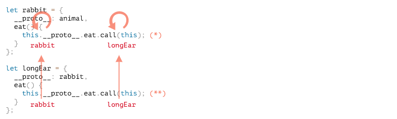
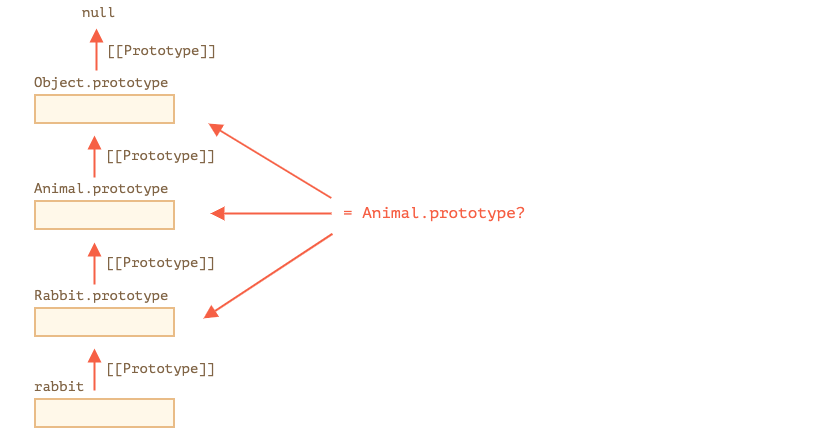

# 现代javascript教程

## 第1部分：JavaScript 编程语言

### 第八章、类

#### 8.1Class 基本语法

*在面向对象的编程中，class 是用于创建对象的可扩展的程序代码模版，它为对象提供了状态（成员变量）的初始值和行为（成员函数和方法）的实现。*

在日常开发中，我们经常要创建许多相同类型的对象，比如用户（users）、商品（goods）或者其他任何东西。

在 [构造函数和操作符 "new"](https://zh.javascript.info/constructor-new) 章节中我们已经知道，`new function` 可以做到这样。

但是在现代 JavaScript 中，有一个更为高级的类（class）构造方式，它引入了对于面向对象编程很有用的功能。

##### [“class” 语法](https://zh.javascript.info/class#class-yu-fa)

基本语法是：

```javascript
class MyClass {
  // class 方法
  constructor() { ... }
  method1() { ... }
  method2() { ... }
  method3() { ... }
  ...
}
```

然后通过 `new MyClass()` 来创建具有上述列出的所有方法的新对象。

通过 `new` 关键词创建的对象会自动调用 `constructor()` 方法，因此我们可以在 `constructor()` 里初始化对象。

例如：

```javascript
class User {

  constructor(name) {
    this.name = name;
  }

  sayHi() {
    alert(this.name);
  }

}

// 使用方法：
let user = new User("John");
user.sayHi();
```

当 `new User("John")` 被调用：

1. 一个新对象被创建。
2. `constructor` 构造器使用给定的参数运行，并为其分配 `this.name`。

…然后我们就可以调用诸如 `user.sayHi` 这样的方法了。

------

**类方法之间没有逗号**

经验不足的开发者常犯的语法错误是在类方法之间加一个逗号。

这里的符号不要与对象字面量相混淆，在类中，不需要逗号。

##### [什么是 class？](https://zh.javascript.info/class#shi-mo-shi-class)

所以，`class` 到底是什么？正如人们可能认为的那样，这不是一个全新的语言级实体。

让我们揭开其神秘面纱，看看类究竟是什么。这将会有助于你理解许多复杂的方面。

**在 JavaScript 中，类是一种函数。**

看看下面这段代码：

```javascript
class User {
  constructor(name) { this.name = name; }
  sayHi() { alert(this.name); }
}

// 佐证：User 是一个函数
alert(typeof User); // function
```

`class User {...}` 构造器内部为我们做了什么：

1. 创建一个以`User`为名称的函数，这是类声明的结果。
   - 函数代码来自于 `constructor` 中的方法（如果我们不写这样的方法，那么就假设它为空的）。
2. 储存所有方法，例如 `User.prototype` 中的 `sayHi`。

然后，对于新的对象，当我们调用方法时，它取自原型，就像我们在 [函数原型](https://zh.javascript.info/function-prototype) 章节中描述的那样。所以 `new User` 对象可以访问类中的方法。

我们可以将 `class User` 声明结果解释为：


下面这些代码很好的解释了它们：

```javascript
class User {
  constructor(name) { this.name = name; }
  sayHi() { alert(this.name); }
}

// 类是函数
alert(typeof User); // function

// ...或者，更确切地说是构造方法
alert(User === User.prototype.constructor); // true

// User.prototype 中的方法，比如：
alert(User.prototype.sayHi); // alert(this.name);

// 实际上在原型中有两个方法
alert(Object.getOwnPropertyNames(User.prototype)); // constructor, sayHi
```

##### [不仅仅是语法糖](https://zh.javascript.info/class#bu-jin-jin-shi-yu-fa-tang)

人们常说 `class` 是 JavaScript 中的语法糖，主要是因为我们可以在没有 `class` 的情况下声明同样的内容：

```javascript
// 以纯函数的重写 User 类

// 1. 创建构造器函数
function User(name) {
  this.name = name;
}
// 任何函数原型默认具有构造器属性，
// 所以，我们不需要创建它

// 2. 向原型中添加方法
User.prototype.sayHi = function() {
  alert(this.name);
};

// 使用方法：
let user = new User("John");
user.sayHi();
```

这和定义的结果大致相同。因此，这确实是 `class` 被视为一种定义构造函数及其原型方法的语法糖的理由。

尽管它们存在重大差异：

1. 首先，通过 `class` 创建的函数是由特殊内部属性标记的 `[[FunctionKind]]:"classConstructor"`。所以，相较于手动创建它还是有点不同的。

   不像普通函数，调用类构造器时必须要用 `new` 关键词：

   ```javascript
   class User {
     constructor() {}
   }
   
   alert(typeof User); // function
   User(); // Error: 没有 ‘new’ 关键词，类构造器 User 无法调用
   ```

   此外，大多数 JavaScript 引擎中的类构造函数的字符串表示形式都以 “class” 开头

   ```javascript
   class User {
     constructor() {}
   }
   
   alert(User); // class User { ... }
   ```

2. 类方法不可枚举。 对于 `"prototype"` 中的所有方法，类定义将 `enumerable` 标记设为 `false。

   这很好，因为如果我们对一个对象调用 `for..in` 方法，我们通常不希望 class 方法出现。

3. 类默认使用 `use strict`。 在类构造函数中的所有方法自动使用严格模式。

此外，除了它的基础操作外，`class` 语法也带来许多其他功能，我们稍后将会探索它们。

##### [类表达式（Class Expression）](https://zh.javascript.info/class#lei-biao-da-shi-classexpression)

正如函数一样，类可以在另外一个表达式中定义，传递（passed around），返回（returned），调用（assigned）等

这里是类表达式的例子：

```javascript
let User = class {
  sayHi() {
    alert("Hello");
  }
};
```

类似于命名函数表达式（Named Function Expressions），类表达式可能也可能没有名称。

如果类表达式有名称，它仅在类内部可见：

```javascript
                        // “命名类表达式”
// （规范中没有这样的术语，但是它和命名函数表达式类似）
let User = class MyClass {
  sayHi() {
    alert(MyClass); // MyClass 仅在其内部可见
  }
};

new User().sayHi(); // 正常运行，显示 MyClass 中定义的内容

alert(MyClass); // 错误，MyClass 在外部不可见
```

我们甚至可以“按需”动态创建类，就像这样：

```javascript
function makeClass(phrase) {
  // 声明并返回类
  return class {
    sayHi() {
      alert(phrase);
    };
  };
}

// 创建新类
let User = makeClass("Hello");

new User().sayHi(); // Hello
```

##### [Getters/setters 及其他 shorthands](https://zh.javascript.info/class#getterssetters-ji-qi-ta-shorthands)

就像对象字面量，类可能包括 getters/setters，generators，计算属性（computed properties）等。

这是使用 `get/set` 实现 `user.name` 的示例：

```javascript
class User {

  constructor(name) {
    // 调用 setter
    this.name = name;
  }

  get name() {
    return this._name;
  }

  set name(value) {
    if (value.length < 4) {
      alert("Name is too short.");
      return;
    }
    this._name = value;
  }

}

let user = new User("John");
alert(user.name); // John

user = new User(""); // Name too short.
```

类声明在 `User.prototype` 中创建 getters 和 setters，就像这样：

```javascript
Object.defineProperties(User.prototype, {
  name: {
    get() {
      return this._name
    },
    set(name) {
      // ...
    }
  }
});
```

这是计算属性的例子：

```javascript
function f() { return "sayHi"; }

class User {
  [f()]() {
    alert("Hello");
  }

}

new User().sayHi();
```

对于 generator 方法，类似的，在它前面添加 `*`。

##### [Class 属性](https://zh.javascript.info/class#class-shu-xing)

------

**旧的浏览器可能需要 polyfill**

类级别的属性是最近才添加到语言中的。

------

上面的例子中，`User` 只有方法。现在我们为其添加属性：

```javascript
class User {
  name = "Anonymous";

  sayHi() {
    alert(`Hello, ${this.name}!`);
  }
}

new User().sayHi();
```

属性不在 `User.prototype` 内。相反它是通过 `new` 分别为每个对象创建的。所以，该属性永远不会在同一个类的不同对象之间共享。

##### [总结](https://zh.javascript.info/class#zong-jie)

基本的类语法看起来是这样的：

```javascript
class MyClass {
  prop = value; // field

  constructor(...) { // 构造器
    // ...
  }

  method(...) {} // 方法

  get something(...) {} // getter 方法
  set something(...) {} // setter 方法

  [Symbol.iterator]() {} // 计算 name/symbol 名方法
  // ...
}
```

技术上来说，`MyClass` 是一个函数（我们提供作为 `constructor` 的那个），而 methods，getters 和 settors 都被写入 `MyClass.prototype`。

在下一章，我们将会进一步研究类，包括继承在内的其他功能。

#### 8.2类继承

假设我们有两个类：

`Animal`:

```javascript
class Animal {
  constructor(name) {
    this.speed = 0;
    this.name = name;
  }
  run(speed) {
    this.speed += speed;
    alert(`${this.name} runs with speed ${this.speed}.`);
  }
  stop() {
    this.speed = 0;
    alert(`${this.name} stopped.`);
  }
}

let animal = new Animal("My animal");
```


…和 `Rabbit`：

```javascript
class Rabbit {
  constructor(name) {
    this.name = name;
  }
  hide() {
    alert(`${this.name} hides!`);
  }
}

let rabbit = new Rabbit("My rabbit");
```


现在，它们是完全独立的。

但是，我们想要 `Rabbit` 继承自 `Animal`。换句话说，rabbits 应该基于 animals，能够访问 `Animal` 中的方法，并使用自己的方法扩展它们。

要继承自另一个类，我们需要在 `{..}` 前指定 `“extends”` 和父类。

在这里，`Rabbit` 继承自 `Animal`：

```javascript
class Animal {
  constructor(name) {
    this.speed = 0;
    this.name = name;
  }
  run(speed) {
    this.speed += speed;
    alert(`${this.name} runs with speed ${this.speed}.`);
  }
  stop() {
    this.speed = 0;
    alert(`${this.name} stopped.`);
  }
}

// 通过指定“extends Animal”让 Rabbit 继承自 Animal
class Rabbit extends Animal {
  hide() {
    alert(`${this.name} hides!`);
  }
}

let rabbit = new Rabbit("White Rabbit");

rabbit.run(5); // White Rabbit runs with speed 5.
rabbit.hide(); // White Rabbit hides!
```

现在 `Rabbit` 代码变简洁了一点，因为它默认以 `Animal` 作为其构造函数，并且它能 `run`，就像 animals 一样。

在其内部，`extends` 关键字添加了 `[[Prototype]]` 引用：从 `Rabbit.prototype` 到 `Animal.prototype`：


 因此，如果在 `Rabbit.prototype` 中没有找到某个方法，JavaScript 将会从 `Animal.prototype` 中获取它。

我们可以回忆一下这一章 [原生的原型](https://zh.javascript.info/native-prototypes)，JavaScript 内置对象同样也是基于原型继承的。例如，`Date.prototype.[[Prototype]]` 是 `Object.prototype`，所以 dates 有通用的对象方法。

------

**`extends` 允许后接任何表达式**

类语法不仅可以指定一个类，还可以指定 `extends` 之后的任何表达式。

例如，一个生成父类的函数调用：

```javascript
function f(phrase) {
  return class {
    sayHi() { alert(phrase) }
  }
}

class User extends f("Hello") {}

new User().sayHi(); // Hello
```

这里 `class User` 继承自 `f("Hello")` 的结果。

我们可以根据多种状况使用函数生成类，并继承它们，这对于高级编程模式来说可能很有用。

##### [重写方法](https://zh.javascript.info/class-inheritance#zhong-xie-fang-fa)

现在，让我们继续前行并尝试重写一个方法。到目前为止，`Rabbit` 继承了 `Animal` 中的 `stop` 方法，该方法设置了 `this.speed = 0`。

如果我们在 `Rabbit` 中定义了我们自己的 `stop` 方法，那么它将被用来代替 `Animal` 中的 `stop`：

```javascript
class Rabbit extends Animal {
  stop() {
    // ...这将用于 rabbit.stop()
  }
}
```

…但是通常来说，我们不希望完全替换父类的方法，而是希望基于它做一些调整或者功能性的扩展。我们在我们的方法中做一些事情，但是在它之前/之后或在执行过程中调用父类方法。

为此，类提供了 `"super"` 关键字。

- 执行 `super.method(...)` 调用父类方法。
- 执行 `super(...)` 调用父类构造函数（只能在子类的构造函数中运行）。

例如，让我们的兔子在停下来的时候自动隐藏：

```javascript
class Animal {

  constructor(name) {
    this.speed = 0;
    this.name = name;
  }

  run(speed) {
    this.speed += speed;
    alert(`${this.name} runs with speed ${this.speed}.`);
  }

  stop() {
    this.speed = 0;
    alert(`${this.name} stopped.`);
  }

}

class Rabbit extends Animal {
  hide() {
    alert(`${this.name} hides!`);
  }

  stop() {
    super.stop(); // 调用父类的 stop 函数
    this.hide(); // 然后隐藏
  }
}

let rabbit = new Rabbit("White Rabbit");

rabbit.run(5); // White Rabbit runs with speed 5.
rabbit.stop(); // White Rabbit stopped. White rabbit hides!
```

现在 `Rabbit` 拥有自己的 `stop` 方法，并且在执行中会调用父类的 `super.stop()`。

------

**箭头函数没有 `super`**

正如我们在 [深入研究箭头函数](https://zh.javascript.info/arrow-functions) 章节中所提到的，箭头函数没有 `super`。

如果被访问，它会从外部函数获取。例如：

```javascript
class Rabbit extends Animal {
  stop() {
    setTimeout(() => super.stop(), 1000); // 1 秒后调用父类 stop 方法
  }
}
```

箭头函数中的 `super` 与 `stop()` 中的是相同的，所以它能按预期工作。如果我们在这里指定一个“普通”函数，那么将会抛出错误：

```javascript
// Unexpected super
setTimeout(function() { super.stop() }, 1000);
```

##### [重写构造函数](https://zh.javascript.info/class-inheritance#zhong-xie-gou-zao-han-shu)

对于构造函数来说，重写则有点棘手。

到目前为止，`Rabbit` 还没有自己的 `constructor`。

根据 [规范](https://tc39.github.io/ecma262/#sec-runtime-semantics-classdefinitionevaluation)，如果一个类继承了另一个类并且没有 `constructor`，那么将生成以下“空” `constructor`：

```javascript
class Rabbit extends Animal {
  // 为没有构造函数的继承类生成以下的构造函数
  constructor(...args) {
    super(...args);
  }
}
```

我们可以看到，它调用了父类的 `constructor`，并传递了所有的参数。如果我们不写自己的构造函数，就会出现这种情况。

现在，我们给 `Rabbit` 添加一个自定义的构造函数。除了 `name` 它还会定义 `earLength`。

```javascript
class Animal {
  constructor(name) {
    this.speed = 0;
    this.name = name;
  }
  // ...
}

class Rabbit extends Animal {

  constructor(name, earLength) {
    this.speed = 0;
    this.name = name;
    this.earLength = earLength;
  }

  // ...
}

// 不生效！
let rabbit = new Rabbit("White Rabbit", 10); // Error: this is not defined.
```

哎呦！我们得到一个报错。现在我们没法新建兔子了。是什么地方出错了？

简短的解释下原因：继承类的构造函数必须调用 `super(...)`，并且 (!) 一定要在使用 this 之前调用。

…但这是为什么呢？这里发生了什么？这个要求确实看起来很奇怪。

当然，本文会给出一个解释。让我们深入细节，这样你就可以真正的理解发生了什么。

在 JavaScript 中，“继承类的构造函数”与所有其他的构造函数之间存在区别。在继承类中，相应的构造函数会被标记为特殊的内部属性 `[[ConstructorKind]]:"derived"`。

不同点就在于：

- 当一个普通构造函数执行时，它会创建一个空对象作为 `this` 并继续执行。
- 但是当继承的构造函数执行时，它并不会做这件事。它期望父类的构造函数来完成这项工作。

因此，如果我们构建了我们自己的构造函数，我们必须调用 `super`，因为如果不这样的话 `this` 指向的对象不会被创建。并且我们会收到一个报错。

为了让 `Rabbit` 可以运行，我们需要在使用 `this` 之前调用 `super()`，就像下面这样：

```javascript
class Animal {

  constructor(name) {
    this.speed = 0;
    this.name = name;
  }

  // ...
}

class Rabbit extends Animal {

  constructor(name, earLength) {
    super(name);
    this.earLength = earLength;
  }

  // ...
}

// 现在可以了
let rabbit = new Rabbit("White Rabbit", 10);
alert(rabbit.name); // White Rabbit
alert(rabbit.earLength); // 10
```

##### [Super 内部探究：[[HomeObject\]]](https://zh.javascript.info/class-inheritance#super-nei-bu-tan-jiu-homeobject)

让我们再深入的去研究下 `super`。顺便说一句，我们会发现一些有趣的事情。

首先要说的是，从我们迄今为止学到的知识来看，`super` 是不可能运行的。

的确是这样，让我们问问自己，在技术上它是如何实现的？当一个对象方法运行时，它会将当前对象作为 `this`。如果之后我们调用 `super.method()`，它需要从当前对象的原型中调用 `method`。

任务看起来是挺容易的，但其实并不简单。引擎知道当前对象的 `this`，因此它可以获取父 `method` 作为 `this.__proto__.method`。不幸的是，这个“天真”的解决方法是行不通的。

让我们来说明一下这个问题。没有类，为简单起见，使用普通对象。

在下面的例子中是 `rabbit.__proto__ = animal`。现在让我们尝试一下：在 `rabbit.eat()` 我们将会通过 `this.__proto__` 调用 `animal.eat()`：

```javascript
let animal = {
  name: "Animal",
  eat() {
    alert(`${this.name} eats.`);
  }
};

let rabbit = {
  __proto__: animal,
  name: "Rabbit",
  eat() {
    // 这就是 super.eat() 可能运行的原因
    this.__proto__.eat.call(this); // (*)
  }
};

rabbit.eat(); // Rabbit eats.
```

在 (*) 这一行，我们从原型（`animal`）上获取 `eat`，并在当前对象的上下文中调用它。请注意，`.call(this)` 在这里非常重要，因为简单的调用 `this.__proto__.eat()` 将在原型的上下文中执行 `eat`，而非当前对象。

在上述的代码中，它按照期望运行：我们获得了正确的 `alert`。

现在让我们在原型链上再添加一个额外的对象。我们将看到这件事是如何被打破的：

```javascript
let animal = {
  name: "Animal",
  eat() {
    alert(`${this.name} eats.`);
  }
};

let rabbit = {
  __proto__: animal,
  eat() {
    // ...围绕 rabbit-style 和 调用父类（animal）方法
    this.__proto__.eat.call(this); // (*)
  }
};

let longEar = {
  __proto__: rabbit,
  eat() {
    // ...用长耳朵做一些事情，并调用父类（rabbit）的方法
    this.__proto__.eat.call(this); // (**)
  }
};

longEar.eat(); // Error: Maximum call stack size exceeded
```

代码无法再运行了！我们可以看到，在试图调用 `longEar.eat()` 时抛出了错误。

原因可能不那么明显，但是如果我们跟踪 `longEar.eat()` 的调用，就可以发现原因。在 (*) 和 (**) 这两行中，`this` 的值都是当前对象（`longEar`）。这是至关重要的一点：所有的对象方法都将当前对象作为 `this`，而非原型或其他什么东西。

因此，在 (*) 和 (**) 这两行中，`this.__proto__` 的值是完全相同的：都是 `rabbit`。在这个无限循环中，他们都调用了 `rabbit.eat`，而不是在原型链上向上寻找方法。

这张图介绍了发生的情况：



1. 在 `longEar.eat()` 中，(**) 这一行调用 `rabbit.eat` 并且此时 `this=longEar`。

   ```javascript
   // 在 longEar.eat() 中 this 指向 longEar
   this.__proto__.eat.call(this) // (**)
   // 变成了
   longEar.__proto__.eat.call(this)
   // 即等同于
   rabbit.eat.call(this);
   ```

2. 之后在 `rabbit.eat` 的 (*) 行中，我们希望将函数调用在原型链上向更高层传递，但是因为 `this=longEar`，因此 `this.__proto__.eat` 又是 `rabbit.eat`！

   ```javascript
   // 在 rabbit.eat() 中 this 依旧等于 longEar
   this.__proto__.eat.call(this) // (*)
   // 变成了
   longEar.__proto__.eat.call(this)
   // 再次等同于
   rabbit.eat.call(this);
   ```

3. …所以 `rabbit.eat` 不停地循环调用自己，因此它无法进一步地往原型链的更高层调用。

这个问题没法单独使用 `this` 来解决。

###### [`[[HomeObject\]]`](https://zh.javascript.info/class-inheritance#homeobject)

为了提供解决方法，JavaScript 为函数额外添加了一个特殊的内部属性：`[[HomeObject]]`。

当一个函数被定义为类或者对象方法时，它的 `[[HomeObject]]` 属性就成为那个对象。

然后 `super` 使用它来解析父类原型和它自己的方法。

让我们看看它是怎么工作的，首先，对于普通对象：

```javascript
let animal = {
  name: "Animal",
  eat() {         // animal.eat.[[HomeObject]] == animal
    alert(`${this.name} eats.`);
  }
};

let rabbit = {
  __proto__: animal,
  name: "Rabbit",
  eat() {         // rabbit.eat.[[HomeObject]] == rabbit
    super.eat();
  }
};

let longEar = {
  __proto__: rabbit,
  name: "Long Ear",
  eat() {         // longEar.eat.[[HomeObject]] == longEar
    super.eat();
  }
};

// 正常运行
longEar.eat();  // Long Ear eats.
```

它按照预期运行，基于 `[[HomeObject]]` 运行机制。像 `longEar.eat` 这样的方法，知道 `[[HomeObject]]`，并且从它的原型中获取父类方法。并没有使用 `this`。

###### [方法并不是“自由”的](https://zh.javascript.info/class-inheritance#fang-fa-bing-bu-shi-zi-you-de)

**这里可以成功执行，但是使用方法上是错误，因为不能随意将带有`super`方法从一个对象复制到另一个对象。**

在前面我们已经知道，通常函数都是 “自由” 的，并没有绑定到 JavaScript 中的对象。正因如此，它们可以在对象之间复制，并且用另外一个 `this` 调用它。

`[[HomeObject]]` 的存在违反了这个原则，因为方法记住了它们的对象。`[[HomeObject]]` 不能被修改，所以这个绑定是永久的。

在 JavaScript 语言中 `[[HomeObject]]` 仅被用于 `super`。所以，如果一个方法不使用 `super`，那么我们仍然可以视它为自由的并且可在对象之间复制。但是在 `super` 中可能出错。

下面是错误的 `super` 调用示例：

```javascript
let animal = {
  sayHi() {
    console.log(`I'm an animal`);
  }
};

let rabbit = {
  __proto__: animal,
  sayHi() {
    super.sayHi();
  }
};

let plant = {
  sayHi() {
    console.log("I'm a plant");
  }
};

let tree = {
  __proto__: plant,
  sayHi: rabbit.sayHi // (*)
};

tree.sayHi();  // I'm an animal (?!?)
```

调用 `tree.sayHi()` 显示 “I’m an animal”。绝对是错误的。

原因很简单：

- 在 (*) 行，`tree.sayHi` 方法从 `rabbit` 复制而来。也许我们只是想避免重复代码？
- 所以它的 `[[HomeObject]]` 是 `rabbit`，因为他是在 `rabbit` 中创建的。没有办法修改 `[[HomeObject]]`。
- `tree.sayHi()` 内具有 `super.sayHi()`。它从 `rabbit` 中上溯，然后从 `animal` 中获取方法。


##### [方法，不是函数属性](https://zh.javascript.info/class-inheritance#fang-fa-bu-shi-han-shu-shu-xing)

`[[HomeObject]]` 是为类和普通对象中的方法定义的。但是对于对象来说，方法必须确切指定为 `method()`，而不是 `"method: function()"`。

这个差别对我们来说可能不重要，但是对 JavaScript 来说却是非常重要的。

下面的例子中，使用非方法（non-method）语句进行比较。`[[HomeObject]]` 属性未设置，并且继承不起作用：

```javascript
let animal = {
  eat: function() { // 可以使用简短写法：eat() {...}
    // ...
  }
};

let rabbit = {
  __proto__: animal,
  eat: function() { // 这里不可使用method: function()定义，该定义方法不设置[[HomeObject]]
    super.eat();
  }
};

rabbit.eat();  // 错误调用 super（因为这里并没有 [[HomeObject]]）
```

##### [总结](https://zh.javascript.info/class-inheritance#zong-jie)

1. 扩展类：

   ```
   class Child extends Parent
   ```

   ：

   - 这就意味着 `Child.prototype.__proto__` 将是 `Parent.prototype`，所以方法被继承。

2. 重写构造函数：

   - 在使用 `this` 之前，我们必须在 `Child` 构造函数中将父构造函数调用为 `super()`。

3. 重写方法：

   - 我们可以在 `Child` 方法中使用 `super.method()` 来调用 `Parent` 方法。

4. 内部工作：

   - 方法在内部 `[[HomeObject]]` 属性中记住它们的类/对象。这就是 `super` 如何解析父类方法的。
   - 因此，将一个带有 `super` 的方法从一个对象复制到另一个对象是不安全的。

补充：

- 箭头函数没有自己的 `this` 或 `super`，所以它们能融入到就近的上下文，像透明似的。

##### 拓展`Object.__proto__ === Function.prototype`

个人认为JS的原型链有点绕，故去网上学习了一下人家的理解，[原链接奉上](https://www.cnblogs.com/oxspirt/p/6069874.html)。

先说点和链接内容无关，但是我觉得有必要看的东西。


首先看第一张图，目的是为了搞明白`__proto__`和`prototype`，先来个定义解释吧：

- `__proto__`是站在对象的角度讨论原型对象。
- `prototype`是站在构造函数的角度讨论原型属性，或构造函数创建的对象的原型对象。

javascript是基于对象的，换一种说法是基于原型(链)的。

每一个函数都有一个`prototype`(原型)属性,这个属性是一个对象，它的用途是包含可以由特定类型的所有实例共享的属性和方法。`prototype`是通过调用构造函数来创建的那个对象的原型(属性)对象。

Javascript中对象的`prototype`属性，可以返回对象的**原型对象**的引用。

*怎么理解原型(链)？*

函数(对象)有`prototype`属性->对应了一个原型对象->每个原型对象都有一个`constructor`属性->包含一个指向`prototype`属性所在函数的指针。

每一个实例都有一个内部属性`\__proto__`->指向原型对象。

这里提到的几个属性或对象：

- `Person`是一个对象
- `person`是一个对象的实例
- `Person.prototype`;//->是原型对象
- `Person.prototype.constructor`;//->指向构造函数

- `person.\__proto__`;//->指向原型对象

**原链接干货正式来了！**


`__proto__`是在查找链中用于解析方法等的实际对象。`prototype`是在使用`new`创建对象时用于构建`__proto__`的对象。


对我来说，最令人惊讶的事情是发现`Object .__ proto__`指向`Function.prototype`而不是`Object.prototype`，但是我敢肯定有很好的理由:-)。

我认为类`Object`本身是`Function`的一个实例，这就是为什么`Object .__ proto__ === Function.prototype`的原因。

之所以`Object .__ proto__`指向`Function.prototype`的原因是因为`Object（）`本身是实例化空对象的原生函数。 因此，`Object（）`是一个函数。 您会发现所有其他主要的原生类型的`__proto__`属性都指向`Function.prototype`。 对象，函数，字符串，数字和数组都继承了函数原型。

这意味着添加到`Function.prototype`将自动反映其`__proto__`引用`Function.prototype`的所有对象。

例如，看下面的地图：


此外，即使类Function本身也是Function本身的实例，也就是`Function .__ proto__ === Function.prototype`，这也是为什么`Function === Function.constructor`

此外，常规类`Cat`是`Function`的实例，即`Cat .__ proto__ === Function.prototype`。

上面的原因是，实际上，当我们使用JavaScript创建类时，我们只是在创建一个函数，该函数应该是`Function`的一个实例。 对象和函数只是特殊的，但它们仍然是类，而`Cat`是常规类。

作为一个因素，在Google Chrome JavaScript引擎中，以下4个参数：

- `Function.prototype`
- `Function.__proto__`
- `Object.__proto__`
- `Cat.__proto__`

They are all `===` (absolutely equal) to the other 3, and their value is `function Empty() {}`

```
> Function.prototype
  function Empty() {}
> Function.__proto__
  function Empty() {}
> Object.__proto__
  function Empty() {}
> Cat.__proto__
  function Empty() {}
> Function.prototype === Function.__proto__
  true
> Function.__proto__ === Object.__proto__
  true
> Object.__proto__ === Cat.__proto__
  true
```


这里的代码笔者认为非常有必要去谷歌开发者模式的控制台里跑一下，给大家提供个不用手敲的福利：

```
Object.O1=""
Object.prototype.Op1=""
Function.F1=""
Function.prototype.Fp1=""
Cat = function(){}
Cat.C1 = ""
Cat.prototype.Cp1 = ""
myCat = new Cat()
o = {}
console.log(myCat)
console.log(o)
```

这里拿`myCat`为例子解释下打印出的东西：


其实笔者看完了也不能深究原理理解为什么`Object.__proto__ === Function.prototype`，但是通过观察实际例子，事实如此，至少可以加深印象，而且博客中讲到的`Object（）`是一个函数也确实是合理解释了。

#### 8.3静态属性和静态方法

我们可以把一个方法赋值给一个类方法，而不是赋给它的 `"原型对象"`。这样的方法我们称为**静态的**。

在类里面，他们在前面添加 “static” 关键字，就像这样：

```javascript
class User {
  static staticMethod() {
    alert(this === User);
  }
}

User.staticMethod(); // true
```

这实际上跟直接作为属性赋值做了同样的事情：

```javascript
class User() { }

User.staticMethod = function() {
  alert(this === User);
};
```

在 `User.staticMethod` 方法内部，`this` 的值是构造函数 `User` 它自己（“点之前对象”[object before dot]规则）。

通常来说，静态方法用来实现一个属于类，但不属于类的某个对象的特定方法。

举个例子，我们有 `Article` 对象，需要一个方法来比较它们。一个自然的解决方案是添加 `Article.compare` 方法，就像这样：

```javascript
class Article {
  constructor(title, date) {
    this.title = title;
    this.date = date;
  }

  static compare(articleA, articleB) {
    return articleA.date - articleB.date;
  }
}

// 用法
let articles = [
  new Article("HTML", new Date(2019, 1, 1)),
  new Article("CSS", new Date(2019, 0, 1)),
  new Article("JavaScript", new Date(2019, 11, 1))
];

articles.sort(Article.compare);

alert( articles[0].title ); // CSS
```

这里 `Article.compare` 代表这些文章，作为一个比较它们的意思。它不是一篇文章的方法，而是所有 class 的方法。

另一个例子是所谓的“工厂”方法。想象一下，我们需要一些方式来创建一篇文章：

1. 通过用指定的参数来创建(`title`，`date` 等)。
2. 用今天的日期来创建一篇空的文章。
3. ……其它等等。

第一种方法我们可以使用构造函数来实现。对于第二种方式，我们可以创建一个类的静态方法来实现。

就像这里的 `Article.createTodays()`：

```javascript
class Article {
  constructor(title, date) {
    this.title = title;
    this.date = date;
  }

  static createTodays() {
    // 记住，this = Article
    return new this("Today's digest", new Date());
  }
}

let article = Article.createTodays();

alert( article.title ); // Todays digest
```

现在，每当我们需要创建一个今天的摘要时，我们可以调用 `Article.createTodays()`。再一次说明，这不是一篇文章的方法，而是整个 class 的方法。

静态方法也用于与数据库相关的公共类，可以用来搜索/保存删除数据库中的条目， 就像这样：

```javascript
// 假定 Article 是一个用来管理文章的特殊类
// 静态方法用于移除文章：
Article.remove({id: 12345});
```

##### [静态属性](https://zh.javascript.info/static-properties-methods#jing-tai-shu-xing)

------

最近的补充
这是该语言的最新功能。 示例可在最近的Chrome浏览器中使用。

------

静态的属性也是有可能的，它们看起来像常规的类属性，但前面加有 `static`：

```javascript
class Article {
  static publisher = "Ilya Kantor";
}

alert( Article.publisher ); // Ilya Kantor
```

这等同于直接给 `Article` 赋值：

```javascript
Article.publisher = "Ilya Kantor";
```

##### [静态方法的继承](https://zh.javascript.info/static-properties-methods#jing-tai-fang-fa-de-ji-cheng)

静态方法是继承的。

举个例子：下面代码里的 `Animal.compare` 被继承，可以通过 `Rabbit.compare` 来访问：

```javascript
class Animal {

  constructor(name, speed) {
    this.speed = speed;
    this.name = name;
  }

  run(speed = 0) {
    this.speed += speed;
    alert(`${this.name} runs with speed ${this.speed}.`);
  }

  static compare(animalA, animalB) {
    return animalA.speed - animalB.speed;
  }

}

// 继承 Animal 类
class Rabbit extends Animal {
  hide() {
    alert(`${this.name} hides!`);
  }
}

let rabbits = [
  new Rabbit("White Rabbit", 10),
  new Rabbit("Black Rabbit", 5)
];

rabbits.sort(Rabbit.compare);

rabbits[0].run(); // Black Rabbit runs with speed 5.
```

现在我们调用 `Rabbit.compare` 被断定为继承的 `Animal.compare` 将被调用。

它的原理是什么？ 再次的，使用原型。你可能已经猜到了，`继承` 让 `Rabbit` 的 `[[Prototype]]` 属性指向了 `Animal`。


因此，`Rabbit extends Animal` 创建了两个 `[[Prototype]]` 的引用：

1. `Rabbit` 方法原型继承自 `Animal` 方法。
2. `Rabbit.prototype` 原型继承自 `Animal.prototype`。

结果就是，继承对于常规的和静态的方法都有效。

这里，让我们通过代码来检验一下：

```javascript
class Animal {}
class Rabbit extends Animal {}

// 对于静态属性和静态方法
alert(Rabbit.__proto__ === Animal); // true

// 对于普通方法
alert(Rabbit.prototype.__proto__ === Animal.prototype);
```

##### [总结](https://zh.javascript.info/static-properties-methods#zong-jie)

静态方法被用来实现属于整个类的功能，不涉及到某个具体的类实例的功能。

举个例子， 一个用来比较的方法 `Article.compare(article1, article2)` 或者一个工厂函数 `Article.createTodays()`。

它们在类声明中通过 `static` 来标记。

当我们想要存储类级别的数据时，我们会使用静态属性，而不是在实例上绑定数据。

语法：

```javascript
class MyClass {
  static property = ...;

  static method() {
    ...
  }
}
```

技术上来说，静态声明等同于直接给类本身赋值：

```javascript
MyClass.property = ...
MyClass.method = ...
```

静态属性和方法是被继承的。

对于 `class B extends A`，类 `B` 的 prototype 指向了 `A`：`B.[[Prototype]] = A`。因此，如果一个字段在 `B` 中没有找到，会继续在 `A` 中查找。

#### 8.4私有的和受保护的属性和方法

面向对象编程最重要的原则之一 —— 划分出外部接口和内部接口。

在开发比 “hello world” 应用更复杂的东西时，这是“必须”的做法。

为了理解这一点，让我们脱离开发过程，把目光转向现实世界。

通常，我们使用的设备非常复杂。但是划分出外部接口和内部接口可以让我们使用它们而没有任何问题。

##### [一个真实的例子](https://zh.javascript.info/private-protected-properties-methods#yi-ge-zhen-shi-de-li-zi)

例如咖啡机。从外面看很简单：一个按钮，一个显示器，几个洞……当然，结果就是 —— 很棒的咖啡！:)

但在里面……（维修手册中的图片）


有很多细节。但我们可以在不了解的情况下使用它。

咖啡机非常可靠，不是吗？我们可以使用好几年，只有在出现问题时 —— 进行维修。

咖啡机的可靠性和简洁性的秘诀 —— 所有细节都经过精心调整并 **隐藏** 在内部。

如果我们从咖啡机上取下保护盖，那么使用它将会复杂得多（要按哪里？），并且危险（会触电）。

正如我们所看到的，在编程中，对象就像咖啡机。

但是为了隐藏内部细节，我们不会使用保护盖，而是使用语言和惯例中的特殊语法。

##### [内部接口和外部接口](https://zh.javascript.info/private-protected-properties-methods#nei-bu-jie-kou-he-wai-bu-jie-kou)

在面向对象的编程中，属性和方法分为两组：

- **内部接口** —— 可以通过类的其他方法访问，但不能从外部访问的方法和属性。
- **外部接口** —— 也可从类的外部访问的方法和属性。

如果我们继续用咖啡机进行类比 —— 内部隐藏的内容：锅炉管，加热元件等 —— 是其内部的接口。

内部接口用于对象，它的细节相互使用。例如，锅炉管连接到加热元件。

但是从外面看，咖啡机内部被保护罩遮住，所以没有人可以接触到。细节被隐藏起来并且无法访问。我们可以通过外部接口使用它的功能。

所以，我们需要使用一个对象时只需知道它的外部接口。我们可能完全不知道它的内部是如何工作的，这很棒。

这是个概括的介绍。

在 JavaScript 中，有两种类型的对象字段（属性和方法）：

- 公共的：可从任何地方访问。它们包含外部接口。直到现在我们只使用公共属性和方法。
- 私有的：只能从类的内部访问。这些用于内部接口。

在许多其他语言中，还存在“受保护”的字段：只能从类的内部访问和扩展它们（类似私有的，但是加上了向继承的类的访问）。它们对内部接口也很有用。它们在某种意义上比私有的属性和方法更广泛，因为我们通常希望继承类来获得正确执行扩展的访问权限。

受保护的字段不是在 Javascript 语言级别上实现的，但实际上它们非常方便，因为它们是在 Javascript 中模拟的类定义语法。

现在，我们将使用所有这些类型的属性在 Javascript 中制作咖啡机。咖啡机有很多细节，我们不会对它们进行全面模拟以保持简洁（尽管我们可以）。

##### [受保护的“waterAmount”](https://zh.javascript.info/private-protected-properties-methods#shou-bao-hu-de-wateramount)

让我们先做一个简单的咖啡机类：

```javascript
class CoffeeMachine {
  waterAmount = 0; // 内部的水量

  constructor(power) {
    this.power = power;
    alert( `Created a coffee-machine, power: ${power}` );
  }

}

// 创建咖啡机
let coffeeMachine = new CoffeeMachine(100);

// 加入水
coffeeMachine.waterAmount = 200;
```

现在，属性 `waterAmount` 和 `power` 是公共的。我们可以轻松地从外部读取/设置它们为任何值。

让我们将 `waterAmount` 属性更改为受保护的属性以对其进行更多控制。例如，我们不希望任何人将其值设置为小于零的数。

**受保护的属性通常以下划线 `_` 作为前缀。**

这不是在语言层面强制实施的，但是有一个在程序员之间人尽皆知的惯例是不应该从外部访问这些属性和方法。

所以我们的属性将被称为 `_waterAmount` ：

```javascript
class CoffeeMachine {
  _waterAmount = 0;

  set waterAmount(value) {
    if (value < 0) throw new Error("Negative water");
    this._waterAmount = value;
  }

  get waterAmount() {
    return this._waterAmount;
  }

  constructor(power) {
    this._power = power;
  }

}

// 创建咖啡机
let coffeeMachine = new CoffeeMachine(100);

// 加入水
coffeeMachine.waterAmount = -10; // Error: Negative water
```

现在访问受到控制，因此将水量设置为小于零的数将会失败。

##### [只读的“power”](https://zh.javascript.info/private-protected-properties-methods#zhi-du-de-power)

对于 `power` 属性，让我们将它设为只读的。有时候一个属性必须仅在创建时设置，然后不再修改。

这就是咖啡机的实际情况：功率永远不会改变。

要做到这一点，我们只需要设置 getter，而不是 setter：

```javascript
class CoffeeMachine {
  // ...

  constructor(power) {
    this._power = power;
  }

  get power() {
    return this._power;
  }

}

// 创建咖啡机
let coffeeMachine = new CoffeeMachine(100);

alert(`Power is: ${coffeeMachine.power}W`); // 功率是：100W

coffeeMachine.power = 25; // Error (no setter)
```

------

**Getter/setter 函数**

这里我们使用 getter/setter 语法。

但大多数时候首选 `get.../set...` 函数，像这样：

```javascript
                       class CoffeeMachine {
  _waterAmount = 0;

  setWaterAmount(value) {
    if (value < 0) throw new Error("Negative water");
    this._waterAmount = value;
  }

  getWaterAmount() {
    return this._waterAmount;
  }
}

new CoffeeMachine().setWaterAmount(100);
```

这看起来有点长，但函数更灵活。他们可以接受多个参数（即使我们现在不需要它们）。

另一方面，get/set 语法更短，所以最终没有严格的规则，而是由你自己来决定。

------

**受保护的字段是继承的**

如果我们继承 `class MegaMachine extends CoffeeMachine`，那么无法阻止我们从新的类中的方法访问 `this._waterAmount` 或 `this._power`。

所以受保护的字段是自然可继承的。不像我们接下来将看到的私有字段。

##### [私有的“#waterLimit”](https://zh.javascript.info/private-protected-properties-methods#si-you-de-waterlimit)

------

最近的补充
这是该语言的最新功能。 JavaScript引擎不支持或部分支持，需要填充。

------

在标准中几乎有个已完成的 Javascript 提案，它为私有属性和方法提供语言级支持。

私有属性和方法应该以 `#` 开头。他们只能从类的内部访问。

例如，这有一个私有属性 `#waterLimit`，以及检查水量的私有方法 `#checkWater`：

```javascript
class CoffeeMachine {
  #waterLimit = 200;

  #checkWater(value) {
    if (value < 0) throw new Error("Negative water");
    if (value > this.#waterLimit) throw new Error("Too much water");
  }

}

let coffeeMachine = new CoffeeMachine();

// 不能从类的外部访问其私有方法
coffeeMachine.#checkWater(); // Error
coffeeMachine.#waterLimit = 1000; // Error
```

在语言层面，`#` 是该字段为私有的特殊标志。我们无法从外部或从继承的类中访问它。

私有字段不与公共字段发生冲突。我们可以同时拥有私有属性 `#waterAmount` 和公共属性 `waterAmount`。

例如，让 `waterAmount` 成为 `#waterAmount` 的访问器：

```javascript
class CoffeeMachine {

  #waterAmount = 0;

  get waterAmount() {
    return this.#waterAmount;
  }

  set waterAmount(value) {
    if (value < 0) throw new Error("Negative water");
    this.#waterAmount = value;
  }
}

let machine = new CoffeeMachine();

machine.waterAmount = 100;
alert(machine.#waterAmount); // Error
```

与受保护的字段不同，私有字段由语言本身强制执行。这是好事。

但是如果我们继承 `CoffeeMachine`，那么我们将无法直接访问 `#waterAmount`。我们需要依赖 `waterAmount` getter / setter：

```javascript
class MegaCoffeeMachine extends CoffeeMachine() {
  method() {
    alert( this.#waterAmount ); // 错误：只能从 CoffeeMachine 中访问
  }
}
```

在许多情况下，这种限制太严重了。如果我们扩展一个 `CoffeeMachine`，我们可能有正当理由访问其内部。这就是为什么大多数时候都会使用受保护字段的原因，即使它们不受语言语法的支持。

------

**私有字段不能通过 this[name] 访问**

私有字段很特别。

如我们所知，通常我们可以使用 `this[name]` 访问字段：

```javascript
                                   class User {
  ...
  sayHi() {
    let fieldName = "name";
    alert(`Hello, ${this[fieldName]}`);
  }
}
```

私有字段是不可能的： `this['#name']` 不起作用。这是确保私有性的语法限制。

##### [总结](https://zh.javascript.info/private-protected-properties-methods#zong-jie)

就面向对象编程（OOP）而言，内部接口与外部接口的划分称为[封装](https://zh.javascript.info/article/private-protected-properties-methods/"https://en.wikipedia.org/wiki/Encapsulation_(computer_programming)")。

它具有以下优点：

- 保护用户，使他们不会误伤自己

  想象一下，有一群开发人员使用咖啡机。它是由“Best CoffeeMachine”公司制造的，工作正常，但保护盖被拿走了。因此内部接口暴露了出来。所有的开发人员都是文明的 —— 他们按照预期使用咖啡机。但其中一个人，约翰，被认为是最聪明的，并且决定让他在咖啡机内部做一些调整。然而咖啡机两天后就坏了。这肯定不是约翰的错，而是那个取下保护套并让约翰执行自己操作的人的错。编程也一样。如果一个类的使用者想要改变那些本不打算从外部改变的东西 —— 后果是不可预测的。

- 可支持的

  编程的情况比现实生活中的咖啡机更复杂，因为我们不只是购买一次。代码不断经历着发展和改进。**如果我们严格界定内部接口，那么类的开发人员可以自由地更改其内部属性和方法，即使没有通知用户。**如果你是这样的类的开发者，当知道由于没有外部代码的依赖，私有方法可以安全地重命名，它们的参数可以改变，甚至可以删除是很棒的事。对于使用者来说，当新版本出现时，它可能是全面的内部检查，但如果外部接口相同，则仍然很容易升级。

- 隐藏复杂性

  人们喜欢使用简单的东西。至少从外部来看是这样。内部的东西则是另外一回事了。程序员也不例外。**隐藏实施细节时总是很方便，并且提供了一个简单的，记录详细的外部接口。**

为了隐藏内部接口，我们使用受保护的或私有的属性：

- 受保护的字段以 `_` 开头。这是一个众所周知的惯例，没有在语言层面强制执行。程序员只应该通过它的类和它继承的类中访问以 `_` 开头的字段。
- 私有字段以 `#` 开头。JavaScript 确保我们只能访问类中的内容。

目前，在各浏览器中不支持私有字段，但可以用 polyfill 解决。

#### 8.5Extending built-in classes（扩展内置类）

内置类（如Array，Map等）也可以扩展。举例来说，在这里`PowerArray`从原生`Array`继承：

```javascript
// add one more method to it (can do more)
class PowerArray extends Array {
  isEmpty() {
    return this.length === 0;
  }
}

let arr = new PowerArray(1, 2, 5, 10, 50);
alert(arr.isEmpty()); // false

let filteredArr = arr.filter(item => item >= 10);
alert(filteredArr); // 10, 50
alert(filteredArr.isEmpty()); // false
```

请注意一件非常有趣的事情。 内置方法（例如filter，map和其他方法）将返回完全继承类型的新对象。 他们依靠`constructor`属性来做到这一点。

在上面的示例中，

```javascript
arr.constructor === PowerArray
```

所以当`arr.filter()`被调用时，它自然地使用 `new PowerArray`而不是基础的`Array`创建新的数组结果。这实际上非常酷，因为我们可以继续在结果上使用`PowerArray`的方法。

甚至，我们可以自定义该行为。

我们可以在类中添加一个特殊的静态get方法`Symbol.species`。如果存在，则应返回JavaScript将在内部使用其在`map`，`filter`等中创建新实体的构造函数。

对象的`Symbol.species`属性，指向当前对象的构造函数。创造实例时，默认会调用这个方法，即使用这个属性返回的函数当作构造函数，来创造新的实例对象。

如果我们希望使用诸如`map`这样的内置方法，`filter`将返回常规数组，则可以在`Symbol.species`中返回`Array`，如下所示：

```javascript
class PowerArray extends Array {
  isEmpty() {
    return this.length === 0;
  }

  // built-in methods will use this as the constructor
  static get [Symbol.species]() {
    return Array;
  }
}

let arr = new PowerArray(1, 2, 5, 10, 50);
alert(arr.isEmpty()); // false

// filter creates new array using arr.constructor[Symbol.species] as constructor
let filteredArr = arr.filter(item => item >= 10);

// filteredArr is not PowerArray, but Array
alert(filteredArr.isEmpty()); // Error: filteredArr.isEmpty is not a function
```

如您所见，`.filter`现在返回`Array`。 因此，扩展功能不再传递。

##### [No static inheritance in built-ins](https://zh.javascript.info/extend-natives#nostaticinheritanceinbuiltins)（内置类没有静态方法继承）

内置对象具有自己的静态方法，例如`Object.keys`，`Array.isArray`等。

众所周知，原生类相互扩展。 例如，`Array`扩展了`Object`。

通常，当一个类扩展另一个类时，静态和非静态方法都会被继承。

所以，如果`Rabbit extends Animal`，那么：

1. `Rabbit.methods` are callable for `Animal.methods`, 因为 `Rabbit.[[Prototype]] = Animal`.
2. `new Rabbit().methods` are also available, because `Rabbit.prototype.[[Prototype]] = Animal.prototype`.

本章已对此进行了详细说明[静态属性和静态方法](https://zh.javascript.info/static-properties-methods#statics-and-inheritance).

但是内置类是一个例外。 它们不会彼此继承静态变量`（1）`。

For example, both `Array` and `Date` inherit from `Object`, so their instances have methods from `Object.prototype`. But `Array.[[Prototype]]` does not point to `Object`. So there’s `Object.keys()`, but not `Array.keys()` and `Date.keys()`.

Here’s the picture structure for `Date` and `Object`:


Note, there’s no link between `Date` and `Object`. Both `Object` and `Date` exist independently. `Date.prototype`inherits from `Object.prototype`, but that’s all.

下图是[静态属性和静态方法](https://zh.javascript.info/static-properties-methods)中的图，非内置类的继承，这里静态方法也得到了继承。


#### 8.6类型检测："instanceof"

`instanceof` 操作符用于检测对象是否属于某个 class，同时，检测过程中也会将继承关系考虑在内。

这种检测在多数情况下还是比较有用的，下面，我们就用它来构建一个具备 **多态** 性的函数，这个函数能识别出参数类型，从而作出不同的处理。

##### [instanceof](https://zh.javascript.info/instanceof#ref-instanceof)

用法：

```javascript
obj instanceof Class
```

如果 `obj` 隶属于 `Class` 类（或者是 `Class` 类的衍生类），表达式将返回 `true`。

举例说明：

```javascript
class Rabbit {}
let rabbit = new Rabbit();

// rabbit 是 Rabbit 类的实例对象吗?
alert( rabbit instanceof Rabbit ); // true
```

使用构造函数结果也是一样的：

```javascript
// 构造函数而非 class
function Rabbit() {}

alert( new Rabbit() instanceof Rabbit ); // true
```

…再来看看内置类型 `Array`：

```javascript
let arr = [1, 2, 3];
alert( arr instanceof Array ); // true
alert( arr instanceof Object ); // true
```

有一点需要留意，`arr` 同时还隶属于 `Object` 类。因为从原型上来讲，`Array` 是继承自 `Object` 类的。

`instanceof` 在检测中会将原型链考虑在内，此外，还能借助静态方法 `Symbol.hasInstance` 来改善检测效果。

`obj instanceof Class` 语句的大致执行过程如下：

1. 如果提供了静态方法 `Symbol.hasInstance`，那就直接用这个方法进行检测：

   ```javascript
   // 假设具有 canEat 属性的对象为动物类
   class Animal {
     static [Symbol.hasInstance](obj) {
       if (obj.canEat) return true;
     }
   }
   
   let obj = { canEat: true };
   alert(obj instanceof Animal); // 返回 true：调用 Animal[Symbol.hasInstance](obj)
   ```

2. 大部分的类是没有 `Symbol.hasInstance` 方法的，这时会检查 `Class.prototype` 是否与 `obj` 的原型链中的任何一个原型相等。

   简而言之，是这么比较的：

   ```javascript
   obj.__proto__ === Class.prototype
   obj.__proto__.__proto__ === Class.prototype
   obj.__proto__.__proto__.__proto__ === Class.prototype
   ...
   ```

   在上一个例子中有 `Rabbit.prototype === rabbit.__proto__` 成立，所以结果是显然的。

   再比如下面一个继承的例子，`rabbit` 对象同时也是父类的一个实例：

   ```javascript
   class Animal {}
   class Rabbit extends Animal {}
   
   let rabbit = new Rabbit();
   alert(rabbit instanceof Animal); // true
   // rabbit.__proto__ === Rabbit.prototype
   // rabbit.__proto__.__proto__ === Animal.prototype (match!)
   ```

下图展示了 `rabbit instanceof Animal` 的执行过程中，`Animal.prototype` 是如何参与比较的：



这里还要提到一个方法 [objA.isPrototypeOf(objB)](https://developer.mozilla.org/zh/docs/Web/JavaScript/Reference/Global_Objects/object/isPrototypeOf)，如果 `objA` 处在 `objB` 的原型链中，调用结果为 `true`。所以，`obj instanceof Class` 也可以被视作为是调用 `Class.prototype.isPrototypeOf(obj)`。

```javascript
let animal = {
}
let rabbit = {
  __proto__: animal
}
alert(animal.isPrototypeOf(rabbit)); // true
```

虽然有点奇葩，其实 `Class` 的构造器自身是不参与检测的！检测过程只和原型链以及 `Class.prototype` 有关。

所以，当 `prototype` 改变时，会产生意想不到的结果。

就像这样：

```javascript
function Rabbit() {}
let rabbit = new Rabbit();

// 修改其 prototype
Rabbit.prototype = {};

// ...再也不是只兔子了！
alert( rabbit instanceof Rabbit ); // false
```

所以，为了谨慎起见，最好避免修改 `prototype`。

##### [福利：使用 Object 的 toString 方法来揭示类型](https://zh.javascript.info/instanceof#fu-li-shi-yong-object-de-tostring-fang-fa-lai-jie-shi-lei-xing)

大家都知道，一个普通对象被转化为字符串时为 `[object Object]`：

```javascript
let obj = {};

alert(obj); // [object Object]
alert(obj.toString()); // 同上
```

这也是它们的 `toString` 方法的实现如此。但是，`toString` 自有其潜质，可以让它变得更实用一点。甚至可以用来替代 `instanceof`，也可以视作为 `typeof` 的增强版。

听起来挺不可思议？那是自然，精彩马上揭晓。

按照 [规范](https://tc39.github.io/ecma262/#sec-object.prototype.tostring) 上所讲，内置的 `toString` 方法可以从对象中提取出来，以其他值作为上下文（context）对象进行调用，调用结果取决于传入的上下文对象。

- 如果传入的是 number 类型，返回 `[object Number]`
- 如果传入的是 boolean 类型，返回 `[object Boolean]`
- 如果传入 `null`，返回 `[object Null]`
- 传入 `undefined`，返回 `[object Undefined]`
- 传入数组，返回 `[object Array]`
- …等等（例如一些自定义类型）

下面进行阐述：

```javascript
// 保存 toString 方法的引用，方便后面使用
let objectToString = Object.prototype.toString;

// 猜猜是什么类型？
let arr = [];

alert( objectToString.call(arr) ); // [object Array]
```

这里用到了章节 [装饰和转发，call/apply](https://zh.javascript.info/call-apply-decorators) 里提到的 [call](https://developer.mozilla.org/zh/docs/Web/JavaScript/Reference/Global_Objects/function/call) 方法来调用 `this=arr` 上下文的方法 `objectToString`。

`toString` 的内部算法会检查 `this` 对象，返回对应的结果。再来几个例子：

```javascript
let s = Object.prototype.toString;

alert( s.call(123) ); // [object Number]
alert( s.call(null) ); // [object Null]
alert( s.call(alert) ); // [object Function]
```

###### [Symbol.toStringTag](https://zh.javascript.info/instanceof#symboltostringtag)

对象的 `toString` 方法可以使用 `Symbol.toStringTag` 这个特殊的对象属性进行自定义输出。

举例说明：

```javascript
let user = {
  [Symbol.toStringTag]: "User"
};

alert( {}.toString.call(user) ); // [object User]
```

大部分和环境相关的对象也有这个属性。以下输出可能因浏览器不同而异：

```javascript
// 环境相关对象和类的 toStringTag：
alert( window[Symbol.toStringTag]); // window
alert( XMLHttpRequest.prototype[Symbol.toStringTag] ); // XMLHttpRequest

alert( {}.toString.call(window) ); // [object Window]
alert( {}.toString.call(new XMLHttpRequest()) ); // [object XMLHttpRequest]
```

输出结果和 `Symbol.toStringTag`（前提是这个属性存在）一样，只不过被包裹进了 `[object ...]` 里。

这样一来，我们手头上就有了个“磕了药似的 typeof”，不仅能检测基本数据类型，就是内置对象类型也不在话下，更可贵的是还支持自定义。

所以，如果希望以字符串的形式获取内置对象类型信息，而不仅仅只是检测类型的话，可以用这个方法来替代 `instanceof`。

##### [总结](https://zh.javascript.info/instanceof#zong-jie)

下面，来总结下大家学到的类型检测方式：

|               | 用于                                                         | 返回       |
| :------------ | :----------------------------------------------------------- | :--------- |
| `typeof`      | 基本数据类型                                                 | string     |
| `{}.toString` | 基本数据类型、内置对象以及包含 `Symbol.toStringTag` 属性的对象 | string     |
| `instanceof`  | 任意对象                                                     | true/false |

看样子，`{}.toString` 基本就是一增强版 `typeof`。

`instanceof` 在涉及多层类结构的场合中比较实用，这种情况下需要将类的继承关系考虑在内。

#### 8.7JavaScript 中的 Mixin 模式

在 JavaScript 中，我们只能继承单个对象。每个对象只能有一个 `[[Prototype]]` 原型。并且每个类只可以扩展另外一个类。

但是有些时候这种设定（译者注：单继承）会让人感到受限制。比如说我有一个 `StreetSweeper` 类和一个 `Bicycle`类，现在我想要一个 `StreetSweepingBicycle` 类（译者注：实现两个父类的功能）。

或者，在谈论编程的时候，我们有一个实现模板的 `Renderer` 类和一个实现事件处理的 `EventEmitter` 类，现在想要把这两个功能合并到一个 `Page` 类上以使得一个页面可以同时使用模板和触发事件。

有一个概念可以帮助我们，叫做“mixins”。

根据维基百科的定义，[mixin](https://en.wikipedia.org/wiki/Mixin) 是一个包含许多供其它类使用的方法的类，而且这个类不必是其它类的父类。

换句话说，一个 *mixin* 提供了许多实现具体行为的方法，但是我们不单独使用它，我们用它来将这些行为添加到其它类中。

##### [一个 Mixin 实例](https://zh.javascript.info/mixins#yi-ge-mixin-shi-li)

在 JavaScript 中构造一个 mixin 最简单的方式就是构造一个拥有许多实用方法的对象，通过这个对象我们可以轻易地将这些实用方法合并到任何类的原型中。

例如，这个叫做 `sayHiMixin` 的 mixin 用于给 `User` 添加一些“言语”。

```javascript
// mixin
let sayHiMixin = {
  sayHi() {
    alert(`Hello ${this.name}`);
  },
  sayBye() {
    alert(`Bye ${this.name}`);
  }
};

// 用法：
class User {
  constructor(name) {
    this.name = name;
  }
}

// 拷贝方法
Object.assign(User.prototype, sayHiMixin);

// 现在 User 可以说　hi 了
new User("Dude").sayHi(); // Hello Dude!
```

没有继承，只有一个简单的方法拷贝。因此 `User` 可以扩展其它类并且同样包含 mixin 来“mix-in”其它方法，就像这样：

```javascript
class User extends Person {
  // ...
}

Object.assign(User.prototype, sayHiMixin);
```

Mixin 可以在自己内部使用继承。

比如，这里的 `sayHiMixin` 继承于 `sayMixin`：

```javascript
let sayMixin = {
  say(phrase) {
    alert(phrase);
  }
};

let sayHiMixin = {
  __proto__: sayMixin, // （或者，我们可以在这里通过 Object.create 来设置原型。）

  sayHi() {
    // 调用父类中的方法
    super.say(`Hello ${this.name}`);
  },
  sayBye() {
    super.say(`Bye ${this.name}`);
  }
};

class User {
  constructor(name) {
    this.name = name;
  }
}

// 拷贝方法
Object.assign(User.prototype, sayHiMixin);

// 现在 User 可以说 hi 了
new User("Dude").sayHi(); // Hello Dude!
```

请注意在 `sayHiMixin` 内部对于父类方法 `super.say()` 的调用会在 mixin 的原型上查找方法而不是在 class 自身查找。


那是因为 `sayHiMixin` 内部的方法设置了 `[[HomeObject]]` 属性。因此 `super` 实际上就是 `sayHiMixin.__proto__` ，而不是 `User.__proto__`。

##### [EventMixin](https://zh.javascript.info/mixins#eventmixin)

现在让我们为了实际运用构造一个 mixin。

许多对象的重要特征是与事件一起工作。

也就是说：对象应该有一个方法在发生重要事件时“生成事件”，其它对象应该能够“监听”这样的事件。

一个事件必须有一个名称，并可以选择性的捆绑一些额外的数据。

比如说，一个 `user` 对象能够在访问者登录时产生`“login”`事件。另一个 `calendar` 对象可能在等待着接受一个这样的事件以便为登录后的用户加载日历。

或者，`menu` 在菜单选项被选择之后会产生 `"select"` 事件，并且其它对象可能在等待着接受事件的信息并且对事件做出反应。

事件是一种与任何想要得到信息的人分享信息的方式。它在任何类中都可以使用，因此现在为它构造一个 mixin。

现在让我们为了实际运用构造一个 mixin。

许多对象的重要特征是与事件一起工作。

也就是说：对象应该有一个方法在发生重要事件时“生成事件”，其它对象应该能够“监听”这样的事件。

一个事件必须有一个名称，并可以选择性的捆绑一些额外的数据。

比如说，一个 `user` 对象能够在访问者登录时产生`“login”`事件。另一个 `calendar` 对象可能在等待着接受一个这样的事件以便为登录后的用户加载日历。

或者，`menu` 在菜单选项被选择之后会产生 `"select"` 事件，并且其它对象可能在等待着接受事件的信息并且对事件做出反应。

事件是一种与任何想要得到信息的人分享信息的方式。它在任何类中都可以使用，因此现在为它构造一个 mixin。

```javascript
let eventMixin = {
  /**
   * 订阅事件，用法：
   *  menu.on('select', function(item) { ... }
  */
  on(eventName, handler) {
    if (!this._eventHandlers) this._eventHandlers = {}; 
    if (!this._eventHandlers[eventName]) {
      this._eventHandlers[eventName] = [];
    }
    this._eventHandlers[eventName].push(handler);
  },

  /**
   * 取消订阅，用法：
   *  menu.off('select', handler)
   */
  off(eventName, handler) {
    let handlers = this._eventHandlers && this._eventHandlers[eventName]; // this._eventHandlers必须不为空才往下执行
    if (!handlers) return;
    for (let i = 0; i < handlers.length; i++) {
      if (handlers[i] === handler) {
        handlers.splice(i--, 1);
      }
    }
  },

  /**
   * 触发事件并传递参数
   *  this.trigger('select', data1, data2);
   */
  trigger(eventName, ...args) {
    if (!this._eventHandlers || !this._eventHandlers[eventName]) {
      return; // 对应事件名没有事件处理函数。
    }

    // 调用事件处理函数
    this._eventHandlers[eventName].forEach(handler => handler.apply(this, args));
  }
};
```

有三个方法：

1. `.on(eventName, handler)` — 指定函数 `handler` 在具有对应事件名的事件发生时运行。这些事件处理函数存储在 `_eventHandlers` 属性中。
2. `.off(eventName, handler)` — 在事件处理函数列表中移除指定的函数。
3. `.trigger(eventName, ...args)` — 触发事件：所有被指定到对应事件的事件处理函数都会被调用并且 `args` 会被作为参数传递给它们。

用法：

```javascript
// 新建一个 class
class Menu {
  choose(value) {
    this.trigger("select", value);
  }
}
// 添加 mixin
Object.assign(Menu.prototype, eventMixin);

let menu = new Menu();

// 被选中时调用事件处理函数：
menu.on("select", value => alert(`Value selected: ${value}`));

// 触发事件 => 展示被选中的值：123
menu.choose("123"); // 被选中的值
```

现在如果我们已经有了针对用户选择事件做出具体反应的代码，可以将代码使用 `menu.on(...)` 进行绑定。

只要我们喜欢，就可以通过 `eventMixin` 将这些行为添加到任意个数的类中而不影响继承链。

##### [总结](https://zh.javascript.info/mixins#zong-jie)

*Mixin* — 是一个通用的面向对象编程术语：一个包含其他类的方法的类。

一些其它语言比如 python 允许通过多继承实现 mixin。JavaScript 不支持多继承，但是可以通过拷贝多个类中的方法到某个类的原型中实现 mixin。

我们可以使用 mixin 作为一种通过多种行为来增强类的方式，就像我们上面看到的事件处理一样。

如果 Mixins 偶尔会重写原生类中的方法，那么 Mixins 可能会成为一个冲突点。因此通常情况下应该好好考虑 mixin 的命名，以减少这种冲突的可能性。

