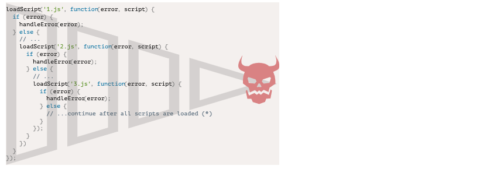
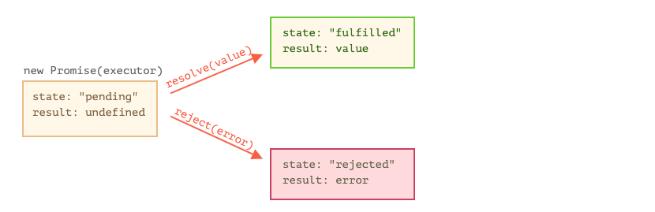
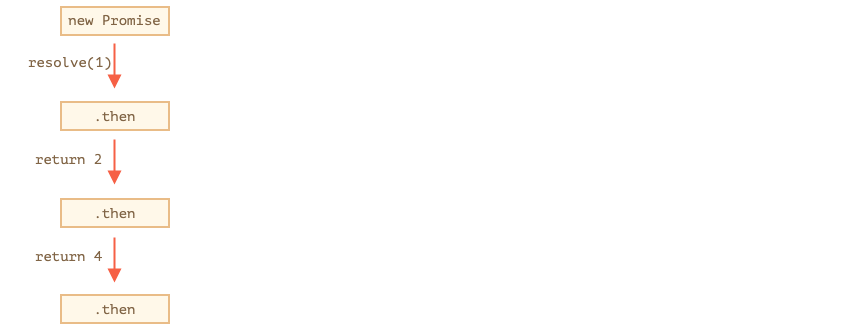
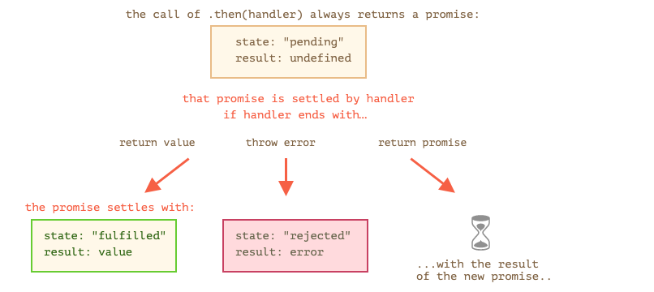
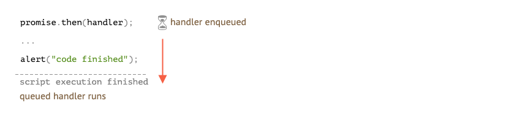

# 现代javascript教程

## 第1部分：JavaScript 编程语言

### 第十章、Promises, async/await

#### 参考资料

[Promise的源码实现](https://segmentfault.com/a/1190000018428848?utm_source=tag-newest)

#### 10.1简介：回调

JavaScipt 中的许多动作都是**异步**的。

比如，这个 `loadScript(src)` 函数：

```javascript
function loadScript(src) {
  let script = document.createElement('script');
  script.src = src;
  document.head.append(script);
}
```

这个函数的作用是加载一个新的脚本。当使用 `` 将其添加到文档中时，浏览器就会对它进行加载和执行。

我们可以像这样使用：

```javascript
// 加载并执行脚本
loadScript('/my/script.js');
```

函数是**异步**调用的，因为动作不是此刻（加载脚本）完成的，而是之后。

调用初始化脚本加载，然后继续执行。当脚本正在被加载时，下面的代码可能已经完成了执行，如果加载需要时间，那么同一时间，其他脚本可能也会被运行。

```javascript
loadScript('/my/script.js');
// 下面的代码在加载脚本时，不会等待脚本被加载完成
// ...
```

现在，我们假设想在新脚本被加载完成时，被立即使用。它可能声明了新函数，因此我们想要运行它们。

但如果我们在 `loadScript(…)` 调用后，立即那么做，就会导致操作失败。

```javascript
loadScript('/my/script.js'); // 脚本含有 "function newFunction() {…}"

newFunction(); // 没有这个函数！
```

很明显，浏览器没有时间去加载脚本。因此，对新函数的立即调用失败了。`loadScript` 函数并没有提供追踪加载完成时方法。脚本加载然后最终的运行，仅此而已。但我们希望了解脚本何时加载完成，以使用其中的新函数和新变量。

我们将 `callback` 函数作为第二个参数添加至 `loadScript` 中，函数在脚本加载时被执行：

```javascript
function loadScript(src, callback) {
  let script = document.createElement('script');
  script.src = src;

  script.onload = () => callback(script);

  document.head.append(script);
}
```

如果现在你想从脚本中调用新函数，我们应该在回调函数中那么写：

```javascript
loadScript('/my/script.js', function() {
  // 在脚本被加载后，回调才会被运行
  newFunction(); // 现在起作用了
  ...
});
```

这是我们的想法：第二个参数是一个函数（通常是匿名的）会在动作完成后被执行。

这是一个可运行的真实脚本示例：

```javascript
function loadScript(src, callback) {
  let script = document.createElement('script');
  script.src = src;
  script.onload = () => callback(script);
  document.head.append(script);
}

loadScript('https://cdnjs.cloudflare.com/ajax/libs/lodash.js/3.2.0/lodash.js', script => {
  alert(`Cool, the ${script.src} is loaded`);
  alert( _ ); // 在加载的脚本中声明的函数
});
```

这被称为“基于回调”的异步编程风格。异步执行某些动作的函数，应该提供一个在函数完成时可以运行的 `callback` 参数。

我们 `loadScript` 中就是那么做的，但很明显这是一般性的方法。

##### [在回调中回调](https://zh.javascript.info/callbacks#zai-hui-tiao-zhong-hui-tiao)

如何顺序加载两个脚本：先是第一个，然后是第二个？

最明显的方法是将第二个 `loadScript` 调用放在回调中，就像这样：

```javascript
loadScript('/my/script.js', function(script) {

  alert(`Cool, the ${script.src} is loaded, let's load one more`);

  loadScript('/my/script2.js', function(script) {
    alert(`Cool, the second script is loaded`);
  });

});
```

在外部 `loadScript` 完成时，内部回调就会被回调。

如果我们还想要一个脚本呢？

```javascript
loadScript('/my/script.js', function(script) {

  loadScript('/my/script2.js', function(script) {

    loadScript('/my/script3.js', function(script) {
      // ...在所有脚本被加载后继续操作
    });

  })

});
```

因此，每一个动作都在回调内部。这对于新动作来说，非常好，但是其他动作却并不友好，因此我们接下来会看到一些此方法的变体。

##### [处理错误](https://zh.javascript.info/callbacks#chu-li-cuo-wu)

上述示例中，我们并没有考虑错误因素。假如加载失败会如何？我们的回调应该可以立即对其做出响应。

这是可以跟踪错误的 `loadScript` 改进版：

```javascript
function loadScript(src, callback) {
  let script = document.createElement('script');
  script.src = src;

  script.onload = () => callback(null, script);
  script.onerror = () => callback(new Error(`Script load error for ${src}`));

  document.head.append(script);
}
```

成功时，调用 `callback(null, script)`，否则调用 `callback(error)`。

用法：

```javascript
loadScript('/my/script.js', function(error, script) {
  if (error) {
    // handle error
  } else {
    // 成功加载脚本
  }
});
```

再一次强调，我们使用的 `loadScript` 方法是非常常规的。它被称为 “error-first callback” 风格。

惯例是：

1. `callback` 的第一个参数是为了错误发生而保留的。一旦发生错误，`callback(err)` 就会被调用。
2. 第二个参数（如果有需要）用于成功的结果。此时 `callback(null, result1, result2…)` 将被调用。

因此单个 `callback` 函数可以同时具有报告错误以及传递返回结果的作用。

##### [回调金字塔](https://zh.javascript.info/callbacks#hui-tiao-jin-zi-ta)

从第一步可以看出，这是异步编码的一种可行性方案。的确如此，对于一个或两个的简单嵌套，这样的调用看起来非常好。

但对于一个接一个的多个异步动作，代码就会变成这样：

```javascript
loadScript('1.js', function(error, script) {

  if (error) {
    handleError(error);
  } else {
    // ...
    loadScript('2.js', function(error, script) {
      if (error) {
        handleError(error);
      } else {
        // ...
        loadScript('3.js', function(error, script) {
          if (error) {
            handleError(error);
          } else {
            // ...加载所有脚本后继续 (*)
          }
        });

      }
    })
  }
});
```

上述代码中：

1. 我们加载 `1.js`，如果没有发生错误。
2. 我们加载 `2.js`，如果没有发生错误。
3. 我们加载 `3.js`，如果没有发生错误 —— 做其他操作 `(*)`。

如果嵌套变多，代码层次就会变深，维护难度也随之增加，尤其是如果我们有一个不是 `...` 的真实代码，就会包含更多的循环，条件语句等。

这有时称为“回调地狱”或者“回调金字塔”。



嵌套调用的“金字塔”在每一个异步动作中都会向右增长。很快就会失去控制。

因此这种编码方式并不可取。

我们可以通过为每个动作编写一个独立函数来解决这一问题，就像这样：

```javascript
loadScript('1.js', step1);

function step1(error, script) {
  if (error) {
    handleError(error);
  } else {
    // ...
    loadScript('2.js', step2);
  }
}

function step2(error, script) {
  if (error) {
    handleError(error);
  } else {
    // ...
    loadScript('3.js', step3);
  }
}

function step3(error, script) {
  if (error) {
    handleError(error);
  } else {
    // ...在所有脚本被加载后继续 (*)
  }
};
```

看到了么？效果一样，但是没有深层的嵌套了，因为我们使每个动作都有一个独立的顶层函数。

这很有效，但代码看起来就像是一个被分裂的表格。你可能注意到了，它的可读性非常差。在阅读时，需要在块之间切换。这非常不方便，尤其是不熟悉代码的读者，他们甚至不知道该跳转到何处。

名为 `step*` 的函数都是单一使用的，他们被创建的唯一作用就是避免“回调金字塔”。没有人会在动作链之外重复使用它们。因此这里的命名空间非常杂乱。

或许还有更好的方法。

幸运地是，有其他方法可以避免回调金字塔。其中一个最好的方法是使用 “promises”，我们将在下一章中详细描述。

#### 10.2Promise

想象一下，你自己是一位顶尖歌手，粉丝没日没夜地询问你下个单曲何时到来。

为了从中解放，你承诺会在单曲发布的第一时间通知他们。你让粉丝们填写了他们的个人信息，因此他们会在歌曲发布的第一时间获取到。即使遇到了不测，歌曲可能永远不会被发行，他们也会被通知到。

每个人都很开心：你不会被任何人催促；粉丝也不会错过单曲发行的第一时间。

在编程中，我们经常用现实世界中的事物进行类比：

1. “生产者代码” 会做一些事情，也需要事件。比如，它加载一个远程脚本。此时它就像“歌手”。
2. “消费者代码” 想要在它准备好时知道结果。许多函数都需要结果。此时它们就像是“粉丝”。
3. **promise** 是将两者连接的一个特殊的 JavaScript 对象。就像是“列表”。生产者代码创建它，然后将它交给每个订阅的对象，因此它们都可以订阅到结果。

这种类比并不精确，因为 JavaScipt promises 比简单的列表更加复杂：它们拥有额外的特性和限制。但是它们仍然有相似之处。

Promise 对象的构造语法是：

```javascript
let promise = new Promise(function(resolve, reject) {
  // executor (生产者代码，"singer")
});
```

传递给 `new Promise`的函数称之为 **executor**。当 promise 被创建时，它会被自动调用。它包含生产者代码，这最终会产生一个结果。与上文类比，executor 就是“歌手”。

`promise` 对象有内部属性：

- `state` —— 最初是 “pending”，然后被改为 “fulfilled” 或 “rejected”，
- `result` —— 一个任意值，最初是 `undefined`。

当 executor 完成任务时，应调用下列之一：

- `resolve(value)` —— 说明任务已经完成：
  - 将 `state` 设置为 `"fulfilled"`，
  - sets `result` to `value`。
- `reject(error)` —— 表明有错误发生：
  - 将 `state` 设置为 `"rejected"`，
  - 将 `result` 设置为 `error`。



这是一个简单的 executor，可以把这一切都聚集在一起：

```javascript
let promise = new Promise(function(resolve, reject) {
  // 当 promise 被构造时，函数会自动执行

  alert(resolve); // function () { [native code] }
  alert(reject);  // function () { [native code] }

  // 在 1 秒后，结果为“完成！”，表明任务被完成
  setTimeout(() => resolve("done!"), 1000);
});
```

我们运行上述代码后发现两件事：

1. 会自动并立即调用 executor（通过 `new Promise`）。
2. executor 接受两个参数 `resolve` 和 `reject` —— 这些函数来自于 JavaScipt 引擎。我们不需要创建它们，相反，executor 会在它们准备好时进行调用。

经过一秒钟的思考后，executor 调用 `resolve("done")` 来产生结果：


这是“任务成功完成”的示例。

现在的是示例则是 promise 的 reject 出现于错误的发生：

```javascript
let promise = new Promise(function(resolve, reject) {
  // after 1 second signal that the job is finished with an error
  setTimeout(() => reject(new Error("Whoops!")), 1000);
});
```


总之，executor 应该完成任务（通常会需要时间），然后调用 `resolve` 或 `reject` 来改变 promise 对象的对应状态。

Promise 结果应该是 resolved 或 rejected 的状态被称为 “settled”，而不是 “pending” 状态的 promise。

------

**There can be only one result or an error**

executor 只会调用 `resolve` 或 `reject`。Promise 的最后状态一定会变化。

对 `resolve` 和 `reject` 的深层调用都会被忽略：

```javascript
let promise = new Promise(function(resolve, reject) {
  resolve("done");

  reject(new Error("…")); // 被忽略
  setTimeout(() => resolve("…")); // 被忽略
});
```

executor 所做的任务可能只有一个结果或者一个错误。在编程中，还有其他允许 “flowing” 结果的数据结构。例如流和队列。相对于 promise，它们有着自己的优势和劣势。它们不被 JavaScipt 核心支持，而且缺少 promise 所提供的某些语言特性，我们在这里不对 promise 进行过多的讨论。

同时，如果我们使用另一个参数调用 `resolve/reject` —— 只有第一个参数会被使用，下一个会被忽略。

------

**Reject with `Error` objects**

从技术上来说，我们可以使用任何类型的参数来调用 `reject`（就像 `resolve`）。但建议在 `reject`（或从它们中继承）中使用 `Error` 对象。 错误原因就会显示出来。

------

**Resolve/reject can be immediate**

实际上，executor 通常会异步执行一些动作，然后在一段时间后调用 `resolve/reject`，但它不必那么做。我们可以立即调用 `resolve` 或 `reject`，就像这样：

```javascript
let promise = new Promise(function(resolve, reject) {
  resolve(123); // immediately give the result: 123
});
```

比如，当我们开始做一个任务时，它就会发生，然后发现一切都已经被做完了。从技术上来说，这非常好：我们现在有了一个 resolved promise。

------

**The `state` and `result` are internal**

Promise 的 `state` 和 `result` 属性是内部的。我们不能从代码中直接访问它们，但是我们可以使用 `.then/catch` 来访问，下面是对此的描述。

##### [消费者：".then" 和 “.catch”](https://zh.javascript.info/promise-basics#xiao-fei-zhe-then-he-catch)

Promise 对象充当生产者（executor）和消费函数之间的连接 —— 那些希望接收结果/错误的函数。假设函数可以使用方法 `promise.then` 和 `promise.catch` 进行注册。

`.then` 的语法：

```javascript
promise.then(
  function(result) { /* handle a successful result */ },
  function(error) { /* handle an error */ }
);
```

第一个函数参数在 promise 为 resolved 时被解析，然后得到结果并运行。第二个参数 —— 在状态为 rejected 并得到错误时使用。

例如：

```javascript
let promise = new Promise(function(resolve, reject) {
  setTimeout(() => resolve("done!"), 1000);
});

// resolve 在 .then 中运行第一个函数
promise.then(
  result => alert(result), // 在 1 秒后显示“已经完成！”
  error => alert(error) // 不会运行
);
```

在 rejection 的情况下：

```javascript
let promise = new Promise(function(resolve, reject) {
  setTimeout(() => reject(new Error("Whoops!")), 1000);
});

// reject 在 .then 中运行第二个函数
promise.then(
  result => alert(result), // 无法运行
  error => alert(error) // 在 1 秒后显示 "Error: Whoops!"
);
```

如果我们只对成功完成的情况感兴趣，那么我们只为 `.then` 提供一个参数：

```javascript
let promise = new Promise(resolve => {
  setTimeout(() => resolve("done!"), 1000);
});

promise.then(alert); // 在 1 秒后显示 "done!"
```

如果我们只对错误感兴趣，那么我们可以对它使用 `.then(null, function)` 或 “alias”：`.catch(function)`

```javascript
let promise = new Promise((resolve, reject) => {
  setTimeout(() => reject(new Error("Whoops!")), 1000);
});

// .catch(f) 等同于 promise.then(null, f)
promise.catch(alert); // 在 1 秒后显示 "Error: Whoops!"
```

调用 `.catch(f)` 是 `.then(null, f)` 的模拟，这只是一个简写。

------

**On settled promises `then` runs immediately**

如果 promise 为 pending 状态，`.then/catch` 处理器必须要等待结果。相反，如果 promise 已经被处理，它们就会立即执行：

```javascript
// 一个立即变成 resolve 的 promise
let promise = new Promise(resolve => resolve("done!"));

promise.then(alert); // 完成！（现在显示）
```

这对于有时需要时间而且有时要立即完成的任务来说非常方便。确保处理器在两种情况下都能够运行。

------

**`.then/catch` 的处理器总是异步的**

更确切地说，当 `.then/catch` 处理器应该执行时，它会首先进入内部队列。JavaScript 引擎从队列中提取处理器，并在当前代码完成时执行 `setTimeout(..., 0)`。

换句话说，`.then(handler)` 会被触发，会执行类似于 `setTimeout(handler, 0)` 的动作。

在下述示例中，promise 被立即 resolved，因此 `.then(alert)` 被立即触发：`alert` 会进入队列，在代码完成之后立即执行。

```javascript
// an immediately resolved promise
let promise = new Promise(resolve => resolve("done!"));

promise.then(alert); // 完成！（在当前代码完成之后）

alert("code finished"); // 这个 alert 会最先显示
```

因此在 `.then` 之后的代码总是在处理器之前被执行（即使实在预先解决 promise 的情况下）。通常这并不重要，只会在特定情况下才会重要。

------

我们现在研究一下 promises 如何帮助我们编写异步代码的示例。

##### [示例：loadScript](https://zh.javascript.info/promise-basics#shi-li-loadscript)

我们已经从之前的章节中加载了 `loadScript` 函数。

这是基于回调函数的变体，记住它：

```javascript
function loadScript(src, callback) {
  let script = document.createElement('script');
  script.src = src;

  script.onload = () => callback(null, script);
  script.onerror = () => callback(new Error(`Script load error ` + src));

  document.head.append(script);
}
```

我们用 promises 进行重写。

`loadScript` 新函数不需要请求回调函数，取而代之的是它会创建并返回一个在加载完成时的 promise 对象。外部代码可以使用 `.then` 向其添加处理器：

```javascript
function loadScript(src) {
  return new Promise(function(resolve, reject) {
    let script = document.createElement('script');
    script.src = src;

    script.onload = () => resolve(script);
    script.onerror = () => reject(new Error("Script load error: " + src));

    document.head.append(script);
  });
}
```

用法：

```javascript
let promise = loadScript("https://cdnjs.cloudflare.com/ajax/libs/lodash.js/3.2.0/lodash.js");

promise.then(
  script => alert(`${script.src} is loaded!`),
  error => alert(`Error: ${error.message}`)
);

promise.then(script => alert('One more handler to do something else!'));
```

我们立刻看到基于回调语法的好处：

- 不足
  - 在调用 `loadScript` 时，我们必须已经有了一个 `callback` 函数。换句话说，在调用 `loadScript` **之前**我们必须知道如何处理结果。
  - 只能有一个回调。

- 优点
  - Promises 允许我们按照自然顺序进行编码。首先，我们运行 `loadScript` 和 `.then` 来编写如何处理结果。
  - 无论何时，只要我们有需要，就可以在 promise 中调用 `.then`。

因此，promise 已经为我们的编码带来了更好的编码方式和灵活性。我们会在之后章节看到更多相关内容。

#### 10.3Promises 链

我们回顾一下 [简介：回调](https://zh.javascript.info/callbacks) 章节提及的问题：我们有一系列的异步任务要一个接一个完成。例如，加载脚本。我们如何写出更好的代码呢？

Promises 提供了几种方案来解决这个问题。

本章节中我们来讲解 promise 链。

它看起来就像这样：

```javascript
new Promise(function(resolve, reject) {

  setTimeout(() => resolve(1), 1000); // (*)

}).then(function(result) { // (**)

  alert(result); // 1
  return result * 2;

}).then(function(result) { // (***)

  alert(result); // 2
  return result * 2;

}).then(function(result) {

  alert(result); // 4
  return result * 2;

});
```

它的理念是把 result 传入 `.then` 的处理程序链。

运行流程如下：

1. 初始 promise 1 秒后 resolve `(*)`，
2. 然后 `.then` 方法被调用 `(**)`。
3. 它返回的值被传入下一个 `.then` 的处理程序 `(***)`
4. ……依此类推。

随着 result 在处理程序链中传递，我们会看到 `alert` 依次显示：`1` → `2` → `4`。



之所以这么运行，是因为 `promise.then` 返回了一个 promise，所以我们可以用它调用下一个 `.then`。

当控制函数返回一个值时，它会变成当前 promise 的 result，所以会用它调用下一个 `.then`。

为了把这些话讲更清楚，我们看一下链的开头：

```javascript
new Promise(function(resolve, reject) {

  setTimeout(() => resolve(1), 1000);

}).then(function(result) {

  alert(result);
  return result * 2; // <-- (1)

}) // <-- (2)
// .then…
```

`.then` 返回的值是一个 promise，这是为什么我们可以在 `(2)` 处添加另一个 `.then`。在 `(1)` 处返回值时，当前 promise 变成 resolved，然后下一个处理程序使用这个返回值运行。

**新手常犯的一个经典错误：从技术上讲我们仍然能添加许多 `.then` 到一个 promise 上。但这并不是 promise 链（chaining）。**

例如：

```javascript
let promise = new Promise(function(resolve, reject) {
  setTimeout(() => resolve(1), 1000);
});

promise.then(function(result) {
  alert(result); // 1
  return result * 2;
});

promise.then(function(result) {
  alert(result); // 1
  return result * 2;
});

promise.then(function(result) {
  alert(result); // 1
  return result * 2;
});
```

我们这里所做的仅仅是将几个处理程序（handler）添加到一个 promise 上。它们之间并不会互相传递数据，相反，它们之间彼此独立运行处理程序。

这里有一张图片来解释它（对比上面的链式调用）：


在同一个 promise 上的所有 `.then` 会得到相同的结果 —— 该 promise 的 result。所以，以上代码中所有 `alert` 会显示相同的内容：`1`。

实际上我们极少遇到一个 promise 需要多处理程序，而是更经常地使用链式调用。

##### [返回 promises](https://zh.javascript.info/promise-chaining#fan-hui-promises)

正常来说，`.then` 处理程序返回的值会立即传入下一个处理程序。但是有一个例外。

如果返回的值是一个 promise，那么直到它结束之前，下一步执行会一直被暂停。在结束之后，该 promise 的结果会传递给下一个 `.then` 处理程序。

例如：

```javascript
new Promise(function(resolve, reject) {

  setTimeout(() => resolve(1), 1000);

}).then(function(result) {

  alert(result); // 1

  return new Promise((resolve, reject) => { // (*)
    setTimeout(() => resolve(result * 2), 1000);
  });

}).then(function(result) { // (**)

  alert(result); // 2

  return new Promise((resolve, reject) => {
    setTimeout(() => resolve(result * 2), 1000);
  });

}).then(function(result) {

  alert(result); // 4

});
```

这里第一个 `.then` 显示 `1` 并在 `(*)` 行返回 `new Promise(…)`，一秒之后它会 resolve 掉，然后 result（`resolve` 的参数，在这里它是 `result*2`）被传递给位于 `(**)` 行的第二个 `.then`。它会显示 `2`，而且执行相同的动作。

所以输出还是 1 → 2 → 4，但是现在每次 `alert` 调用之间会有 1 秒钟的延迟。

返回 promises 允许我们建立异步动作链。

##### [示例：loadScript](https://zh.javascript.info/promise-chaining#shi-li-loadscript)

让我们以在 [前述章节](https://zh.javascript.info/promise-basics#loadscript) 定义过的 promise 化的 `loadScript` 来一个个按顺序加载脚本：

```javascript
loadScript("/article/promise-chaining/one.js")
  .then(function(script) {
    return loadScript("/article/promise-chaining/two.js");
  })
  .then(function(script) {
    return loadScript("/article/promise-chaining/three.js");
  })
  .then(function(script) {
    // 使用脚本里声明的函数来表明它们的确被加载了

    one();
    two();
    three();
  });
```

我们可以用箭头函数来重写代码，让其变得简短一些：

```javascript
loadScript("/article/promise-chaining/one.js")
  .then(script => loadScript("/article/promise-chaining/two.js"))
  .then(script => loadScript("/article/promise-chaining/three.js"))
  .then(script => {
    // 脚本被加载，我们可以使用声明过的函数了
    one();
    two();
    three();
  });
```

这里每个 `loadScript` 调用返回一个 promise，并且在它 resolve 时运行下一个 `.then`。 然后它开始加载下一个脚本。所以脚本是依次被加载的。

我们可以在链中添加更多的异步动作。请注意代码仍然“扁平”，它向下增长，而不是向右。没有“死亡金字塔”的迹象。

请注意理论上可以向每个 `loadScript` 直接添加 `.then`，就像这样：

```javascript
loadScript("/article/promise-chaining/one.js").then(script1 => {
  loadScript("/article/promise-chaining/two.js").then(script2 => {
    loadScript("/article/promise-chaining/three.js").then(script3 => {
      // 这个函数可以访问 script1、script2 和 script3 变量
      one();
      two();
      three();
    });
  });
});
```

这段代码做了一样的事情：顺序加载 3 个脚本。但是它“向右增长”。所以和使用回调函数一样，我们会碰到相同的问题。

人们刚开始使用 promise 有时候可能并不知道什么是链，所以它们就这样写了。通常，链是优先考虑的。

有时直接写 `.then` 是没问题的，因为嵌套函数可以访问外部作用域。在上面的例子中嵌套最深的那一层回调（callback）可以访问所有变量 `script1`, `script2`, `script3`。但这是一个例外而不算是规则。

------

**Thenables**

确切地说，`.then` 可以返回任意的 “thenable” 对象 —— 一个具有 `.then` 方法的任意对象，并且会被当做一个 promise 来对待。

第三方库能实现它们自己的 “可兼容 promise” 对象就是这种理念。他们可以扩展方法集，不过会保证与原生 promise 兼容，因为他们实现了 `.then` 方法。

这里是一个 thenable 对象的示例：

```javascript
class Thenable {
  constructor(num) {
    this.num = num;
  }
  then(resolve, reject) {
    alert(resolve); // function() { native code }
    // 1 秒后用 this.num*2 来 resolve
    setTimeout(() => resolve(this.num * 2), 1000); // (**)
  }
}

new Promise(resolve => resolve(1))
  .then(result => {
    return new Thenable(result); // (*)
  })
  .then(alert); // 1000 ms 后显示 2
```

JavaScript 在 `(*)` 行检查 `.then` 处理程序返回的对象：如果它有一个名为 `then` 的可调用方法，那么它会调用该方法并提供原生函数 `resolve`，`reject 作为参数（类似于 executor）并在它被调用前一直等待。上面的例子中`resolve(2)`1 秒后被调用`(**)`。然后 result 会延链向下传递。

这个功能允许整合定制对象和 promise 链，不用从 `Promise` 继承。

##### [更复杂的示例：fetch](https://zh.javascript.info/promise-chaining#geng-fu-za-de-shi-li-fetch)

在前端编程中，promise 经常被用来网络请求，就让我们再看一个关于这点展开的示例。

我们将使用 [fetch](https://zh.javascript.info/fetch) 方法从远程服务器加载用户信息。我们在其他章节中介绍了许多其他可选参数，但是基本语法很简单：

```javascript
let promise = fetch(url);
```

它发送网络请求到 `url` 并返回一个 promise。当远程服务器返回响应头（注意不是**全部响应加载完成**）时，该 promise 用一个 `response` 来 resolve 掉。

为了读取全部的响应，我们应该调用方法 `response.text()`：当全部文字内容从远程服务器上下载后，它会返回一个 resolved 状态的 promise，同时该文字会作为 result。

下面代码向 `user.json` 发送请求并从服务器加载文字。

```javascript
fetch('/article/promise-chaining/user.json')
  // 当远程服务器开始响应时，下面的 .then 执行
  .then(function(response) {
    // 当结束下载时，response.text() 会返回一个新的 resolved promise，该 promise 拥有全部响应文字

    return response.text();
  })
  .then(function(text) {
    // ...这是远程文件内容
    alert(text); // {"name": "iliakan", isAdmin: true}
  });
```

其实还有一个方法，`response.json()` 会读取远程数据并把它解析成 JSON。我们的示例中用这个方法要更方便，所以让我们替换成此方法。

为了简洁，我们也使用箭头函数：

```javascript
// 同上，但是使用 response.json() 把远程内容解析为 JSON
fetch('/article/promise-chaining/user.json')
  .then(response => response.json())
  .then(user => alert(user.name)); // iliakan
```

现在我们用加载好的用户信息搞点事情。

例如，我们可以多发一个请求到 GitHub，加载用户信息并显示头像：

```javascript
// 发一个 user.json 请求
fetch('/article/promise-chaining/user.json')
  // 作为 json 加载
  .then(response => response.json())
  // 发一个请求到 GitHub
  .then(user => fetch(`https://api.github.com/users/${user.name}`))
  // 响应作为 json 加载
  .then(response => response.json())
  // 显示头像图片（githubUser.avatar_url）3 秒（也可以加上动画效果）
  .then(githubUser => {
    let img = document.createElement('img');
    img.src = githubUser.avatar_url;
    img.className = "promise-avatar-example";
    document.body.append(img);

    setTimeout(() => img.remove(), 3000); // (*)
  });
```

这段代码可以工作，具体细节请看注释。但是，有一个潜在的问题，一个新手使用 promise 的典型问题。

请看 `(*)` 行：我们如何能在头像结束显示并在移除**之后**做点什么？例如，我们想显示一个可以编辑用户，或者别的表单。就目前而言是做不到的。

为了使链可扩展，我们需要在头像结束显示时返回一个 resolved 状态的 promise。

就像这样：

```javascript
fetch('/article/promise-chaining/user.json')
  .then(response => response.json())
  .then(user => fetch(`https://api.github.com/users/${user.name}`))
  .then(response => response.json())
  .then(githubUser => new Promise(function(resolve, reject) {
    let img = document.createElement('img');
    img.src = githubUser.avatar_url;
    img.className = "promise-avatar-example";
    document.body.append(img);

    setTimeout(() => {
      img.remove();
      resolve(githubUser);
    }, 3000);
  }))
  // triggers after 3 seconds
  .then(githubUser => alert(`Finished showing ${githubUser.name}`));
```

现在，在 `setTimeout` 后运行 `img.remove()`，然后调用 `resolve(githubUser)`，这样链中的控制流程走到下一个 `.then` 并传入用户数据。

作为一个规律，一个异步动作应该永远返回一个 promise。

这让它规划下一步动作成为可能。虽然现在我们没打算扩展链，我们可能在日后需要它。

最终，我们可以把代码分割成几个可复用的函数：

```javascript
function loadJson(url) {
  return fetch(url)
    .then(response => response.json());
}

function loadGithubUser(name) {
  return fetch(`https://api.github.com/users/${name}`)
    .then(response => response.json());
}

function showAvatar(githubUser) {
  return new Promise(function(resolve, reject) {
    let img = document.createElement('img');
    img.src = githubUser.avatar_url;
    img.className = "promise-avatar-example";
    document.body.append(img);

    setTimeout(() => {
      img.remove();
      resolve(githubUser);
    }, 3000);
  });
}

// 使用它们
loadJson('/article/promise-chaining/user.json')
  .then(user => loadGithubUser(user.name))
  .then(showAvatar)
  .then(githubUser => alert(`Finished showing ${githubUser.name}`));
  // ...
```

##### [总结](https://zh.javascript.info/promise-chaining#zong-jie)

如果 `.then`（或者 `catch/finally` 都可以）处理程序（handler）返回一个 promise，链的其余部分会等到它执行结束。当它完成后，其结果（或者错误）将会进一步传递下去。

这是一个完整的流程图：



#### 10.4Promise 错误处理

异步操作有时候可能会失败：如果出现错误，相应的 promise 就会 reject。例如，如果远程服务器无法访问，`fetch` 就会失败。我们可以使用 `.catch` 去处理这些错误（rejections）。

Promise 链在这方面做的很好。当 promise 被 reject，控制权就移交给链中最近的 rejection 处理程序。这在实际应用中很方便。

例如，下面代码中的 URL 是错误的（没有这个网站）此时 `.catch` 可以处理这个错误：

```javascript
fetch('https://no-such-server.blabla') // rejects
  .then(response => response.json())
  .catch(err => alert(err)) // TypeError: failed to fetch （文字可能有所不同）
```

或者可能有这样的情况：网站一切正常，但是相应数据不是一个合法的 JSON：

```javascript
fetch('/') // 目前 fetch 能正常工作，服务器响应 HTML 页面
  .then(response => response.json()) // rejects：页面是 HTML，不是合法的 json
  .catch(err => alert(err)) // SyntaxError: Unexpected token < in JSON at position 0
```

捕获所有错误最简单的方法是在链的末端加上 `.catch`：

```javascript
fetch('/article/promise-chaining/user.json')
  .then(response => response.json())
  .then(user => fetch(`https://api.github.com/users/${user.name}`))
  .then(response => response.json())
  .then(githubUser => new Promise((resolve, reject) => {
    let img = document.createElement('img');
    img.src = githubUser.avatar_url;
    img.className = "promise-avatar-example";
    document.body.append(img);

    setTimeout(() => {
      img.remove();
      resolve(githubUser);
    }, 3000);
  }))
  .catch(error => alert(error.message));
```

通常情况下 `.catch` 根本不会触发，因为没有错误发生。但是如果上述任意一个 promise reject（网络错误或者不合法的 json 等等），它就会被捕获。

##### [隐式 try…catch](https://zh.javascript.info/promise-error-handling#yin-shi-trycatch)

Promise 执行（executor）和 promise 处理（handler）程序周围有一个“不可见 `try..catch`”。如果发生异常，它会被捕获并视为 rejection。

例如，下面的代码：

```javascript
new Promise((resolve, reject) => {
  throw new Error("Whoops!");
}).catch(alert); // Error: Whoops!
```

……与下面代码完全相同：

```javascript
new Promise((resolve, reject) => {
  reject(new Error("Whoops!"));
}).catch(alert); // Error: Whoops!
```

在执行程序周围 “不可见 `try..catch`” 自动捕获错误并视它为 rejection。

这不仅仅发生在执行程序上，同样也发生在处理程序上。如果我们在 `.then` 处理程序里 `throw`，这意味着被 rejected 的 promise，因此控制权移交最近的错误处理程序。

这里是它的例子：

```javascript
new Promise((resolve, reject) => {
  resolve("ok");
}).then((result) => {
  throw new Error("Whoops!"); // rejects 这个 promise
}).catch(alert); // Error: Whoops!
```

所有的错误都会发生这种情况，而不仅仅是由 `throw` 语句导致的这些错误。例如，一个编程错误：

```javascript
new Promise((resolve, reject) => {
  resolve("ok");
}).then((result) => {
  blabla(); // 没有这个函数
}).catch(alert); // ReferenceError: blabla is not defined
```

最终的 `.catch` 不仅会捕获明确的拒绝，而且会捕获上面上面处理程序中可能会出现的错误。

##### [重新抛出（Rethrowing）](https://zh.javascript.info/promise-error-handling#zhong-xin-pao-chu-rethrowing)

正如我们已经注意到的， `.catch` 表现得像 `try..catch`。我们可能有许多的 `.then` 处理程序，然后在最末端使用一个 `.catch` 处理上面的所有错误。

在常规 `try..catch` 中，我们可以分析错误，当我们无法处理的时候可能还会重新抛出（rethrow）它。对于 promise 来说也可以这样做。

如果我们在 `.catch` 内 `throw`，此时控制移交到下一个最近的错误处理程序。如果我们处理错误并正常完成，那么它将继续到最近的成功的 `.then` 处理程序。

在下面例子中 `.catch` 成功处理错误：

```javascript
// 执行：catch -> then
new Promise((resolve, reject) => {

  throw new Error("Whoops!");

}).catch(function(error) {

  alert("The error is handled, continue normally");

}).then(() => alert("Next successful handler runs"));
```

这里 `.catch` 块正常完成。因此就会调用下一个成功的 `.then` 处理程序。

在下面的例子中，我们可以看到 `.catch` 的另一种情况。`(*)` 行的处理程序捕获错误但无法处理它（例如，它只知道如何处理 `URIError` 错误），所以它再次被抛出：

```javascript
// 执行：catch -> catch -> then
new Promise((resolve, reject) => {

  throw new Error("Whoops!");

}).catch(function(error) { // (*)

  if (error instanceof URIError) {
    // handle it
  } else {
    alert("Can't handle such error");

    throw error; // 抛出这个或者其他的错误跳转到下一个 catch
  }

}).then(function() {
  /* 此处不会运行 */
}).catch(error => { // (**)

  alert(`The unknown error has occurred: ${error}`);
  // 不会返回任何内容 => 正常方式执行

});
```

然后执行从第一个 `.catch` `(*)` 跳到链中的下一个 `(**)`。

在本章的下面，我们将会看到重新抛出的实例。

##### [Fetch 错误处理示例](https://zh.javascript.info/promise-error-handling#fetch-cuo-wu-chu-li-shi-li)

让我们改进用户加载（user-loading）示例的错误处理。

当请求无法发出时，[fetch](https://developer.mozilla.org/zh/docs/Web/API/WindowOrWorkerGlobalScope/fetch) reject 会返回 promise。例如，远程服务器无法访问，或者 URL 异常。但是如果远程服务器返回响应错误 404，甚至是错误 500，这些都被认为是合法的响应。

如果在 `(*)` 行，服务器返回一个错误 500 的非 JSON（non-JSON）页面该怎么办？如果没有这个用户，GitHub 返回错误 404 的页面又该怎么办呢？

```javascript
fetch('no-such-user.json') // (*)
  .then(response => response.json())
  .then(user => fetch(`https://api.github.com/users/${user.name}`)) // (**)
  .then(response => response.json())
  .catch(alert); // SyntaxError: Unexpected token < in JSON at position 0
  // ...
```

到目前为止，代码试图以 JSON 格式加载响应数据，但无论如何都会因为语法错误而失败。你可以通过执行上述例子来查看相关信息，因为文件 `no-such-user.json` 不存在。

这有点糟糕，因为错误只是落在链上，并没有相关细节信息：什么失败了，在哪里失败的。

因此我们多添加一步：我们应该检查具有 HTTP 状态的 `response.status` 属性，如果不是 200 就抛出错误。

```javascript
class HttpError extends Error { // (1)
  constructor(response) {
    super(`${response.status} for ${response.url}`);
    this.name = 'HttpError';
    this.response = response;
  }
}

function loadJson(url) { // (2)
  return fetch(url)
    .then(response => {
      if (response.status == 200) {
        return response.json();
      } else {
        throw new HttpError(response);
      }
    })
}

loadJson('no-such-user.json') // (3)
  .catch(alert); // HttpError: 404 for .../no-such-user.json
```

1. 我们为 HTTP 错误创建一个自定义类用于区分 HTTP 错误和其他类型错误。此外，新的类有一个构造函数，它接受 `response` 对象，并将其保存到 error 中。因此，错误处理（error-handling）代码就能够获得响应数据了。
2. 然后我们将请求（requesting）和错误处理代码包装进一个函数，它能够 fetch `url` *并* 将所有状态码不是 200 视为错误。这很方便，因为我们通常需要这样的逻辑。
3. 现在 `alert` 显示更多有用的描述信息。

拥有我们自己的错误处理类的好处是我们可以使用 `instanceof` 很容易的在错误处理代码中检查错误。

例如，我们可以创建请求，如果我们得到 404 就可以告知用户修改信息。

下面的代码从 GitHub 加载给定名称的用户。如果没有这个用户，它将告知用户填写正确的名称：

```javascript
function demoGithubUser() {
  let name = prompt("Enter a name?", "iliakan");

  return loadJson(`https://api.github.com/users/${name}`)
    .then(user => {
      alert(`Full name: ${user.name}.`);
      return user;
    })
    .catch(err => {
      if (err instanceof HttpError && err.response.status == 404) {
        alert("No such user, please reenter.");
        return demoGithubUser();
      } else {
        throw err; // (*)
      }
    });
}

demoGithubUser();
```

请注意：这里的 `.catch` 会捕获所有错误，但是它仅仅“知道如何处理” `HttpError 404`。在那种特殊情况下它意味着没有这样的用户，而 `.catch` 仅仅在这种情况下重试。

对于其他错误，它不知道会出现什么问题。可能是编程错误或者其他错误。所以它仅仅是在 `(*)` 行重新抛出。

##### [未处理的 rejections](https://zh.javascript.info/promise-error-handling#wei-chu-li-de-rejections)

当错误没有被处理会发生什么？例如，在上面例子中 `(*)` 行重新抛出后会发生什么？

或者我们忘记将错误处理程序添加到链末尾，就像这样：

```javascript
new Promise(function() {
  noSuchFunction(); // Error here (no such function)
})
  .then(() => {
    // 成功的 promise 处理程序，一个或多个
  }); // 结尾处没有 .catch！
```

如果出现错误，promise 的状态变为 “rejected”，此时执行程序应该跳转到最近的 rejection 处理程序。但是上面例子中并没有这个处理程序。因此错误会“卡住（stuck）”。没有代码来处理它。

在实践中，就像常规的未处理错误一样，这意味着某些东西出了问题。

当一个常规的错误发生且未被 `try..catch` 捕获时会发生什么呢？脚本死了。类似的事情也发生在未处理的 promise rejections 上。

JavaScript 引擎跟踪此类 rejections，在这种情况下会生成一个全局错误。如果你运行上面代码，你可以在控制台（console）里看到。

在浏览器里，我们可以使用 `unhandledrejection` 时间来捕获这类错误：

```javascript
window.addEventListener('unhandledrejection', function(event) {
  // the event object has two special properties:
  alert(event.promise); // [object Promise] - 产生错误的 promise
  alert(event.reason); // Error: Whoops! - 未处理的错误对象
});

new Promise(function() {
  throw new Error("Whoops!");
}); // 没有 catch 处理错误
```

这个事件是 [HTML 标准](https://html.spec.whatwg.org/multipage/webappapis.html#unhandled-promise-rejections) 的一部分。

如果发生错误且没有 `.catch` 捕获，`unhandledrejection` 处理程序就会被触发并获取具有相关错误信息的 `event` 对象，此时我们就能做一些处理了。

通常这种错误是不可恢复的，所以我们最好的办法是告知用户有关问题的信息，并可能将事件报告给服务器。

在 Node.js 等非浏览器环境中，还有其他类似的方法来跟踪未处理的错误。

##### [总结](https://zh.javascript.info/promise-error-handling#zong-jie)

- `.catch` 能处理各种 promise rejections：可以是 `reject()` 调用或者处理程序中抛出的错误。
- 我们应该将 `.catch` 准确放到我们想要处理错误的位置，并知道如何处理它们。处理程序应该分析错误（可以自定义错误类帮助分析）并且重新抛出未知错误。
- 如果没有办法从错误中恢复的话，不使用 `.catch` 也没有问题。
- 在任何情况下我们都应该有 `unhandledrejection` 事件处理程序（用于浏览器，以及其他环境的模拟），跟踪未处理的错误并告知用户（可能还有我们的服务器），这样我们的应用程序永远不会“死”。

最后，如果我们有加载指示（load-indication），`.finally` 是一个很好的处理程序，在 fetch 完成时停止它：

```javascript
function demoGithubUser() {
  let name = prompt("Enter a name?", "iliakan");

  document.body.style.opacity = 0.3; // (1) 开始指示（indication）

  return loadJson(`https://api.github.com/users/${name}`)
    .finally(() => { // (2) 停止指示（indication）
      document.body.style.opacity = '';
      return new Promise(resolve => setTimeout(resolve)); // (*)
    })
    .then(user => {
      alert(`Full name: ${user.name}.`);
      return user;
    })
    .catch(err => {
      if (err instanceof HttpError && err.response.status == 404) {
        alert("No such user, please reenter.");
        return demoGithubUser();
      } else {
        throw err;
      }
    });
}

demoGithubUser();
```

此处的 `(1)` 行，我们通过调暗文档来指示加载。指示方法没有什么问题，可以使用任何类型的指示来代替。

当 promise 得以解决，fetch 可以是成功或者错误，`finally` 在 `(2)` 行触发并终止加载指示。

有一个浏览器技巧 `(*)` 是从 `finally` 返回零延时（zero-timeout）的 promise。这是因为一些浏览器（比如 Chrome）需要“一点时间”外的 promise 处理程序来绘制文档的更改。因此它确保在进入链下一步之前，指示在视觉上是停止的。

#### 10.5Promise API

在 `Promise` 类中，有 5 种静态方法。我们在这里简单介绍下它们的使用场景。

##### [Promise.resolve](https://zh.javascript.info/promise-api#promiseresolve)

语法：

```javascript
let promise = Promise.resolve(value);
```

根据给定的 `value` 值返回 resolved promise。

等价于：

```javascript
let promise = new Promise(resolve => resolve(value));
```

当我们已经有一个 value 的时候，就会使用该方法，但希望将它“封装”进 promise。

例如，下面的 `loadCached` 函数会获取 `url` 并记住结果，以便以后对同一 URL 进行调用时可以立即返回：

```javascript
function loadCached(url) {
  let cache = loadCached.cache || (loadCached.cache = new Map());

  if (cache.has(url)) {
    return Promise.resolve(cache.get(url)); // (*)
  }

  return fetch(url)
    .then(response => response.text())
    .then(text => {
      cache.set(url,text);
      return text;
    });
}
```

我们可以使用 `loadCached(url).then(…)`，因为该函数必定返回一个 promise。这是 `Promise.resolve` 在 `(*)` 行的目的：它确保了接口的统一性。我们可以在 `loadCached` 之后使用 `.then`。

##### [Promise.reject](https://zh.javascript.info/promise-api#promisereject)

语法：

```javascript
let promise = Promise.reject(error);
```

创建一个带有 `error` 的 rejected promise。

就像这样：

```javascript
let promise = new Promise((resolve, reject) => reject(error));
```

我们会在此讨论它的完整性，但在实际工作中，我们很少这样使用。

##### [Promise.all](https://zh.javascript.info/promise-api#promiseall)

假设我想要并行执行多个 promise，并等待所有 promise 准备就绪。

例如，并行下载几个 URL 并等到所有内容都下载完毕后才开始处理它们。

这就是 `Promise.all` 的用途：

语法：

```javascript
let promise = Promise.all([...promises...]);
```

它需要一个 promise 的数组作为其参数（严格来说可以是任何可迭代对象，但通常都是数组）并返回一个新的 promise。

当所有给定的 promise 都被处理并以数组的形式呈现其结果时，新的 promise 也就被 resolve。

例如，下面的 `Promise.all` 在 3 秒之后被处理，然后它的结果就是一个 `[1, 2, 3]` 数组：

```javascript
Promise.all([
  new Promise(resolve => setTimeout(() => resolve(1), 3000)), // 1
  new Promise(resolve => setTimeout(() => resolve(2), 2000)), // 2
  new Promise(resolve => setTimeout(() => resolve(3), 1000))  // 3
]).then(alert); // 1,2,3 当 promise 就绪：每一个 promise 即成为数组中的一员
```

请注意，它们的相对顺序是相同的。即使第一个 promise 需要很长的时间来 resolve，但它仍然是结果数组中的第一个。

常见技巧是将一组作业数据映射到一个 promise 数组，然后再将它们封装进 `Promise.all`。

例如，假设我们有一个存储 URL 的数组，我们就可以像这样来获取它们：

```javascript
let urls = [
  'https://api.github.com/users/iliakan',
  'https://api.github.com/users/remy',
  'https://api.github.com/users/jeresig'
];

// 将每个 url 映射到 fetch 的 promise 中
let requests = urls.map(url => fetch(url));

// Promise.all 等待所有作业都被 resolve
Promise.all(requests)
  .then(responses => responses.forEach(
    response => alert(`${response.url}: ${response.status}`)
  ));
```

一个更真实的示例是通过用户名来为一组 GitHub 用户获取他们的信息（或者我们可以通过他们的 id 来获取一系列商品，逻辑都是一样的）：

```javascript
let names = ['iliakan', 'remy', 'jeresig'];

let requests = names.map(name => fetch(`https://api.github.com/users/${name}`));

Promise.all(requests)
  .then(responses => {
    // 所有响应都就绪时，我们可以显示 HTTP 状态码
    for(let response of responses) {
      alert(`${response.url}: ${response.status}`); // 每个 url 都显示 200
    }

    return responses;
  })
  // 映射 response 数组到 response.json() 中以读取它们的内容
  .then(responses => Promise.all(responses.map(r => r.json())))
  // 所有 JSON 结果都被解析：“users” 是它们的数组
  .then(users => users.forEach(user => alert(user.name)));
```

**如果任意一个 promise 为 reject，`Promise.all` 返回的 promise 就会立即 reject 这个错误。**

例如：

```javascript
Promise.all([
  new Promise((resolve, reject) => setTimeout(() => resolve(1), 1000)),
  new Promise((resolve, reject) => setTimeout(() => reject(new Error("Whoops!")), 2000)),
  new Promise((resolve, reject) => setTimeout(() => resolve(3), 3000))
]).catch(alert); // Error: Whoops!
```

这里的第二个 promise 在两秒内被 reject。这立即导致了对 `Promise.all` 的 reject。因此 `.catch` 被执行：reject 的错误成为整个 `Promise.all` 的结果。

------

**如果出现错误，其他 promise 就会被忽略**

如果其中一个 promise 被 reject，`Promise.all` 就会立即被 reject 并忽略所有列表中其他的 promise。它们的结果也被忽略。

例如，像上面例子中提到的那样，如果同时进行多个 `fetch` 操作，其中一个失败，其他的 `fetch` 操作仍然会继续执行，但是 `Promise.all` 会忽略它们。它们可能已经解决了某些问题，但是结果将会被忽略。

没有什么方法能取消 `Promise.all`，因为 promise 中没有 “cancellation” 这类概念。在 [其他章节](https://zh.javascript.info/fetch-abort) 我们将会讨论可以“取消” promise 的 `AbortController`，但它不是 Promise API 的一部分。

------

**`Promise.all(iterable)` 允许“迭代”中的非 promise（non-promise）的 \“常规\” 值**

通常，`Promise.all(...)` 接受可迭代的 promise 集合（大部分情况下是数组）。但是如果这些对象中的任意一个不是 promise，它将会被直接包装进 `Promise.resolve`。

例如，这里的结果是 `[1, 2, 3]`：

```javascript
Promise.all([
  new Promise((resolve, reject) => {
    setTimeout(() => resolve(1), 1000)
  }),
  2, // 视为 Promise.resolve(2)
  3  // 视为 Promise.resolve(3)
]).then(alert); // 1, 2, 3
```

所以我们可以很方便的将准备好的值传递给 `Promise.all`。

##### [Promise.allSettled](https://zh.javascript.info/promise-api#promiseallsettled)

------

**A recent addition**

This is a recent addition to the language. Old browsers may need polyfills.

------

如果任意 promise reject，`Promise.all` 整个将会 reject。当我们需要*所有*结果来做些什么的时候，这样的情况就很好：

```javascript
Promise.all([
  fetch('/template.html'),
  fetch('/style.css'),
  fetch('/data.json')
]).then(render); // render 方法需要上面所有数据
```

`Promise.allSettled` 等待所有的 promise 都被处理：即使其中一个 reject，它仍然会等待其他的 promise。处理完成后的数组有：

- `{status:"fulfilled", value:result}` 对于成功的响应，
- `{status:"rejected", reason:error}` 对于错误的响应。

例如，我们想要获取多个用户的信息。即使其中一个请求失败，我们仍然对其他的感兴趣。

让我们使用 `Promise.allSettled`：

```javascript
let urls = [
  'https://api.github.com/users/iliakan',
  'https://api.github.com/users/remy',
  'https://no-such-url'
];

Promise.allSettled(urls.map(url => fetch(url)))
  .then(results => { // (*)
    results.forEach((result, num) => {
      if (result.status == "fulfilled") {
        alert(`${urls[num]}: ${result.value.status}`);
      }
      if (result.status == "rejected") {
        alert(`${urls[num]}: ${result.reason}`);
      }
    });
  });
```

上面的 `(*)` 行，`results` 将会是：

```javascript
[
  {status: 'fulfilled', value: ...response...},
  {status: 'fulfilled', value: ...response...},
  {status: 'rejected', reason: ...error object...}
]
```

因此，对于每个 promise，我们都能获取其状态（status）和 `value/reason`。

###### [Polyfill](https://zh.javascript.info/promise-api#polyfill)

如果浏览器不支持 `Promise.allSettled`，使用 polyfill 很容易让其支持：

```javascript
if(!Promise.allSettled) {
  Promise.allSettled = function(promises) {
    return Promise.all(promises.map(p => Promise.resolve(p).then(v => ({
      state: 'fulfilled',
      value: v,
    }), r => ({
      state: 'rejected',
      reason: r,
    }))));
  };
}
```

在这段代码中，`promises.map` 获取输入值，并使用 `p => Promise.resolve(p)` 将该值转换为 promise（以防传递了非 promise），然后向其添加 `.then` 处理器。

这个处理器将成功的结果 `v` 转换为 `{state:'fulfilled', value:v}`，将错误的结果 `r` 转换为 `{state:'rejected', reason:r}`。这正是 `Promise.allSettled` 的格式。

然后我们就可以使用 `Promise.allSettled` 来获取结果或*所有*给出的 promise，即使其中一些被 reject。

##### [Promise.race](https://zh.javascript.info/promise-api#promiserace)

与 `Promise.all` 类似，它接受一个可迭代的 promise 集合，但是它只等待第一个完成（或者 error）而不会等待所有都完成，然后继续执行。

语法：

```javascript
let promise = Promise.race(iterable);
```

例如，这里的结果会是 `1`：

```javascript
Promise.race([
  new Promise((resolve, reject) => setTimeout(() => resolve(1), 1000)),
  new Promise((resolve, reject) => setTimeout(() => reject(new Error("Whoops!")), 2000)),
  new Promise((resolve, reject) => setTimeout(() => resolve(3), 3000))
]).then(alert); // 1
```

因此，第一个结果/错误会成为整个 `Promise.race` 的结果。在第一个 promise 被解决（“赢得比赛[wins the race]”）后，所有后面的结果/错误都会被忽略。

##### [总结](https://zh.javascript.info/promise-api#zong-jie)

`Promise` 类有 5 种静态方法：

1. `Promise.resolve(value)` – 根据给定值返回 resolved promise。

2. `Promise.reject(error)` – 根据给定错误返回 rejected promise。

3. `Promise.all(promises)` – 等待所有的 promise 为 resolve 时返回存放它们结果的数组。如果任意给定的 promise 为 reject，那么它就会变成 `Promise.all` 的错误结果，所有的其他结果都会被忽略。

4. ```
   Promise.allSettled(promises)
   ```

    

   （新方法） – 等待所有 promise resolve 或者 reject，并以对象形式返回它们结果数组：

   - `state`：`‘fulfilled’` 或 `‘rejected’`
   - `value`（如果 fulfilled）或 `reason`（如果 rejected）

5. `Promise.race(promises)` – 等待第一个 promise 被解决，其结果/错误即为结果。

这五个方法中，`Promise.all` 在实战中使用的最多。

#### 10.6Promisification

Promisification —— 一个长单词，用来描述一个简单的转换。它指将一个接受回调的函数转换为一个返回 promise 的函数。

准确一点说就是，我们创建了一个包装函数（wrapper-function）来做同样的事情，在内部调用原来的函数，但返回一个 promise。

在实际开发中经常需要这种转换，因为很多函数和库都是基于回调（callback-based）的。但是，使用 promise 更加方便。因此，将它们（函数和库）promisify 是很有意义的。

例如，章节 [简介：回调](https://zh.javascript.info/callbacks) 里面写的 `loadScript(src, callback)`。

```javascript
function loadScript(src, callback) {
  let script = document.createElement('script');
  script.src = src;

  script.onload = () => callback(null, script);
  script.onerror = () => callback(new Error(`Script load error for ${src}`));

  document.head.append(script);
}

// 用法：
// loadScript('path/script.js', (err, script) => {...})
```

来对它进行 promisify 吧。新的函数 `loadScriptPromise(src)` 将会做同样的事情，但只接受 `src`（没有回调）并返回 promise。

```javascript
let loadScriptPromise = function(src) {
  return new Promise((resolve, reject) => {
    loadScript(src, (err, script) => {
      if (err) reject(err)
      else resolve(script);
    });
  })
}

// 用法：
// loadScriptPromise('path/script.js').then(...)
```

现在， `loadScriptPromise` 非常适用于我们基于 promise（promise-based）的代码。

如我们所见，它将所有工作委派给原来的 `loadScript`，提供了自己的回调。此回调转换成了 promise 的 `resolve/reject`。

由于我们可能需要 promisify 很多函数，使用一个助手（helper）很有意义。

实际上很简单 —— 下面的 `promisify(f)` 接受一个要被 promisify 的函数，并返回一个包装函数。

这个包装函数做了跟上面代码一样的事情：返回 promise 并且把调用传递给原来的 `f`，在自定义的回调函数中跟踪结果：

```javascript
function promisify(f) {
  return function (...args) { // 返回一个包装函数
    return new Promise((resolve, reject) => {
      function callback(err, result) { // 给 f 用的自定义回调
        if (err) {
          return reject(err);
        } else {
          resolve(result);
        }
      }

      args.push(callback); // 在参数的最后附上我们自定义的回调函数

      f.call(this, ...args); // 调用原来的函数
    });
  };
};

// 用法：
let loadScriptPromise = promisify(loadScript);
loadScriptPromise(...).then(...);
```

这里我们假设，原来的函数接受一个有两个参数 `(err, result)` 的回调。那是我们最经常遇到的（形式）。那么我们的自定义回调的格式确实正确，而且 `promisify` 在此案例中非常适用。

但是如果原来的 `f` 接受一个带更多参数的回调 `callback(err, res1, res2)`，该怎么办？

下面是 `promisify` 的修改版，它返回一个装有多个回调结果的数组：

```javascript
                                       // 设定为 promisify(f, true) 来获取结果数组
function promisify(f, manyArgs = false) {
  return function (...args) {
    return new Promise((resolve, reject) => {
      function callback(err, ...results) { // 给 f 用的自定义回调
        if (err) {
          return reject(err);
        } else {
          // 如果 manyArgs 被指定值，则 resolve 所有回调结果
          resolve(manyArgs ? results : results[0]);
        }
      }

      args.push(callback);

      f.call(this, ...args);
    });
  };
};

// 用法：
f = promisify(f, true);
f(...).then(arrayOfResults => ..., err => ...)
```

在一些案例中，`err` 可能没有（在参数里）：`callback(result)`，或者回调的格式有些奇怪，那么我们可以在不使用助手（helper）的情况下去手动实现 promisify。

也有一些提供更灵活一点的 promisification 函数的模块，例如 [es6-promisify](https://github.com/digitaldesignlabs/es6-promisify)。在 Node.js 中，有一个内置的 promisify 函数 `util.promisify`。

------

**请注意：**

Promisification 是一种很好的方法，特别是你使用 `async/await` 的时候（请看下一节），但不是回调函数的完全替代品。

请记住，一个 promise 可能只有一个结果，但是技术上，一个回调函数可能被多次调用。

因此 promisification 仅仅对调用一次回调的函数有用。以后的调用将会被忽略。

#### 10.7微任务（Microtasks）

Promise 的处理程序（handlers）`.then`、`.catch` 和 `.finally` 都是异步的。

即便一个 promise 立即被 resolve，`.then`、`.catch` 和 `.finally` *下面*的代码也会在这些处理程序之前被执行。

示例代码如下：

```javascript
let promise = Promise.resolve();

promise.then(() => alert("promise done"));

alert("code finished"); // 该警告框会首先弹出
```

如果你运行它，你会首先看到 `code finished`，然后才是 `promise done`。

这很奇怪，因为这个 promise 绝对在开头就被执行了。

为什么 `.then` 会在之后被触发？这是怎么回事？

##### [微任务队列（Microtasks queue）](https://zh.javascript.info/microtask-queue#wei-ren-wu-dui-lie-microtasksqueue)

异步任务需要适当的管理。为此，JavaScript 标准规定了一个内部队列 `PromiseJobs`，通常被称为 “微任务队列”（v8 术语）。

如[规范](https://tc39.github.io/ecma262/#sec-jobs-and-job-queues)中所述：

- 队列是先进先出的：首先进入队列的任务会首先运行。
- 只有在引擎中没有其它任务运行时，才会启动任务队列的执行。

或者，简单地说，当一个 promise 准备就绪时，它的 `.then/catch/finally` 处理程序就被放入队列中。但是不会立即被执行。当 JavaScript 引擎执行完当前的代码，它会从队列中获取任务并执行它。

这就是示例中的“code finished”会首先出现的原因。



Promise 处理程序总是被放入这个内部队列中。

如果有一个 promise 链带有多个 `.then/catch/finally`，那么它们中每一个都是异步执行的。也就是说，它会首先排入一个队列，只有当前代码执行完毕而且先前的排好队的处理程序都完成时才会被执行。

**如果返回值的顺序对我们很重要该怎么办？我们怎么才能让 `code finished` 在 `promise done` 之后出现呢？**

很简单，只需要像下面这样把返回 `code finished` 的 `.then` 处理程序放入队列中：

```javascript
Promise.resolve()
  .then(() => alert("promise done!"))
  .then(() => alert("code finished"));
```

现在代码就是按照预期执行的。

##### [未处理的 rejection](https://zh.javascript.info/microtask-queue#wei-chu-li-de-rejection)

还记得 [Promise 错误处理](https://zh.javascript.info/promise-error-handling) 一章中“未处理的 rejection”事件吗？

现在我们可以解释 JavaScript 是如何发现 rejection 是未被处理的。

**“未处理的 rejection”是指在 microtask 队列结束时未处理的 promise 错误。**

正常来说，如果我们预期可能会发生错误，我们会添加 `.catch` 到 promise 链上去处理它：

```javascript
let promise = Promise.reject(new Error("Promise Failed!"));
promise.catch(err => alert('caught'));

// 不会运行：错误已被处理
window.addEventListener('unhandledrejection', event => alert(event.reason));
```

……但是如果我们忘记添加 `.catch`，那么微任务队列清空后，JavaScript 引擎会触发以下事件：

```javascript
let promise = Promise.reject(new Error("Promise Failed!"));

// Promise Failed!
window.addEventListener('unhandledrejection', event => alert(event.reason));
```

如果我们迟点再处理这个错误会怎样？比如：

```javascript
let promise = Promise.reject(new Error("Promise Failed!"));
setTimeout(() => promise.catch(err => alert('caught')));

// Error: Promise Failed!
window.addEventListener('unhandledrejection', event => alert(event.reason));
```

现在，如果你运行以上的代码，我们先会看到 `Promise Failed!` 的消息，然后才是 `caught`。

如果我们并不了解微任务队列，我们可能想知道：“为什么 `unhandledrejection` 的处理程序会运行？我们已经去捕捉（catch）这个错误了！”

但是现在我们知道 `unhandledrejection` 在 microtask 队列完成时才会被生成：引擎会检查 promise，如果其中的任何一个出现“rejected”状态，`unhandledrejection` 事件就会被触发。

在这个例子中，被添加到 `setTimeout` 的 `.catch` 也会执行，只是会在 `unhandledrejection` 事件出现之后才执行，所以并没有改变什么（没有发挥作用）。

##### [总结](https://zh.javascript.info/microtask-queue#zong-jie)

Promise 处理始终是异步的，因为所有 promise 操作都被放入内部的“promise jobs”队列执行，也被称为“微任务队列”（v8 术语）。

**因此，`.then/catch/finally` 处理程序总是在当前代码完成后才被调用。**

如果我们需要确保一段代码在 `.then/catch/finally` 之后被执行，最好将它添加到 `.then` 的链式调用中。

在大部分 JavaScript 引擎中（包括浏览器和 Node.js），微任务的概念与“事件循环”和“宏任务”紧密联系。由于这些概念跟 promises 没有直接关系，它们被涵盖在本教程另外的章节 文章 "event-loop"中。

#### 10.8Async/await

「async/await」是一种以更舒适的方式使用 promises 的特殊语法，同时它也更易于理解和使用。

##### [Async functions](https://zh.javascript.info/async-await#asyncfunctions)

让我们以 `async` 这个关键字开始。它可以被放置在一个函数前面，像下面这样：

```javascript
async function f() {
  return 1;
}
```

在函数前面的「async」这个单词表达了一个简单的事情：即这个函数总是返回一个 promise。即使这个函数实际上会返回一个非 promise 的值，函数定义前加上了「async」关键字会指示 JavaScript 引擎自动将返回值包装在一个已决议（resolved）的 promise 内。

例如，以下的代码就返回了一个以 `1` 为结果的决议后的 promise, 让我们试一下：

```javascript
async function f() {
  return 1;
}

f().then(alert); // 1
```

…我们也可以显式返回一个 promise，结果是一样的：

```javascript
async function f() {
  return Promise.resolve(1);
}

f().then(alert); // 1
```

所以说，`async` 确保了函数的返回值是一个 promise，也会包装非 promise 的值。很简单是吧？但是还没完。还有一个关键字叫 `await`，它只在 `async` 函数中有效，也非常酷。

##### [Await](https://zh.javascript.info/async-await#await)

语法如下：

```javascript
// 只在 async 函数中有效
let value = await promise;
```

关键字 `await` 让 JavaScript 引擎等待直到 promise 完成并返回结果。

这里的例子就是一个 1 秒后决议的 promise：

```javascript
async function f() {

  let promise = new Promise((resolve, reject) => {
    setTimeout(() => resolve("done!"), 1000)
  });

  let result = await promise; // 等待直到 promise 决议 (*)

  alert(result); // "done!"
}

f();
```

这个函数在执行的时候，「暂停」在了 `(*)` 那一行，并且当 promise 完成后，拿到 `result` 作为结果继续往下执行。所以「done!」是在一秒后显示的。

划重点：`await` 字面的意思就是让 JavaScript 引擎等待直到 promise 状态完成，然后以完成的结果继续执行。这个行为不会耗费 CPU 资源，因为引擎可以同时处理其他任务：执行其他脚本，处理事件等。

相比 `promise.then` 来获取 promise 结果，这只是一个更优雅的语法，同时也更可读和更易书写。

------

**不能在普通函数中使用 `await`**

如果我们尝试在非 async 函数中使用 `await` 的话，就会报语法错误：

```javascript
function f() {
  let promise = Promise.resolve(1);
  let result = await promise; // Syntax error
}
```

如果函数前面没有 `async` 关键字，我们就会得到一个语法错误。就像前面说的，`await` 只在 `async 函数` 中有效。

------

让我们拿 [Promises 链](https://zh.javascript.info/promise-chaining) 那一章的 `showAvatar()` 例子改写成 `async/await` 的形式：

1. 用 `await` 替换掉 `.then` 的调用。
2. 在函数前面加上 `async` 关键字。

```javascript
async function showAvatar() {

  // 读取 JSON
  let response = await fetch('/article/promise-chaining/user.json');
  let user = await response.json();

  // 读取 github 用户信息
  let githubResponse = await fetch(`https://api.github.com/users/${user.name}`);
  let githubUser = await githubResponse.json();

  // 显示头像
  let img = document.createElement('img');
  img.src = githubUser.avatar_url;
  img.className = "promise-avatar-example";
  document.body.append(img);

  // 等待 3 秒
  await new Promise((resolve, reject) => setTimeout(resolve, 3000));

  img.remove();

  return githubUser;
}

showAvatar();
```

简洁明了，是吧？比之前可强多了。

------

**`await` 不能在顶层代码运行**

刚开始使用 `await` 的人常常会忘记 `await` 不能用在顶层代码中。如，下面这样就不行：

```javascript
// 用在顶层代码中会报语法错误
let response = await fetch('/article/promise-chaining/user.json');
let user = await response.json();
```

我们可以将其包裹在一个匿名 async 函数中，如：

```javascript
(async () => {
  let response = await fetch('/article/promise-chaining/user.json');
  let user = await response.json();
  ...
})();
```

------

**`await` 可以接收「thenables」**

像 `promise.then` 那样，`await` 被允许接收 thenable 对象（具有 `then` 方法的对象）。第三方对象虽然不是 promise，但是却兼容 promise，如果这些对象支持 `.then`，那么就可以对它们使用 `await`。

下面是一个 `Thenable` 类，`await` 接收了该类的实例：

```javascript
class Thenable {
  constructor(num) {
    this.num = num;
  }
  then(resolve, reject) {
    alert(resolve);
    // 1 秒后决议为 this.num*2
    setTimeout(() => resolve(this.num * 2), 1000); // (*)
  }
};

async function f() {
  // 等待 1 秒, result 变为 2
  let result = await new Thenable(1);
  alert(result);
}

f();
```

如果 `await` 接收了一个非 promise 的但是提供了 `.then` 方法的对象，它就会调用这个 then 方法，并将原生函数 `resolve`，`reject` 作为参数传入。然后 `await` 等到这两个方法中的某个被调用（在例子中发生在（*）的那一行），再处理得到的结果。

------

**Async methods**

如果想定义一个 async 的类方法，在方法前面添加 `async` 就可以了：

```javascript
class Waiter {
  async wait() {
    return await Promise.resolve(1);
  }
}

new Waiter()
  .wait()
  .then(alert); // 1
```

这里的含义是一样的：它确保了方法的返回值是一个 promise 并且可以在方法中使用 `await`。

##### [Error handling](https://zh.javascript.info/async-await#errorhandling)

如果一个 promise 正常决议，`await promise` 返回的就是其结果。但是如果 promise 被拒绝（rejected），就会抛出一个错误，就像在那一行有个 `throw` 语句那样。

这里的代码：

```javascript
async function f() {
  await Promise.reject(new Error("Whoops!"));
}
```

…和下面是一样的：

```javascript
async function f() {
  throw new Error("Whoops!");
}
```

在真实的环境下，promise 被拒绝前通常会等待一段时间。所以 `await` 会等待，然后抛出一个错误。

我们可以用 `try..catch` 来捕获上面的错误，就像对一般的 `throw` 语句那样：

```javascript
async function f() {

  try {
    let response = await fetch('http://no-such-url');
  } catch(err) {
    alert(err); // TypeError: failed to fetch
  }
}

f();
```

如果有错误发生，代码就会跳到 `catch` 块中。当然也可以用 try 包裹多行 await 代码：

```javascript
async function f() {

  try {
    let response = await fetch('/no-user-here');
    let user = await response.json();
  } catch(err) {
    // 捕获到 fetch 和 response.json 中的错误
    alert(err);
  }
}

f();
```

如果我们不使用 `try..catch`，由`f()` 产生的 promise 就会被拒绝。我们可以在函数调用后添加 `.catch`来处理错误：

```javascript
async function f() {
  let response = await fetch('http://no-such-url');
}

// f() 变为一个被拒绝的 promise
f().catch(alert); // TypeError: failed to fetch // (*)
```

如果我们忘了添加 `.catch`，我们就会得到一个未处理的 promise 错误（显示在控制台）。我们可以通过在 [Promise 错误处理](https://zh.javascript.info/promise-error-handling) 章节讲的全局事件处理器来捕获这些。

------

**`sync/await` 和 `promise.then/catch`**

当我们使用 `async/await` 时，几乎就不会用到 `.then` 了，因为为我们 `await` 处理了异步等待。并且我们可以用 `try..catch` 来替代 `.catch`。这通常更加方便（当然不是绝对的）。

但是当我们在顶层代码，外面并没有任何 `async` 函数，我们在语法上就不能使用 `await` 了，所以这时候就可以用 `.then/catch` 来处理结果和异常。

就像上面代码的 `(*)` 那行一样。

------

**`async/await` 可以和 `Promise.all` 一起使用**

当我们需要同时等待多个 promise 时，我们可以用 `Promise.all` 来包裹他们，然后使用 `await`：

```javascript
// 等待多个 promise 结果
let results = await Promise.all([
  fetch(url1),
  fetch(url2),
  ...
]);
```

如果发生错误，也会正常传递：先从失败的 promise 传到 `Promise.all`，然后变成我们能用 `try..catch` 处理的异常。

##### [Microtask queue](https://zh.javascript.info/async-await#microtask-queue)

我们在 [微任务（Microtasks）](https://zh.javascript.info/microtask-queue) 章节讲过，promise 回调是异步执行的。每个 `.then/catch/finally` 回调首先被放入「微任务队列」然后在当前代码执行完成后被执行。

`Async/await` 是基于 promise 的，所以它内部使用相同的微任务队列，并且相对宏任务来说具有更高的优先级。

例如，看代码：

- `setTimeout(handler, 0)`，应该以零延迟运行 `handler` 函数。
- `let x = await f()`，函数 `f()` 是异步的，但是会立即运行。

那么如果 `await` 在 `setTimeout` 下面，哪一个先执行呢？

```javascript
async function f() {
  return 1;
}

(async () => {
    setTimeout(() => alert('timeout'), 0);

    await f();

    alert('await');
})();
```

这里很确定：`await` 总是先完成，因为（作为微任务）它相比 `setTimeout` 具有更高的优先级。

##### [总结](https://zh.javascript.info/async-await#zong-jie)

函数前面的关键字 `async` 有两个作用：

1. 让这个函数返回一个 promise。
2. 允许在函数内部使用 `await`。

这个 `await` 关键字又让 JavaScript 引擎等待直到 promise 完成，然后：

1. 如果有错误，就会抛出异常，就像那里有一个 `throw error` 语句一样。
2. 否则，就返回结果，并赋值。

这两个关键字一起用就提供了一个很棒的方式来控制异步代码，并且易于读写。

有了 `async/await` 我们就几乎不需要使用 `promise.then/catch`，但是不要忘了它们是基于 promise 的，所以在有些时候（如在最外层代码）我们就不得不使用这些方法。再有就是 `Promise.all` 可以帮助我们同时处理多个异步任务。

