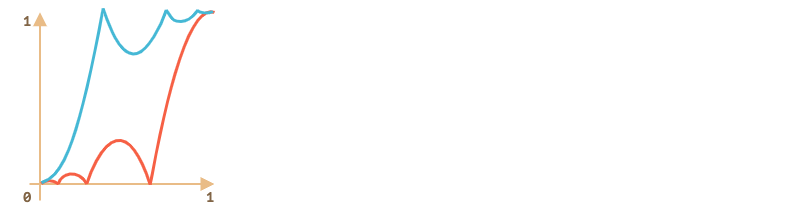

# 现代javascript教程

## 第3部分：其他文章

### 第五章、动画

#### 5.1贝塞尔曲线

贝塞尔曲线用于计算机图形绘制形状，CSS 动画和许多其他地方。

他们其实非常简单，值得学习一次并且在矢量图形和高级动画的世界里非常受用。

##### [控制点](https://zh.javascript.info/bezier-curve#kong-zhi-dian)

[贝塞尔曲线](https://en.wikipedia.org/wiki/Bézier_curve)由控制点定义。

这些点可能有 2、3、4 或更多。

例如，两点曲线：


三点曲线：


四点曲线：


如果仔细观察这些曲线，你会立即注意到：

1. **控制点不总是在曲线上**这是非常正常的，稍后我们将看到曲线是如何构建的。
2. **曲线的阶次等于控制点的数量减一**。 对于两个点我们能得到一条线性曲线（直线），三个点 — 一条二阶曲线，四个点 — 一条三阶曲线。
3. **曲线总是在控制点的[凸包](https://en.wikipedia.org/wiki/Convex_hull)内部：**


由于最后一个属性，在计算机图形学中，可以优化相交测试。如果凸包不相交，则曲线也不相交。因此，首先检查凸包的交叉点可以非常快地给出“无交叉”结果。检查交叉区域或凸包更容易，因为它们是矩形，三角形等（见上图），比曲线简单的多。

贝塞尔曲线绘制的主要重点 —— 通过移动曲线，曲线**以直观明显的**方式变化。

经过一些练习后，很明显我们知道怎样通过放置控制点来获得所需要的曲线。通过连接几条曲线，我们几乎可以得到任何东西。

这里有一些例子：


##### [数学](https://zh.javascript.info/bezier-curve#shu-xue)

贝塞尔曲线可以使用数学方程式来描述。

很快我们就能看到 —— 没必要知道它。但是为了完整性 —— 请看这里。

给定控制点 `Pi` 的坐标：第一个控制点的坐标为 `P1 = (x1, y1)`，第二个控制点的坐标为 `P2 = (x2, y2)`，以此类推，曲线坐标由方程式描述，这个方程式依赖属于区间 `[0,1]` 的参数 `t`。

- 有两个控制点的曲线方程：

  `P = (1-t)P1 + tP2`

- 有三个控制点的曲线方程：

  `P = (1−t)2P1 + 2(1−t)tP2 + t2P3`

- 有四个控制点的曲线方程：

  `P = (1−t)3P1 + 3(1−t)2tP2 +3(1−t)t2P3 + t3P4`

这些是矢量方程。

我们可以逐坐标重写它们，例如 3 点曲线：

- `x = (1−t)2x1 + 2(1−t)tx2 + t2x3`
- `y = (1−t)2y1 + 2(1−t)ty2 + t2y3`

我们应该放置 3 个控制点的坐标，而不是 `x1、y1、x2、y2、x3 和 y3`。

例如，如果控制点是 `(0,0)`、`(0.5, 1)` 和 `(1, 0)`，则方程式为：

- `x = (1−t)2 * 0 + 2(1−t)t * 0.5 + t2 * 1 = (1-t)t + t2 = t`
- `y = (1−t)2 * 0 + 2(1−t)t * 1 + t2 * 0 = 2(1-t)t = –t2 + 2t`

现在随着 `t` 从 `0` 到 `1` 变化，每个 `t` 对应的 `(x,y)` 集合可以构成曲线。

这可能太学术化了，对于曲线为什么看起来像这样以及它们如何依赖于控制点的描述并不是很明显。

所以绘制算法可能更容易理解。

##### [德卡斯特里奥算法](https://zh.javascript.info/bezier-curve#de-ka-si-te-li-ao-suan-fa)

[德卡斯特里奥算法](https://en.wikipedia.org/wiki/De_Casteljau's_algorithm)与曲线的数学定义相同，但直观地显示了曲线是如何被建立的。

**德卡斯特里奥算法构造三点贝塞尔曲线：**

1. 绘制控制点。在上面的演示中，它们标有：`1`、`2` 和 `3`。

2. 创造控制点 1 → 2 → 3 间的线段. 在上面的演示中它们是棕色的。

3. 参数 `t` 从 `0` to `1` 变化。 在上面的演示中取值 `0.05`：循环遍历 `0, 0.05, 0.1, 0.15, ... 0.95, 1`。

   对于每一个 `t` 的取值：

   - 在每一个棕色线段上我们取一个点，这个点距起点的距离按比例 `t` 取值。由于有两条线段，我们能得到两个点。

     例如，当 `t=0` — 所有点都在线段起点处，当 `t=0.25` — 点到起点的距离为线段长度的 25%，当 `t=0.5` — 50%（中间），当 `t=0.25` — 线段终点。

   - 连接这些点，下面这张图中连好的线被绘制成蓝色。

   

4. 现在在蓝色线段上取一个点，距离比例取相同数值的 `t`。也就是说，当 `t=0.25`（左图）时，我们取到的点位于线段的左 1/4 终点处，当 `t=0.5`（右图）时 — 线段中间。在上图中这一点是红色的。

5. 随着 `t` 从 `0` to `1` 变化，每一个 `t` 的值都会添加一个点到曲线上。这些点的集合就形成的贝塞尔曲线。它在上面的图中是红色的，并且是抛物线状的。

这是三控制点的处理过程，但是对于 4 个点同样适用。


算法：

- 控制点通过线段连接：1 → 2、2 → 3 和 3 → 4。 我们能得到 3 条棕色的线段。
- 对于`0`to`1`之间的每一个`t`：
  - 我们在这些线段上距起点距离比例为 `t` 的位置取点。把这些点连接起来，然后得到两条绿色线段。
  - 在这些线段上同样按比例 `t` 取点，得到一条蓝色线段。
  - 在蓝色线段按比例 `t` 取点。在上面的例子中是红色的。
- 这些点在一起组成了曲线。

该算法是递归的，并且可以适应于任意数量的控制点。

给定 N 个控制点，我们将它们连接起来以获得初始的 N-1 个线段。

然后对从 `0` 到 `1` 的每一个 `t`：

- 在每条线段上按 `t` 比例距离取一个点并且连接 —— 会得到 N-2 个线段。
- 在上面得到的每条线段上按 `t` 比例距离取一个点并且连接 —— 会得到 N-3 个线段，以此类推……
- 直到我们得到一个点。得到的这些点就形成了曲线。

------

**如何通过给定点绘制曲线？**

我们使用控制点制作贝塞尔曲线。正如我们所见，它们并不在曲线上。或者更准确地说，第一个和最后一个在曲线上，但其它的不在。

有时我们有另一种任务：绘制一条曲线**通过几个点**，让它们都在一条平滑曲线上。这种任务叫[插值](https://en.wikipedia.org/wiki/Interpolation)，这里我们不覆盖讲解它。

这些曲线有数学方程式，例如[拉格朗日多项式](https://en.wikipedia.org/wiki/Lagrange_polynomial)。

在计算机图形中[样条插值](https://en.wikipedia.org/wiki/Spline_interpolation)通常用于构建连接多个点的平滑曲线。

##### [总结](https://zh.javascript.info/bezier-curve#zong-jie)

贝塞尔曲线由其控制点定义。

贝塞尔曲线的两种定义方法：

1. 使用数学方程式。
2. 使用绘图过程：德卡斯特里奥算法

贝塞尔曲线的优点：

- 我们可以通过控制点移动来用鼠标绘制平滑线条。
- 复杂的形状可以由多条贝塞尔曲线组成。

用途：

- 在计算机图形学，建模，矢量图形编辑器中。字体由贝塞尔曲线描述。
- 在 Web 开发中 — 用于 Canvas 上的图形和 SVG 格式。顺便说一下，上面的“实时”示例是用 SVG 编写的。它们实际上是一个 SVG 文档，被赋予不同的控制点做参数。你可以在单独的窗口中打开它并查源码：[demo.svg](https://zh.javascript.info/article/bezier-curve/demo.svg?p=0,0,1,0.5,0,0.5,1,1&animate=1)。
- 在 CSS 动画中描述动画的路径和速度。

#### 5.2CSS 动画

CSS 动画可以在不借助 Javascript 的情况下做出一些简单的动画效果。

你也可以通过 Javascript 控制 CSS 动画，使用少量的代码，就能让动画表现更加出色。

##### [CSS 过渡（transition）[#css-transition\]](https://zh.javascript.info/css-animations#css-guo-du-transitioncsstransition)

CSS 过渡的理念非常简单，我们只需要定义某一个属性以及如何动态地表现其变化。当属性变化时，浏览器将会绘制出相应的过渡动画。

也就是说：我们只需要改变某个属性，然后所有流畅的动画都由浏览器生成。

举个例子，以下 CSS 会为 `backgroud-color` 的变化生成一个 3 秒的过渡动画：

```css
.animated {
  transition-property: background-color;
  transition-duration: 3s;
}
```

现在，只要一个元素拥有名为 `.animated` 的类，那么任何背景颜色的变化都会被渲染为 3 秒钟的动画。

单击以下按钮以演示动画：

```html
<button id="color">Click me</button>

<style>
  #color {
    transition-property: background-color;
    transition-duration: 3s;
  }
</style>

<script>
  color.onclick = function() {
    this.style.backgroundColor = 'red';
  };
</script>
```

CSS 提供了五个属性来描述一个过渡：

- `transition-property`
- `transition-duration`
- `transition-timing-function`
- `transition-delay`

之后我们会详细介绍它们，目前我们需要知道，我们可以在 `transition` 中以 `property duration timing-function delay` 的顺序一次性定义它们，并且可以同时为多个属性设置过渡动画。

请看以下例子，点击按钮生成 `color` 和 `font-size` 的过渡动画：

```html
<button id="growing">Click me</button>

<style>
#growing {
  transition: font-size 3s, color 2s;
}
</style>

<script>
growing.onclick = function() {
  this.style.fontSize = '36px';
  this.style.color = 'red';
};
</script>
```

现在让我们一个一个展开看这些属性。

##### [transition-property](https://zh.javascript.info/css-animations#transitionproperty)

在 `transition-property` 中我们可以列举要设置动画的所有属性，如：`left、margin-left、height 和 color`。

不是所有的 CSS 属性都可以使用过渡动画，但是它们中的[大多数](http://www.w3.org/TR/css3-transitions/#animatable-properties-)都是可以的。`all` 表示应用在所有属性上。

##### [transition-duration](https://zh.javascript.info/css-animations#transitionduration)

`transition-duration` 允许我们指定动画持续的时间。时间的格式参照 [CSS 时间格式](http://www.w3.org/TR/css3-values/#time)：单位为秒 `s` 或者毫秒 `ms`。

##### [transition-delay](https://zh.javascript.info/css-animations#transitiondelay)

`transition-delay` 允许我们设定动画**开始前**的延迟时间。例如，对于 `transition-delay: 1s`，动画将会在属性变化发生 1 秒后开始渲染。

你也可以提供一个负值。那么动画将会从整个过渡的中间时刻开始渲染。例如，对于 `transition-duration: 2s`，同时把 `delay` 设置为 `-1s`，那么这个动画将会持续 1 秒钟，并且从正中间开始渲染。

##### [transition-timing-function](https://zh.javascript.info/css-animations#transitiontimingfunction)

时间函数描述了动画进程在时间上的分布。它是先慢后快还是先快后慢？

乍一看，这可能是最复杂的属性了，但是稍微花点时间，你就会发现其实也很简单。

这个属性接受两种值：一个贝塞尔曲线（Bezier curve）或者阶跃函数（steps）。我们先从贝塞尔曲线开始，这也是较为常用的。

###### [贝塞尔曲线（Bezier curve）](https://zh.javascript.info/css-animations#bei-sai-er-qu-xian-beziercurve)

时间函数可以用[贝塞尔曲线](https://zh.javascript.info/bezier-curve)描述，通过设置四个满足以下条件的控制点：

1. 第一个应为：`(0,0)`。
2. 最后一个应为：`(1,1)`。
3. 对于中间值，`x` 必须位于 `0..1` 之间，`y` 可以为任意值。

CSS 中设置一贝塞尔曲线的语法为：`cubic-bezier(x2, y2, x3, y3)`。这里我们只需要设置第二个和第三个值，因为第一个点固定为 `(0,0)`，第四个点固定为 `(1,1)`。

时间函数描述了动画进行的快慢。

- `x` 轴表示时间：`0` —— 开始时刻，`1` —— `transition-duration`的结束时刻。
- `y` 轴表示过程的完成度：`0` —— 属性的起始值，`1` —— 属性的最终值。

最简单的一种情况就是动画匀速进行，可以通过设置曲线为 `cubic-bezier(0, 0, 1, 1)` 来实现。

CSS 提供几条内置的曲线：`linear`、`ease`、`ease-in`、`ease-out` 和 `ease-in-out`。

`linear` 其实就是 `cubic-bezier(0, 0, 1, 1)` 的简写 —— 一条直线，刚刚我们已经看过了。

其它的名称是以下贝塞尔曲线的简写：

`*` —— 默认值，如果没有指定时间函数，那么将使用 `ease` 作为默认值。

**贝塞尔曲线可以使动画『超出』其原本的范围。**

曲线上的控制点的 `y` 值可以使任意的：不管是负值还是一个很大的值。如此，贝塞尔曲线就会变得很低或者很高，让动画超出其正常的范围。

在一下的例子中使用的代码：

```css
.train {
  left: 100px;
  transition: left 5s cubic-bezier(.5, -1, .5, 2);
  /* JavaScript sets left to 400px */
}
```

`left` 本该在 `100px` 到 `400px` 之间变化。

但是如果你点击列车，你会发现：

- 起初，列车会**反向**运动：`left` 会变得小于 `100px`。
- 然后，它会变回往前运动，并且超过 `400px`。
- 最后再返回 —— 回到 `400px`。

`style.css`

```css
.train {
  position: relative;
  cursor: pointer;
  width: 177px;
  height: 160px;
  left: 100px;
  transition: left 5s cubic-bezier(.5, -1, .5, 2);
}
```

`index.html`

```html
<!doctype html>
<html>

<head>
  <meta charset="UTF-8">
  <link rel="stylesheet" href="style.css">
</head>

<body>

  

</body>

</html>
```

为什么会这样？看一眼给定的贝塞尔曲线的图像你就会明白了。


我们把第二个点的 `y` 坐标移动到了小于 `0` 的位置，同时把第三个点的 `y` 坐标移动到了大于 `1` 的位置，因此曲线已经不再像一个四分之一圆了。`y` 坐标超出了常规的 `0..1` 的范围。

正如我们所知，`y` 表示『动画进程的完成度』。`y = 0` 表示属性的初始值，`y = 1` 则表示属性的最终值。因此，`y < 0`意味着属性值要比初始值小，而 `y > 1` 则表明属性值要比最终值大。

当然了，`-1` 和 `2` 还是比较缓和的值。如果我们把 `y` 设为 `-99` 和 `99`，那么列车将会偏离地更远。

但是，如何针对特定的任务寻找到合适的贝塞尔曲线呢？事实上，有很多工具可以帮到你。比方说，我们可以利用这个网站：http://cubic-bezier.com/。

###### [阶跃函数（Steps）](https://zh.javascript.info/css-animations#jie-yue-han-shu-steps)

时间函数 `steps(number of steps[, start/end])` 允许你让动画分段进行，`number of steps` 表示需要拆分为多少段。

让我们通过一个数字的例子来演示一下。我们将会让数字以离散的方式变化，而不是以连续的方式。

为了达到效果，我们把动画拆分为 9 段：

```css
#stripe.animate  {
  transform: translate(-90%);
  transition: transform 9s steps(9, start);
}
```

`step(9, start)` 生效时：

`style.css`

```css
#digit {
  width: .5em;
  overflow: hidden;
  font: 32px monospace;
  cursor: pointer;
}

#stripe {
  display: inline-block
}

#stripe.animate {
  transform: translate(-90%);
  transition-property: transform;
  transition-duration: 9s;
  transition-timing-function: steps(9, start);
}
```

`index.html`

```html
<!DOCTYPE html>
<html>

<head>
  <meta charset="utf-8">
  <link rel="stylesheet" href="style.css">
</head>

<body>

  Click below to animate:

  <div id="digit"><div id="stripe">0123456789</div></div>

  <script>
    digit.onclick = function() {
      stripe.classList.add('animate');
    }
  </script>


</body>

</html>
```

`steps` 的第一个参数表示段数。这个过渡动画将会被拆分为 9 个部分（每个占 10%）。时间间隔也会以同样的方式被拆分：9 秒会被分割为多个时长 1 秒的间隔。

第二个参数可以取 `start` 或 `end` 两者其一。

`start` 表示在动画开始时，我们需要立即开始第一段的动画。

可以观察到，在动画过程中：当我们单击数字之后，它会立马变为 `1`（即第一段），然后在下一秒开始的时候继续变化。

具体的流程如下：

- `0s` —— `-10%`（在第一秒开始的时候立即变化）
- `1s` —— `-20%`
- …
- `8s` – `-80%`
- （最后一秒，显示最终值）

另一个值 `end` 表示：改变不应该在最开始的时候发生，而是发生在每一段的最后时刻。

其流程如下：

- `0s` —— `0`
- `1s` —— `-10%`（在第一秒结束时第一次变化）
- `2s` —— `-20%`
- …
- `9s` —— `-90%`

另外还有一些简写值：

- `step-start` —— 等同于 `steps(1, start)`。即：动画立刻开始，并且只有一段。也就是说，会立刻开始，紧接着就结束了，宛如没有动画一样。
- `step-end` —— 等同于 `steps(1, end)`。即：在 `transition-duration` 结束时生成一段动画。

这些值很少会被用到，因为它们并不算是真正的动画，而是单步的变化。

##### [transitionend 事件](https://zh.javascript.info/css-animations#transitionend-shi-jian)

CSS 动画完成后，会触发 `transitionend` 事件。

这被广泛用于在动画结束后执行某种操作。我们也可以用它来串联动画。

举例来说，下面的[小船](https://zh.js.cx/article/css-animations/boat/)会在点击后向右浮动，然后再回来。而且，每一次都会向右移动地更远一点：

这个动画通过 `go` 函数初始化，并且在每次动画完成后都会重复执行，并转变方向：

```javascript
boat.onclick = function() {
  //...
  let times = 1;

  function go() {
    if (times % 2) {
      // 向右移动
      boat.classList.remove('back');
      boat.style.marginLeft = 100 * times + 200 + 'px';
    } else {
      // 向左移动
      boat.classList.add('back');
      boat.style.marginLeft = 100 * times - 200 + 'px';
    }

  }

  go();

  boat.addEventListener('transitionend', function() {
    times++;
    go();
  });
};
```

`transitionend` 的事件对象有几个特定的属性：

`event.propertyName` ：当前完成动画的属性，这在我们同时为多个属性加上动画时会很有用。

`event.elapsedTime` ：动画完成的时间（按秒计算），不包括 `transition-delay`。

##### [关键帧动画（Keyframes）](https://zh.javascript.info/css-animations#guan-jian-zhen-dong-hua-keyframes)

我们可以通过 CSS 提供的 `@keyframes` 规则整合多个简单的动画。

它会指定某个动画的名称以及相应的规则：哪个属性，何时以及何地渲染动画。然后使用 `animation` 属性把动画绑定到相应的元素上，并为其添加额外的参数。

这里有个详细的例子：

```html
<div class="progress"></div>

<style>
  @keyframes go-left-right {        /* 指定一个名字："go-left-right" */
    from { left: 0px; }             /* 从 left: 0px 开始 */
    to { left: calc(100% - 50px); } /* 移动至 left: 100%-50px */
  }

  .progress {
    animation: go-left-right 3s infinite alternate;
    /* 把动画 "go-left-right" 应用到元素上
       持续 3 秒
       持续次数：infinite
       每次都改变方向
    */

    position: relative;
    border: 2px solid green;
    width: 50px;
    height: 20px;
    background: lime;
  }
</style>
```

有许多关于 `@keyframes` 的文章以及一个[详细的规范说明](https://drafts.csswg.org/css-animations/)。

很可能你并不需要经常用到 `@keyframes`，除非你的网站上有一直在运动的元素。

##### [总结](https://zh.javascript.info/css-animations#zong-jie)

CSS 动画允许你为一个或者多个属性的变化创建丝滑流畅（也可能不是）的过渡动画。

它们适用于大多数的动画需求。我们也可以使用 JavaScript 创建动画，下一章将会详细讲解相关内容。

相对于 JavaScript 动画，CSS 动画存在的特点如下：

优点

- 简单的事，简单地做。
- 快速，而且对 CPU 造成的压力很小。

不足

- JavaScript 动画更加灵活。它们可以实现任何动画逻辑，比如某个元素的爆炸效果。
- 不仅仅只是属性的变化。我们还可以在 JavaScript 中生成新元素用于动画。

本节已经介绍了可以使用 CSS 实现的主要动画类型，而且 `transitionend` 还允许在动画结束后执行 JavaScript 代码，因此它可以方便得与代码结合起来。

但是在下一节，我们将会学习一些 JavaScript 动画来实现更加复杂的效果。

#### 5.3JavaScript 动画

JavaScript 动画可以处理 CSS 无法处理的事情。

例如，沿着具有与 Bezier 曲线不同的时序函数的复杂路径移动，或者实现画布上的动画。

##### [使用 setInterval](https://zh.javascript.info/js-animation#shi-yong-setinterval)

从 HTML/CSS 的角度来看，动画是 style 属性的逐渐变化。例如，将 `style.left` 从 `0px` 变化到 `100px` 可以移动元素。

如果我们用 `setInterval` 每秒做 50 次小变化，看起来会更流畅。电影也是这样的原理：每秒 24 帧或更多帧足以使其看起来流畅。

伪代码如下：

```javascript
let delay = 1000 / 50; // 每秒 50 帧
let timer = setInterval(function() {
  if (animation complete) clearInterval(timer);
  else increase style.left
}, delay)
```

更完整的动画示例：

```javascript
let start = Date.now(); // 保存开始时间

let timer = setInterval(function() {
  // 距开始过了多长时间
  let timePassed = Date.now() - start;

  if (timePassed >= 2000) {
    clearInterval(timer); // 2 秒后结束动画
    return;
  }

  // 在 timePassed 时刻绘制动画
  draw(timePassed);

}, 20);

// 随着 timePassed 从 0 增加到 2000
// 将 left 的值从 0px 增加到 400px
function draw(timePassed) {
  train.style.left = timePassed / 5 + 'px';
}
```

##### [使用 requestAnimationFrame](https://zh.javascript.info/js-animation#shi-yong-requestanimationframe)

假设我们有几个同时运行的动画。

如果我们单独运行它们，每个都有自己的 `setInterval(..., 20)`，那么浏览器必须以比 `20ms` 更频繁的速度重绘。

每个 `setInterval` 每 `20ms` 触发一次，但它们相互独立，因此 `20ms` 内将有多个独立运行的重绘。

这几个独立的重绘应该组合在一起，以使浏览器更加容易处理。

换句话说，像下面这样：

```javascript
setInterval(function() {
  animate1();
  animate2();
  animate3();
}, 20)
```

……比这样更好：

```javascript
setInterval(animate1, 20);
setInterval(animate2, 20);
setInterval(animate3, 20);
```

还有一件事需要记住。有时当 CPU 过载时，或者有其他原因需要降低重绘频率。例如，如果浏览器选项卡被隐藏，那么绘图完全没有意义。

有一个标准[动画时序](http://www.w3.org/TR/animation-timing/)提供了 `requestAnimationFrame` 函数。

它解决了所有这些问题，甚至更多其它的问题。

语法：

```javascript
let requestId = requestAnimationFrame(callback);
```

这会让 `callback` 函数在浏览器每次重绘的最近时间运行。

如果我们对 `callback` 中的元素进行变化，这些变化将与其他 `requestAnimationFrame` 回调和 CSS 动画组合在一起。因此，只会有一次几何重新计算和重绘，而不是多次。

返回值 `requestId` 可用来取消回调：

```javascript
// 取消回调的周期执行
cancelAnimationFrame(requestId);
```

`callback` 得到一个参数 —— 从页面加载开始经过的毫秒数。这个时间也可通过调用 [performance.now()](https://developer.mozilla.org/zh/docs/Web/API/Performance/now) 得到。

通常 `callback` 很快就会运行，除非 CPU 过载或笔记本电量消耗殆尽，或者其他原因。

下面的代码显示了 `requestAnimationFrame` 的前 10 次运行之间的时间间隔。通常是 10-20ms：

```html
<script>
  let prev = performance.now();
  let times = 0;

  requestAnimationFrame(function measure(time) {
    document.body.insertAdjacentHTML("beforeEnd", Math.floor(time - prev) + " ");
    prev = time;

    if (times++ < 10) requestAnimationFrame(measure);
  });
</script>
```

##### [结构化动画](https://zh.javascript.info/js-animation#jie-gou-hua-dong-hua)

现在我们可以在 `requestAnimationFrame` 基础上创建一个更通用的动画函数：

```javascript
function animate({timing, draw, duration}) {

  let start = performance.now();

  requestAnimationFrame(function animate(time) {
    // timeFraction 从 0 增加到 1
    let timeFraction = (time - start) / duration;
    if (timeFraction > 1) timeFraction = 1;

    // 计算当前动画状态
    let progress = timing(timeFraction);

    draw(progress); // 绘制

    if (timeFraction < 1) {
      requestAnimationFrame(animate);
    }

  });
}
```

`animate` 函数接受 3 个描述动画的基本参数：

- `duration`

  动画总时间，比如 `1000`。

- `timing(timeFraction)`

  时序函数，类似 CSS 属性 `transition-timing-function`，传入一个已过去的时间与总时间之比的小数（`0` 代表开始，`1` 代表结束），返回动画完成度（类似 Bezier 曲线中的 `y`）。例如，线性函数意味着动画以相同的速度均匀地进行：`function linear(timeFraction) {  return timeFraction; }`

- `draw(progress)`

  获取动画完成状态并绘制的函数。值 `progress = 0` 表示开始动画状态，`progress = 1` 表示结束状态。这是实际绘制动画的函数。它可以移动元素：`function draw(progress) {  train.style.left = progress + 'px'; }`……或者做任何其他事情，我们可以以任何方式为任何事物制作动画。

让我们使用我们的函数将元素的 `width` 从 `0` 变化为 `100%`。

它的代码如下：

```javascript
animate({
  duration: 1000,
  timing(timeFraction) {
    return timeFraction;
  },
  draw(progress) {
    elem.style.width = progress * 100 + '%';
  }
});
```

与 CSS 动画不同，我们可以在这里设计任何时序函数和任何绘图函数。时序函数不受 Bezier 曲线的限制。并且 `draw` 不局限于操作 CSS 属性，还可以为类似烟花动画或其他动画创建新元素。

##### [时序函数](https://zh.javascript.info/js-animation#shi-xu-han-shu)

上文我们看到了最简单的线性时序函数。

让我们看看更多。我们将尝试使用不同时序函数的移动动画来查看它们的工作原理。

###### [n 次幂](https://zh.javascript.info/js-animation#n-ci-mi)

如果我们想加速动画，我们可以让 `progress` 为 `n` 次幂。

例如，抛物线：

```javascript
function quad(timeFraction) {
  return Math.pow(timeFraction, 2)
}
```

图像如下：


……或者三次曲线甚至使用更大的 `n`。增大幂会让动画加速得更快。

下面是 `progress` 为 `5` 次幂的图像:


###### [圆弧](https://zh.javascript.info/js-animation#yuan-hu)

函数：

```javascript
function circ(timeFraction) {
  return 1 - Math.sin(Math.acos(timeFraction));
}
```

图像：


###### [反弹：弓箭射击](https://zh.javascript.info/js-animation#fan-dan-gong-jian-she-ji)

此函数执行“弓箭射击”。首先，我们“拉弓弦”，然后“射击”。

与以前的函数不同，它取决于附加参数 `x`，即“弹性系数”。“拉弓弦”的距离由它定义。

代码如下：

```javascript
function back(x, timeFraction) {
  return Math.pow(timeFraction, 2) * ((x + 1) * timeFraction - x);
}
```

**`x = 1.5` 时的图像：**


###### [弹跳](https://zh.javascript.info/js-animation#dan-tiao)

想象一下，我们正在抛球。球落下之后，弹跳几次然后停下来。

`bounce` 函数也是如此，但顺序相反：“bouncing”立即启动。它使用了几个特殊的系数：

```javascript
function bounce(timeFraction) {
  for (let a = 0, b = 1, result; 1; a += b, b /= 2) {
    if (timeFraction >= (7 - 4 * a) / 11) {
      return -Math.pow((11 - 6 * a - 11 * timeFraction) / 4, 2) + Math.pow(b, 2)
    }
  }
}
```

###### [伸缩动画](https://zh.javascript.info/js-animation#shen-suo-dong-hua)

另一个“伸缩”函数接受附加参数 `x` 作为“初始范围”。

```javascript
function elastic(x, timeFraction) {
  return Math.pow(2, 10 * (timeFraction - 1)) * Math.cos(20 * Math.PI * x / 3 * timeFraction)
}
```

**`x=1.5` 时的图像：**


##### [逆转：ease*](https://zh.javascript.info/js-animation#ni-zhuan-ease)

我们有一组时序函数。它们的直接应用称为“easeIn”。

有时我们需要以相反的顺序显示动画。这是通过“easeOut”变换完成的。

###### [easeOut](https://zh.javascript.info/js-animation#easeout)

在“easeOut”模式中，我们将 `timing` 函数封装到 `timingEaseOut`中：

```javascript
timingEaseOut(timeFraction) = 1 - timing(1 - timeFraction);
```

换句话说，我们有一个“变换”函数 `makeEaseOut`，它接受一个“常规”时序函数 `timing` 并返回一个封装器，里面封装了 `timing` 函数：

```javascript
// 接受时序函数，返回变换后的变体
function makeEaseOut(timing) {
  return function(timeFraction) {
    return 1 - timing(1 - timeFraction);
  }
}
```

例如，我们可以使用上面描述的 `bounce` 函数：

```javascript
let bounceEaseOut = makeEaseOut(bounce);
```

这样，弹跳不会在动画开始时执行，而是在动画结束时。这样看起来更好。

在这里，我们可以看到变换如何改变函数的行为：



如果在开始时有动画效果，比如弹跳 —— 那么它将在最后显示。

上图中常规弹跳为红色，easeOut 弹跳为蓝色。

- 常规弹跳 —— 物体在底部弹跳，然后突然跳到顶部。
- `easeOut` 变换之后 —— 物体跳到顶部之后，在那里弹跳。

###### [easeInOut](https://zh.javascript.info/js-animation#easeinout)

我们还可以在动画的开头和结尾都显示效果。该变换称为“easeInOut”。

给定时序函数，我们按下面的方式计算动画状态：

```javascript
if (timeFraction <= 0.5) { // 动画前半部分
  return timing(2 * timeFraction) / 2;
} else { // 动画后半部分
  return (2 - timing(2 * (1 - timeFraction))) / 2;
}
```

封装器代码：

```javascript
function makeEaseInOut(timing) {
  return function(timeFraction) {
    if (timeFraction < .5)
      return timing(2 * timeFraction) / 2;
    else
      return (2 - timing(2 * (1 - timeFraction))) / 2;
  }
}

bounceEaseInOut = makeEaseInOut(bounce);
```

“easeInOut” 变换将两个图像连接成一个：动画的前半部分为“easeIn”（常规），后半部分为“easeOut”（反向）。

如果我们比较 `circ` 时序函数的 `easeIn`、`easeOut` 和 `easeInOut` 的图像，就可以清楚地看到效果：


- 红色是 `circ`（`easeIn`）的常规变体。
- 绿色 —— `easeOut`。
- 蓝色 —— `easeInOut`。

正如我们所看到的，动画前半部分的图形是缩小的“easeIn”，后半部分是缩小的“easeOut”。结果是动画以相同的效果开始和结束。

##### [更有趣的 “draw”](https://zh.javascript.info/js-animation#geng-you-qu-de-draw)

除了移动元素，我们还可以做其他事情。我们所需要的只是写出合适的 `draw`。

这是动画形式的“弹跳”文字输入：

`style.css`

```css
textarea {
  display: block;
  border: 1px solid #BBB;
  color: #444;
  font-size: 110%;
}

button {
  margin-top: 10px;
}
```

`index.html`

```html
<!DOCTYPE HTML>
<html>

<head>
  <meta charset="utf-8">
  <link rel="stylesheet" href="style.css">
  <script src="https://js.cx/libs/animate.js"></script>
</head>

<body>


  <textarea id="textExample" rows="5" cols="60">He took his vorpal sword in hand:
Long time the manxome foe he sought—
So rested he by the Tumtum tree,
And stood awhile in thought.
  </textarea>

  <button onclick="animateText(textExample)">Run the animated typing!</button>

  <script>
    function animateText(textArea) {
      let text = textArea.value;
      let to = text.length,
        from = 0;

      animate({
        duration: 5000,
        timing: bounce,
        draw: function(progress) {
          let result = (to - from) * progress + from;
          textArea.value = text.substr(0, Math.ceil(result))
        }
      });
    }


    function bounce(timeFraction) {
      for (let a = 0, b = 1, result; 1; a += b, b /= 2) {
        if (timeFraction >= (7 - 4 * a) / 11) {
          return -Math.pow((11 - 6 * a - 11 * timeFraction) / 4, 2) + Math.pow(b, 2)
        }
      }
    }
  </script>


</body>

</html>
```

##### [总结](https://zh.javascript.info/js-animation#zong-jie)

JavaScript 动画应该通过 `requestAnimationFrame` 实现。该内置方法允许设置回调函数，以便在浏览器准备重绘时运行。那通常很快，但确切的时间取决于浏览器。

当页面在后台时，根本没有重绘，因此回调将不会运行：动画将被暂停并且不会消耗资源。那很棒。

这是设置大多数动画的 helper 函数 `animate`：

```javascript
function animate({timing, draw, duration}) {

  let start = performance.now();

  requestAnimationFrame(function animate(time) {
    // timeFraction 从 0 增加到 1
    let timeFraction = (time - start) / duration;
    if (timeFraction > 1) timeFraction = 1;

    // 计算当前动画状态
    let progress = timing(timeFraction);

    draw(progress); // 绘制

    if (timeFraction < 1) {
      requestAnimationFrame(animate);
    }

  });
}
```

参数：

- `duration` —— 动画运行的总毫秒数。
- `timing` —— 计算动画进度的函数。获取从 0 到 1 的小数时间，返回动画进度，通常也是从 0 到 1。
- `draw` —— 绘制动画的函数。

当然我们可以改进它，增加更多花里胡哨的东西，但 JavaScript 动画不是经常用到。它们用于做一些有趣和不标准的事情。因此，您大可在必要时再添加所需的功能。

JavaScript 动画可以使用任何时序函数。我们介绍了很多例子和变换，使它们更加通用。与 CSS 不同，我们不仅限于 Bezier 曲线。

`draw` 也是如此：我们可以将任何东西动画化，而不仅仅是 CSS 属性。

