# 现代javascript教程

## 第3部分：其他文章

### 第六章、**Web components**

#### 6.1从星球轨道的高度讲起

这一部分我们将会讲述关于「Web Components」的一系列现代标准。

到目前为止，这些标准仍然在制定中。其中一些特性已经被很好地支持并集成到了现代 HTML/DOM 标准中，但是还有部分特性仍然处在草案阶段。你可以在任何浏览器中尝试一些例子，Google Chrome 可能是对这些新特性支持得最好的浏览器。猜测可能是因为 Google 公司的人本身就是很多相关标准的支持者。

##### [共通之处在于……](https://zh.javascript.info/webcomponents-intro#gong-tong-zhi-chu-zai-yu)

整个组件化的概念并不是最新才提出的。很多框架和其他地方已经广泛地应用了组件化的设计。

在我们开始探讨实现细节之前，先让我们看看人类的伟大成就：


这是国际空间站（ISS）。

这是其组成结构（大致的）：


这个国际空间站：

- 由许多组件构成。
- 各个组件都由很多的更小的部分组成，
- 组件都非常复杂，远比大部分网站更复杂。
- 国际化的组件开发团队，整个工作由不同国家、说着不同语言的人共同完成。

……并且这个家伙能飞，它让人类在太空中能够生存！

这些复杂的设备是如何被创造的？

我们可以从中借鉴哪些原则，让我们的开发项目同样的可靠并且可大规模化呢？或者至少让我们可以接近这些目标。

##### [组件化架构](https://zh.javascript.info/webcomponents-intro#zu-jian-hua-jia-gou)

众所周知，开发复杂软件的原则是：不要让软件复杂。

如果某个部分变得复杂了 —— 将其拆分成更简单的部分，再以最简明的方式组合起来。

**只有让复杂的事情简单化的架构才是好架构。**

我们可以把用户界面拆分为若干可视化组件：每个组件都在页面上占有一块位置，可以执行一个明确的任务，并且可以和其他组件区分开。

接下来看一个实际的网站的例子，比如 Twitter。

非常自然地，可以拆分为几个组件：

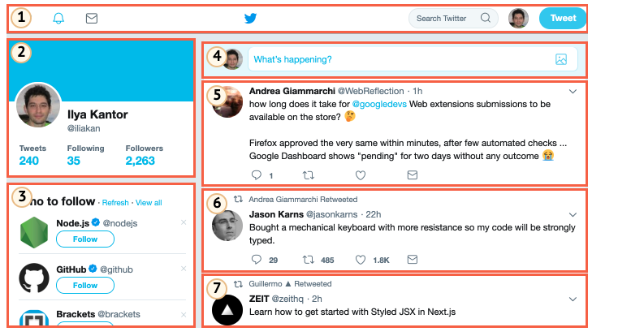

1. 顶部导航栏。
2. 用户信息。
3. 关注推荐。
4. 提交表格。
5. （6，7也是） —— 消息。

组件也可以包含子组件，比如消息组件可能是更高阶组件「消息列表」的子组件。可点击的用户头像可能也是一个组件，这样的例子还有很多。

我们如何划分一个组件呢？直觉、经验和常识可以帮助我们完成这件事。通常情况下，如果一个独立可视化实体，我们可以描述其可以做什么和如何在页面上交互，那么就可以将其划分为一个组件。在上面的例子中，这个页面存在几个模块，每个模块都有自己的角色，所以把它们划分为组件是合理的。

一个组件有：

- 自己的 JavaScript 类。
- DOM 结构，并且只由自己的类管理，无法被外部代码操作。（「封装」原则）。
- CSS 样式，作用在这个组件上。
- API：事件，类方法等等，让组件可以与其他组件交互。

再说一遍，整个「组件化」的概念并不是什么特别的东西。

现在已经有了很多框架和开发方法论可以实现组件化，它们各个都有自己的卖点。通常情况下，采用特殊的 CSS 类命名和一些规范，已经可以带来「组件化的感觉」 —— 即 CSS 作用域和 DOM 封装。

而现在浏览器已经原生支持了「Web Components」，我们就可以不用再自己去模拟组件化的结构了。

- [Custom elements](https://html.spec.whatwg.org/multipage/custom-elements.html#custom-elements) —— 用于自定义 HTML 元素.
- [Shadow DOM](https://dom.spec.whatwg.org/#shadow-trees) —— 为组件创造内部 DOM，它对外部是不可见的。
- [CSS Scoping](https://drafts.csswg.org/css-scoping/) —— 申明仅应用于组件的 Shadow DOM 内的样式。
- [Event retargeting](https://dom.spec.whatwg.org/#retarget) 以及更多的小东西，让自定义组件更适用于开发工作。

在下一篇中我们将会更细致地讲述「Custom Elements」 —— 一个已经被很广泛支持的 Web Components 重要组成部分。

#### 6.2**Custom elements**

我们可以通过描述带有自己的方法、属性和事件等的类来创建自定义 HTML 元素。

在 custom elements （自定义标签）定义完成之后，我们可以将其和 HTML 的内置标签一同使用。

这是一件好事，因为虽然 HTML 有非常多的标签，但仍然是有穷尽的。如果我们需要像 `<easy-tabs>`、`<sliding-carousel>`、`<beautiful-upload>`…… 这样的标签，内置标签并不能满足我们。

我们可以把上述的标签定义为特殊的类，然后使用它们，就好像它们本来就是 HTML 的一部分一样。

Custom elements 有两种：

1. **Autonomous custom elements （自主自定义标签）** —— “全新的” 元素, 继承自 `HTMLElement` 抽象类.
2. **Customized built-in elements （自定义内置元素）** —— 继承内置的 HTML 元素，比如自定义 `HTMLButtonElement`等。

我们将会先创建 autonomous 元素，然后再创建 customized built-in 元素。

在创建 custom elements 的时候，我们需要告诉浏览器一些细节，包括：如何展示它，以及在添加元素到页面和将其从页面移除的时候需要做什么，等等。

通过创建一个带有几个特殊方法的类，我们可以完成这件事。这非常容易实现，我们只需要添加几个方法就行了，同时这些方法都不是必须的。

下面列出了这几个方法的概述：

```javascript
class MyElement extends HTMLElement {
  constructor() {
    super();
    // 元素在这里创建
  }

  connectedCallback() {
    // 在元素被添加到文档之后，浏览器会调用这个方法
    //（如果一个元素被反复添加到文档／移除文档，那么这个方法会被多次调用）
  }

  disconnectedCallback() {
    // 在元素从文档移除到时候，浏览器会调用这个方法
    // （如果一个元素被反复添加到文档／移除文档，那么这个方法会被多次调用）
  }

  static get observedAttributes() {
    return [/* 属性数组，这些属性的变化会被被监视 */];
  }

  attributeChangedCallback(name, oldValue, newValue) {
    // 当上面数组里面的属性变化的时候，这个方法会被调用
  }

  adoptedCallback() {
    // 在元素被移动到新的文档的时候，这个方法会被调用
    // （document.adoptNode 会用到, 非常少见）
  }

  // 还可以添加更多的元素方法和属性
}
```

在申明了上面几个方法之后，我们需要注册元素：

```javascript
// 让浏览器知道我们新定义的类是为 <my-element> 服务的
customElements.define("my-element", MyElement);
```

现在当任何带有 `<my-element>` 标签的元素被创建的时候，一个 `MyElement` 的实例也会被创建，并且前面提到的方法也会被调用。我们同样可以使用 `document.createElement('my-element')` 在 JavaScript 里创建元素。

------

**Custom element 名称必须包括一个短横线 `-`**

Custom element 名称必须包括一个短横线 `-`, 比如 `my-element` 和 `super-button` 都是有效的元素名，但 `myelement` 并不是。

这是为了确保 custom element 和内置 HTML 元素之间不会发生命名冲突。

##### [例子: “time-formatted”](https://zh.javascript.info/custom-elements#li-zi-timeformatted)

举个例子，HTML 里面已经有 `<time>` 元素了，用于显示日期／时间。但是这个标签本身并不会对时间进行任何格式化处理。

让我们来创建一个可以展示适用于当前浏览器语言的时间格式的 `<time-formatted>` 元素：

```html
<script>
class TimeFormatted extends HTMLElement { // (1)

  connectedCallback() {
    let date = new Date(this.getAttribute('datetime') || Date.now());

    this.innerHTML = new Intl.DateTimeFormat("default", {
      year: this.getAttribute('year') || undefined,
      month: this.getAttribute('month') || undefined,
      day: this.getAttribute('day') || undefined,
      hour: this.getAttribute('hour') || undefined,
      minute: this.getAttribute('minute') || undefined,
      second: this.getAttribute('second') || undefined,
      timeZoneName: this.getAttribute('time-zone-name') || undefined,
    }).format(date);
  }

}

customElements.define("time-formatted", TimeFormatted); // (2)
</script>

<!-- (3) -->
<time-formatted datetime="2019-12-01"
  year="numeric" month="long" day="numeric"
  hour="numeric" minute="numeric" second="numeric"
  time-zone-name="short"
></time-formatted>
```

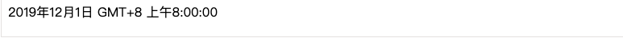

1. 这个类只有一个方法 `connectedCallback()` —— 在 `<time-formatted>` 元素被添加到页面的时候，浏览器会调用这个方法（或者当 HTML 解析器检测到它的时候），它使用了内置的时间格式化工具 [Intl.DateTimeFormat](https://developer.mozilla.org/en-US/docs/Web/JavaScript/Reference/Global_Objects/DateTimeFormat)，这个工具可以非常好地展示格式化之后的时间，在各浏览器中兼容性都非常好。
2. 我们需要通过 `customElements.define(tag, class)` 来注册这个新元素。
3. 接下来在任何地方我们都可以使用这个新元素了。

------

**Custom elements 升级**

如果浏览器在 `customElements.define` 之前的任何地方见到了 `<time-formatted>` 元素，并不会报错。但会把这个元素当作未知元素，就像任何非标准标签一样。

`:not(:defined)` CSS 选择器可以对这样「未定义」的元素加上样式。

当 `customElement.define` 被调用的时候，他们被「升级」了：一个新的 `TimeFormatted` 元素为每一个标签创建了，并且 `connectedCallback` 被调用。 他们变成了 `:defined`。

我们可以通过这些方法来获取更多的自定义标签的信息：

- `customElements.get(name)` —— 返回指定 custom element `name` 的类。
- `customElements.whenDefined(name)` – 返回一个 promise，将会在这个具有给定 `name` 的 custom element 变为已定义状态的时候 resolve（不带值）。

------

**在 `connectedCallback` 中渲染，而不是 `constructor` 中**

在上面的例子中，元素里面的内容是在 `connectedCallback` 中渲染（创建）的。

为什么不在 `constructor` 中渲染？

原因很简单：在 `constructor` 被调用的时候，还为时过早。虽然这个元素实例已经被创建了，但还没有插入页面。在这个阶段，浏览器还没有处理／创建元素属性：调用 `getAttribute` 将会得到 `null`。所以我们并不能在那里渲染元素。

而且，如果你仔细考虑，这样作对于性能更好 —— 推迟渲染直到真正需要的时候。

在元素被添加到文档的时候，它的 `connectedCallback` 方法会被调用。这个元素不仅仅是被添加为了另一个元素的子元素，同样也成为了页面的一部分。因此我们可以构建分离的 DOM，创建元素并且让它们为之后的使用准备好。它们只有在插入页面的时候才会真的被渲染。

##### [监视属性](https://zh.javascript.info/custom-elements#jian-shi-shu-xing)

我们目前的 `<time-formatted>` 实现中，在元素渲染以后，后续的属性变化并不会带来任何影响。这对于 HTML 元素来说有点奇怪。通常当我们改变一个属性的时候，比如 `a.href`，我们会预期立即看到变化。我们将会在下面修正这一点。

为了监视这些属性，我们可以在 `observedAttributes()` static getter 中提供属性列表。当这些属性发生变化的时候，`attributeChangedCallback` 会被调用。出于性能优化的考虑，其他属性变化的时候并不会触发这个回调方法。

以下是 `<time-formatted>` 的新版本，它会在属性变化的时候自动更新：

```html
<script>
class TimeFormatted extends HTMLElement {

  render() { // (1)
    let date = new Date(this.getAttribute('datetime') || Date.now());

    this.innerHTML = new Intl.DateTimeFormat("default", {
      year: this.getAttribute('year') || undefined,
      month: this.getAttribute('month') || undefined,
      day: this.getAttribute('day') || undefined,
      hour: this.getAttribute('hour') || undefined,
      minute: this.getAttribute('minute') || undefined,
      second: this.getAttribute('second') || undefined,
      timeZoneName: this.getAttribute('time-zone-name') || undefined,
    }).format(date);
  }

  connectedCallback() { // (2)
    if (!this.rendered) {
      this.render();
      this.rendered = true;
    }
  }

  static get observedAttributes() { // (3)
    return ['datetime', 'year', 'month', 'day', 'hour', 'minute', 'second', 'time-zone-name'];
  }

  attributeChangedCallback(name, oldValue, newValue) { // (4)
    this.render();
  }

}

customElements.define("time-formatted", TimeFormatted);
</script>

<time-formatted id="elem" hour="numeric" minute="numeric" second="numeric"></time-formatted>

<script>
setInterval(() => elem.setAttribute('datetime', new Date()), 1000); // (5)
</script>
```

1. 渲染逻辑被移动到了 `render()` 这个辅助方法里面。
2. 这个方法在元素被插入到页面的时候调用。
3. `attributeChangedCallback` 在 `observedAttributes()` 里的属性改变的时候被调用。
4. …… 然后重渲染元素。
5. 最终，一个计时器就这样被我们轻松地实现了。

##### [渲染顺序](https://zh.javascript.info/custom-elements#xuan-ran-shun-xu)

在 HTML 解析器构建 DOM 的时候，会按照先后顺序处理元素，先处理父级元素再处理子元素。例如，如果我们有 `<outer><inner></inner></outer>`，那么 `<outer>` 元素会首先被创建并接入到 DOM，然后才是 `<inner>`。

这对 custom elements 产生了重要影响。

比如，如果一个 custom element 想要在 `connectedCallback` 内访问 `innerHTML`，它什么也拿不到:

```html
<script>
customElements.define('user-info', class extends HTMLElement {

  connectedCallback() {
    alert(this.innerHTML); // empty (*)
  }

});
</script>

<user-info>John</user-info>
```

如果你运行上面的代码，`alert` 出来的内容是空的。

这正是因为在那个阶段，子元素还不存在，DOM 还没有完成构建。HTML 解析器先连接 custom element `<user-info>`，然后再处理子元素，但是那时候子元素还并没有加载上。

如果我们要给 custom element 传入信息，我们可以使用元素属性。它们是即时生效的。

或者，如果我们需要子元素，我们可以使用延迟时间为零的 `setTimeout` 来推迟访问子元素。

这样是可行的：

```html
<script>
customElements.define('user-info', class extends HTMLElement {

  connectedCallback() {
    setTimeout(() => alert(this.innerHTML)); // John (*)
  }

});
</script>

<user-info>John</user-info>
```

现在 `alert` 在 `(*)` 行展示了 「John」，因为我们是在 HTML 解析完成之后，才异步执行了这段程序。我们在这个时候处理必要的子元素并且结束初始化过程。

另一方面，这个方案并不是完美的。如果嵌套的 custom element 同样使用了 `setTimeout` 来初始化自身，那么它们会按照先后顺序执行：外层的 `setTimeout` 首先触发，然后才是内层的。

这样外层元素还是早于内层元素结束初始化。

让我们用一个例子来说明：

```html
<script>
customElements.define('user-info', class extends HTMLElement {
  connectedCallback() {
    alert(`${this.id} 已连接。`);
    setTimeout(() => alert(`${this.id} 初始化完成。`));
  }
});
</script>

<user-info id="outer">
  <user-info id="inner"></user-info>
</user-info>
```

输出顺序：

1. outer 已连接。
2. inner 已连接。
3. outer 初始化完成。
4. inner 初始化完成。

我们可以很明显地看到外层元素并没有等待内层元素。

并没有任何内置的回调方法可以在嵌套元素渲染好之后通知我们。但我们可以自己实现这样的回调。比如，内层元素可以分派像 `initialized` 这样的事件，同时外层的元素监听这样的事件并做出响应。

##### [Customized built-in elements](https://zh.javascript.info/custom-elements#customizedbuiltinelements)

我们创建的 `<time-formatted>` 这些新元素，并没有任何相关的语义。搜索引擎并不知晓它们的存在，同时无障碍设备也无法处理它们。

但上述两点同样是非常重要的。比如，搜索引擎会对这些事情感兴趣，比如我们真的展示了时间。或者如果我们创建了一个特别的按钮，为什么不复用已有的 `<button>` 功能呢？

我们可以通过继承内置元素的类来扩展和定制它们。

比如，按钮是 `HTMLButtonElement` 的实例，让我们在这个基础上创建元素。

1. 我们的类继承自 `HTMLButtonElement`：

   ```javascript
   class HelloButton extends HTMLButtonElement { /* custom element 方法 */ }
   ```

2. 给 `customElements.define` 提供定义标签的第三个参数：

   ```javascript
   customElements.define('hello-button', HelloButton, {extends: 'button'});
   ```

   这一步是必要的，因为不同的标签会共享同一个类。

3. 最后，插入一个普通的 `<button>` 标签，但添加 `is="hello-button"` 到这个元素，这样就可以使用我们的 custom element：

   ```markup
   <button is="hello-button">...</button>
   ```

下面是一个完整的例子：

```html
<script>
// 这个按钮在被点击的时候说 "hello"
class HelloButton extends HTMLButtonElement {
  constructor() {
    super();
    this.addEventListener('click', () => alert("Hello!"));
  }
}

customElements.define('hello-button', HelloButton, {extends: 'button'});
</script>

<button is="hello-button">Click me</button>

<button is="hello-button" disabled>Disabled</button>
```

我们新定义的按钮继承了内置按钮，所以它拥有和内置按钮相同的样式和标准特性，比如 `disabled` 属性。

##### [引用参考](https://zh.javascript.info/custom-elements#yin-yong-can-kao)

- HTML 现行标准： https://html.spec.whatwg.org/#custom-elements。
- 兼容性： https://caniuse.com/#feat=custom-elements。

##### [总结](https://zh.javascript.info/custom-elements#zong-jie)

有两种 custom element：

1. “Autonomous” —— 全新的标签，继承 `HTMLElement`。

   定义方式：

   ```javascript
   class MyElement extends HTMLElement {
     constructor() { super(); /* ... */ }
     connectedCallback() { /* ... */ }
     disconnectedCallback() { /* ... */  }
     static get observedAttributes() { return [/* ... */]; }
     attributeChangedCallback(name, oldValue, newValue) { /* ... */ }
     adoptedCallback() { /* ... */ }
    }
   customElements.define('my-element', MyElement);
   /* <my-element> */
   ```

2. “Customized built-in elements” —— 已有元素的扩展。

   需要多一个 `.define` 参数，同时 `is="..."` 在 HTML 中：

   ```javascript
   class MyButton extends HTMLButtonElement { /*...*/ }
   customElements.define('my-button', MyElement, {extends: 'button'});
   /* <button is="my-button"> */
   ```

Custom element 在各浏览器中的兼容性已经非常好了。Edge 支持地相对较差，但是我们可以使用 polyfill https://github.com/webcomponents/webcomponentsjs。

#### 6.3影子 DOM（Shadow DOM）

Shadow DOM 为封装而生。它可以让一个组件拥有自己的「影子」DOM 树，这个 DOM 树不能在主文档中被任意访问，可能拥有局部样式规则，还有其他特性。

##### [内建 shadow DOM](https://zh.javascript.info/shadow-dom#nei-jian-shadowdom)

你是否曾经思考过复杂的浏览器控件是如何被创建和添加样式的？

比如 `<input type="range">`：

浏览器在内部使用 DOM/CSS 来绘制它们。这个 DOM 结构一般来说对我们是隐藏的，但我们可以在开发者工具里面看见它。比如，在 Chrome 里，我们需要打开「Show user agent shadow DOM」选项。

然后 `<input type="range"> ` 看起来会像这样：

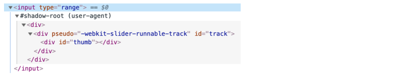

你在 `#shadow-root` 下看到的就是被称为「shadow DOM」的东西。

我们不能使用一般的 JavaScript 调用或者选择器来获取内建 shadow DOM 元素。它们不是常规的子元素，而是一个强大的封装手段。

在上面的例子中，我们可以看到一个有用的属性 `pseudo`。这是一个因为历史原因而存在的属性，并不在标准中。我们可以使用它来给子元素加上 CSS 样式，像这样：

```html
<style>
/* 让滑块轨道变红 */
input::-webkit-slider-runnable-track {
  background: red;
}
</style>

<input type="range">
```

重申一次，`pseudo` 是一个非标准的属性。按照时间顺序来说，浏览器首先实验了使用内部 DOM 结构来实现控件，然后，在一段时间之后，shadow DOM 才被标准化来让我们开发者们做类似的事。

接下来，我们将要使用现代 shadow DOM 标准，它在 [DOM spec](https://dom.spec.whatwg.org/#shadow-trees) 和其他相关标准中可以被找到。

##### [Shadow tree](https://zh.javascript.info/shadow-dom#shadowtree)

一个 DOM 元素可以有以下两类 DOM 子树：

1. Light tree（光明树） —— 一个轻型（light）DOM 子树，由 HTML 子元素组成。我们在之前章节看到的所有子树都是「光明的」。
2. Shadow tree（影子树） —— 一个隐藏的 DOM 子树，不在 HTML 中反映，无法被察觉。

如果一个元素同时有以上两种子树，那么浏览器只渲染 shadow tree。但是我们同样可以设置两种树的组合。我们将会在后面的章节 [Shadow DOM slots, composition](https://zh.javascript.info/slots-composition) 中看到更多细节。

影子树可以在自定义元素中被使用，其作用是隐藏组件内部结构和添加只在组件内有效的样式。

比如，这个 `<show-hello>` 元素将它的内部 DOM 隐藏在了影子里面：

```html
<script>
customElements.define('show-hello', class extends HTMLElement {
  connectedCallback() {
    const shadow = this.attachShadow({mode: 'open'});
    shadow.innerHTML = `<p>
      Hello, ${this.getAttribute('name')}
    </p>`;
  }
});
</script>

<show-hello name="John"></show-hello>
```

这就是在 Chrome 开发者工具中看到的最终样子，所有的内容都在「#shadow-root」下：

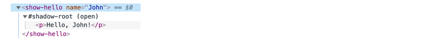

首先，调用 `elem.attachShadow({mode: …})` 可以创建一个 shadow tree。

这里有两个限制：

1. 在每个元素中，我们只能创建一个 shadow root。
2. `elem` 必须是自定义元素，或者是以下元素的其中一个：「article」、「aside」、「blockquote」、「body」、「div」、「footer」、「h1…h6」、「header」、「main」、「nav」、「p」、「section」或者「span」。其他元素，比如 ``，不能容纳 shadow tree。

`mode` 选项可以设定封装层级。他必须是以下两个值之一：

- `「open」` —— shadow root 可以通过 `elem.shadowRoot` 访问。

  任何代码都可以访问 `elem` 的 shadow tree。

- `「closed」` —— `elem.shadowRoot` 永远是 `null`。

  我们只能通过 `attachShadow` 返回的指针来访问 shadow DOM（并且可能隐藏在一个 class 中）。浏览器原生的 shadow tree，比如 `<input type="range">`，是封闭的。没有任何方法可以访问它们。

`attachShadow` 返回的 [shadow root](https://dom.spec.whatwg.org/#shadowroot)，和任何元素一样：我们可以使用 `innerHTML` 或者 DOM 方法，比如 `append` 来扩展它。

我们称有 shadow root 的元素叫做「shadow tree host」，可以通过 shadow root 的 `host` 属性访问：

```javascript
// 假设 {mode: "open"}，否则 elem.shadowRoot 是 null
alert(elem.shadowRoot.host === elem); // true
```

##### [封装](https://zh.javascript.info/shadow-dom#feng-zhuang)

Shadow DOM 被非常明显地和主文档分开：

1. Shadow DOM 元素对于 light DOM 中的 `querySelector` 不可见。实际上，Shadow DOM 中的元素可能与 light DOM 中某些元素的 id 冲突。这些元素必须在 shadow tree 中独一无二。
2. Shadow DOM 有自己的样式。外部样式规则在 shadow DOM 中不产生作用。

比如：

```html
<style>
  /* 文档样式对 #elem 内的 shadow tree 无作用 (1) */
  p { color: red; }
</style>

<div id="elem"></div>

<script>
  elem.attachShadow({mode: 'open'});
    // shadow tree 有自己的样式 (2)
  elem.shadowRoot.innerHTML = `
    <style> p { font-weight: bold; } </style>
    <p>Hello, John!</p>
  `;

  // <p> 只对 shadow tree 里面的查询可见 (3)
  alert(document.querySelectorAll('p').length); // 0
  alert(elem.shadowRoot.querySelectorAll('p').length); // 1
</script>
```

1. 文档里面的样式对 shadow tree 没有任何效果。
2. ……但是内部的样式是有效的。
3. 为了获取 shadow tree 内部的元素，我们可以从树的内部查询。

##### [参考](https://zh.javascript.info/shadow-dom#can-kao)

- DOM：https://dom.spec.whatwg.org/#shadow-trees
- 兼容性：https://caniuse.com/#feat=shadowdomv1
- Shadow DOM 在很多其他标准中被提到，比如：[DOM Parsing](https://w3c.github.io/DOM-Parsing/#the-innerhtml-mixin) 指定了 shadow root 有 `innerHTML`。

##### [总结](https://zh.javascript.info/shadow-dom#zong-jie)

Shadow DOM 是创建组件级别 DOM 的一种方法。

1. `shadowRoot = elem.attachShadow({mode: open|closed})` —— 为 `elem` 创建 shadow DOM。如果 `mode="open"`，那么它通过 `elem.shadowRoot` 属性被访问。
2. 我们可以使用 `innerHTML` 或者其他 DOM 方法来扩展 `shadowRoot`。

Shadow DOM 元素：

- 有自己的 id 空间。
- 对主文档的 JavaScript 选择器隐身，比如 `querySelector`。
- 只使用 shadow tree 内部的样式，不使用主文档的样式。

Shadow DOM，如果存在的话，会被浏览器渲染而不是所谓的 「light DOM」（普通子元素）。在 [Shadow DOM slots, composition](https://zh.javascript.info/slots-composition) 章节中我们将会看到如何组织它们。

#### 6.4模板元素

内置的`<template>`元素用作HTML标记模板的存储。 浏览器将忽略它的内容，仅检查语法的有效性，但是我们可以在JavaScript中访问和使用它来创建其他元素。

从理论上讲，我们可以在HTML中的某个位置创建任何不可见元素，以用于HTML标记存储。 `<template>`有什么特别之处？

首先，其内容可以是任何有效的HTML，即使它通常需要适当的封闭标签也是如此。

例如，我们可以在其中放置表格行`<tr>`：

```html
<template>
  <tr>
    <td>Contents</td>
  </tr>
</template>
```

通常，如果我们尝试将`<tr>`放入例如`<div>`的内部，浏览器将检测到无效的DOM结构并将其“修复”，并在其周围添加`<table>`。 那不是我们想要的。 另一方面，`<template>`完全保留我们在此处放置的内容。

我们也可以将样式和脚本放入`<template>`中：

```html
<template>
  <style>
    p { font-weight: bold; }
  </style>
  <script>
    alert("Hello");
  </script>
</template>
```

浏览器认为`<template>`内容是“文档之外”：未应用样式，未执行脚本，未运行`<video autoplay>`等。

当我们将内容插入文档时，该内容变为活动状态（应用样式，运行脚本等）。

##### [插入模板](https://zh.javascript.info/template-element#insertingtemplate)

模板内容可在其`content`属性中以[DocumentFragment](https://zh.javascript.info/modifying-document#document-fragment)的形式获得–一种特殊的DOM节点类型。

我们可以将其视为任何其他DOM节点，除了一个特殊属性：将其插入某个位置时，将插入其子级。

例如：

```html
<template id="tmpl">
  <script>
    alert("Hello");
  </script>
  <div class="message">Hello, world!</div>
</template>

<script>
  let elem = document.createElement('div');

  // 克隆模板内容以多次重复使用
  elem.append(tmpl.content.cloneNode(true));

  document.body.append(elem);
  // Now the script from <template> runs
  现在，<template>中的脚本运行了
</script>
```

让我们使用`<template>`重写上一章的Shadow DOM示例：

```html
<template id="tmpl">
  <style> p { font-weight: bold; } </style>
  <p id="message"></p>
</template>

<div id="elem">Click me</div>

<script>
  elem.onclick = function() {
    elem.attachShadow({mode: 'open'});

    elem.shadowRoot.append(tmpl.content.cloneNode(true)); // (*)

    elem.shadowRoot.getElementById('message').innerHTML = "Hello from the shadows!";
  };
</script>
```

当我们克隆并插入`tmpl.content`时，在`（*）`行中将其子级（`<style>`，`<p>`）作为其`DocumentFragment`插入。

它们形成影子DOM：

```html
<div id="elem">
  #shadow-root
    <style> p { font-weight: bold; } </style>
    <p id="message"></p>
</div>
```

##### [总结](https://zh.javascript.info/template-element#summary)

总结一下：

- `<template>`内容可以是任何语法正确的HTML。
- `<template>` 内容被认为是“文档之外”，因此它不会影响任何内容。
- 我们可以从JavaScript访问`template.content`，将其克隆以在新组件中重复使用。

 ` <template>`标签非常独特，因为：

- 浏览器检查其中的HTML语法（与在脚本中使用模板字符串相对）。
- …但仍然允许使用任何顶级HTML标记，即使没有适当的包装程序（例如`<tr>`）也没有意义的HTML标记。
- 内容变为交互式的：插入文档后，脚本会运行，`<video autoplay>`播放等。

`<template>`元素不具有任何迭代机制，数据绑定或变量替换，但是我们可以在其之上实现这些功能。

#### 6.5Shadow DOM slots, composition

许多类型的组件（例如选项卡，菜单，图像画廊等）都需要内容才能呈现。

就像内置浏览器标签`<select>`期望`<option>`项一样，我们的`<custom-tabs>`可能期望传递实际的标签内容。 并且`<custom-menu>`可能需要菜单项。

使用`<custom-menu>`的代码如下所示：

```html
<custom-menu>
  <title>Candy menu</title>
  <item>Lollipop</item>
  <item>Fruit Toast</item>
  <item>Cup Cake</item>
</custom-menu>
```

…然后，我们的组件应正确呈现它，作为具有给定标题和项目，处理菜单事件等的漂亮菜单。

如何执行呢？

我们可以尝试分析元素内容并动态复制-重新安排DOM节点。 这是可能的，但是如果我们将元素移至阴影DOM，则文档中的CSS样式不会在其中应用，因此视觉样式可能会丢失。 还需要一些编码。

幸运的是，我们不必这样做。 Shadow DOM支持`<slot>`元素，这些元素将由light DOM中的内容自动填充。

##### [插槽命名](https://zh.javascript.info/slots-composition#namedslots)

让我们来看一个简单示例中的插槽如何工作。

在这里，`<user-card>`阴影DOM提供了两个由浅DOM填充的插槽：

```html
<script>
customElements.define('user-card', class extends HTMLElement {
  connectedCallback() {
    this.attachShadow({mode: 'open'});
    this.shadowRoot.innerHTML = `
      <div>Name:
        <slot name="username"></slot>
      </div>
      <div>Birthday:
        <slot name="birthday"></slot>
      </div>
    `;
  }
});
</script>

<user-card>
  <span slot="username">John Smith</span>
  <span slot="birthday">01.01.2001</span>
</user-card>
```

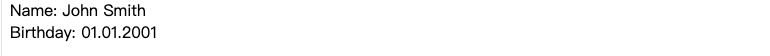

在影子DOM中，`<slot name =“ X”>`定义了一个“插入点”，即渲染具有`slot ="X" `的元素的位置。

然后，浏览器执行“合成”：从轻型（light）DOM中获取元素，并将其呈现在阴影DOM的相应插槽中。 最后，我们正是想要的-一个可以填充数据的通用组件。

这是脚本后面的DOM结构，没有考虑组成：

```html
<user-card>
  #shadow-root
    <div>Name:
      <slot name="username"></slot>
    </div>
    <div>Birthday:
      <slot name="birthday"></slot>
    </div>
  <span slot="username">John Smith</span>
  <span slot="birthday">01.01.2001</span>
</user-card>
```

这里没有什么奇怪的。 我们创建了影子DOM，就在这里。 现在，元素同时具有光和阴影DOM。

出于渲染目的，对于影子DOM中的每个`<slot name="...">`，浏览器都在轻型（light）DOM中查找具有相同名称的`slot="..."`。将这些元素呈现在插槽内：

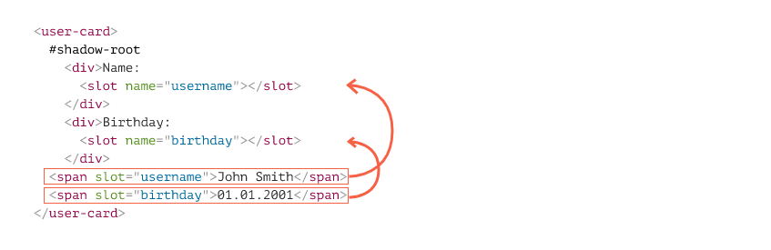

结果称为“扁平化” DOM：

```html
<user-card>
  #shadow-root
    <div>Name:
      <slot name="username">
        <!-- slotted element is inserted into the slot as a whole -->
        <span slot="username">John Smith</span>
      </slot>
    </div>
    <div>Birthday:
      <slot name="birthday">
        <span slot="birthday">01.01.2001</span>
      </slot>
    </div>
</user-card>
```

…但是“扁平化” DOM仅用于呈现和事件处理目的。 这样便可以显示事物。 节点实际上并没有移动！

如果我们运行`querySelector`，则可以很容易地检查到：节点仍然在它们原来的位置。

```javascript
// 轻型（light）DOM <span>节点仍位于`<user-card>`下的同一位置。
alert( document.querySelector('user-card span').length ); // 2
```

看起来很奇怪，但是对于带有插槽的影子DOM，我们还有一个“ DOM级别”，即“扁平化”的DOM –插槽插入的结果。 浏览器呈现它并将其用于样式继承，事件传播。 但是JavaScript在展平之前仍然按原样查看文档。

------

**仅顶级子级可以具有slot =“ ...”属性**

`slot="..."` 属性仅对影子主（在我们的示例中，`<user-card>`元素）的直接子代有效。 对于嵌套元素，它将被忽略。

例如，此处的第二个`<span>`被忽略（因为它不是`<user-card>`的顶级子级）：

```html
<user-card>
  <span slot="username">John Smith</span>
  <div>
    <!-- bad slot, not top-level: -->
    <span slot="birthday">01.01.2001</span>
  </div>
</user-card>
```

实际上，放置深层嵌套的元素没有任何意义，因此此限制只是确保正确的DOM结构。

##### [Slot后备内容](https://zh.javascript.info/slots-composition#slotfallbackcontent)

如果将某些内容放入`<slot>`内，它将成为后备内容。 如果轻型（light）DOM中没有相应的填充符，浏览器会显示出来。

例如，在这片影子DOM中，如果轻型（light）DOM中没有`slot="username" `，则`Anonymous`呈现。

```html
<div>Name:
  <slot name="username">Anonymous</slot>
</div>
```

##### [Default slot](https://zh.javascript.info/slots-composition#defaultslot)

影子DOM中第一个没有名称的`<slot>`是“默认”插槽。 它从轻型（light）DOM中获取所有未放置在其他位置的节点。

例如，让我们将默认位置添加到我们的`<user-card>`中，该位置可以收集有关该用户的所有未显示位置的信息：

```html
<script>
customElements.define('user-card', class extends HTMLElement {
  connectedCallback() {
    this.attachShadow({mode: 'open'});
    this.shadowRoot.innerHTML = `
    <div>Name:
      <slot name="username"></slot>
    </div>
    <div>Birthday:
      <slot name="birthday"></slot>
    </div>
    <fieldset>
      <legend>Other information</legend>
      <slot></slot>
    </fieldset>
    `;
  }
});
</script>

<user-card>
  <div>I like to swim.</div>
  <span slot="username">John Smith</span>
  <span slot="birthday">01.01.2001</span>
  <div>...And play volleyball too!</div>
</user-card>
```

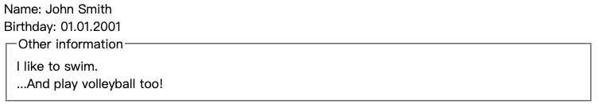

所有未插入插槽的轻型（light）DOM内容都进入“其他信息”字段集。

元素一个接一个地附加到插槽中，因此这两个未插入插槽的信息都一起位于默认插槽中。

扁平化的DOM如下所示：

```html
<user-card>
  #shadow-root
    <div>Name:
      <slot name="username">
        <span slot="username">John Smith</span>
      </slot>
    </div>
    <div>Birthday:
      <slot name="birthday">
        <span slot="birthday">01.01.2001</span>
      </slot>
    </div>
    <fieldset>
      <legend>Other information</legend>
      <slot>
        <div>Hello</div>
        <div>I am John!</div>
      </slot>
    </fieldset>
</user-card>
```

##### [Menu example](https://zh.javascript.info/slots-composition#menuexample)

现在，回到本章开头提到的`<custom-menu>`。

我们可以使用插槽来分配元素。

这是`<custom-menu>`的标记：

```html
<custom-menu>
  <span slot="title">Candy menu</span>
  <li slot="item">Lollipop</li>
  <li slot="item">Fruit Toast</li>
  <li slot="item">Cup Cake</li>
</custom-menu>
```

具有适当插槽的影子DOM模板：

```html
<template id="tmpl">
  <style> /* menu styles */ </style>
  <div class="menu">
    <slot name="title"></slot>
    <ul><slot name="item"></slot></ul>
  </div>
</template>
```

1. `<span slot="title">`进入`<slot name="title">`。
2. 模板中有许多`<li slot="item">`，但模板中只有一个`<slot name="item">`。 这完全OJBK。所有具有`slot="item"`的元素都一个接一个地附加到`<slot name="item">`。

扁平化的DOM变为：

```html
<custom-menu>
  #shadow-root
    <style> /* menu styles */ </style>
    <div class="menu">
      <slot name="title">
        <span slot="title">Candy menu</span>
      </slot>
      <ul>
        <slot name="item">
          <li slot="item">Lollipop</li>
          <li slot="item">Fruit Toast</li>
          <li slot="item">Cup Cake</li>
        </slot>
      </ul>
    </div>
</custom-menu>
```

可能会注意到，在有效的DOM中，`<li>`必须是`<ul>`的直接子代。 但这是扁平化的DOM，它描述了组件的呈现方式，这种情况在此处自然发生。

我们只需要添加一个单击处理程序即可打开/关闭列表，并且`<custom-menu>`已准备就绪：

```javascript
customElements.define('custom-menu', class extends HTMLElement {
  connectedCallback() {
    this.attachShadow({mode: 'open'});

    // tmpl是影子DOM模板(如上)
    this.shadowRoot.append( tmpl.content.cloneNode(true) );

    // 我们无法选择轻型（light）DOM节点，因此让我们来处理插槽上的点击
    this.shadowRoot.querySelector('slot[name="title"]').onclick = () => {
      // 打开/关闭菜单
      this.shadowRoot.querySelector('.menu').classList.toggle('closed');
    };
  }
});
```

这是完整的DEMO：

```html
<!doctype html>
<template id="tmpl">
  <style>
  ul {
    margin: 0;
    list-style: none;
    padding-left: 20px;
  }

  ::slotted([slot="title"]) {
    font-size: 18px;
    font-weight: bold;
    cursor: pointer;
  }

  ::slotted([slot="title"])::before {
    content: '📂';
    font-size: 14px;
  }

  .closed ::slotted([slot="title"])::before {
    content: '📁';
  }

  .closed ul {
    display: none;
  }
  </style>

  <div class="menu">
    <slot name="title"></slot>
    <ul><slot name="item"></slot></ul>
  </div>
</template>

<script>
customElements.define('custom-menu', class extends HTMLElement {
  connectedCallback() {
    this.attachShadow({mode: 'open'});
    this.shadowRoot.append( tmpl.content.cloneNode(true) );

    this.shadowRoot.querySelector('slot[name="title"]').onclick = () => {
      this.shadowRoot.querySelector('.menu').classList.toggle('closed');
    };
  }
});
</script>

<custom-menu>
  <span slot="title">Candy menu</span>
  <li slot="item">Lollipop</li>
  <li slot="item">Fruit Toast</li>
  <li slot="item">Cup Cake</li>
</custom-menu>
```

当然，我们可以为其添加更多功能：事件，方法等。

##### [监视slots](https://zh.javascript.info/slots-composition#monitoringslots)

如果外部代码想动态添加/删除菜单项怎么办？

**如果添加/删除了插槽元素，则浏览器将监视插槽并更新渲染。**

另外，由于不复制轻型（light）DOM节点，而只是在插槽中进行渲染，因此它们内部的更改立即变为可见。

因此，我们无需执行任何操作即可更新渲染。 但是，如果组件想了解插槽更改，则可以使用`slotchange`事件。

例如，此处菜单项在1秒后被动态插入，并且标题在2秒后发生变化：

```html
<custom-menu id="menu">
  <span slot="title">Candy menu</span>
</custom-menu>

<script>
customElements.define('custom-menu', class extends HTMLElement {
  connectedCallback() {
    this.attachShadow({mode: 'open'});
    this.shadowRoot.innerHTML = `<div class="menu">
      <slot name="title"></slot>
      <ul><slot name="item"></slot></ul>
    </div>`;

    // shadowRoot can't have event handlers, so using the first child
    this.shadowRoot.firstElementChild.addEventListener('slotchange',
      e => alert("slotchange: " + e.target.name)
    );
  }
});

setTimeout(() => {
  menu.insertAdjacentHTML('beforeEnd', '<li slot="item">Lollipop</li>')
}, 1000);

setTimeout(() => {
  menu.querySelector('[slot="title"]').innerHTML = "New menu";
}, 2000);
</script>
```

菜单渲染每次都会更新，而无需我们干预。

这里有两个`slotchange`事件：

1. 在初始化时

   `slotchange: title`立刻触发，当来自轻型（light）DOM的`slot="title"`插入时。

2. 在1秒后：

   `slotchange: item` 触发, 当添加了一个新的`<li slot="item">`。

请注意：修改`slot="title"`的内容后2秒钟内不会发生`slotchange`事件。 那是因为没有更改插槽。 我们修改了插槽元素内的内容，这是另一回事。

如果我们想通过JavaScript跟踪轻型（light）DOM的内部修改，也可以使用更通用的机制来实现： [MutationObserver](https://zh.javascript.info/mutation-observer).

##### [Slot API](https://zh.javascript.info/slots-composition#slotapi)

最后，我们来谈谈与插槽相关的JavaScript方法。

正如我们之前所见，JavaScript会查看“真实的” DOM，而不会扁平。 但是，如果影子树具有`{mode：'open'}`，那么我们可以找出哪个元素分配给了一个插槽，反之亦然，通过其中的元素确定了该插槽：

- `node.assignedSlot` – 返回分配给节点的`<slot>`元素。
- `slot.assignedNodes({flatten: true/false})` – 返回分配给插槽的DOM节点。 默认情况下，`flatten`选项为`false`。 如果显式设置为`true`，则它将更深入地研究扁平化的DOM，如果嵌套了组件，则返回嵌套的插槽；如果未分配节点，则返回备用内容。
- `slot.assignedElements({flatten: true/false})` – 返回分配给插槽的DOM元素（与上面相同，但仅元素节点）。

当我们不仅需要显示已插入内容的内容，还需要在JavaScript中对其进行跟踪时，这些方法很有用。

例如，如果`<custom-menu>`组件想知道它所显示的内容，则它可以跟踪`slotchange`并从`slot.assignedElements`获取项目：

```html
<custom-menu id="menu">
  <span slot="title">Candy menu</span>
  <li slot="item">Lollipop</li>
  <li slot="item">Fruit Toast</li>
</custom-menu>

<script>
customElements.define('custom-menu', class extends HTMLElement {
  items = []

  connectedCallback() {
    this.attachShadow({mode: 'open'});
    this.shadowRoot.innerHTML = `<div class="menu">
      <slot name="title"></slot>
      <ul><slot name="item"></slot></ul>
    </div>`;

    // slottable is added/removed/replaced
    this.shadowRoot.firstElementChild.addEventListener('slotchange', e => {
      let slot = e.target;
      if (slot.name == 'item') {
        this.items = slot.assignedElements().map(elem => elem.textContent);
        alert("Items: " + this.items);
      }
    });
  }
});

// items update after 1 second
setTimeout(() => {
  menu.insertAdjacentHTML('beforeEnd', '<li slot="item">Cup Cake</li>')
}, 1000);
</script>
```

##### [总结](https://zh.javascript.info/slots-composition#summary)

插槽允许在阴影DOM中显示轻型（light）DOM子级。

插槽有两种：

- 命名插槽：`<slot name="X">...</slot>` – 获取带有`slot="X"`的常规子级。
- Default slot: 第一个没有名称的`<slot>`（随后的未命名插槽将被忽略）–获得未插槽的常规子级。
- 如果同一插槽中有许多元素，则将它们一个接一个地附加。
- `<slot>`元素的内容用作后备。 显示该插槽是否没有常规子级。

在插槽内渲染开槽元素的过程称为“合成”。 结果称为“扁平化DOM”。

合成并不会真正移动节点，从JavaScript的角度来看，DOM仍然相同。

JavaScript可以使用以下方法访问插槽：

- `slot.assignedNodes/Elements()` – 返回`slot`内的节点/元素。
- `node.assignedSlot` – 相反的方法，返回一个节点的插槽。

如果我们想知道显示的内容，可以使用以下方法跟踪插槽内容：

- `slotchange` 事件 – 在插槽第一次填充时触发，并且在插槽元素的任何添加/删除/替换操作（而不是其子元素）上触发。 插槽是`event.target`。
- [MutationObserver](https://zh.javascript.info/mutation-observer) 可以更深入地了解插槽内容，观察其中的变化。

现在，在阴影DOM中有来自轻型（light）DOM的元素时，让我们看看如何正确设置样式。 基本规则是阴影元素在内部设置样式，灯常规元素在外部设置样式，但是有一些例外。

我们将在下一章中查看详细信息。

#### 6.6Shadow DOM styling

Shadow DOM可能同时包含`<style>`和`<link rel="stylesheet" href="…">`标签。 在后一种情况下，样式表是HTTP缓存的，因此不会重新下载它们。 @import或链接许多组件的相同样式没有任何开销。

通常，局部样式仅在阴影树内部起作用，而文档样式在阴影树外部起作用。 但是很少有例外。

##### [:host](https://zh.javascript.info/shadow-dom-style#host)

`:host`选择器允许选择shadow host（包含影子树的元素）。

例如，我们正在制作应居中的`<custom-dialog>`元素。 为此，我们需要设置`<custom-dialog>`元素本身的样式。

这正是`:host`的作用：

```html
<template id="tmpl">
  <style>
    /* the style will be applied from inside to the custom-dialog element */
    :host {
      position: fixed;
      left: 50%;
      top: 50%;
      transform: translate(-50%, -50%);
      display: inline-block;
      border: 1px solid red;
      padding: 10px;
    }
  </style>
  <slot></slot>
</template>

<script>
customElements.define('custom-dialog', class extends HTMLElement {
  connectedCallback() {
    this.attachShadow({mode: 'open'}).append(tmpl.content.cloneNode(true));
  }
});
</script>

<custom-dialog>
  Hello!
</custom-dialog>
```

##### [Cascading（级联）](https://zh.javascript.info/shadow-dom-style#cascading)

shadow host （`<custom-dialog>`本身）位于轻型（light）DOM中，因此受主要CSS级联的影响。

如果在`:host`本地和文档中都有样式化的属性，则文档样式优先。

例如，如果在文档中我们有：

```css
<style>
custom-dialog {
  padding: 0;
}
</style>
```

…然后`<custom-dialog>`将没有填充。

这非常方便，因为我们可以在component`:host`规则中设置“默认”样式，然后在文档中轻松覆盖它们。

例外是当本地属性标记为`!important`时，对于此类属性，本地样式优先。

##### [:host(selector)](https://zh.javascript.info/shadow-dom-style#hostselector)

与`:host`相同，但仅在shadow host 与`selector`匹配时才应用。

例如，仅当`<custom-dialog>`具有`centered`属性时，我们才想居中：

```html
<template id="tmpl">
  <style>
    :host([centered]) {
      position: fixed;
      left: 50%;
      top: 50%;
      transform: translate(-50%, -50%);
    }

    :host {
      display: inline-block;
      border: 1px solid red;
      padding: 10px;
    }
  </style>
  <slot></slot>
</template>

<script>
customElements.define('custom-dialog', class extends HTMLElement {
  connectedCallback() {
    this.attachShadow({mode: 'open'}).append(tmpl.content.cloneNode(true));
  }
});
</script>


<custom-dialog centered>
  Centered!
</custom-dialog>

<custom-dialog>
  Not centered.
</custom-dialog>
```

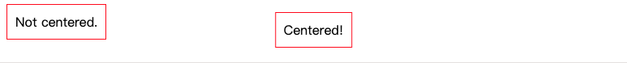

现在，附加的居中样式仅应用于第一个对话框`<custom-dialog centered>`。

##### [:host-context(selector)](https://zh.javascript.info/shadow-dom-style#hostcontextselector)

与`:host`相同，仅在shadow host或其外部文档中的任何祖先与`selector`匹配时才应用。

例如。`:host-context(.dark-theme)`仅在其上方的`<custom-dialog>`上有`dark-theme`类时才匹配：

```html
<body class="dark-theme">
  <!--
    :host-context(.dark-theme) applies to custom-dialogs inside .dark-theme
  -->
  <custom-dialog>...</custom-dialog>
</body>
```

总而言之，我们可以根据上下文使用`:host` - 选择器系列来设置组件主要元素的样式。 这些样式（除非`!important`）可以被文档覆盖。

##### [Styling slotted content（样式化槽位内容）](https://zh.javascript.info/shadow-dom-style#stylingslottedcontent)

现在让我们考虑插槽的情况。

插槽元素来自轻型（light）DOM，因此它们使用文档样式。 本地样式不会影响插槽内容。

在下面的示例中，根据文档样式，带槽的`<span>`为粗体，但不使用局部样式的背景：

```html
<style>
  span { font-weight: bold }
</style>

<user-card>
  <div slot="username"><span>John Smith</span></div>
</user-card>

<script>
customElements.define('user-card', class extends HTMLElement {
  connectedCallback() {
    this.attachShadow({mode: 'open'});
    this.shadowRoot.innerHTML = `
      <style>
      span { background: red; }
      </style>
      Name: <slot name="username"></slot>
    `;
  }
});
</script>
```

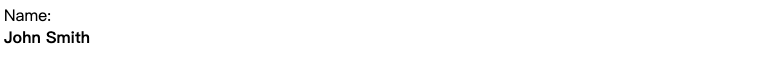

结果为粗体，但不是红色。

如果我们想在组件中设置插槽元素的样式，则有两种选择。

首先，我们可以自己设置`<slot>`的样式，并依靠CSS继承：

```html
<user-card>
  <div slot="username"><span>John Smith</span></div>
</user-card>

<script>
customElements.define('user-card', class extends HTMLElement {
  connectedCallback() {
    this.attachShadow({mode: 'open'});
    this.shadowRoot.innerHTML = `
      <style>
      slot[name="username"] { font-weight: bold; } // 使用继承策略
      </style>
      Name: <slot name="username"></slot>
    `;
  }
});
</script>
```

在这里`<p> John Smith </ p>`变为粗体，因为`<slot>`及其内容之间的CSS继承有效。 但是，并非所有CSS属性都是继承的。

另一种选择是使用`::slotted(selector)`伪类。 它根据两个条件匹配元素：

1. 插入到`<slot>`中的轻型（light）DOM中的元素。然后插槽的名字就无所谓了。 只是任何带槽元素，但只有元素本身，而不是其子元素。
2. 元素与 `selector`匹配。

```html
<user-card>
  <div slot="username">
    <div>John Smith</div>
  </div>
</user-card>

<script>
customElements.define('user-card', class extends HTMLElement {
  connectedCallback() {
    this.attachShadow({mode: 'open'});
    this.shadowRoot.innerHTML = `
      <style>
      ::slotted(div) { border: 1px solid red; }
      </style>
      Name: <slot name="username"></slot>
    `;
  }
});
</script>
```

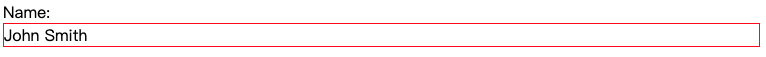

请注意，`::slotted`选择器不能向插槽后代传播。 这些选择器无效：

```css
::slotted(div span) {
  /* our slotted <div> does not match this */
}

::slotted(div) p {
  /* can't go inside light DOM */
}
```

另外，`::slotted`仅可在CSS中使用。 我们无法在`querySelector`中使用它。

##### [具有自定义属性的CSS钩子](https://zh.javascript.info/shadow-dom-style#csshookswithcustomproperties)

我们如何从主文档中深入设计组件的样式？

自然，文档样式适用于`<custom-dialog>`元素或`<user-card>`等。但是，我们如何影响其内部？ 例如，在`<user-card>`中，我们希望允许外部文档更改用户字段的外观。

正如我们公开与组件交互的方法一样，我们也可以公开CSS变量（自定义CSS属性）来设置其样式。

**自定义CSS属性存在于所有级别，包括明暗两种。**

例如，在阴影DOM中，我们可以使用`--user-card-field-color` CSS变量来设置字段样式：

```html
<style>
  .field {
    color: var(--user-card-field-color, black);
    /* if --user-card-field-color is not defined, use black */
  }
</style>
<div class="field">Name: <slot name="username"></slot></div>
<div class="field">Birthday: <slot name="birthday"></slot></div>
</style>
```

然后，我们可以在外部文档中为`<user-card>`声明此属性：

```css
user-card {
  --user-card-field-color: green;
}
```

自定义CSS属性贯穿阴影DOM，它们在任何地方都可见，因此内部`.field`规则将使用它。

这是完整的示例：

```html
<style>
  user-card {
    --user-card-field-color: green;
  }
</style>

<template id="tmpl">
  <style>
    .field {
      color: var(--user-card-field-color, black);
    }
  </style>
  <div class="field">Name: <slot name="username"></slot></div>
  <div class="field">Birthday: <slot name="birthday"></slot></div>
</template>

<script>
customElements.define('user-card', class extends HTMLElement {
  connectedCallback() {
    this.attachShadow({mode: 'open'});
    this.shadowRoot.append(document.getElementById('tmpl').content.cloneNode(true));
  }
});
</script>

<user-card>
  <span slot="username">John Smith</span>
  <span slot="birthday">01.01.2001</span>
</user-card>
```

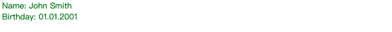

##### [总结](https://zh.javascript.info/shadow-dom-style#summary)

Shadow DOM可以包含样式，例如`<style>`或`<link rel =“ stylesheet”>`。

本地样式可能会影响：

- shadow tree，
- shadow host with `:host`- 家族伪类，
- slotted elements (coming from light DOM), `::slotted(selector)` 允许自己选择插槽元素，但不能选择其子元素。

文档样式可能会影响：

- shadow host （如外部文档中所示）
- slotted elements and their contents （因为它实际上在外部文档中）

当CSS属性发生冲突时，通常文档样式优先，除非将该属性标记为`!important`。 然后，本地样式具有优先权。

CSS自定义属性贯穿阴影DOM。 它们用作对组件进行样式设置的“挂钩”：

1. 该组件使用自定义CSS属性来设置关键元素的样式，例如`var（-component-name-title，<default value>）`。
2. 组件作者将这些属性发布给开发人员，它们与其他公共组件方法一样重要。
3. 当开发人员想要设置标题样式时，他们为影子主机或更高版本的主机分配`--component-name-title` CSS属性。
4. Profit!!!!!!!!

#### 6.7Shadow DOM 和事件（events）

Shadow tree 背后的思想是封装组件的内部实现细节。

假设，在 `<user-card>` 组件的 shadow DOM 内触发一个点击事件。但是主文档内部的脚本并不了解 shadow DOM 内部，尤其是当组件来自于第三方库。

所以，为了保持细节简单，浏览器会*重新定位（retargets）*事件。

**当事件在组件外部捕获时，shadow DOM 中发生的事件将会以 host 元素作为目标。**

这里有个简单的例子：

```html
<user-card></user-card>

<script>
customElements.define('user-card', class extends HTMLElement {
  connectedCallback() {
    this.attachShadow({mode: 'open'});
    this.shadowRoot.innerHTML = `<p>
      <button>Click me</button>
    </p>`;
    this.shadowRoot.firstElementChild.onclick =
      e => alert("Inner target: " + e.target.tagName);
  }
});

document.onclick =
  e => alert("Outer target: " + e.target.tagName);
</script>
```

如果你点击了 button，就会出现以下信息：

1. Inner target: `BUTTON` —— 内部事件处理程序获取了正确的目标，即 shadow DOM 中的元素。
2. Outer target: `USER-CARD` —— 文档事件处理程序以 shadow host 作为目标。

事件重定向是一件很棒的事情，因为外部文档并不需要知道组件的内部情况。从它的角度来看，事件是发生在 `<user-card>`。

**如果事件发生在 slotted 元素上，实际存在于轻型（light）DOM 上，则不会发生重定向。**

例如，在下面的例子中，如果用户点击了 `<span slot="username">`，那么对于 shadow 和 light 处理程序来说，**事件目标就是当前这个 `span` 元素**。

```html
<user-card id="userCard">
  <span slot="username">John Smith</span>
</user-card>

<script>
customElements.define('user-card', class extends HTMLElement {
  connectedCallback() {
    this.attachShadow({mode: 'open'});
    this.shadowRoot.innerHTML = `<div>
      <b>Name:</b> <slot name="username"></slot>
    </div>`;

    this.shadowRoot.firstElementChild.onclick =
      e => alert("Inner target: " + e.target.tagName);
  }
});

userCard.onclick = e => alert(`Outer target: ${e.target.tagName}`);
</script>
```

如果单击事件发生在 `"John Smith"` 上，则对于内部和外部处理程序来说，其目标是 `<span slot="username">`。这是 light DOM 中的元素，所以没有重定向。

另一方面，如果单击事件发生在源自 shadow DOM 的元素上，例如，在 `<b>Name</b>` 上，然后当它冒泡出 shadow DOM 后，其 `event.target` 将重置为 `<user-card>`。

##### [冒泡（bubbling）, event.composedPath()](https://zh.javascript.info/shadow-dom-events#mao-pao-bubblingeventcomposedpath)

出于事件冒泡的目的，使用扁平 DOM（flattened DOM）。

所以，如果我们有一个 slot 元素，并且事件发生在它的内部某个地方，那么它就会冒泡到 `<slot>` 并继续向上。

使用 `event.composedPath()` 获得原始事件目标的完整路径以及所有 shadow 元素。正如我们从方法名称中看到的那样，该路径是在组合（composition）之后获取的。

在上面的例子中，扁平 DOM 是：

```html
<user-card id="userCard">
  #shadow-root
    <div>
      <b>Name:</b>
      <slot name="username">
        <span slot="username">John Smith</span>
      </slot>
    </div>
</user-card>
```

因此，对于 `<span slot="username">` 上的点击事件，会调用 `event.composedPath()` 并返回一个数组：[`span`, `slot`, `div`, `shadow-root`, `user-card`, `body`, `html`, `document`, `window`]。在组合之后，这正是扁平 DOM 中目标元素的父链。

------

**Shadow 树详细信息仅提供给 `{mode:'open'}` 树**

如果 shadow 树是用 `{mode: 'closed'}` 创建的，那么组合路径就从 host 开始：`user-card` 及其更上层。

这与使用 shadow DOM 的其他方法的原理类似。closed 树内部是完全隐藏的。

##### [event.composed](https://zh.javascript.info/shadow-dom-events#eventcomposed)

大多数事件能成功冒泡到 shadow DOM 边界。很少有事件不能冒泡到 shadow DOM 边界。

这由 `composed` 事件对象属性控制。如果 `composed` 是 `true`，那么事件就能穿过边界。否则它仅能在 shadow DOM 内部捕获。

如果你浏览一下 [UI 事件规范](https://www.w3.org/TR/uievents) 就知道，大部分事件都是 `composed: true`：

- `blur`，`focus`，`focusin`，`focusout`，
- `click`，`dblclick`，
- `mousedown`，`mouseup` `mousemove`，`mouseout`，`mouseover`，
- `wheel`，
- `beforeinput`，`input`，`keydown`，`keyup`。

所有触摸事件（touch events）及指针事件（pointer events）都是 `composed: true`。

但也有些事件是 `composed: false` 的：

- `mouseenter`，`mouseleave`（它们根本不会冒泡），
- `load`，`unload`，`abort`，`error`，
- `select`，
- `slotchange`。

这些事件仅能在事件目标所在的同一 DOM 中的元素上捕获，

##### [自定义事件（Custom events）](https://zh.javascript.info/shadow-dom-events#zi-ding-yi-shi-jian-customevents)

当我们发送（dispatch）自定义事件，我们需要设置 `bubbles` 和 `composed` 属性都为 `true` 以使其冒泡并从组件中冒泡出来。

例如，我们在 `div#outer` shadow DOM 内部创建 `div#inner` 并在其上触发两个事件。只有 `composed: true` 的那个自定义事件才会让该事件本身冒泡到文档外面：

```html
<div id="outer"></div>

<script>
outer.attachShadow({mode: 'open'});

let inner = document.createElement('div');
outer.shadowRoot.append(inner);

/*
div(id=outer)
  #shadow-dom
    div(id=inner)
*/

document.addEventListener('test', event => alert(event.detail));

inner.dispatchEvent(new CustomEvent('test', {
  bubbles: true,
  composed: true,
  detail: "composed"
}));

inner.dispatchEvent(new CustomEvent('test', {
  bubbles: true,
  composed: false,
  detail: "not composed"
}));
</script>
```

##### [总结](https://zh.javascript.info/shadow-dom-events#zong-jie)

事件仅仅是在它们的 `composed` 标志设置为 `true` 的时候才能通过 shadow DOM 边界。

内建事件大部分都是 `composed: true` 的，正如相关规范所描述的那样：

- UI 事件 https://www.w3.org/TR/uievents。
- Touch 事件 https://w3c.github.io/touch-events。
- Pointer 事件 https://www.w3.org/TR/pointerevents。
- ……等等。

也有些内建事件它们是 `composed: false` 的：

- `mouseenter`，`mouseleave`（也不冒泡），
- `load`，`unload`，`abort`，`error`，
- `select`，
- `slotchange`。

这些事件仅能在同一 DOM 中的元素上捕获。

如果我们发送一个 `CustomEvent`，那么我们应该显示设置 `composed: true`。

请注意，如果是嵌套组件，一个 shadow DOM 可能嵌套到另外一个 shadow DOM 中。在这种情况下合成事件冒泡到所有 shadow DOM 边界。因此，如果一个事件仅用于直接封闭组件，我们也可以在 shadow host 上发送它并设置 `composed: false`。这样它就不在组件 shadow DOM 中，也不会冒泡到更高级别的 DOM。

