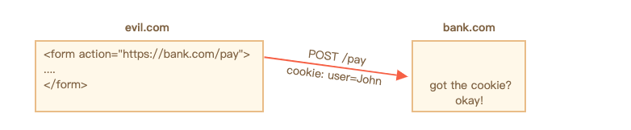
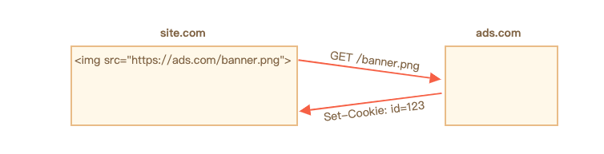
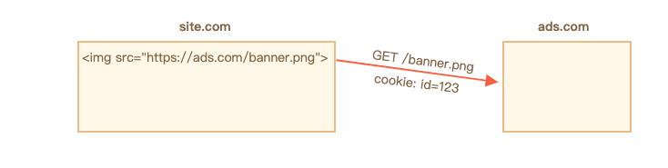
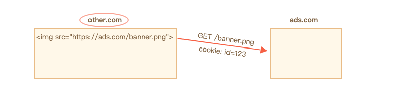
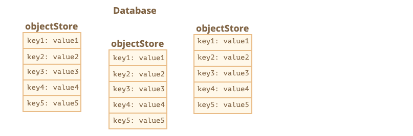
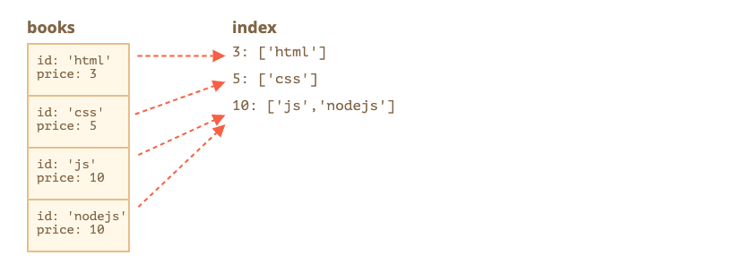

# 现代javascript教程

## 第3部分：其他文章

### 第四章、Storing data in the browser

#### 4.1Cookies, document.cookie

cookies 是直接保存在浏览器上的小数据串。它们是 HTTP 协议的一部分，由 [RFC 6265](https://tools.ietf.org/html/rfc6265) 规范定义。

大多数情况下，cookies 是由 web 服务器设置的。然后它们会自动添加到相同域名下的每次请求中。

最常见的用处之一是身份验证：

1. 登录后，服务端通过 `Set-Cookie` 在响应的 HTTP-header 中设置了一个带有 “会话标识符” 的 cookie。
2. 下次如果相同域名发起了请求，浏览器会发送带有 `Cookie` 的 HTTP-header。
3. 所以服务端知道是谁发起了请求。

我们还可以使用 `document.cookie` 属性在浏览器上访问 cookies。

有关 cookies 和它们的选项有很多棘手的事情。在本章节中，我们将会详细介绍。

##### [从 document.cookie 中读取](https://zh.javascript.info/cookie#cong-documentcookie-zhong-du-qu)

你在这个网站上有 cookies 吗？让我们来看看：

```javascript
// 在 javascript.info，我们使用谷歌分析来统计，
// 所以应该存在一些 cookies
alert( document.cookie ); // cookie1=value1; cookie2=value2;...
```

`document.cookie` 的值由一个个 `name=value` 组成，以 `;` 相隔。每一个都是独立的 cookie。

为了找到一个特定的 cookie，我们可以通过 `;` 截取 `document.cookie`，然后找到合适的名字。我们可以使用正则表达式或者数组的方法来实现。

我们把这个留给读者当作练习。此外，在本章节的结尾，你可以找到一些操作 cookies 的辅助函数。

##### [写入 document.cookie](https://zh.javascript.info/cookie#xie-ru-documentcookie)

我们可以写入 `document.cookie`。但是这不是一个数据属性，它是一个访问者（getter/setter）。赋值操作会被特殊处理。

**浏览器的 `document.cookie` 写入操作只会更新已存在的 cookies，而不会影响其他 cookies。**

例如，这里设置了一个名称为 `user` 和值为 `John` 的 cookie：

```javascript
document.cookie = "user=John"; // 只会更新名称为 user 的 cookie
alert(document.cookie); // 展示所有 cookies
```

如果你运行了代码，你很可能会看到多个 cookies。这是因为 `document.cookie=` 操作不是重写整个 cookies。它只设置代码中提到的 cookie `user`。

从技术层面看，cookie 的名称和值能是任何字符，为了保持格式有效，它们应该使用 `encodeURIComponent` 内置方法来编码一下：

```javascript
// 特殊字符（空白符），需要编码
let name = "my name";
let value = "John Smith"

// 编码后变成 my%20name=John%20Smith
document.cookie = encodeURIComponent(name) + '=' + encodeURIComponent(value);

alert(document.cookie); // ...; my%20name=John%20Smith
```

------

**局限性**

存在一些局限性：

- `encodeURIComponent` 编码后的 `name=value` 对，大小不能超过 4kb。所以我们不能在一个 cookie 中保存大数据。
- 每个域名下所有 cookies 的总数限制在 20 几个，实际的限制数量取决于浏览器。

------

cookies 有好几个选项，很多选项都很重要并且应该设置它。

选项列在 `key=value` 后面，使用 `;` 间隔，像这样：

```javascript
document.cookie = "user=John; path=/; expires=Tue, 19 Jan 2038 03:14:07 GMT"
```

##### [path](https://zh.javascript.info/cookie#path)

- **`path=/mypath`**

可访问到 cookie 的 url 路径前缀。必须是绝对路径。默认值为当前路径。

如果一个 cookie 设置了 `path=/admin`，那么在 `/admin` 和 `/admin/something` 下都是可见的，但是在 `/home` 或 `/adminpage` 下不可见。

通常，我们设置 `path=/` 来允许网站下所有页面访问 cookie。

##### [domain](https://zh.javascript.info/cookie#domain)

- **`domain=site.com`**

可访问到 cookie 的域名。但是在实践中，存在局限性。我们不能设置任何域名。

默认情况下，cookie 只能在设置的域名下才能访问到。所以，如果 cookie 设置在 `site.com` 下，我们不能在任何其他域名下（`other.com`）访问它。

……但是棘手的是，我们在子域名下同样不能获取到 cookie（`forum.site.com`）！

```javascript
// 在 site.com
document.cookie = "user=John"

// 在 forum.site.com
alert(document.cookie); // 没有 user
```

**让 cookie 在另外一个二级域名下可以访问到是没有办法的，所以其他域名 `other.com` 将不会接收到设置在 `site.com` 的 cookie。**

这是一个安全限制，为了允许我们可以在 cookie 中保存敏感信息。

……但是如果我们想要批准像 `forum.site.com` 这样的子域名访问，这是可以做到的。我们应该明确设置 `domain` 选项为根域名：`domain=site.com`：

```javascript
// 在 site.com 中
// 使 cookie 在其任何子域名下可以访问：
document.cookie = "user=John; domain=site.com"

// 之后

// 在 forum.site.com
alert(document.cookie); // 也存在 user
```

因为历史原因，`domain=.site.com`（以点开头）也可以正常使用，最好添加点来支持老版本的浏览器。

所以，`domain` 选项允许子域名访问 cookie。

##### [expires, max-age](https://zh.javascript.info/cookie#expiresmaxage)

默认情况下，如果一个 cookie 没有设置这两个参数中的任何一个，那么在浏览器关闭后，它就会消失。此类 cookies 被称为 "session cookies”。

为了让 cookies 在浏览器关闭后仍然存在，我们可以设置 `expires` 或 `max-age` 其中一个选项。

- **`expires=Tue, 19 Jan 2038 03:14:07 GMT`**

cookie 过期日期，当到了过期时间浏览器会自动删除它。

日期必须是这种格式，GMT 时区。我们可以使用 `date.toUTCString` 方法得到。举个例子，我们可以设置 cookie 在 1 天后过期。

```javascript
// 在当前时间上加 1 天
let date = new Date(Date.now() + 86400e3);
date = date.toUTCString();
document.cookie = "user=John; expires=" + date;
```

如果我们设置 `expires` 为已经过去的时间，cookie 会被删除。

- **`max-age=3600`**

一个可以替代 `expires` 的选项，具体说明 cookie 的过期时间距离当前时间的秒数。

如果是 0 或者负数，cookie 会被删除：

```javascript
// 1 小时后 cookie 会失效
document.cookie = "user=John; max-age=3600";

// 删除 cookie (让 cookie 马上过期)
document.cookie = "user=John; max-age=0";
```

##### [secure](https://zh.javascript.info/cookie#secure)

- **`secure`**

cookie 应仅在 HTTPS 环境下传输。

**默认情况下，如果我们在 `http://site.com` 设置了 cookie，然后 cookie 在 `https://site.com` 中也会出现，反之亦然。**

也就是说，cookies 是基于域名的，它们不是通过协议来区分的。

有了这个选项，如果一个 cookie 通过 `https://site.com` 设置，然后它不会在相同域名的 HTTP 环境下出现，例如 `http://site.com`。所以，如果一个 cookie 存有敏感内容，不应该在不安全的 HTTP 环境下发送，此时这个选项就派上用场了。

```javascript
// 假设我们现在在 HTTPS 环境下
// 设置 cookie secure（只在 HTTPS 环境下传输）
document.cookie = "user=John; secure";
```

##### [samesite](https://zh.javascript.info/cookie#samesite)

这是另外一个关于安全的选项，为了防止 XSRF（跨站点请求伪造）攻击。

为了理解它什么时候起效，我们来介绍下以下的攻击情况。

###### [XSRF 攻击](https://zh.javascript.info/cookie#xsrf-gong-ji)

想象一下，你登录了 `bank.com` 网站。此时：你有了该站点的身份验证 cookie。你的浏览器会随着每次请求把它发送到 `bank.com`，因此，`bank.com` 承认你的身份和你做出的所有敏感经济操作。

现在，在另外一个窗口浏览网页时，你偶然访问了另外一个网站 `evil.com`，该网站有 JavaScript 代码提交了一个表单 `<form action="https://bank.com/pay">` 到 `bank.com`，提交的表单字段能够开始一笔到黑客账户的交易。

你每次访问 `bank.com` 时 cookie 都会发送，即使表单在 `evil.com` 上提交。所以银行识别你的身份并实际执行付款。



这就被称为一个跨站点请求伪造（Cross-Site Request Forgery，简称 XSRF）攻击。

当然，真正的银行会防止出现这种情况。所有 `bank.com` 生成的表单都有一个特殊的字段，所谓的 "xsrf 保护令牌”，邪恶页面既不能生成或者从远程页面获取（它可以在那里提交表单，但是无法获取数据）。而且站点 `bank.com` 每次都会检查收到的表单上的令牌。

但这种防护需要时间来实现：我们需要确保每个表单都有 token 字段，而且必须检查所有的请求。

###### [输入 cookie samesite 选项](https://zh.javascript.info/cookie#shu-ru-cookiesamesite-xuan-xiang)

cookie 的 `samesite` 选项提供了另一种防止此类攻击的方法，（理论上）应该不需要 "xsrf 保护令牌”。

它有两个可选的值：

- **`samesite=strict` (和 `samesite` 没有值一样)**

如果用户来自同一站点之外，那么设置了 `samesite=strict` 的 cookie 永远不会发送。

换句话说，无论用户是跟踪邮件链接或从 `evil.com` 提交表单，或者来自其他域名下的任何操作，cookie 都不会发送。

如果身份验证的 cookies 存在 `samesite` 选项，XSRF 攻击是没有机会成功的，因为 `evil.com` 发起的提交没有 cookies。所以 `bank.com` 无法识别用户，并且不会继续付款。

保护非常有效。只有来自 `bank.com` 的操作才会发送 `samesite` cookie，例如来自 `bank.com` 上另一页面的表单发送。

虽然，这样有一点点不方便。

当用户跟随合法链接来到 `bank.com`，例如他们自己的笔记，他们会感到惊讶，`bank.com` 不能识别他们的身份。实际上，在这种情况下 `samesite=strict` cookies 不会发送。

我们可以使用两个 cookies 来解决这个问题：一个 cookie 用来 “大致识别”，仅用来说 “Hello, John”，另外一个带有 `samesite=strict` 的 cookie 用来验证数据改变的操作。然后来自外部网站的用户会看到欢迎页面，但必须在银行的网站上发起付款，为了第二个 cookie 能被发送。 

- **`samesite=lax`**

一种更轻松的方法也能防止 XSRF 攻击并且不会破坏用户体验。

lax 模式，和 `strict` 模式类似，禁止浏览器发送来自外部网站的 cookie，但是增加了一个例外。

`samesite=lax` cookie 在以下两个条件都成立时会被发送：

1. HTTP 方法是安全的（例如 GET 方法，不是 POST）。

   所有安全的 HTTP 方法列表可以看 [RFC7231 规范](https://tools.ietf.org/html/rfc7231)。基本上，这些都是只能用来读取数据但是不能写入数据的方法。他们不能执行任何更改数据的操作。以下链接都是 GET 安全方法。

2. 操作执行顶级导航（在浏览器地址栏中改变 URL）。

   这通常是正确的，但是如果导航是在一个 `<iframe>` 中执行，那么它不是顶级的。此外，JavaScript 的网络请求不执行任何导航，因为它们不适合。

所以，`samesite=lax` 基本上允许最常见的跳转 URL 的操作来获取 cookie。例如，从注释中打开网站链接即可满足这些条件。

但是任何更复杂的事，比如来自另一网站的网络请求或表单提交都会丢失 cookie。

如果这种情况适合你，那么添加 `samesite=lax` 将不会破坏用户体验并且可以增加保护。

总体来看，`samesite` 是一个很好的选项，但是它有一个重要的缺点：

- `samesite` 会被老版本的浏览器忽略（不兼容），2017 年左右。

**所以如果我们完全依赖 `samesite` 提供保护，那么老版本的浏览器是容易受到攻击的。**

但是我们肯定可以同时使用 `samesite` 和其他的保护措施，例如 xsrf tokens，这样可以增加多一层保护，将来，当老版本的浏览器淘汰时，我们可能会丢弃 xsrf tokens 这种方式。

##### [httpOnly](https://zh.javascript.info/cookie#httponly)

这个选项和 JavaScript 没有关系，但是为了完整性我们也提一下它。

web 服务器使用 `Set-Cookie` 标头来设置 cookie。它可以设置 `httpOnly` 这个选项。

这个选项禁止任何 JavaScript 操作访问 cookie。我们使用 `document.cookie` 不能看到 cookie 或操作 cookie。

这被用作预防措施，以保护黑客将自己的 JavaScript 代码注入页面并等待用户访问页面时发起的攻击。这应该是不可能发生的，黑客应该不可能将他们的代码注入我们的网站，但是网站有可能存在漏洞让黑客利用来实现这样的操作。

通常来说，如果发生了这种情况，并且让用户访问了带有黑客 JavaScript 代码的页面，黑客代码执行并获取到 `document.cookie` 包括用户身份验证的 cookie。这样就很糟糕了。

但是如果 cookie 设置了 `httpOnly`，然后 `document.cookie` 不能看到这个 cookie，所以它是受保护的。

##### [附录: Cookie 函数](https://zh.javascript.info/cookie#fu-lu-cookie-han-shu)

###### [getCookie(name)](https://zh.javascript.info/cookie#getcookiename)

获取 cookie 最简短的方式是使用 [正则表达式](https://zh.javascript.info/regular-expressions)。

`getCookie(name)` 函数返回该 `name` 对应的 cookie：

```javascript
// 返回该 `name` 对应的 cookie,
// 如果没找到返回 undefined
function getCookie(name) {
  let matches = document.cookie.match(new RegExp(
    "(?:^|; )" + name.replace(/([\.$?*|{}\(\)\[\]\\\/\+^])/g, '\\$1') + "=([^;]*)"
  ));
  return matches ? decodeURIComponent(matches[1]) : undefined;
}
```

这里的 `new RegExp` 是动态生成的，为了匹配 `; name=<value>`。

请注意 cookie 的值是经过编码的，所以 `getCookie` 使用内置方法 `decodeURIComponent` 来解码。

###### [setCookie(name, value, options)](https://zh.javascript.info/cookie#setcookienamevalueoptions)

使用给定的 `value` 设置 `name` cookie，默认值是 `path=/`（可以修改或添加其他默认值）：

```javascript
function setCookie(name, value, options = {}) {

  options = {
    path: '/',
    // 如果需要的话，在这里添加其他默认值
    ...options
  };

  if (options.expires.toUTCString) {
    options.expires = options.expires.toUTCString();
  }

  let updatedCookie = encodeURIComponent(name) + "=" + encodeURIComponent(value);

  for (let optionKey in options) {
    updatedCookie += "; " + optionKey;
    let optionValue = options[optionKey];
    if (optionValue !== true) {
      updatedCookie += "=" + optionValue;
    }
  }

  document.cookie = updatedCookie;
}

// 使用举例：
setCookie('user', 'John', {secure: true, 'max-age': 3600});
```

###### [deleteCookie(name)](https://zh.javascript.info/cookie#deletecookiename)

要删除 cookie，我们可以给它设置一个负数的过期时间：

```javascript
function deleteCookie(name) {
  setCookie(name, "", {
    'max-age': -1
  })
}
```

------

**Updating or deleting must use same path and domain**

请注意：当我们更新或者删除一个 cookie 时，我们应该使用和设置 cookie 时相同的路径和域名选项。

##### [附录：第三方 cookies](https://zh.javascript.info/cookie#fu-lu-di-san-fang-cookies)

如果 cookie 在用户正在访问的页面外的域名网站设置，则被称为第三方 cookie。

例如：

1. `site.com` 网站的一个页面加载了另外一个网站的 banner：``。

2. 和 banner 一起，`ads.com` 的远程服务器可能设置 `Set-Cookie` 标头比如 `id=1234`。此类 cookie 源自 `ads.com`域名，并且只在 `ads.com` 下是可见的：

   

3. 下次访问 `ads.com` 网站时，远程服务器获取 `id` cookie 并且识别用户身份。

   

4. 更为重要的是，当用户从 `site.com` 网站移动到另外一个带有 banner 的 `other.com` 上时，然后 `ads.com` 获取它所属的 cookie，从而识别用户身份并跟踪他在网站之间跳转：

   

由于它的性质，第三方 cookies 传统上用于跟踪和广告服务。它们绑定在原始域名上，因此 `ads.com` 可以跟踪到不同站点下的相同用户，如果他们访问的话。

当然，一些用户不喜欢被跟踪，所以浏览器禁止此类 cookies。

此外，一些现代浏览器对此类 cookies 采用特殊策略：

- Safari 浏览器根本不允许第三方 cookies。
- Firefox 浏览器附带一个第三方域名的黑名单，可以阻止第三方 cookies。

------

**请注意：**

如果我们加载了一段第三方域的脚本，例如 `<script src="https://google-analytics.com/analytics.js">`，并且这段脚本使用 `document.cookie` 设置了 cookie，然后此类 cookie 不是第三方。

如果脚本设置了一个 cookie，那么无论脚本来自何处 —— 这个 cookie 都属于当前网页的域下。

##### [附录: GDPR](https://zh.javascript.info/cookie#fu-lu-gdpr)

本主题和 JavaScript 无关，只是设置 cookies 时的一些注意事项。

欧洲有一项名为 GDPR 的立法，它对网站实施一套尊重用户隐私的规则。其中一条规则是要求用户明确许可了才可以跟踪 cookies。

请注意，这只是关于跟踪/识别/授权 cookies。

所以，如果我们设置一个只保存了一些信息的 cookie，但是既不跟踪也不识别用户，那么我们可以自由的设置它。

但是如果我们要设置带有身份验证的 cookie 或跟踪 id，那么必须得到用户允许。

网站在遵循 GDPR 下通常有两种做法。你应该已经在网站中看到过它们了：

1. 如果一个网站想要为已经经过身份验证的用户设置跟踪 cookies。

   为此，注册表格必须要有一个选择框，例如“接受隐私政策”（描述怎么使用 cookie），用户必须勾选它，然后网站才可以自由设置身份验证 cookies。

2. 如果一个网站想要为每个人设置跟踪 cookies。

   为了合法实现，网站为新用户显示一个模态框，然后要求他们同意设置 cookies。然后网站才设置 cookie 并且让用户看到网站内容。虽然这对新用户来说可能是令人不安的。没有人喜欢看到 “必须点击” 的模态框而不是网站内容。但是 GDPR 要求得到用户明确的同意。

GDPR 不仅只涉及 cookie，还涉及其他与隐私相关的问题，但这超出了我们的讨论范围。

##### [总结](https://zh.javascript.info/cookie#zong-jie)

`document.cookie` 提供了对 cookies 的访问

- 写入操作只会修改其中存在的 cookie。
- name/value 必须编码。
- 一个 cookie 最大 4kb，每个网站最多 20+ 个 cookies（取决于浏览器）。

Cookie 选项：

- `path=/`，默认为当前路径，使 cookie 仅在该路径下可见。
- `domain=site.com`，默认 cookie 仅在当前域名下可见，如果明确设置了域名，可以让 cookie 在子域名下也可见。
- `expires` 或 `max-age` 设置 cookie 过期时间，如果没有设置，则当浏览器关闭时 cookie 就失效了。
- `secure` 使 cookie 仅在 HTTPS 下有效。
- `samesite` 如果请求来自外部网站，禁止浏览器发送 cookie，这样有助于防止 XSRF 攻击。

另外：

- 浏览器可能会禁用第三方 cookies，例如 Safari 浏览器默认就会这样做。
- 在为欧洲人民设置跟踪 cookie 时，GDPR 要求得到用户明确许可。

#### 4.2LocalStorage, sessionStorage

Web 存储对象 `localStorage` 和 `sessionStorage` 允许我们在浏览器上保存键值对。

有趣的是，数据在页面刷新（`sessionStorage`）甚至浏览器完全重启（`localStorage`）后仍然保留。我们很快会看到。

我们已经有了 `cookies`。为什么还要额外的 web 存储对象呢？

- 与 `cookies` 不同，web 存储对象不会随着每次请求发送到服务端。因此，我们可以保存更多数据。大部分浏览器允许保存至少 2M 字节的数据（或者更多），并且是可配置的。
- 还有一点和 `cookies` 不同，服务端不能通过 HTTP 头部操作存储对象。一切都在 `JavaScript` 中完成。
- 存储绑定在同一个源（`域名/协议/端口 三者都相同`）下。也就是说，不同协议或者子域保存不同的存储对象，它们之间不能相互访问数据。

两个存储对象都提供相同的方法和属性：

- `setItem(key, value)` – 存储键值对。
- `getItem(key)` – 根据键名获取值。
- `removeItem(key)` – 删除单个数据。
- `clear()` – 删除所有数据。
- `key(index)` – 获取该索引下的键名。
- `length` – 存储数据的长度。

正如你所看到的，它就像一个 `Map` 收集器（`setItem/getItem/removeItem`）。但是也保持着元素顺序，并且允许通过索引访问 `key(index)` 。

让我们看看它是如何工作的吧。

##### [localStorage 示例](https://zh.javascript.info/localstorage#localstorage-shi-li)

`localStorage` 最主要的特点是：

- 同源的数据在所有浏览器标签页和窗口之间共享。
- 数据不会过期。它在浏览器重启甚至系统重启后仍然保留。

例如，如果你运行此代码……

```javascript
localStorage.setItem('test', 1);
```

……然后关闭重新打开浏览器或者只是在不同的窗口打开同一页面，然后你就能看到：

```javascript
alert( localStorage.getItem('test') ); // 1
```

我们只要求数据存储在同源上（域名/端口/协议都相同），`url` 路径可以是不同的。

同源的 `localStorage` 数据在所有窗口之间都是共享的。所以，如果我们在其中一个窗口设置了数据，在另外一个窗口中可以看到数据也发生了变化。

##### [类似对象形式访问](https://zh.javascript.info/localstorage#lei-si-dui-xiang-xing-shi-fang-wen)

我们也可以使用普通对象读取/设置键的方式，像这样：

```javascript
// set key
localStorage.test = 2;

// get key
alert( localStorage.test ); // 2

// remove key
delete localStorage.test;
```

这是历史原因允许的，并且大部分是有效的，但是通常不推荐这种做法，原因如下：

1. 如果键是由用户生成的，那么它可以是任何内容，例如 `length` 或 `toString`，或者是其他 `localStorage` 的内置方法。在这种情况下，`getItem/setItem` 可以正常使用，类似对象访问的方式则会失败：

   ```javascript
   let key = 'length';
   localStorage[key] = 5; // 错误，不能指定长度
   ```

2. 有一个 `storage` 事件，在我们改变数据时会触发。但是以类似对象形式访问时，该事件不会触发。我们可以在本章节后面看到。

##### [循环键](https://zh.javascript.info/localstorage#xun-huan-jian)

正如我们看到的，这些方法提供了按键获取/设置/删除的功能。但是我们怎么能够获取到所有保存的值或键呢？

不幸的是，存储对象是不可迭代的。

一种方法是在数组上循环遍历它们：

```javascript
for(let i=0; i<localStorage.length; i++) {
  let key = localStorage.key(i);
  alert(`${key}: ${localStorage.getItem(key)}`);
}
```

另一个方法是使用 `for key in localStorage` 循环，就像我们循环普通对象一样。

它迭代所有的键，但是也输出了我们不需要的的几个内置字段。

```javascript
// bad try
for(let key in localStorage) {
  alert(key); // 显示 getItem，setItem 和其他内置函数
}
```

……所以我们需要使用 `hasOwnProperty` 来过滤掉原型中的字段：

```javascript
for(let key in localStorage) {
  if (!localStorage.hasOwnProperty(key)) {
    continue; // 跳过键，例如 setItem，getItem 等
  }
  alert(`${key}: ${localStorage.getItem(key)}`);
}
```

……或者使用 `Object.keys` 获取本身的属性，然后根据需要循环它：

```javascript
let keys = Object.keys(localStorage);
for(let key of keys) {
  alert(`${key}: ${localStorage.getItem(key)}`);
}
```

后者有效，因为 `Object.keys` 只返回属于对象的属性，忽略原型上的。

##### [只有字符串](https://zh.javascript.info/localstorage#zhi-you-zi-fu-chuan)

请注意键和值都必须是字符串。

如果是其他类型，例如数字或对象，它将自动转换为字符串。

```javascript
sessionStorage.user = {name: "John"};
alert(sessionStorage.user); // [object Object]
```

我们可以使用 `JSON` 来存储对象：

```javascript
sessionStorage.user = JSON.stringify({name: "John"});

// sometime later
let user = JSON.parse( sessionStorage.user );
alert( user.name ); // John
```

为了调试的话，也可以将整个存储对象转为字符串。

```javascript
// 为 JSON.stringify 增加格式化参数，这样可以让对象看起来更美观
alert( JSON.stringify(localStorage, null, 2) );
```

##### [sessionStorage](https://zh.javascript.info/localstorage#sessionstorage)

`sessionStorage` 的使用频率比 `localStorage` 少。

属性和方法是相同的，但是它具有更多的局限性：

- `sessionStorage`的数据只存在于当前浏览器标签页。
- 具有相同页面的另外一个浏览器标签页中将会有不同的存储。
  - 但是它在相同标签页下的 `iframes` 之间是共享的(假如它们是同源的)。
  
- 数据在页面刷新后仍然保留，但是在关闭重新打开浏览器标签页后不会被保留。

让我们看看它是怎么运行的。

运行此代码……

```javascript
sessionStorage.setItem('test', 1);
```

……然后刷新页面。这时候你还是可以获取到数据：

```javascript
alert( sessionStorage.getItem('test') ); // after refresh: 1
```

……但是如果你在新的标签页中打开此页面，然后在新的页面中运行以上代码，则会返回 `null`，意思是找不到数据。

这是因为 `sessionStorage` 的数据不仅仅绑定在同源下，还绑定在同一浏览器标签页下。因此，请谨慎使用 `sessionStorage`。

##### [Storage 事件](https://zh.javascript.info/localstorage#storage-shi-jian)

当 `localStorage` 或 `sessionStorage` 中的数据更新后，[storage](https://www.w3.org/TR/webstorage/#the-storage-event) 事件将会触发，具有以下属性：

- `key` – 数据发生改变的 `key`（如果调用的是 `.clear()` 方法，`key` 会返回 `null`）。
- `oldValue` – 旧值（如果是新增数据，会返回 `null`）。
- `newValue` – 新值（如果是删除数据，会返回 `null`）。
- `url` – 数据发生更新时的文档链接。
- `storageArea` – 数据发生更新的 `localStorage` 或 `sessionStorage` 对象。

最重要的是：事件将会在所有能访问到当前存储对象的 `window` 下触发，除了当前数据改变的 `window`。

我们来详细说明一下。

想象一下，你有两个窗口，每个窗口具有相同的页面。所以 `localStorage` 在它们之间是共享的。

你可以在两个浏览器窗口中打开当前页面来测试下面的代码。

如果两个窗口都监听 `window.onstorage` 事件，那么每个窗口的事件将会在另外一个窗口中数据更新后被触发。

```javascript
// 在另外一个具有相同存储对象更新后触发
window.onstorage = event => {
  if (event.key != 'now') return;
  alert(event.key + ':' + event.newValue + " at " + event.url);
};

localStorage.setItem('now', Date.now());
```

请注意，该事件还包括 `event.url` – 数据更新了的文档链接。

此外，`event.storageArea` 还会返回存储对象 – 因为 `sessionStorage` 和 `localStorage` 具有相同的事件，所以 `event.storageArea` 会返回数据发生改变的存储对象。为了响应数据更新，我们也许会在里面设置一些东西。

**这允许同源的不同窗口交换消息。**

现代浏览器还支持 [Broadcast channel API](https://developer.mozilla.org/en-US/docs/Web/API/Broadcast_Channel_API)，这是用于同源窗口之间通信的特殊 API，它的功能更加全面，但是兼容性还不好。有一些库可以基于 `localStorage` polyfill 该 API，使其可以用在任何地方。

##### [总结](https://zh.javascript.info/localstorage#zong-jie)

Web 存储对象 `localStorage` 和 `sessionStorage` 允许我们在浏览器中保存键值对。

- 所有的 `key` 和 `value` 都必须是字符串。
- 存储大小限制为 2mb+，取决于浏览器也会有所不同。
- 它们不会过期。
- 数据绑定在同源下（域名/端口/协议都相同）。

| `localStorage`                     | `sessionStorage`                             |
| :--------------------------------- | :------------------------------------------- |
| 同源的所有标签页和窗口之间共享数据 | 作用域在一个浏览器标签下，包括同源的 iframes |
| 浏览器重启后数据仍然保留           | 页面刷新后数据仍然保留（不包括标签页关闭）   |

API：

- `setItem(key, value)` – 存储键值对。
- `getItem(key)` – 根据键名获取值。
- `removeItem(key)` – 删除单个数据。
- `clear()` – 删除所有数据。
- `key(index)` – 获取该索引下的键名。
- `length` – 存储数据的长度。
- 使用 `Object.keys` 获取所有的键。
- 假如我们使用对象属性的形式来访问键，则 `storage` 事件不会被触发。

Storage 事件：

- 在调用 `setItem`，`removeItem`，`clear`方法后触发。
- 返回包含有关操作（`key/oldValue/newValue`），文档 `url` 和存储对象（`storageArea`）的所有数据。
- 在除当前数据改变的对象以外所有能访问到存储对象的 `window` 对象上都会被触发（在 `sessionStorage` 有效范围的同一标签页下，在 `localStorage` 的有效范围下）。

#### 4.3IndexedDB

IndexedDB是一个内置数据库，比`localStorage`强大得多。

- 键/值存储：值可以（几乎）是任何东西，多种键类型。
- 支持事务的可靠性。
- 支持键范围查询，索引。
- 比`localStorage`可以存储更多的数据。

对于传统的客户端服务器应用程序来说，这种功能通常是过分的。 IndexedDB适用于脱机应用程序，可与ServiceWorkers和其他技术结合使用。

规范https://www.w3.org/TR/IndexedDB中描述的IndexedDB的本机接口是基于事件的。

我们还可以在基于Promise的包装器（如https://github.com/jakearchibald/idb）的帮助下使用`async / await`。 那很方便，但是包装器并不完美，它不能替代所有情况下的事件。 因此，我们将从事件开始，然后，在对IndexedDb理解之后，我们将使用包装器。

##### [打开数据库](https://javascript.info/indexeddb#open-database)

要开始使用IndexedDB，我们首先需要打开一个数据库。

语法：

```javascript
let openRequest = indexedDB.open(name, version);
```

- `name` – 字符串，数据库名称。
- `version` – 正整数版本，默认情况下为“ 1”（如下所述）。

我们可以有许多名称不同的数据库，但所有数据库都存在于当前来源（域/协议/端口）中。 不同的网站无法访问彼此的数据库。

调用之后，我们需要监听`openRequest`对象上的事件：

- `success`: 数据库已准备好，在`openRequest.result`中有一个“数据库对象”，我们应该将其用于进一步的调用。
- `error`: 打开失败。
- `upgradeneeded`: 数据库已准备就绪，但其版本已过时（请参见下文）。

**IndexedDB具有服务器模式数据库中不存在的内置“模式版本控制”机制。**

与服务器端数据库不同，IndexedDB是客户端，数据存储在浏览器中，因此我们（开发人员）无法直接访问它。 但是，当我们发布应用程序的新版本时，我们可能需要更新数据库。

如果本地数据库版本小于`open`中指定的版本，则将触发特殊事件` upgradeneeded`，我们可以根据需要比较版本并升级数据结构。

当数据库尚不存在时，该事件也会触发，因此我们可以执行初始化。

首次发布应用程序时，我们使用版本`1`将其打开，并在`upgradeneeded`处理程序中执行初始化：

```javascript
let openRequest = indexedDB.open("store", 1);

openRequest.onupgradeneeded = function() {
  // 如果客户端没有数据库则触发
  // ...执行初始化...
};

openRequest.onerror = function() {
  console.error("Error", openRequest.error);
};

openRequest.onsuccess = function() {
  let db = openRequest.result;
  // 继续使用db对象处理数据库
};
```

当我们发布第二版时：

```javascript
let openRequest = indexedDB.open("store", 2);

openRequest.onupgradeneeded = function() {
  // 现有的数据库版本小于2（或不存在）
  let db = openRequest.result;
  switch(db.version) { // 现有的数据库版本
    case 0:
      // 版本0表示客户端没有数据库
      // 执行初始化
    case 1:
      // 客户端版本1
      // 升级
  }
};
```

因此，在`openRequest.onupgradeneeded`中，我们更新了数据库。 很快，我们将看到它是如何完成的。 然后，仅当其处理程序完成且没有错误时，`openRequest.onsuccess`才会触发。

在`openRequest.onsuccess`之后，我们在`openRequest.result`中有一个数据库对象，将用于进一步的操作。

要删除数据库：

```javascript
let deleteRequest = indexedDB.deleteDatabase(name)
// deleteRequest.onsuccess / onerror跟踪结果
```

------

**我们是否可以打开旧版本？**

现在，如果我们尝试打开一个版本低于当前版本的数据库该怎么办？ 例如。 现有的数据库版本是3，我们尝试`open(...2)`。

那是一个错误，`openRequest.onerror`触发器。

如果访客加载了过时的代码，例如 从代理缓存中。 我们应该检查`db.version`，建议他重新加载页面。 还要重新检查我们的缓存头，以确保访问者永远不会得到旧的代码。

###### [并行更新问题](https://javascript.info/indexeddb#parallel-update-problem)

在谈论版本控制时，让我们解决一个小的相关问题。

假设某位访客在数据库版本为1的浏览器标签中打开了我们的网站。

然后，我们进行了更新，同一位访问者在另一个标签中打开了我们的网站。 因此，有两个标签页，两个标签页都与我们的站点一起使用，但是一个标签页与数据库版本1建立了开放连接，而另一个标签页试图在`upgradeneededhandler`中进行更新。

问题在于，数据库是在两个标签之间共享的，因为这是同一站点，同一来源。 而且不能同时是版本1和2。要执行对版本2的更新，必须关闭与版本1的所有连接。

为了组织该事件，当尝试并行升级时，`versionchange`事件会触发一个打开的数据库对象。 我们应该监听它，以便我们关闭数据库（并可能建议访问者重新加载页面，以加载更新的代码）。

如果我们不关闭它，那么第二个新的连接将被`blocked`事件而不是`success`阻止。

这是执行此操作的代码：

```javascript
let openRequest = indexedDB.open("store", 2);

openRequest.onupgradeneeded = ...;
openRequest.onerror = ...;

openRequest.onsuccess = function() {
  let db = openRequest.result;

  db.onversionchange = function() {
    db.close();
    alert("Database is outdated, please reload the page.")
  };

  // ...数据库已经准备好，使用它...
};

openRequest.onblocked = function() {
  // 同一个数据库有另一个打开的连接
  // 并且在为他们触发db.onversionchange之后并没有关闭
};
```

这里完成了两个事情:

1. 成功打开后，添加`db.onversionchange`监听器，以获悉并行更新尝试。
2. 添加`openRequest.onblocked`侦听器以处理旧连接未关闭的情况。 如果我们在`db.onversionchange`中将其关闭，则不会发生这种情况。

还有其他变体。 例如，我们可以花一些时间在`db.onversionchange`中正常关闭事物，在关闭连接之前提示访问者保存数据。 `db.onversionchange`完成而没有关闭后，新的更新连接将立即被阻止，我们可以要求标签页中的访问者关闭其他标签页进行更新。

这种更新冲突很少发生，但是我们至少应该对此进行一些处理，例如 `onblocked`处理程序，以使我们的脚本不会因默默死亡而使用户感到惊讶。

##### [Object store](https://javascript.info/indexeddb#object-store)

要将某些内容存储在IndexedDB中，我们需要一个*对象存储区*。

对象存储是IndexedDB的核心概念。 其他数据库中的对等对象称为“表”或“集合”。 它是存储数据的地方。 一个数据库可能有多个对象存储区：一个用于用户，另一个用于商品，等等。

尽管被称为“对象存储”，但也可以存储基元。

**我们几乎可以存储任何值，包括复杂的对象。**

IndexedDB使用[标准的序列化算法](https://www.w3.org/TR/html53/infrastructure.html#section-structuredserializeforstorage)来克隆和存储对象。 就像`JSON.stringify`一样，但是功能更强大，能够存储更多数据类型。

无法存储的对象示例：带有循环引用的对象。 此类对象不可序列化。 `JSON.stringify`对于此类对象也将失败。

存储中的每个值都必须有一个唯一的`key`。

键必须具有以下类型之一：数字，日期，字符串，二进制或数组。 这是唯一的标识符：我们可以通过键搜索/删除/更新值。



我们很快就会看到，在向存储中添加值时，我们可以提供一个键，类似于`localStorage`。 但是，当我们存储对象时，IndexedDB允许将对象属性设置为键，这更加方便。 或者我们可以自动生成键。

但是我们需要首先创建一个对象存储。

创建对象库的语法：

```javascript
db.createObjectStore(name[, keyOptions]);
```

请注意，该操作是同步的，不需要`await`。

- `name`是对象库名称，例如` "books"`用于书籍，
- keyOptions 是具有两个属性之一的可选对象：
  - `keyPath` – IndexedDB将用作键的对象属性的路径，例如`id`。
  - `autoIncrement` – 如果为`true`，则将自动生成新存储对象的键，该键将作为递增的数字。

如果我们不提供`keyOptions`，那么稍后在存储对象时我们需要显式提供一个键。

例如，此对象库使用`id`属性作为键：

**只有在升级数据库版本时，才需要在`upgradeneed`处理程序中创建/修改对象存储。**

这是技术限制。 在处理程序之外，我们可以添加/删除/更新数据，但是只能在版本更新期间创建/删除/更改对象存储。

要执行数据库版本升级，有两种主要方法：

1. 我们可以实现每个版本的升级功能：从1到2，从2到3，从3到4等。然后，在`upgradeneeded`中，我们可以比较版本（例如，旧的2，现在的4）并运行每个版本的升级步骤 对于每个中间版本（2到3，然后是3到4）逐步进行。
2. 或者我们可以检查数据库：以`db.objectStoreNames`的形式获取现有对象存储的列表。 该对象是[DOMStringList](https://html.spec.whatwg.org/multipage/common-dom-interfaces.html#domstringlist)，它提供了` contains（name）`方法来检查是否存在。 然后我们可以根据存在和不存在进行更新。

对于小型数据库，第二个变体可能更简单。

这是第二种方法的演示：

```javascript
let openRequest = indexedDB.open("db", 2);

// 创建/升级数据库而无需版本检查
openRequest.onupgradeneeded = function() {
  let db = openRequest.result;
  if (!db.objectStoreNames.contains('books')) { // if there's no "books" store
    db.createObjectStore('books', {keyPath: 'id'}); // create it
  }
};
```

要删除对象库：

```javascript
db.deleteObjectStore('books')
```

##### [事务](https://javascript.info/indexeddb#transactions)

术语“事务”是通用的，用在许多数据库中。

事务是一组操作，应该全部成功或全部失败。

例如，当一个人买东西时，我们需要：

1. 从他们的帐户中减去钱。
2. 将该项目添加到其库存中。

如果我们完成第一个操作，然后出了点问题，例如电源断了，我们没有做到第二。 两者都应该成功（购买完成，良好！），或者都应该失败（至少该人保留了他们的钱，以便他们可以重试）。

事务可以保证这些。

**所有数据操作必须在IndexedDB中的事务内进行。**

要开始一个事务：

```javascript
db.transaction(store[, type]);
```

- `store` 是事务要访问的对象库名称，例如`"books"`。如果我们要访问多个对象库，则可以是对象库名称的数组。
- `type` – 事务类型，其中一种：
  - `readonly` – 默认只能读取。
  - `readwrite` – 只能读取和写入数据，而不能创建/删除/更改对象存储。

还有`versionchange`事务类型：此类事务可以完成所有操作，但我们无法手动创建。 在打开数据库时，IndexedDB自动为`updateneede`处理程序创建一个`versionchange`事务。 这就是为什么我们在一个地方可以更新数据库结构，创建/删除对象存储的原因。

------

**为什么存在不同类型的事务？**

性能是为什么需要将事务标记为`readonly`和`readwrite`的原因。

许多`readonly`事务能够同时访问同一对象库，但`readwrite`事务却不能。 `readwrite`事务“锁定”对象库以进行写入。 下一个事务必须等待上一个事务完成才能访问同一对象库。

创建事务后，我们可以向对象库添加内容，如下所示：

```javascript
let transaction = db.transaction("books", "readwrite"); // (1)

// 获取对象库以对其进行操作
let books = transaction.objectStore("books"); // (2)

let book = {
  id: 'js',
  price: 10,
  created: new Date()
};

let request = books.add(book); // (3)

request.onsuccess = function() { // (4)
  console.log("Book added to the store", request.result);
};

request.onerror = function() {
  console.log("Error", request.error);
};
```

基本上有四个步骤:

1. 创建事务，并提及要访问的全部对象库， `(1)`.
2. t 使用 `transaction.objectStore(name)`获取对象库， `(2)`.
3. 执行向对象库中 `books.add(book)`的请求， `(3)`.
4. …处理请求成功/失败 `(4)`, 然后我们可以根据需要发出其他请求，依此类推。

对象存储支持两种存储值的方法：

- **put(value, [key])**  将`value`添加到库。 仅当对象存储没有`keyPath`或`autoIncrement`选项时，才提供`key`。 如果已经有一个具有相同键的值，它将被替换。
- **add(value, [key])** 与`put`相同，但是如果已经有一个具有相同键的值，则请求将失败，并生成一个名称为`ConstraintError`的错误。

与打开数据库类似，我们可以发送一个请求：`books.add（book）`，然后等待成功/错误事件。

- `add`的`request.result`是新对象的键。
- 该错误在`request.error`中（如果有）。

##### [事务自动提交](https://javascript.info/indexeddb#transactions-autocommit)

在上面的示例中，我们开始了事务并提出了添加请求。 但是，正如我们前面所述，一个事务可能具有多个关联请求，这些请求必须全部成功或全部失败。 我们如何将事务标记为已完成，没有更多的请求？

简短的答案是：我们没有。

在规范的下一个版本3.0中，可能会采用手动方式完成事务，但现在在2.0中还没有。

**当所有事务请求都完成并且[微任务队列](https://javascript.info/microtask-queue)为空时，它会自动提交。**

通常，我们可以假设事务在其所有请求都完成并且当前代码完成时提交。

因此，在上面的示例中，不需要特殊调用即可完成事务。

事务自动提交原则具有重要的副作用。 我们不能在事务中间插入异步操作，例如`fetch`，`setTimeout`。 在完成这些操作之前，IndexedDB不会让事务等待。

在`request2`下面的代码中，第`（*）`行失败，因为该事务已经提交，因此无法在其中提出任何请求：

```javascript
let request1 = books.add(book);

request1.onsuccess = function() {
  fetch('/').then(response => {
    let request2 = books.add(anotherBook); // (*)
    request2.onerror = function() {
      console.log(request2.error.name); // TransactionInactiveError
    };
  });
};
```

这是因为`fetch`是异步操作，即宏任务。 在浏览器开始执行宏任务之前，事务已关闭。

IndexedDB规范的作者认为，事务应该是短暂的。 主要是出于性能原因。

值得注意的是，`readwrite`事务“锁住”库以进行写入。 因此，如果应用程序的一部分在` books`对象存储上启动了`readwrite`，那么另一个想要做的事情就必须等待：新事务“挂起”直到第一个事务完成。 如果事务需要很长时间，则可能导致奇怪的延迟。

那么该怎么办？

在上面的例子中，我们可以在新请求`（*）`之前创建一个新的`db.transaction`。

但是，如果我们希望将一次事务中的所有操作保持在一起，以拆分IndexedDB事务和“其他”异步内容，那就更好了。

首先，进行`fetch`，必要时准备数据，然后创建一个事务并执行所有数据库请求，然后它将起作用。

为了检测成功完成的时刻，我们可以监听`transaction.oncomplete`事件：

```javascript
let transaction = db.transaction("books", "readwrite");

// ...perform operations...

transaction.oncomplete = function() {
  console.log("Transaction is complete");
};
```

只有`complete`保证事务被整体保存。 个别请求可能会成功，但最终的写操作可能会出错（例如I / O错误或其他原因）。

要手动中止事务，请调用：

```javascript
transaction.abort();
```

这将取消请求中的所有修改，并触发`transaction.onabort`事件。

##### [错误处理](https://javascript.info/indexeddb#error-handling)

写入请求可能会失败。

这是可以预料的，不仅是因为我们这边可能存在错误，还有与事务本身无关的原因。 例如，可能超过了存储配额。 因此，我们必须准备好应对这种情况。

**失败的请求会自动中止事务，并取消所有更改。**

在某些情况下，我们可能希望处理失败（例如，尝试其他请求），而不取消现有更改，然后继续进行事务。 ` request.onerror`处理程序能够通过调用`event.preventDefault（）`来防止事务中止。

在下面的示例中，将添加一本新书，并使用与现有书相同的键`（id）`。 在这种情况下，`store.add`方法将生成“ `ConstraintError`。 我们在不取消事务的情况下进行处理：

```javascript
let transaction = db.transaction("books", "readwrite");

let book = { id: 'js', price: 10 };

let request = transaction.objectStore("books").add(book);

request.onerror = function(event) {
  // ConstraintError 当具有相同ID的对象已经存在时发生
  if (request.error.name == "ConstraintError") {
    console.log("Book with such id already exists"); // 处理
    event.preventDefault(); // 不终止事务
    // 为该书添加另一个id？
  } else {
    // 意外错误，无法处理
    // 事务将会终止
  }
};

transaction.onabort = function() {
  console.log("Error", transaction.error);
};
```

###### [事件委托](https://javascript.info/indexeddb#event-delegation)

对于每个请求，我们都需要`onerror/onsuccess`吗？ 并非每次。 我们可以改用事件委托。

**IndexedDB事件冒泡：`request` → `transaction` → `database`。**

所有事件都是具有捕获和冒泡的DOM事件，但通常仅使用冒泡阶段。

因此，我们可以使用`db.onerror`处理程序捕获所有错误，用于报告或其他目的：

```javascript
db.onerror = function(event) {
  let request = event.target; // 该请求导致了错误

  console.log("Error", request.error);
};
```

…但是，如果完全解决了错误该怎么办？ 在这种情况下，我们不想举报。

通过在`request.onerror`中使用`event.stopPropagation（）`，我们可以停止冒泡并因此停止`db.onerror`。

```javascript
request.onerror = function(event) {
  if (request.error.name == "ConstraintError") {
    console.log("Book with such id already exists"); // 处理错误
    event.preventDefault(); // 不终止事务
    event.stopPropagation(); // 不要冒出错误，“咀嚼”它
  } else {
		 // 没做什么
     // 事务将被中止
     // 我们可以处理transaction.onabort中的错误
  }
};
```

##### [通过键查找](https://javascript.info/indexeddb#searching-by-keys)

对象存储中有两种主要的搜索类型：

1. 按一个键或一个键范围。 那就是： 通过“ books”存储中的 `book.id` 。
2. 通过另一个对象字段，例如 `book.price`。

首先，让我们来处理键和键范围`(1)`。

涉及搜索的方法支持精确键或所谓的“范围查询” –指定“键范围”的[IDBKeyRange](https://www.w3.org/TR/IndexedDB/#keyrange)对象。

使用以下调用创建范围：

- `IDBKeyRange.lowerBound(lower, [open])` 的意思是：`> lower`（或`≥lower`如果`open`为真）
- `IDBKeyRange.upperBound(upper, [open])` 的意思是：`< upper`（或`≤upper`如果`open`为真）
- `IDBKeyRange.bound(lower, upper, [lowerOpen], [upperOpen])` 的意思是：在`lower`和`upper`之间，如果相应的`open`为真，则具有可选的相等性。
- `IDBKeyRange.only(key)` – 仅包含一个`key`的范围，很少使用。

所有搜索方法都接受一个`query`参数，该参数可以是精确键也可以是键范围：

- `store.get(query)` – 通过键或范围搜索第一个值。
- `store.getAll([query], [count])` – 搜索所有值，如果给定`count`，则以其限制。
- `store.getKey(query)` – 搜索满足查询条件的第一个键，通常是一个范围。
- `store.getAllKeys([query], [count])` – 搜索满足查询条件的所有键，通常是一个范围，如果指定的话，最大为`count`。
- `store.count([query])` – 获得满足查询条件的键的总数，通常是一个范围。

例如，我们的库里有很多书。请记住，`id`字段是关键，因此所有这些方法都可以通过`id`进行搜索。

请求示例：

```javascript
// get one book
books.get('js')

// get books with 'css' < id < 'html'
books.getAll(IDBKeyRange.bound('css', 'html'))

// get books with 'html' <= id
books.getAll(IDBKeyRange.lowerBound('html', true))

// get all books
books.getAll()

// get all keys: id >= 'js'
books.getAllKeys(IDBKeyRange.lowerBound('js', true))
```

------

**对象库始终排序**

对象存储在内部按键对值进行排序。因此，返回许多值的请求总是按键顺序将其返回。

##### [通过带索引的任何字段进行搜索](https://javascript.info/indexeddb#searching-by-any-field-with-an-index)

要按其他对象字段进行搜索，我们需要创建一个名为“ index”的附加数据结构。

索引是库的“附加组件”，用于跟踪给定的对象字段。 对于该字段的每个值，它存储具有该值的对象的键列表。 下面将有更详细的图片。

语法：

```javascript
objectStore.createIndex(name, keyPath, [options]);
```

- **`name`** – 索引名，
- **`keyPath`** – 索引应跟踪的对象字段的路径（我们将通过该字段进行搜索），
- **`option`**– 具有属性的可选对象：
  - **`unique`** – 如果为`true`，则库中可能只有一个对象在`keyPath`处具有给定值。 如果我们尝试添加重复项，索引将通过生成错误来强制执行此操作。
  - **`multiEntry`** – 仅在`keyPath`的值是数组时使用。 在这种情况下，默认情况下，索引会将整个数组视为键。 但是，如果`multiEntry`为`true`，则索引将为该数组中的每个值保留一个存储对象列表。 因此，数组成员成为索引键。

在我们的示例中，我们存储由`id`键控的书籍。

假设我们要按`price`进行搜索。

首先，我们需要创建一个索引。 它必须在` upgradeneeded`中完成，就像对象存储一样：

```javascript
openRequest.onupgradeneeded = function() {
  // 我们必须在versionchange事务中在这里创建索引
  let books = db.createObjectStore('books', {keyPath: 'id'});
  let index = inventory.createIndex('price_idx', 'price');
};
```

- 该索引将追踪 `price` 字段.
- 价格不是唯一的，可能有多本价格相同的图书，因此我们没有设置`unique`选项。
- 价格不是数组，因此`multiEntry`标志不适用。

想象一下，我们的`inventory`存有4本书。 这是确切显示索引是什么的图片：



如前所述，每个`price`值的索引（第二个参数）保留具有该价格的键的列表。

索引会自动保持最新状态，我们不必担心。

现在，当我们要搜索给定价格时，我们只需将相同的搜索方法应用于索引：

```javascript
let transaction = db.transaction("books"); // readonly
let books = transaction.objectStore("books");
let priceIndex = books.index("price_idx");

let request = priceIndex.getAll(10);

request.onsuccess = function() {
  if (request.result !== undefined) {
    console.log("Books", request.result); // array of books with price=10
  } else {
    console.log("No such books");
  }
};
```

我们还可以使用`IDBKeyRange`创建范围并查找便宜/昂贵的书：

```javascript
// find books where price < 5
let request = priceIndex.getAll(IDBKeyRange.upperBound(5));
```

索引在内部按跟踪的对象字段（在本例中为价格）排序。 因此，当我们进行搜索时，结果也会按照`price`进行排序。

##### [从库中删除](https://javascript.info/indexeddb#deleting-from-store)

`delete`方法查找查询要删除的值，调用格式类似于`getAll`：

- **`delete(query)`** – 通过查询删除匹配的值。

例如：

```javascript
// delete the book with id='js'
books.delete('js');
```

如果我们想基于价格或其他对象字段删除图书，则我们应该首先在索引中找到键，然后调用`delete`：

```javascript
// find the key where price = 5
let request = priceIndex.getKey(5);

request.onsuccess = function() {
  let id = request.result;
  let deleteRequest = books.delete(id);
};
```

要删除全部内容：

```javascript
books.clear(); // clear the storage.
```

##### [游标](https://javascript.info/indexeddb#cursors)

像`getAll / getAllKeys`这样的方法返回一个键/值数组。

但是对象存储空间可能很大，大于可用内存。 然后`getAll`将无法以数组的形式获取所有记录。

该怎么办？

  ***cursor* 是一个特殊的对象，它遍历对象存储，给出查询，并一次返回一个键/值，从而节省了内存。**

由于对象存储库是通过键在内部排序的，因此游标会以键顺序（默认情况下升序）在存储区中移动。

语法：

```javascript
// like getAll, but with a cursor:
let request = store.openCursor(query, [direction]);

// to get keys, not values (like getAllKeys): store.openKeyCursor
```

- **`query`** 是一个键或键范围，与`getAll`相同。
- **`direction`**是可选参数，使用顺序：
  - `"next"` – 默认情况下，游标从具有最低键的记录上移。
  - `"prev"` – 逆序：从具有最大键的记录向下移动。
  - `"nextunique"`, `"prevunique"` – 与上述相同，但跳过使用相同键的记录（仅适用于索引上方的游标，例如，对于价格为5的多本图书，只会返回第一本）。

**游标的主要区别是`request.onsuccess`会多次触发：每个结果一次。**

这是一个如何使用游标的示例：

```javascript
let transaction = db.transaction("books");
let books = transaction.objectStore("books");

let request = books.openCursor();

// called for each book found by the cursor
request.onsuccess = function() {
  let cursor = request.result;
  if (cursor) {
    let key = cursor.key; // book key (id field)
    let value = cursor.value; // book object
    console.log(key, value);
    cursor.continue();
  } else {
    console.log("No more books");
  }
};
```

主要的游标方法是：

- `advance(count)` – 向下移动游标`count`次数，跳过这些值。
- `continue([key])` – 将游标移至范围匹配中的下一个值（或在给出`key`之后）。

不管是否有更多的值与游标匹配 - 调用`onsuccess`，然后在`result`中我们可以使游标指向下一条记录或`undefined`。

在上面的示例中，游标指向对象库。

但是我们也可以将游标放在索引上。 我们记得，索引允许按对象字段进行搜索。 索引上的游标与对象存储上的游标完全相同–它们通过一次返回一个值来节省内存。

对于索引上的游标，`cursor.key`是索引键（例如价格），我们应该对对象键使用`cursor.primaryKey`属性：

```javascript
let request = priceIdx.openCursor(IDBKeyRange.upperBound(5));

// called for each record
request.onsuccess = function() {
  let cursor = request.result;
  if (cursor) {
    let key = cursor.primaryKey; // next object store key (id field)
    let value = cursor.value; // next object store object (book object)
    let key = cursor.key; // next index key (price)
    console.log(key, value);
    cursor.continue();
  } else {
    console.log("No more books");
  }
};
```

##### [Promise装饰器](https://javascript.info/indexeddb#promise-wrapper)

在每个请求中添加`onsuccess/onerror`是一项繁琐的任务。 有时我们可以通过使用事件委托来使我们的生活更清算。在整个事务上设置处理程序，但是`async / await`更加方便。

在本章中，我们进一步使用`promise`装饰器https://github.com/jakearchibald/idb。 它使用[promisified](https://javascript.info/promisify)IndexedDB方法创建一个全局`idb`对象。

然后，我们可以这样写而不是`onsuccess / onerror`：

```javascript
let db = await idb.openDb('store', 1, db => {
  if (db.oldVersion == 0) {
    // perform the initialization
    db.createObjectStore('books', {keyPath: 'id'});
  }
});

let transaction = db.transaction('books', 'readwrite');
let books = transaction.objectStore('books');

try {
  await books.add(...);
  await books.add(...);

  await transaction.complete;

  console.log('jsbook saved');
} catch(err) {
  console.log('error', err.message);
}
```

因此，我们拥有了所有可爱的“普通异步代码”和“ try ... catch”东西。

###### [错误处理](https://javascript.info/indexeddb#error-handling-2)

如果我们没有发现错误，那么它将一直失败，直到最接近的外部`try..catch`。

未捕获的错误将成为“ window”对象上的“unhandled promise rejection”事件。

我们可以这样处理错误：

```javascript
window.addEventListener('unhandledrejection', event => {
  let request = event.target; // IndexedDB native request object
  let error = event.reason; //  Unhandled error object, same as request.error
  ...report about the error...
});
```

###### [“Inactive transaction” pitfall](https://javascript.info/indexeddb#inactive-transaction-pitfall)

众所周知，一旦浏览器完成当前代码和微任务，事务就会自动提交。 因此，如果我们在交易过程中放置一个宏任务，例如`fetch`，那么交易就不会等待它完成。 它只是自动提交。 因此，其中的下一个请求将失败。

对于一个`promise wrapper`和`async / await`，情况是一样的。

这是事务过程中`fetch`的示例：

```javascript
let transaction = db.transaction("inventory", "readwrite");
let inventory = transaction.objectStore("inventory");

await inventory.add({ id: 'js', price: 10, created: new Date() });

await fetch(...); // (*)

await inventory.add({ id: 'js', price: 10, created: new Date() }); // Error
```

`fetch`(*)之后的下一个`inventory.add`失败，并显示“非活动事务”错误，因为该事务当时已经提交并关闭。

解决方法与使用本机IndexedDB时相同：进行新事务或将事物分开。

1. 准备数据并首先获取所有需要的数据。
2. 然后保存在数据库中。

###### [Getting native objects](https://javascript.info/indexeddb#getting-native-objects)

在内部，包装器执行本机IndexedDB请求，向其添加`onerror / onsuccess`，并返回拒绝/解决结果的Promise。

在大多数情况下都可以。 这些示例位于lib页面https://github.com/jakearchibald/idb。

在极少数情况下，当我们需要原始的`request`对象时，可以将其作为promise的`promise.request`属性进行访问：

```javascript
let promise = books.add(book); // get a promise (don't await for its result)

let request = promise.request; // native request object
let transaction = request.transaction; // native transaction object

// ...do some native IndexedDB voodoo...

let result = await promise; // if still needed
```

##### [总结](https://javascript.info/indexeddb#summary)

可以将IndexedDB视为“类固醇的本地存储”。 这是一个简单的键值数据库，功能强大，可以离线使用，但使用起来却很简单。

最好的手册是规范，[当前版本](https://w3c.github.io/IndexedDB)是2.0，但是[3.0](https://w3c.github.io/IndexedDB/)中的方法很少（ 并没有太大的区别）得到部分支持。

基本用法可以用一些短语来描述：

1. 得到一个`promise wrapper`像 [idb](https://github.com/jakearchibald/idb).
2. 打开一个数据库: `idb.openDb(name, version, onupgradeneeded)`
   - 在`onupgradeneeded`处理程序中创建对象存储和索引，或者根据需要执行版本更新。
3. For requests:
   - 创建一个事务 `db.transaction('books')` (`readwrite`，如果需要的话).
   - 获取一个对象库 `transaction.objectStore('books')`.
4. 然后，要通过键进行搜索，请直接在对象存储上调用方法。
   - 要按对象字段搜索，请创建索引。
5. 如果数据不适合内存，请使用游标。

这是一个小型演示应用程序（请确保使用的浏览器支持IndexedDB）：

```html
<!doctype html>
<script src="https://cdn.jsdelivr.net/npm/idb@3.0.2/build/idb.min.js"></script>

<button onclick="addBook()">Add a book</button>
<button onclick="clearBooks()">Clear books</button>

<p>Books list:</p>

<ul id="listElem"></ul>

<script>
let db;

init();

async function init() {
  db = await idb.openDb('booksDb', 1, db => {
    db.createObjectStore('books', {keyPath: 'name'});
  });

  list();
}

async function list() {
  let tx = db.transaction('books');
  let bookStore = tx.objectStore('books');

  let books = await bookStore.getAll();

  if (books.length) {
    listElem.innerHTML = books.map(book => `<li>
        name: ${book.name}, price: ${book.price}
      </li>`).join('');
  } else {
    listElem.innerHTML = '<li>No books yet. Please add books.</li>'
  }


}

async function clearBooks() {
  let tx = db.transaction('books', 'readwrite');
  await tx.objectStore('books').clear();
  await list();
}

async function addBook() {
  let name = prompt("Book name?");
  let price = +prompt("Book price?");

  let tx = db.transaction('books', 'readwrite');

  try {
    await tx.objectStore('books').add({name, price});
    await list();
  } catch(err) {
    if (err.name == 'ConstraintError') {
      alert("Such book exists already");
      await addBook();
    } else {
      throw err;
    }
  }
}

window.addEventListener('unhandledrejection', event => {
  alert("Error: " + event.reason.message);
});

</script>
```

