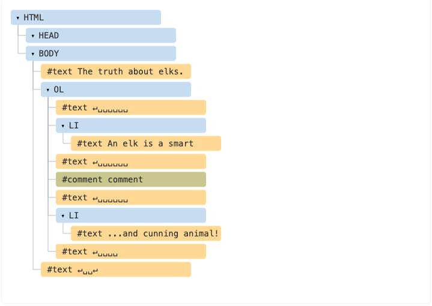
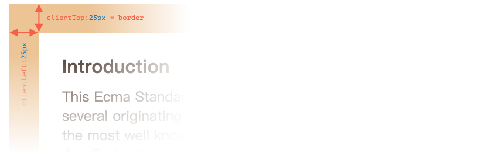

# 现代javascript教程

## 第2部分：浏览器：文档、事件和接口

### 第一章、Document

#### 1.1浏览器环境，规格

JavaScript 语言最初是为 Web 浏览器创建的。此后，它发展成为一种有多种用途和平台的语言。

平台可以是一个浏览器，一台网络服务器，一台咖啡机或其他**主机**。它们每个都提供特定于平台的功能。JavaScript 规范调用了**主机环境**。

主机环境提供语言核心以外的平台特定对象和功能。Web 浏览器提供了一种控制网页的手段。Node.JS 提供了服务器端功能，等等。

以下是浏览器在 JavaScript 中运行时的一个鸟瞰图：


有一个叫做 `window` 的“根”对象。它有两个角色：

1. 首先，它是 JavaScript 代码的全局对象，如 [全局对象](https://zh.javascript.info/global-object) 一章所述。
2. 其次，它代表“浏览器窗口”并提供控制它的方法。

例如，在这里我们将其用作全局对象：

```javascript
function sayHi() {
  alert("Hello");
}

// global functions are accessible as properties of window
window.sayHi();
```

在这里，我们将它用作浏览器窗口，以查看窗口高度：

```javascript
alert(window.innerHeight); // inner window height
```

还有更多窗口特定的方法和属性，我们稍后会介绍它们。

##### [文档对象模型（DOM）](https://zh.javascript.info/browser-environment#wen-dang-dui-xiang-mo-xing-dom)

`document` 对象可以访问页面内容。我们可以使用它在页面上更改或创建任何内容。

例如：

```javascript
// change the background color to red
document.body.style.background = "red";

// change it back after 1 second
setTimeout(() => document.body.style.background = "", 1000);
```

这里我们使用了 `document.body.style`，但还有很多很多其他的东西。规范中描述了属性和方法。正好有两个工作组在研发：

1. [W3C](https://en.wikipedia.org/wiki/World_Wide_Web_Consortium) — 其文档位于 https://www.w3.org/TR/dom。
2. [WhatWG](https://en.wikipedia.org/wiki/WHATWG)，发布在 [https://dom.spec.whatwg.org](https://dom.spec.whatwg.org/)。

巧的是，这两个工作组并不总是统一意见，所以我们有两套标准。但它们非常相似，并最终融合在一起。您在给定资源上找到的文档非常相似，约有 99％ 的相似度。你可能并不会注意到其中很小的差异。

我个人认为 [https://dom.spec.whatwg.org](https://dom.spec.whatwg.org/) 更适合使用。

在过去，根本没有任何标准 —— 每个浏览器都去实现它需要的东西。不同的浏览器对同一事物有不同的配置、方法和属性，开发人员必须为每个浏览器编写不同的代码。那是昏暗、混乱的时代。

即使现在我们有时可以遇到使用浏览器特定属性的旧代码，并且需要解决不兼容的问题。但是，在本教程中，我们将使用现代化的东西：除非迫不得已，否则不需要学习旧的东西。

后来出现了 DOM 标准，试图让每个浏览器都达成协议。第一个版本是“DOM Level 1”，然后它被 DOM Level 2 扩展，后来扩展到 DOM Level 3，现在它已经达到了 DOM Level 4. WhatWG 组的人厌倦了版本号，并将其称为“DOM”，没有号码。所以我们也会这样做。

------

**DOM is not only for browsers**

DOM 规范解释了文档的结构并提供了对其进行操作的对象。有的非浏览器设备也在使用它。

例如，下载并处理 HTML 页面的服务器端工具使用 DOM。尽管如此，他们可能只支持部分规范。

------

**CSSOM for styling**

CSS 规则和样式表的结构不像 HTML。有一个单独的规范 [CSSOM](https://www.w3.org/TR/cssom-1/) 解释了如何将 CSS 表示为对象，以及如何读写它们。

当我们修改文档的样式规则时，CSSOM 与 DOM 一起使用。但实际上，很少需要 CSSOM，因为通常 CSS 规则是静态的。我们很少需要从 JavaScript 中添加/删除 CSS 规则，所以我们现在不会介绍它。

##### [BOM（HTML 规范的一部分）](https://zh.javascript.info/browser-environment#bomhtml-gui-fan-de-yi-bu-fen)

浏览器对象模型（BOM）是浏览器（主机环境）提供的附加对象，用于处理除文档之外的所有内容。

例如：

- [navigator](https://developer.mozilla.org/zh/docs/Web/API/Window/navigator) 对象提供有关浏览器和操作系统的背景信息。navigator 有许多属性，但是最广为人知的两个属性是：`navigator.userAgent` —— 关于当前浏览器和`navigator.platform` —— 关于平台（可以帮助区分 Windows / Linux / Mac等）。
- [location](https://developer.mozilla.org/zh/docs/Web/API/Window/navigator) 对象允许我们读取当前URL并将浏览器重定向到新的URL。

以下是我们如何使用 `location` 对象：

```javascript
alert(location.href); // shows current URL
if (confirm("Go to wikipedia?")) {
  location.href = "https://wikipedia.org"; // redirect the browser to another URL
}
```

函数 `alert/confirm/prompt` 也是 BOM 的一部分：它们与文档并不直接相关，但它表示了与用户通信的纯浏览器方法。

------

**HTML specification**

BOM 是通用 [HTML 规范](https://html.spec.whatwg.org/)的一部分。

[https://html.spec.whatwg.org](https://html.spec.whatwg.org/) 中的 HTML 规范不仅是关于“HTML 语言”（标签，属性），还涵盖了一堆对象、方法和浏览器特定的DOM扩展。这就是“广义的HTML”。

##### [总结](https://zh.javascript.info/browser-environment#zong-jie)

说到标准，我们有：

- DOM 标准

  描述文档的结构、操作和事件，参见 [https://dom.spec.whatwg.org](https://dom.spec.whatwg.org/)。

- CSSOM 标准

  介绍样式表和样式规则，对它们的操作及其对文档的绑定，参见 https://www.w3.org/TR/cssom-1/.

- HTML 标准

  介绍 HTML 语言（例如标签）以及 BOM（浏览器对象模型）—— 各种浏览器函数：`setTimeout`、`alert`、`location`等等，请参阅https://html.spec.whatwg.org。它采用了 DOM 规范并为其扩展了许多属性和方法。

现在我们开始学习 DOM，因为文档在 UI 中扮演着重要角色。

请注意上面的链接，因为有太多东西需要学习，所以在这里不可能掌握和记住所有内容。

当您想要了解某个属性或方法时，Mozilla 手册 https://developer.mozilla.org/en-US/search 是一个很好的资源，但阅读相应的规范可能会更好：它需要更复杂和更长的时间来阅读，但会使你的基本知识变得健全和完整。

#### 1.2DOM 树

HTML 文档的骨干是标签。

根据文档对象模型（DOM），每个 HTML 标签都是一个对象。嵌套标签被称为闭合标签的“子标签”。

标签内的文本也是一个对象。

所有这些对象都可以用 JavaScript 来操作。

##### [DOM 的例子](https://zh.javascript.info/dom-nodes#dom-de-li-zi)

例如，我们来研究这个文档的 DOM：

```html
<!DOCTYPE HTML>
<html>
<head>
  <title>About elks</title>
</head>
<body>
  The truth about elks.
</body>
</html>
```

DOM 将 HTML 表示为标签的树形结构。它是这个样子的：


标签被称为**元素节点**（或者仅仅是元素）。嵌套标签称为闭合标签的子标签。因此我们有这样一个元素树：`<html>` 在根目录下，然后 `<head>` 和 `<body>` 是它的子项，等等。

元素内的文本形成**文本节点**，标记为 `＃text`。文本节点只包含一个字符串。它没有子项，永远是树的一片叶子。

例如，`<title>` 标签里面有文本 `"About elks"`。

请注意文本节点中的特殊字符：

- 换行符：`↵`（在 JavaScript 中称为`\n`）
- 一个空格：`␣`

空格和换行符是完全有效的字符，它们形成文本节点并成为 DOM 的一部分。因此，在上面的例子中，`<head>` 标签在 `<title>` 之前包含了一些空格，并且该文本变成了一个 `#text` 节点（它只包含换行符和一些空格）。

只有两个顶级排除项目：

1. 由于历史原因，`<head>` 之前的空格和换行符被忽略，
2. 如果我们在 `</body>` 之后放置了一些东西，那么它会自动移动到 `body` 内部，因为 HTML 规范要求所有内容必须位于 `<body>` 内。所以 `</body>` 后面可能没有空格。

在其他情况下，一切都很简单 —— 如果文档中有空格（就像任何字符一样），那么它们将成为 DOM 中的文本节点，如果我们删除它们，则不会有任何内容。

这里是没有空格的文本节点：

```html
<!DOCTYPE HTML>
<html><head><title>About elks</title></head><body>The truth about elks.</body></html>
```


------

**Edge spaces and in-between empty text are usually hidden in tools**

与 DOM 协同工作的浏览器工具（不久将会覆盖）通常不会在文本的开始/结尾处显示空格，并且在标记之间不会显示空文本节点（换行符）。

这是因为它们主要用于装饰 HTML，并且不会影响其显示方式（在大多数情况下）。

在进一步的 DOM 图片上，我们有时候会忽略它们，因为它们是无关紧要的，所以要保持简短。

##### [自动修正](https://zh.javascript.info/dom-nodes#zi-dong-xiu-zheng)

如果浏览器遇到格式不正确的 HTML，它会在形成 DOM 时自动修正它。

例如，顶部标签总是 `<html>`。即使它不在于文档中 —— 它将在 DOM 中出现，因为浏览器会创建它。`<body>` 也是一样。

例如，如果 HTML 文件是单个单词“Hello”，浏览器将把它包装到 `<html>` 和 `<body>` 中，添加所需的 `<head>`，DOM 将会变成：


在生成 DOM 时，浏览器会自动处理文档中的错误，关闭标签等等。

这样的“无效”文档：

```html
<p>Hello
<li>Mom
<li>and
<li>Dad
```

…将成为一个正常的 DOM，因为浏览器会读取标签并恢复丢失的部分：


------

**Tables always have** 

表格是一个有趣的“特例”。按照 DOM 规范，它们必须具有 ，但 HTML 文本可能（官方的）忽略它。然后浏览器自动在 DOM 中创建 。

对于 HTML：

```html
<table id="table"><tr><td>1</td></tr></table>
```

DOM 结构会变成：


看到了吗？ 出现了。在使用表格时，应该牢记这一点以避免意外。

##### [其他节点类型](https://zh.javascript.info/dom-nodes#qi-ta-jie-dian-lei-xing)

让我们在页面中添加更多标签和注释：

```html
<!DOCTYPE HTML>
<html>
<body>
  The truth about elks.
  <ol>
    <li>An elk is a smart</li>
    <!-- comment -->
    <li>...and cunning animal!</li>
  </ol>
</body>
</html>
```



在这里我们看到一个新的树节点类型 —— *comment node*，标记为 `#comment`。

我们可能会想 —— 为什么要将注释添加到 DOM 中？它不会以任何方式影响视觉表示。但是有一条规则 —— 如果 HTML 中有东西，那么它也必须在 DOM 树中。

**HTML 中的所有内容甚至注释都成为 DOM 的一部分。**

甚至 HTML 开头的 `<!DOCTYPE...>` 指令也是一个 DOM 节点。它在 `<html>` 之前的 DOM 树中。我们不会触及那个节点，我们甚至不会因为那个原因在图表上绘制它，但它就在那里。

表示整个文档的 `document` 对象在形式上也是一个 DOM 节点。

有 [12 种节点类型](https://dom.spec.whatwg.org/#node)。实际上，我们通常用到的是其中的 4 个：

1. `document`—— DOM 中的“入口点”。
2. 元素节点 —— HTML 标签，树构建块。
3. 文本节点 —— 包含文本。
4. 注释 —— 有时我们可以将内容放入其中，它不会显示，但 JS 可以从 DOM 中读取它。

##### [自行查看](https://zh.javascript.info/dom-nodes#zi-hang-cha-kan)

要实时查看 DOM 结构，请尝试 [Live DOM Viewer](http://software.hixie.ch/utilities/js/live-dom-viewer/)。只需输入文档，它就会立即显示 DOM。

##### [在浏览器中检查](https://zh.javascript.info/dom-nodes#zai-liu-lan-qi-zhong-jian-cha)

研究 DOM 的另一种方式是使用浏览器开发工具。事实上，这正是我们开发时所使用的工具。

请打开网页 [elks.html](https://zh.javascript.info/article/dom-nodes/elks.html)，打开浏览器开发工具并切换到元素选项卡。

它是这样的：


你可以看到 DOM，点击元素，查看其中的细节等等。

请注意，开发者工具中的 DOM 结构已经过简化。文本节点仅以文本形式显。根本没有“空白”（只有空格）的文本节点。这其实很好，因为大部分时间我们都对元素节点感兴趣。

点击左上角的 按钮可以使用鼠标（或其他指针设备）从网页中选择一个节点并“检查”它（在“元素”选项卡中滚动到该节点）。当我们有一个巨大的 HTML 页面（和相应的巨大 DOM），并希望看到其中的一个特定元素的位置时，这很有用。

另一种方法是在网页上右键单击并在上下文菜单中选择“检查”。


在工具的右侧部分有以下子表单：

- **Styles** —— 我们可以看到应用于当前元素的 CSS 中的一条条规则，包括内置规则（灰色）。几乎所有东西都可以在原地进行编辑，包括下面框中的尺寸/边距/填充。
- **Computed** —— 按属性查看应用于元素的 CSS：对于每个属性，我们可以看到一条规则（包括 CSS 继承等）。
- **Event Listeners** —— 查看附加到 DOM 元素的事件侦听器（我们将在本教程的下一部分介绍它们）。
- …等等。

研究它们的最佳方式就是多多点击。大多数值都是可以原地编辑的。

##### [与控制台交互](https://zh.javascript.info/dom-nodes#yu-kong-zhi-tai-jiao-hu)

在我们研究 DOM 时，我们也可能想要使用 JavaScript。就比如：获取一个节点并运行一些代码来修改它，看看它长什么样。这里有一些在元素选项卡和控制台之间传输数据的提示。

- 在元素标签中选择第一个 `<li>`。
- 按下 Esc —— 它将在元素标签下方打开控制台。

现在最后选中的元素可以用 `$0` 来进行操作，以前选择的是 `$1`，如此等等。

我们可以在它们之上运行命令。例如，`$0.style.background = 'red'` 使选定的列表项变成红色，如下所示：


另一方面，如果我们处在控制台中，并且有一个引用 DOM 节点的变量，那么我们可以使用命令 `inspect（node）` 在元素窗格中查看它。

或者我们可以在控制台中输出它并“就地”测试它，如下面的 `document.body`：


这当然是用于调试的目的。从下一章我们将使用 JavaScript 访问和修改 DOM。

浏览器开发者工具对开发有很大的帮助：我们可以研究 DOM，做一些测试并查看出了什么问题。

##### [总结](https://zh.javascript.info/dom-nodes#zong-jie)

HTML/XML 文档在浏览器内表示为 DOM 树。

- 标签成为元素节点并形成文档结构。
- 文本成为文本节点。
- …如此等等，HTML 中的所有东西在 DOM 中都有它的位置，甚至是注释。

我们可以使用开发者工具来检查 DOM 并手动修改它。

在这里，我们介绍了基本知识，入门最常用和最重要的操作。在 https://developers.google.cn/web/tools/chrome-devtools 上有大量有关 Chrome 开发者工具的文档。学习这些工具的最佳方式是四处点击，阅读菜单：大多数选项都很明显。而后，当你差不多了解它们时，阅读文档并学习其余的部分。

DOM 节点具有在它们之间传递数据，修改、移动页面等功能的属性和方法。我们将在接下来的章节中讨论他们。

#### 1.3遍历 DOM

DOM 让我们可以对元素和它们其中的内容做任何事，但是首先我们需要获取到对应的 DOM 对象，把这个对象赋予一个变量，然后我们才能修改这个对象。

对 DOM 的所有操作都是从 `document` 对象开始的。从这个对象我们可以到达任何节点。

这里是一张描述对象间链接的图片，通过这些链接我们可以在 DOM 节点之间遍历。


让我们更详细地讨论这些。

##### [在最顶上的：documentElement 和 body](https://zh.javascript.info/dom-navigation#zai-zui-ding-shang-de-documentelement-he-body)

最上面的树节点可以直接通过 `document` 属性来使用：

- `<html>` = `document.documentElement`

  最上面的 document 节点是 `document.documentElement`。这是对应 `<html>` 标签的 DOM 节点。

- `<body>` = `document.body`

  另一个被广泛使用的 DOM 节点是 `<body>` 元素 — `document.body`。

- `<head>` = `document.head`

  `<head>` 标签可以通过 `document.head` 访问。

------

**这里有个问题：`document.body` 的值可能是 `null`**

脚本无法访问在运行时不存在的元素。

特别要注意的是，如果一个脚本是在 `<head>` 标签中，那么脚本中是访问不到 `document.body` 元素的，因为浏览器还没有读到其中的内容。

所以在下面的例子中第一个 `alert` 函数显示的是 `null`：

```html
<html>

<head>
  <script>
    alert( "From HEAD: " + document.body ); // null, there's no <body> yet
  </script>
</head>

<body>

  <script>
    alert( "From BODY: " + document.body ); // HTMLBodyElement, now it exists
  </script>

</body>
</html>
```

------

**在 DOM 世界中 `null` 就意味着“不存在”**

在 DOM 中，`null` 值就意味着“不存在”或者“没有这样的节点”。

##### [子元素：childNodes, firstChild, lastChild](https://zh.javascript.info/dom-navigation#zi-yuan-su-childnodesfirstchildlastchild)

从现在开始，我们将使用下面这两个术语：

- **子节点（或者叫做子）** —— 对应的是直系的子元素。换句话说它们会完全嵌套在指定的一个元素中。举个例子，`<head>` 和 `<body>` 就是 `<html>` 元素的子元素。
- **子系元素** —— 对应的是所有嵌套在一个指定元素中的元素，包括这些元素的子元素，以此类推得到的所有元素。

比如说，在这里 `<body>` 有子元素 `<div>` 和 `<ul>`（以及一些空白的文本节点）：

```html
<html>
<body>
  <div>Begin</div>

  <ul>
    <li>
      <b>Information</b>
    </li>
  </ul>
</body>
</html>
```

…如果我们要找的是 `<body>` 的子系元素，那我们可以先得到它直系子元素 `<div>`，`<ul>` 以及像 `<li>`（`<ul>` 的子元素）和 `<b>`（`<li>` 的子元素）这样嵌套更深的元素 — 这就是 `<body>` 元素包含的整个子树。

**`childNodes` 集合提供了对所有子节点包括其中文本节点的访问。**

下面的例子显示了 `document.body` 的子元素：

```html
<html>
<body>
  <div>Begin</div>

  <ul>
    <li>Information</li>
  </ul>

  <div>End</div>

  <script>
    for (let i = 0; i < document.body.childNodes.length; i++) {
      alert( document.body.childNodes[i] ); // Text, DIV, Text, UL, ..., SCRIPT
    }
  </script>
  ...more stuff...
</body>
</html>
```

请注意在这边有一个有趣的细节。如果我们运行上面的例子，所展示代码中最后的元素是 `<script>`。实际上，文档下面还有很多东西，但是在这个脚本执行的时候，浏览器还没有读到下面的内容，所以这个脚本并不能看到它们。

**`firstChild` 和 `lastChild` 属性是访问第一个和最后一个子元素的快捷方式**

它们只是简写。如果元素存在子节点，那么下面的脚本运行结果一直都是 true：

```javascript
elem.childNodes[0] === elem.firstChild
elem.childNodes[elem.childNodes.length - 1] === elem.lastChild
```

这里还有一个特别的函数 `elem.hasChildNodes()` 用于检测节点是否有子节点。

###### [DOM 集合](https://zh.javascript.info/dom-navigation#dom-ji-he)

正如我们看到的那样，`childNodes` 看起来就像一个数组。但是它实际上并不是一个数组，而是一个**集合** —— 一个类似数组的可迭代对象。

这个性质会导致两个重要的结果：

1. 我们可以使用 `for..of` 语法来迭代它：

```javascript
for (let node of document.body.childNodes) {
  alert(node); // shows all nodes from the collection
}
```

这是因为集合是可迭代的（提供了所需要的 `Symbol.iterator` 属性）。

1. 并不能使用数组的方法，因为它并不是一个数组：

```javascript
alert(document.body.childNodes.filter); // undefined (there's no filter method!)
```

因为集合性质所得到的第一个结果很不错。第二个结果也还可以忍受，因为如果我们想调用数组的方法的话可以通过 `Array.from` 方法来从集合中创建一个“真”的数组：

```javascript
alert( Array.from(document.body.childNodes).filter ); // now it's there
```

------

**DOM 集合是只读的**

DOM 集合甚至可以说本章中列出的**所有**导航属性都是只读的。

我们不能通过类似 `childNodes[i] = ...` 的操作来替换一个子节点。

修改子节点需要使用其它的方法，我们将会在下一章中看到它们。

------

**DOM 集合是实时的**

除小部分例外之外几乎所有的 DOM 集合都是**实时**的。换句话说，它们都反映的是 DOM 的实时状态。

如果我们保留一个对 `elem.childNodes` 的引用，然后在 DOM 中添加/移除节点，那么这些新加的节点就会自动出现在这个集合中。

------

**不要使用 `for..in` 来循环遍历集合**

在使用 `for..of` 的情况下集合是可迭代的。但是有时候人们会尝试使用 `for..in` 来迭代集合。

请不要这么做。`for..in` 循环遍历的是所有列举的属性。集合会有一些“额外”很少用到的属性，这些属性我们通常不会获取到：

```html
<body>
<script>
  // 显示 0、1、length、item、values 以及其它值。
  for (let prop in document.body.childNodes) alert(prop);
</script>
</body>
```

##### [兄弟节点和父节点](https://zh.javascript.info/dom-navigation#xiong-di-jie-dian-he-fu-jie-dian)

**兄弟节点**是指有同一个父节点的节点。比如说 `<head>` 和 `<body>` 就是兄弟节点：

- `<body>` 可以说是 `<head>` 的“下一个”或者“右边”兄弟节点。
- `<head>` 可以说是 `<body>` 的“前一个”或者“左边”兄弟节点。

父节点可以通过 `parentNode` 访问。

在同一个父节点中一个节点的下一个节点（下一个兄弟节点）可以通过 `nextSibling` 访问，上一个节点可以通过 `previousSibling` 访问。

比如说：

```html
<html><head></head><body><script>
  //  HTML 代码是“密集”的用来避免额外的“空白”文本节点。
  HTML is "dense" to evade extra "blank" text nodes.

  // <body> 的父节点是 <html>
  alert( document.body.parentNode === document.documentElement ); // true

  // <head> 的下一个兄弟节点是  <body>
  alert( document.head.nextSibling ); // HTMLBodyElement

  // <body> 的上一个兄弟节点是  <head>
  alert( document.body.previousSibling ); // HTMLHeadElement
</script></body></html>
```

##### [只在元素中导航](https://zh.javascript.info/dom-navigation#zhi-zai-yuan-su-zhong-dao-hang)

上面列出的导航属性涉及到**所有**节点。比如说，在 `childNodes` 中我们可以看到文本节点，元素节点，甚至如果存在注释节点的话，也能访问到。

但是对于很多任务来说，我们并不想要文本或者注释节点。我们希望可以操纵代表标签的元素节点以及构建整个页面的结构。

所以让我们看看当只考虑**元素节点**时更多的导航链接：


这些链接和之前上面的相似，只是在词中间加了 `Element`：

- `children` —— 只获取类型为元素节点的子节点。
- `firstElementChild`，`lastElementChild` —— 第一个和最后一个子元素。
- `previousElementSibling`，`nextElementSibling` —— 兄弟元素。
- `parentElement` —— 父元素。

------

**为什么是 `parentElement`? 父节点可以不是一个元素吗？**

`parentElement` 属性返回的是“元素”父节点，而 `parentNode` 返回的是“任何类型”的父节点。这些属性通常来说是一样的：它们都获取父节点。

除了有一个例外就是 `document.documentElement`：

```javascript
alert( document.documentElement.parentNode ); // document
alert( document.documentElement.parentElement ); // null
```

换句话说，`documentElement`（对应 `<html>` 标签）是根节点。形式上来讲，它有 `document` 作为它的父节点。但是 `document` 并不是一个元素节点，所以 `parentNode` 返回了 `document` 而 `parentElement` 却没有。

有时候，当我们要遍历父节点并且在每个遍历的节点调用方法时这很重要，但是 `document` 并没有父元素节点，所以我们要将它排除在外。

------

让我们修改上面的其中一个例子：用 `children` 来替换 `childNodes`。现在它就只显示元素：

```html
<html>
<body>
  <div>Begin</div>

  <ul>
    <li>Information</li>
  </ul>

  <div>End</div>

  <script>
    for (let elem of document.body.children) {
      alert(elem); // DIV, UL, DIV, SCRIPT
    }
  </script>
  ...
</body>
</html>
```

##### [更多链接：表](https://zh.javascript.info/dom-navigation#dom-navigation-tables)

到现在为止我们描述了基本的导航属性。

为了方便起见，某些类型的 DOM 元素会提供特定于其类型的额外属性。

Tables 是其中一个很好也是很重要的例子。

<table> 元素支持 (除了上面给出的之外) 以下这些属性:

- `table.rows` — 用于表示表中 元素的集合。
- `table.caption/tHead/tFoot` — 用于访问元素 `、、。
- `table.tBodies` — 元素的集合（根据标准该元素数量可以很多）。

**、、** 元素提供了 `rows` 属性：

- `tbody.rows` — 表内部 元素的集合。

**：**

- `tr.cells` — 在给定 元素下 ` 和 ` 单元格的集合。
- `tr.sectionRowIndex` — 在封闭的 中 的编号。
- `tr.rowIndex` — 在表中 元素的编号。

**` 和 `：**

- `td.cellIndex` — 在封闭的 中单元格的编号。

下面是使用这些属性的例子：

```html
<table id="table">
  <tr>
    <td>one</td><td>two</td>
  </tr>
  <tr>
    <td>three</td><td>four</td>
  </tr>
</table>

<script>
  // 获取第一行中第二个单元格的内容
  alert( table.rows[0].cells[1].innerHTML ) // "two"
</script>
```

规范：[tabular data](https://html.spec.whatwg.org/multipage/tables.html)。

HTML 表单还有其它额外的导航属性。我们稍后会在开始使用表单时看到它们。

##### [总结](https://zh.javascript.info/dom-navigation#zong-jie)

给一个 DOM 节点，我们可以使用导航属性来立即访问和它直接相邻的节点。

这些属性主要分两组：

- 对于所有的节点：`parentNode`、`childNodes`、`firstChild`、`lastChild`、`previousSibling` 和 `nextSibling`。
- 仅用于元素节点：`parentElement`、`children`、`firstElementChild`、`lastElementChild`、`previousElementSibling` 和 `nextElementSibling`。

某些类型的 DOM 元素，比如说像 tables，提供了额外的属性和集合用于访问其内容。

#### 1.4搜索： getElement* 和 querySelector*

当元素关联较密切时，DOM 导航属性是最好的。万一不是这样该怎么办？如何去获取页面上的任意一个元素？

还有其他的搜索方法。

##### [document.getElementById 或者只使用 id](https://zh.javascript.info/searching-elements-dom#documentgetelementbyid-huo-zhe-zhi-shi-yong-id)

如果元素有 `id` 属性，那么该 `id` 也会有一个同名全局变量。

我们可以用以下方式来访问元素：

```html
                                    <div id="elem">
  <div id="elem-content">Element</div>
</div>

<script>
  alert(elem); // DOM-element with id="elem"
  alert(window.elem); // accessing global variable like this also works

  // 对于 elem-content 会稍微有些复杂
  // 因为里面有破折号，所以不是一个变量名
  alert(window['elem-content']); // ...但可以使用方括号 [...]
</script>
```

[在规范中](http://www.whatwg.org/specs/web-apps/current-work/#dom-window-nameditem)描述了这种行为，主要是考虑到兼容性才对它进行了支持。为了帮助我们，浏览器尝试了混合 JS 和 DOM 的命名空间。但这仅仅对简单脚本有效，因为它们可能会产生命名冲突。同时，当我们在 JS 中查看时，因为无法在视图中查看 HTML，所以变量的来源可能会很模糊。

选择特殊的方法，才是最好的选择：`document.getElementById(id)`。

例如：

```html
<div id="elem">
  <div id="elem-content">Element</div>
</div>

<script>
  let elem = document.getElementById('elem');

  elem.style.background = 'red';
</script>
```

本教程中，我们经常使用 `id` 来直接引用属性，但这仅仅是为了简化。实际开发中，使用 `document.getElementById`才是最佳选择。

------

**There can be only one**

`id` 必须唯一，文档中给定的 `id` 只能有唯一一个元素。

如果有多个元素具有同名 `id`，那么对应方法的行为将不可预测。浏览器将随机返回其他的一个。因此未来保证 `id` 的唯一性，请严格遵守规则。

------

**Only `document.getElementById`, not `anyNode.getElementById`**

`getElementById` 只能在 `document` 对象上调用。它会在整个文档中查找给定的 `id`。

##### [getElementsBy*](https://zh.javascript.info/searching-elements-dom#getelementsby)

也有其他的方法来搜索节点：

- `elem.getElementsByTagName(tag)` 用给定的标签来查找元素，并返回它们的集合。`tag` 参数也可以是“任何标签”的 `"*"`。

例如：

```javascript
// 获取所有在文档中的 div
let divs = document.getElementsByTagName('div');
```

此方法可以在任意 DOM 元素的上下文中调用。

让我们找出在表格中的所有 `input` 标签：

```html
<table id="table">
  <tr>
    <td>Your age:</td>

    <td>
      <label>
        <input type="radio" name="age" value="young" checked> less than 18
      </label>
      <label>
        <input type="radio" name="age" value="mature"> from 18 to 50
      </label>
      <label>
        <input type="radio" name="age" value="senior"> more than 60
      </label>
    </td>
  </tr>
</table>

<script>
  let inputs = table.getElementsByTagName('input');

  for (let input of inputs) {
    alert( input.value + ': ' + input.checked );
  }
</script>
```

------

**Don’t forget the `"s"` letter!**

初级开发者会忽略字符 `"s"`。也就是说，它们会调用 `getElementByTagName` 而不是 `getElement**s**ByTagName`。

`"s"` 字符并不存在于 `getElementById`，因为它只返回单个元素。但是 `getElementsByTagName` 返回的是一个元素集合，所以 `"s"` 包含在内。

------

**It returns a collection, not an element!**

另一个普遍存在的错误写法是：

```javascript
// 无法运行
document.getElementsByTagName('input').value = 5;
```

这无法运行，因为它接受输入的**集合**然后将值赋给它，而不是它里面的元素。

我们应该迭代集合或者按给定索引来获取元素，然后赋值，就像下述所示：

```javascript
// 应该可以运行（如果有输入）
document.getElementsByTagName('input')[0].value = 5;
```

------

还有其他很少使用的方法：

- `elem.getElementsByClassName(className)` 返回具有给定 CSS 类的元素。元素也可能含有其他的类。
- `document.getElementsByName(name)` 返回具有给定 `name` 属性的元素，文档范围。因为历史原因而很少使用。在这里提出，只是考虑到了完整性。

例如：

```html
<form name="my-form">
  <div class="article">Article</div>
  <div class="long article">Long article</div>
</form>

<script>
  // 按 name 查找属性
  let form = document.getElementsByName('my-form')[0];

  // 按在表单中的类查找
  let articles = form.getElementsByClassName('article');
  alert(articles.length); // 2, found two elements with class "article"
</script>
```

##### [querySelectorAll](https://zh.javascript.info/searching-elements-dom#querySelectorAll)

现在将进行重要的内容

`elem.querySelectorAll(css)` 的调用将返回与给定 CSS 选择器匹配 `elem` 中的所有元素。这是最常用和最有力的方法。

我们将查找所有为最后一个子元素的 `<li>` 元素：

```html
<ul>
  <li>The</li>
  <li>test</li>
</ul>
<ul>
  <li>has</li>
  <li>passed</li>
</ul>
<script>
  let elements = document.querySelectorAll('ul > li:last-child');

  for (let elem of elements) {
    alert(elem.innerHTML); // "test", "passed"
  }
</script>
```

因为可以使用任何 CSS 选择器，所以这种方法很有用。

------

**Can use pseudo-classes as well**

CSS 选择器的伪类，如 `:hover` 和 `:active` 都是被支持的。例如，`document.querySelectorAll(':hover')` 将会返回指针现在已经结束的集合（按嵌套顺序：从最外层 `<html>` 到嵌套最多的元素）。

##### [querySelector](https://zh.javascript.info/searching-elements-dom#querySelector)

调用 `elem.querySelector(css)` 后，它会返回给定 CSS 选择器的第一个元素。

换句话说，结果与 `elem.querySelectorAll(css)[0]` 相同，但是后者会从**所有**找到的元素中选取一个，而 `elem.querySelector` 只会查找一个。因此编写会更快更简洁。

##### [matches](https://zh.javascript.info/searching-elements-dom#matches)

之前的方法是搜索 DOM 的。

[elem.matches(css)](http://dom.spec.whatwg.org/#dom-element-matches) 不会查找任何内容，它只会检查 `elem` 是否匹配给定的 CSS 选择器。它返回 `true` 或者 `false`。

当我们迭代元素（例如数组或者一些其他内容）并试图过滤那些我们感兴趣的元素时，这个方法会很方便。

例如：

```html
<a href="http://example.com/file.zip">...</a>
<a href="http://ya.ru">...</a>

<script>
  // 不一定是 document.body.children，也可以是任何集合
  for (let elem of document.body.children) {
    if (elem.matches('a[href$="zip"]')) {
      alert("The archive reference: " + elem.href );
    }
  }
</script>
```

##### [closest](https://zh.javascript.info/searching-elements-dom#closest)

所有直接在给定元素之上的元素都被称为它的“祖先”。

换句话说，祖先是：父类，父类的父类，它的父类等。祖先们一起组成了从元素到顶端的父类链。

`elem.closest(css)` 方法会查找与 CSS 选择器匹配的最接近的祖先。`elem` 自己也会被搜索。

换句话说，方法 `closest` 在元素中得到了提升，并检查每个父类。如果与选择器匹配，则停止搜索并返回祖先。

例如：

```html
<h1>Contents</h1>

<div class="contents">
  <ul class="book">
    <li class="chapter">Chapter 1</li>
    <li class="chapter">Chapter 1</li>
  </ul>
</div>

<script>
  let chapter = document.querySelector('.chapter'); // LI

  alert(chapter.closest('.book')); // UL
  alert(chapter.closest('.contents')); // DIV

  alert(chapter.closest('h1')); // null（因为 h1 不是祖先）
</script>
```

##### [Live 集合](https://zh.javascript.info/searching-elements-dom#live-ji-he)

所有的 `"getElementsBy*"` 方法都会返回 **live** 集合。这类集合总是可以反映出文档的当前状态而且在文档变化时，可以自动更新。

下面的实例中，有两个脚本。

1. 第一个方法创建了对集合 `<div>` 的引用。到目前为止，它的长度是 `1`。
2. 第二个脚本在浏览器再遇到一个 `<div>` 时，它的长度会变成 `2`。

```html
<div>First div</div>

<script>
  let divs = document.getElementsByTagName('div');
  alert(divs.length); // 1
</script>

<div>Second div</div>

<script>
  alert(divs.length); // 2
</script>
```

相反，`querySelectorAll` 会返回一个**static**集合。就像一个固定的元素数字。

如果我们使用它，那么两个脚本都会输出 `1`：

```html
<div>First div</div>

<script>
  let divs = document.querySelectorAll('div');
  alert(divs.length); // 1
</script>

<div>Second div</div>

<script>
  alert(divs.length); // 1
</script>
```

现在我们可以很容易地看到不同之处。在文档中出现一个新的 `div` 后，静态集合并没有增加。

我们在这里使用独立的脚本来说明元素添加是如何影响集合的，但是在此之后的任何 DOM 操作都会影响它们。很快我们就可以看到更多的细节。

##### [总结](https://zh.javascript.info/searching-elements-dom#zong-jie)

有 6 种主要的方法，可以在 DOM 中进行搜素：

| Method                   | Searches by... | Can call on an element? | Live? |
| ------------------------ | -------------- | ----------------------- | ----- |
| `getElementById`         | `id`           | -                       | -     |
| `getElementsByName`      | `name`         | -                       | ✔     |
| `getElementsByTagName`   | tag or `'*'`   | ✔                       | ✔     |
| `getElementsByClassName` | class          | ✔                       | ✔     |
| `querySelector`          | CSS-selector   | ✔                       | -     |
| `querySelectorAll`       | CSS-selector   | ✔                       | -     |

请注意，只有在文档 `document.getElementById(...)` 的上下文中才能调用 `getElementById` 和 `getElementsByName`。但元素中没有 `elem.getElementById(...)` 会报错。

也可以在元素上调用其他方法，例如 `elem.querySelectorAll(...)` 将会在 `elem`（在 DOM 子树中）内部进行搜素。

除此以外：

- `elem.matches(css)` 用于检查 `elem` 与给定的 CSS 选择器是否匹配。
- `elem.closest(css)` 用于查找与给定 CSS 选择器相匹配的最近的祖先。`elem` 本身也会被检查。

最后我们在提一种检查父子关系的方法：

- 如果 `elemB` 在 `elemA`（`elemA` 的后代）中或者当 `elemA==elemB` 时 `elemA.contains(elemB)` 将返回 true。

##### 评论——性能比较

网上查阅了一些测试两者性能的文章，自己也做了下测试，总结一下：单元素查询，getElementById 比 querySelector 性能略高；元素集合查询，getElementsByClassName 比 querySelectorAll 性能高很多。但现在很多主流的库内部使用的都是 querySelector* ，最主要原因就是因为它使用方便。至于实际项目中使用哪种，可以根据使用场景和性能需求做选择。

#### 1.5节点属性：type、tag 和 contents

让我们深入了解一下 DOM 节点。

在本章中，我们将更多地了解它们是什么以及它们最常用的属性。

###### [DOM 节点类](https://zh.javascript.info/basic-dom-node-properties#dom-jie-dian-lei)

DOM 节点因为它们的类而具有不同的属性。例如，标记 `<a>` 相对应的元素节点具有链接相关的属性，标记 `<input>` 对应元素节点具有的输入相关的属性等。文本节点不同于元素节点，但是它们之间也存在共有的属性和方法，因为所有的 DOM 节点都形成一个单一层次的结构。

每个 DOM 节点都有与之对应的内置类。

层次的根节点是 [EventTarget](https://dom.spec.whatwg.org/#eventtarget)，[Node](http://dom.spec.whatwg.org/#interface-node) 继承自它，其他 DOM 节点也继承自它。

下图做了进一步解释：


类如下所示：

- [EventTarget](https://dom.spec.whatwg.org/#eventtarget) —— 是根的“抽象”类。该类的对象从未被创建。它作为一个基础，为了让所有 DOM 节点都支持所谓的“事件”，我们会在之后对它进行学习。

- [Node](http://dom.spec.whatwg.org/#interface-node) —— 也是一个“抽象”类，充当 DOM 节点的基础。它提供了树的核心功能：`parentNode`、`nextSibling`、`childNodes` 等（它们都是 getter）。`Node` 类的对象从未被创建。但是一些具体的节点类却继承自它，例如：`Text`表示文本节点，`Element` 用于元素节点，以及更多外来的类（如注释节点 `Comment`）。

- [Element](http://dom.spec.whatwg.org/#interface-element) —— 是 DOM 元素的基类。它提供了元素级的导航，比如 `nextElementSibling`、`children` 以及像 `getElementsByTagName`、`querySelector` 这样的搜索方法。浏览器中不仅有 HTML，还会有 XML 和SVG 文档。`Element` 类充当以下更具体类的基类：`SVGElement`、`XMLElement` 和 `HTMLElement`。

- HTMLElement

   

  —— 最终会成为所有 HTML 元素的基类。由各种 HTML 元素继承：

  - [HTMLInputElement](https://html.spec.whatwg.org/multipage/forms.html#htmlinputelement) —— `<input>` 元素的类，
  - [HTMLBodyElement](https://html.spec.whatwg.org/multipage/semantics.html#htmlbodyelement) —— `<body>` 元素的类，
  - [HTMLAnchorElement](https://html.spec.whatwg.org/multipage/semantics.html#htmlanchorelement) —— `<a>` 元素的类，
  - 等等，每个标记都有可以为自己提供特定属性和方法的类。

因此，给定节点的全部属性和方法都是继承的结果。

例如，我们考虑一下 `<input>` 元素的 DOM 对象。它属于 [HTMLInputElement](https://html.spec.whatwg.org/multipage/forms.html#htmlinputelement) 类。它将属性和方法作为以下内容的叠加：

- `HTMLInputElement` —— 该类提供特定于输入的属性，而且可以继承…
- `HTMLElement` —— 它提供了通用 HTML 元素方法（getter 和setter），而且可以继承自其它属性。
- `Element` —— 提供泛型元素方法，而且可以继承自其它属性。
- `Node` —— 提供通用 DOM 节点属性，而且可以继承自其它属性。
- `EventTarget` —— 为事件（包括事件本身）提供支持，
- 最后，它继承了 `Object`，因为像 `hasOwnProperty` 的“纯对象”方法也是可用的。

要查看 DOM 节点类名，我们可以进行回调，因为对象通常都拥有 `constructor` 属性。它引用类的构造函数，`constructor.name` 就是它的名称：

```javascript
alert( document.body.constructor.name ); // HTMLBodyElement
```

…或者我们可以使用 `toString` 方法：

```javascript
alert( document.body ); // [object HTMLBodyElement]
```

我们还可以使用 `instanceof` 来检查继承：

```javascript
alert( document.body instanceof HTMLBodyElement ); // true
alert( document.body instanceof HTMLElement ); // true
alert( document.body instanceof Element ); // true
alert( document.body instanceof Node ); // true
alert( document.body instanceof EventTarget ); // true
```

正如我们所看到的，DOM 节点是规则的 JavaScript 对象。它们使用基于原型的类来继承。

在浏览器中用 `console.dir(elem)` 输出元素来查看也是非常容易的。在控制台中，你可以看到 `HTMLElement.prototype` 和 `Element.prototype` 等。

------

**`console.dir(elem)` versus `console.log(elem)`**

大多数浏览器在其开发者工具中都支持这两个命令：`console.log` 和 `console.dir`。它们向控制台输出参数。对于 JavaScript 对象，这些命令也是如此。

但对于 DOM 元素却并非如此：

- `console.log(elem)` 显示 DOM 元素树。
- `console.dir(elem)` 将元素视为 DOM 对象，以便更好地探究它的属性。

尝试 `document.body`。

------

**IDL in the spec**

在规范中，类不是用 JavaScript 描述的，而是一个特殊的[接口描述语言（IDL）](https://en.wikipedia.org/wiki/Interface_description_language)，它很容易理解。

在 IDL 中，所有的属性都有它们的类型。比如，`DOMString` 和 `boolean` 等等。

以下是附有评论的摘录：

```javascript
// 定义 HTMLInputElement
// 冒号 ":"意思是 HTMLInputElement 继承自 HTMLElement
interface HTMLInputElement: HTMLElement {
  // 下面是 <input> 元素的属性和方法

  // "DOMString" 意思是这些属性都是字符串
  attribute DOMString accept;
  attribute DOMString alt;
  attribute DOMString autocomplete;
  attribute DOMString value;

  // 布尔属性（true/false）
  attribute boolean autofocus;
  ...
  //方法 "void" 意思是无返回值
  void select();
  ...
}
```

其他类也大抵如此。

##### [“nodeType” 属性](https://zh.javascript.info/basic-dom-node-properties#nodetype-shu-xing)

`nodeType` 属性提供了一个获取 DOM 节点类型的旧方法。

它有一个数值：

- `elem.nodeType == 1` 是元素节点，
- `elem.nodeType == 3` 是文本节点，
- `elem.nodeType == 9` 是 document 对象，
- 在[规范](https://dom.spec.whatwg.org/#node)中几乎没有其他值。

例如：

```html
<body>
  <script>
  let elem = document.body;

  // 让我们检查一下它是什么？
  alert(elem.nodeType); // 1 => element

  // 第一个子节点是
  alert(elem.firstChild.nodeType); // 3 => text

  // 对于文档对象，类型是 9
  alert( document.nodeType ); // 9
  </script>
</body>
```

在现代脚本中，我们可以使用 `instanceof` 和其他基于类的测试来查看节点类型，但有时 `nodeType` 可能会更简单。我们只能读取 `nodeType` 而不能修改它。

##### [标签：nodeName 和 tagName](https://zh.javascript.info/basic-dom-node-properties#biao-qian-nodename-he-tagname)[标签：nodeName 和 tagName](https://zh.javascript.info/basic-dom-node-properties#biao-qian-nodename-he-tagname)

给定一个 DOM 节点，我们可以从 `nodeName` 或者 `tagName` 属性中读取它的标记名：

例如：

```javascript
alert( document.body.nodeName ); // BODY
alert( document.body.tagName ); // BODY
```

tagName 和 nodeName 之间有何不同？

当然，差异反映在它们的名字上，但是确实有些微妙。

当然，差异反映在它们的名字上，但是确实有些微妙。

- `tagName` 属性仅用于 `Element` 节点。
- `nodeName` 是为任意 定义的：
  - 对于元素，它的意义与 `tagName` 相同。
  - 对其他节点类型（text、comment 等），则是拥有一个字符串的节点类型。

换句话说，`tagName` 只被元素节点支持（因为它起源于 `Element` 类），而 `nodeName` 则可以说明其他节点类型。

例如，我们比较一下 `document` 的 `tagName` 和 `nodeName`，以及一个注释节点：

```html
<body><!-- comment -->

  <script>
    // for comment
    alert( document.body.firstChild.tagName ); // undefined (no element)
    alert( document.body.firstChild.nodeName ); // #comment

    // for document
    alert( document.tagName ); // undefined (not element)
    alert( document.nodeName ); // #document
  </script>
</body>
```

如果我们只处理元素，那么 `tagName` 是我们唯一应该使用的。

------

**The tag name is always uppercase except XHTML**

浏览器有两种处理 document 的模式：HTML 和 XML。通常，HTML 模式用于网页，只有浏览器接受带有 `Content-Type: application/xml+xhtml` 报头的 XML-document 时，我们才会使用 XML 模式。

在 HTML 模式中，`tagName/nodeName` 总是大写的：它是 `BODY`，而不是 `<body>` 或 `<BoDy>`。

在 XML 模式中，大小写保持为原样。目前，XML 模式很少被使用。

##### [innerHTML: the contents](https://zh.javascript.info/basic-dom-node-properties#innerhtmlthecontents)

[innerHTML](https://w3c.github.io/DOM-Parsing/#widl-Element-innerHTML) 属性允许将元素中的 HTML 作为字符串来获取。

我们也可以修改它。因此，这是改变页面最有效的方法之一。

该示例显示了 `document.body` 的内容，然后完全替换它：

```html
<body>
  <p>A paragraph</p>
  <div>A div</div>

  <script>
    alert( document.body.innerHTML ); // read the current contents
    document.body.innerHTML = 'The new BODY!'; // replace it
  </script>

</body>
```

我们可以尝试插入无效的 HTML，因为浏览器会为我们修复错误：

```html
<body>

  <script>
    document.body.innerHTML = '<b>test'; // forgot to close the tag
    alert( document.body.innerHTML ); // <b>test</b> (fixed)
  </script>

</body>
```

------

**Scripts don’t execute**

如果 `innerHTML` 将 `<script>` 标签插入到 document 中 —— 它不会被执行。

它会被变成 HTML 的一部分，就像已经运行的脚本一样。

------

###### [小心：“innerHTML+=” 会完全重写](https://zh.javascript.info/basic-dom-node-properties#xiao-xin-innerhtml-hui-wan-quan-zhong-xie)

我们可以通过使用 `elem.innerHTML+="something"` 来添加“更多的 HTML”。

就像这样：

```javascript
chatDiv.innerHTML += "<div>Hello !</div>";
chatDiv.innerHTML += "How goes?";
```

但我们必须非常谨慎地使用，因为我们所做的**不是**附加内容，而且完整的重写。

从技术上来说，这两行的作用相同：

```javascript
elem.innerHTML += "...";
// is a shorter way to write:
elem.innerHTML = elem.innerHTML + "..."
```

换句话说，`innerHTML+=` 做了以下内容：

1. 移除旧的内容。
2. 新的 `innerHTML` 被书写（旧的和新的相连接）。

**因为内容“零输出”而且被从头重写，所有的图片和其他资源都会被重写加载。**

在上面的 `chatDiv` 示例中，`chatDiv.innerHTML+="How goes?"` 重建了 HTML 内容并重新加载了 `smile.gif`（希望它是缓存的）。如果 `chatDiv` 有许多其他文本和图片，那么重新加载就变得清晰可见。

也会有其他副作用。例如，如果用鼠标选定现有文本，那么大多数浏览器都会在重写 `innerHTML` 时删除选定内容。如果浏览着输入的文本有一个 `<input>`，那么文本将被移除。诸如此类。

幸运的是，除了 `innerHTML`，还有其他的可以添加 HTML 的方法，我们很快就会了解到。

##### [outerHTML：元素的完整 HTML](https://zh.javascript.info/basic-dom-node-properties#outerhtml-yuan-su-de-wan-zheng-html)

`outerHTML` 属性包含元素的完整 HTML。就像是 `innerHTML` 加上元素本身。

下面是一个示例：

```html
<div id="elem">Hello <b>World</b></div>

<script>
  alert(elem.outerHTML); // <div id="elem">Hello <b>World</b></div>
</script>
```

**注意：与 `innerHTML`不同，写入到 `outerHTML` 后，不会改变元素。相反，它在外部环境中作为一个整体取代了它。**

是的，虽然听起来很奇怪，更奇怪的是为什么我们在这里做一个单独的注释。看一下。

考虑这个实例：

```html
<div>Hello, world!</div>

<script>
  let div = document.querySelector('div');

  // replace div.outerHTML with <p>...</p>
  div.outerHTML = '<p>A new element!</p>'; // (*)

  // Wow! The div is still the same!
  alert(div.outerHTML); // <div>Hello, world!</div>
</script>
```

在 `(*)` 行，我们取出 `<div>...</div>` 的完整 HTML，用 `<p>...</p>` 将其替换。在外部文档中，我们可以看到新的内容而不是 `<div>`。但是旧的 `div` 变量仍然是相同的

`outerHTML` 赋值时不会修改 DOM 元素。而是从外部上下文中提取它，并插入一个新的 HTML 片段来替代它。

新手有时会在这里犯错：他们修改 `div.outerHTML` 然后继续使用 `div`，就好像其中包含了新内容一样。

在 `innerHTML` 中是可能的，但在 `outerHTML` 中却不行。

我们可以写入 `outerHTML`，但请记住它不会改变我们所写的元素。它会在其位置上创建新内容。我们可以通过查询 DOM 来获取对新元素的引用。

##### [nodeValue/data：文本节点内容](https://zh.javascript.info/basic-dom-node-properties#nodevaluedata-wen-ben-jie-dian-nei-rong)

`innerHTML` 属性仅对元素节点有效。

其他节点类型具有它们的对应项：`nodeValue` 和 `data` 属性。这两个在实际开发中作用几乎相同，只有细微的差异。所以我们使用 `data`，因为它更短。

我们可以像这样读它：

```html
<body>
  Hello
  <!-- Comment -->
  <script>
    let text = document.body.firstChild;
    alert(text.data); // Hello

    let comment = text.nextSibling;
    alert(comment.data); // Comment
  </script>
</body>
```

对于文本节点，我们可以想象一个读取或修改它们的理由，但是为什么是注释呢？通常它们一点都不有趣，但有时开发者会将信息嵌入到 HTML 中，如下所示：

```html
<!-- if isAdmin -->
  <div>Welcome, Admin!</div>
<!-- /if -->
```

…然后 JavaScript 可以读取它并出入嵌入式指令。

##### [textContent：纯文本](https://zh.javascript.info/basic-dom-node-properties#textcontent-chun-wen-ben)

`textContent` 提供对元素中的 *text* 的访问权限：只提供文本，去掉所有的 `<tags>`。

`textContent` 提供对元素中的 *text* 的访问权限：只提供文本，去掉所有的 `<tags>`。

例如：

```html
<div id="news">
  <h1>Headline!</h1>
  <p>Martians attack people!</p>
</div>

<script>
  // Headline! Martians attack people!
  alert(news.textContent);
</script>
```

正如我们所看到，只返回文本，就像是所有的 `<tags>` 都被删除了一样，但实际上它们的文本仍然存在。

实际上，这样的文本读取场景很少。

**写入 `textContent` 显然要有用得多，因为它允许以“安全方式”编辑文本。**

比如我们有一个用户输入的字符串，我们希望将内容显示出了。

- 使用 `innerHTML`，我们将其“作为 HTML” 插入，包含所有 HTML标记。
- 在 `textContent`中，我们将其“作为文本”插入，所有字符都当做字面量处理。

比较两者：

```html
<div id="elem1"></div>
<div id="elem2"></div>

<script>
  let name = prompt("What's your name?", "<b>Winnie-the-pooh!</b>");

  elem1.innerHTML = name;
  elem2.textContent = name;
</script>
```

```
Winnie-the-pooh!
<b>Winnie-the-pooh!</b>
```

1. 第一个 `<div>` 获取名字“作为 HTML”：所有的标记都被标记，因为我们可以看到粗体名字。
2. 第二个 `<div>` 获取名字“作为文本”，因此我们可以从字面上看到 `<b>Winnie-the-pooh!</b>`。

在大多数情况下，我们期望用户提供文本，并希望将其视为文本。我们不想在我们的网站中出现预想不到的 HTML 属性。`textContent` 的赋值恰恰可以做到我们所期望的。

##### [“hidden” 属性](https://zh.javascript.info/basic-dom-node-properties#hidden-shu-xing)

“hidden” 属性和 DOM 属性指定元素是否可见。

我们可以在 HTML 使用它，或者使用 JavaScript 进行分配，就像这些：

```html
<div>Both divs below are hidden</div>

<div hidden>With the attribute "hidden"</div>

<div id="elem">JavaScript assigned the property "hidden"</div>

<script>
  elem.hidden = true;
</script>
```

从技术上来说，`hidden` 与 `style="display:none"` 的运行方式相似。但写法更简洁。

这里有一个 blinking 元素：

```html
<div id="elem">A blinking element</div>

<script>
  setInterval(() => elem.hidden = !elem.hidden, 1000);
</script>
```

##### [更多属性](https://zh.javascript.info/basic-dom-node-properties#geng-duo-shu-xing)

DOM 元素还具有其他属性，其中许多属性由类提供：

- `value` – the value for `<input>`, `<select>` and `<textarea>` (`HTMLInputElement`, `HTMLSelectElement`…).
- `href` – the “href” for `<a href="...">` (`HTMLAnchorElement`).
- `id` – the value of “id” attribute, for all elements (`HTMLElement`).
- …and much more…

例如：

```html
<input type="text" id="elem" value="value">

<script>
  alert(elem.type); // "text"
  alert(elem.id); // "elem"
  alert(elem.value); // value
</script>
```

大部分标准 HTML 属性都具有与之对应的 DOM 属性，我们可以这样访问它。

如果我们想知道给定类的支持属性的完整列表，我们可以在规范中找到它们。例如，https://html.spec.whatwg.org/#htmlinputelement 记录了 HTMLInputElement。

或者，如果我们想要快速获取它们，或者对具体的浏览器规范感兴趣 —— 我们总是可以使用 `console.dir(elem)` 输出元素并读取这些属性。或者在浏览器的开发者工具的功能选择中打开 “DOM properties”。

##### [总结](https://zh.javascript.info/basic-dom-node-properties#zong-jie)

每个 DOM 节点都属于某个类。这些类形成层次结构。完整的属性和方法集是继承的结果。

DOM 节点的属性主要有：

- `nodeType`

  我们可以从 DOM 对象类中获取 `nodeType`，但我们通常只需要查看它是文本节点还是元素节点。`nodeType` 属性就可以我们的需求。它有数值，最重要的是：`1` —— 是元素，`3` —— 是文本。只读。

- `nodeName/tagName`

  对于元素来说，标记名（除了 XML 模式外都要大写）。对于非元素节点，`nodeName` 则描述了它是什么。只读。

- `innerHTML`

  HTML 的元素内容。可以被修改。

- `outerHTML`

  元素的完整 HTML。写入 `elem.outerHTML` 的操作不会涉及 `elem` 自身。相反，它会在外部上下文中被替换成新的 HTML。

- `nodeValue/data`

  非元素节点（文本、注释）内容。两者几乎一样，我们通常使用 `data`。允许被修改。

- `textContent`

  元素中的文本，基本上是 HTML 减去所有 `<tags>`。将文本写入元素中，并把所有特殊字符和标记完全视为文本。可以安全地插入用户生成的文本，防止不必要的 HTML 插入。

- `hidden`

  当设置为 `true` 时，执行与 CSS `display:none` 相同的操作。

DOM 节点还具有其他属性，具体内容则取决于它们的类。例如，`<input>`元素（`HTMLInputElement`）支持 `value`、`type`，而 `<a>` 元素（`HTMLAnchorElement`）则支持 `href` 等。大多数标准 HTML 属性都具有相应的 DOM 属性。

但是 HTML 属性和 DOM 属性并不总是一致的，我们会在下一章中看到这点。

#### 1.6特性和属性

> 译注：原文标题为“Attributes and properties”。两词意思相近，为作区分，将 Attribute 译为“特性”，Property 译为“属性”。

当浏览器加载页面时，它会“读取”（或者称之为：“解析”）HTML 文本并生成 DOM 对象。对于元素节点，大多数 HTML 特性会自动变成 DOM 对象的属性。

在这个例子中，如果标签是 `<body id="page">`，那么 DOM 对象会生成这样一个属性 `body.id="page"`。

但是特性 — 属性并不总是一一对应的！在这一篇文章中将带领你一起分清楚这两个概念，了解它们的具体作用，明白它们什么时候会相同什么时候会不同。

##### [DOM 属性](https://zh.javascript.info/dom-attributes-and-properties#dom-shu-xing)

我们已经见过内置的 DOM 属性了。它的数量很庞大，但是 DOM 技术实现上没有限制我们对这个对象进行添加 —— 如果我们需要额外的属性的话。

DOM 节点是一个标准的 JavaScript 对象。我们可以 alert 它。

在这个例子中，让我们在 `document.body` 创建一个新的属性：

```javascript
document.body.myData = {
  name: 'Caesar',
  title: 'Imperator'
};

alert(document.body.myData.title); // Imperator
```

我们也能像下面这样添加一个方法：

```javascript
document.body.sayTagName = function() {
  alert(this.tagName);
};

document.body.sayTagName(); // BODY（这个方法中的 "this" 指 document.body）
```

我们还可以修改内置属性的原型，比如修改 `Element.prototype` 会给所有元素添加一个方法：

```javascript
Element.prototype.sayHi = function() {
  alert(`Hello, I'm ${this.tagName}`);
};

document.documentElement.sayHi(); // Hello, I'm HTML
document.body.sayHi(); // Hello, I'm BODY
```

所以，DOM 上的属性和方法其实就像是一个标准的 Javascript 对象：

- 它可以有很多值。
- 它是大小写敏感的（要写成 `elem.nodeType`，而不是 `elem.NoDeTyPe`）。

##### [HTML 特性](https://zh.javascript.info/dom-attributes-and-properties#html-te-xing)

在 HTML 语言中，标签可能拥有特性。当浏览器读取 HTML 文本并根据标签生成 DOM 对象，它会辨别**标准化**特性然后以此创建 DOM 属性。

因此当一个元素有 `id` 或其他**标准化**特性，会生相应的 DOM 属性。但是非**标准化**的特性则会被忽略。

例如：

```html
<body id="test" something="non-standard">
  <script>
    alert(document.body.id); // test
    // 非标准特性不会生成相应属性
    alert(document.body.something); // undefined
  </script>
</body>
```

请留意不是每一个元素的标准化特性都是相同的，`"type"` 是 `<input>` 的一个标准化特性（[HTMLInputElement](https://html.spec.whatwg.org/#htmlinputelement)），但是 `<body>` 则没有（[HTMLBodyElement](https://html.spec.whatwg.org/#htmlbodyelement)）。每一个元素的标准化特性都有确切的规范描述。

以下我们可以看到：

```html
<body id="body" type="...">
  <input id="input" type="text">
  <script>
    alert(input.type); // text
    alert(body.type); // undefined：DOM 属性不存在，因为这不是一个标准化的特性。
  </script>
</body>
```

如果一个特性不是标准化的，DOM 属性就不存在这个特性。那我们有没办法获取到这个特性？

答案是肯定的。以下几个方法是针对元素特性的操作：

- `elem.hasAttribute(name)` —— 检验是否拥这个特性。
- `elem.getAttribute(name)` —— 获取到这个特性值。
- `elem.setAttribute(name, value)` —— 设置这个特性值。
- `elem.removeAttribute(name)` —— 移除这个特性。

以上的几个方法实际上也是 HTML 的原生方法。

我们可以通过 `elem.attributes` 读取到该元素的所有特性：这些特性都被一个名为 [Attr](https://dom.spec.whatwg.org/#attr) 的内置类以 `name` 和 `value`这样的键-值对收集起来。

下面是一个如何读取非标准化特性的 demo：

```html
<body something="non-standard">
  <script>
    alert(document.body.getAttribute('something')); // non-standard
  </script>
</body>
```

HTML 特性有几个特征：

- 它们的书写是大小写不敏感的（`id` 也可以写作 `ID`）。
- 他们的值只能是字符串。

下面是一个延伸出来的 demo，它描述了特性是怎么工作的：

```html
<body>
  <div id="elem" about="Elephant"></div>

  <script>
    alert( elem.getAttribute('About') ); // (1) 'Elephant', reading

    elem.setAttribute('Test', 123); // (2), writing

    alert( elem.outerHTML ); // (3), see it's there

    for (let attr of elem.attributes) { // (4) list all
      alert( `${attr.name} = ${attr.value}` );
    }
  </script>
</body>
```

请注意：

1. `getAttribute('About')` —— 这里的第一个字母是大写的，但是在 HTML 里是全小写表示。这也就说明：特性的键名是大小写不敏感的。
2. 我们可以赋予它任何值，这里我们把 `"123"` 作为它的值。
3. 所有特性都有一个 `outerHTML` 给我们设置它在页面上的展示内容。
4. `attributes` 以 `name` 和 `value` 这样的键—值对收集在一个可迭代对象里。

##### [属性—特性的同步](https://zh.javascript.info/dom-attributes-and-properties#shu-xing-te-xing-de-tong-bu)

当一个标准化的特性被改变，相应的属性随之改变（有极个别除外），反之亦然。

下面这个例子中 `id` 这个特性被改变了，我们可以看到属性也被改变了。反过来也是同样的效果。

```html
<input>

<script>
  let input = document.querySelector('input');

  // 特性 => 属性
  input.setAttribute('id', 'id');
  alert(input.id); // id（更新了）

  // 属性 => 特性
  input.id = 'newId';
  alert(input.getAttribute('id')); // newId（更新了）
</script>
```

这里有一些特殊情况下的例子，`input.value` 只能从特性同步到属性，反过来则不行：

```html
<input>

<script>
  let input = document.querySelector('input');

  // 特性 => 属性
  input.setAttribute('value', 'text');
  alert(input.value); // text

  // 这操作无效 属性 => 特性
  input.value = 'newValue';
  alert(input.getAttribute('value')); // text（没有更新！）
</script>
```

通过这两个例子可以看出：

- 改变特性值 `value` 会更新到属性上。
- 但是直接改变属性的值却不会作用在特性的值上。

这种“特征”是相当便利的，因为用户可能会经常修改 `value`，假设我们想要覆盖 HTML上“原始值”，只需要修改特性的值。

##### [DOM 属性的类型](https://zh.javascript.info/dom-attributes-and-properties#dom-shu-xing-de-lei-xing)

DOM 并不总是字符串。例如 `input.checked` 属性（多选框）是一个布尔类型的值。

```html
<input id="input" type="checkbox" checked> checkbox

<script>
  alert(input.getAttribute('checked')); // 特性值是：空字符串
  alert(input.checked); // 属性的值是：true
</script>
```

类似的例子还有，`style` 特性值是一个字符串，但 `style` 属性是一个对象：

```html
<div id="div" style="color:red;font-size:120%">Hello</div>

<script>
  // 字符串
  alert(div.getAttribute('style')); // color:red;font-size:120%

  // 对象
  alert(div.style); // [object CSSStyleDeclaration]
  alert(div.style.color); // red
</script>
```

还有一个非常重要的不同点。DOM 属性的字符串可能跟特性值的字符串所表示的不是同一个东西！

例如 `href` DOM 属性总是一个绝对路径的，而特性值只包含相对路径或者只包含 `#hash` 这一部分。

这里有一个例子：

```html
<a id="a" href="#hello">link</a>
<script>
  // 特性
  alert(a.getAttribute('href')); // #hello

  // 属性
  alert(a.href ); // 绝对路径 http://site.com/page#hello
</script>
```

如果我们需要 HTML 中的 `href` 的值，可以用 `getAttribute` 获取到。

##### [非标准化的特性，dataset](https://zh.javascript.info/dom-attributes-and-properties#fei-biao-zhun-hua-de-te-xing-dataset)

当我们编写 HTML，会用到很多标准特性。但是哪些是标准化的哪些不是，怎么区分它们？首先，看看它们是否起作用？

有时候非标准化特性常常用于在 HTML 中定义一些 JavaScript 数据，或者是给 HTML 元素打上“标记”。

像这样：

```html
                     <!-- 标记这个 div 中要显示 "name" -->
<div show-info="name"></div>
<!-- 这里要显示 "age" -->
<div show-info="age"></div>

<script>
  // 这段代码是找到该元素并且按照给定数据展示到页面上
  let user = {
    name: "Pete",
    age: 25
  };

  for(let div of document.querySelectorAll('[show-info]')) {
    // 插入相应的数据
    let field = div.getAttribute('show-info');
    div.innerHTML = user[field]; // Pete，然后是年龄
  }
</script>
```

我们还可以应用在元素的样式上。

例如，我们通过 `order-state` 设置不同状态下的颜色：

```html
<style>
  /* 按照 "order-state" 的设定产生对应样式 */
  .order[order-state="new"] {
    color: green;
  }

  .order[order-state="pending"] {
    color: blue;
  }

  .order[order-state="canceled"] {
    color: red;
  }
</style>

<div class="order" order-state="new">
  A new order.
</div>

<div class="order" order-state="pending">
  A pending order.
</div>

<div class="order" order-state="canceled">
  A canceled order.
</div>
```

为什么使用特性值比使用 `.order-state-new`，`.order-state-pending`，`order-state-canceled` 这些样式类要好？

因为特性值更容易管理，我们可以轻易的通过特性值的改变切换样式，比如下面这样：

```javascript
// 可以轻易的移除或者添加一个新的类名。
div.setAttribute('order-state', 'canceled');
```

但是自定义的特性也存在问题。如果我们使用了一个非标准化的特性，之后却变成了一个标准化的值并用来做其他事情，HTML 语言一直在发展，越来越多的标准化特性解决了开发者的开发需求。这就是一个不可控的例子。

为了解决这个冲突产生了 [data-*](https://html.spec.whatwg.org/#embedding-custom-non-visible-data-with-the-data-*-attributes) 这个特性。

**所有以 “data-” 开头的特性值可以给编程人员正常使用，同时它还是 `dataset` 合法值。**

例如, 如果一个 `elem` 有一个键名是 `"data-about"` 的特性，那么可以通过 `elem.dataset.about` 取到这个合法值。

像这样：

```html
<body data-about="Elephants">
<script>
  alert(document.body.dataset.about); // Elephants
</script>
```

像 `data-order-state` 的多字特性键名可以写成驼峰式 `dataset.orderState`。

这里是一个 “order state” 重构版：

```html
<style>
  .order[data-order-state="new"] {
    color: green;
  }

  .order[data-order-state="pending"] {
    color: blue;
  }

  .order[data-order-state="canceled"] {
    color: red;
  }
</style>

<div id="order" class="order" data-order-state="new">
  A new order.
</div>

<script>
  // 读取
  alert(order.dataset.orderState); // new

  // 修改
  order.dataset.orderState = "pending"; // (*)
</script>
```

使用 `data-*` 的特性值是一个合法值，保存着自定义数据。

请注意我们不但可以读取，还能修改 data-attributes。上面这个例子的最后一行：`(*)` 会变成蓝色。

##### [总结](https://zh.javascript.info/dom-attributes-and-properties#zong-jie)

- 特性 —— 写在 HTML 中。
- 属性 —— 是一个 DOM 对象。

简略的对比：

|      | 属性                                     | 特性             |
| :--- | :--------------------------------------- | :--------------- |
| 类型 | 一些值，标准化的属性值在规范中有类型描述 | 字符串           |
| 名字 | 键名大小写敏感                           | 键名大小写不敏感 |

操作特性的一些方法：

- `elem.hasAttribute(name)` —— 检查是否存在这个特性
- `elem.getAttribute(name)` —— 获取这个特性
- `elem.setAttribute(name, value)` —— 把这个特性设置为 name 值
- `elem.removeAttribute(name)` —— 移除这个特性
- `elem.attributes` —— 所有特性的集合

对于大多数需求，DOM 属性已经可以给予很好的支持。应当在 DOM 属性实在无法满足开发需求的情况下才使用特性，比如以下情况：

- 我们需要一个非标准化的特性。但是如果我们用 `data-` 来设置特性值，那就要使用 `dataset` 来获取属性值。
- 我们想要读取到 HTML 的展示内容。比如 `href` 属性总是一个绝对路径，但是我们只想要相对路径。

#### 1.7修改文档内容

DOM（document object model 文档对象模型，此文中全部以缩写 DOM 表示）的可修改性是网页能“实时”刷新的关键。

以下的例子向我们展示如何创建一个“弹幕”新元素并且修改它在页面中展示的内容。

这里我们先展示出一个简单的例子，随后会逐一向你说明。

##### [例子：展示一条信息](https://zh.javascript.info/modifying-document#li-zi-zhan-shi-yi-tiao-xin-xi)

首先，我们可以看到一条信息，它看起来像是一个美化版的 `alert`。

这里是它的样式：

```html
<style>
.alert {
  padding: 15px;
  border: 1px solid #d6e9c6;
  border-radius: 4px;
  color: #3c763d;
  background-color: #dff0d8;
}
</style>

<div class="alert">
  <strong>Hi there!</strong> You've read an important message.
</div>
```


在上面这个 HTML 例子中，使用 JavaScript 创建一个像 `div` 一样的元素（假定 CSS 样式是 HTML 中的内联样式或者是从外部引用 CSS 文件）。

##### [生成一个元素](https://zh.javascript.info/modifying-document#sheng-cheng-yi-ge-yuan-su)

这两种方法都可以创建 DOM 节点：

`document.createElement(tag)`

用给定的标签创建一个新*元素节点（element node）*：

```javascript
let div = document.createElement('div');
```

`document.createTextNode(text)`

用给定的文本创建一个**文本节点**

```javascript
let textNode = document.createTextNode('Here I am');
```

###### [生成一条信息](https://zh.javascript.info/modifying-document#sheng-cheng-yi-tiao-xin-xi)

在这个例子中，我们想要为 `div` 设定我们需要的类名和文字信息：

```javascript
let div = document.createElement('div');
div.className = "alert alert-success";
div.innerHTML = "<strong>Hi there!</strong> You've read an important message.";
```

之后，我们就有拥有一个 DOM 元素。现在这个元素仅仅存于一个变量中，我们还不能在页面上看到它。因为它还没有被插入到页面中。

##### [插值方法](https://zh.javascript.info/modifying-document#cha-zhi-fang-fa)

为了让 `div` 显示我们想要的内容，我们需要在 `document` 中找个合适的位置插值，这里我们选择 `document.body`。

这里有个特定的方法 `appendChild` 来完成这一步：`document.body.appendChild(div)`。

这里是完整代码：

```html
<style>
.alert {
  padding: 15px;
  border: 1px solid #d6e9c6;
  border-radius: 4px;
  color: #3c763d;
  background-color: #dff0d8;
}
</style>

<script>
  let div = document.createElement('div');
  div.className = "alert alert-success";
  div.innerHTML = "<strong>Hi there!</strong> You've read an important message.";

  document.body.appendChild(div);
</script>
```

这里有一个简短的列表，我们把一个节点插入到父元素中（用 `parentElem` 指代父元素）：

`parentElem.appendChild(node)`

将 `node` 作为 `parentElem` 最后一个子元素。

可以看到增加了一个 `<li>` 在 `<ol>` 的最末尾：

```html
<ol id="list">
  <li>0</li>
  <li>1</li>
  <li>2</li>
</ol>

<script>
  let newLi = document.createElement('li');
  newLi.innerHTML = 'Hello, world!';

  list.appendChild(newLi);
</script>
```

`parentElem.insertBefore(node, nextSibling)`

在 `parentElem` 的 `nextSibling` 插入 `node`。

下面这段代码在第二个 `<li>` 标签前面插入一个新列表项：

```html
<ol id="list">
  <li>0</li>
  <li>1</li>
  <li>2</li>
</ol>
<script>
  let newLi = document.createElement('li');
  newLi.innerHTML = 'Hello, world!';

  list.insertBefore(newLi, list.children[1]);
</script>
```

如果需要把 `newLi` 插入成为第一个子元素，我们可以这样做：

```javascript
list.insertBefore(newLi, list.firstChild);
```

`parentElem.replaceChild(node, oldChild)`


所有这些插入节点的操作都会返回节点。换句话说，`parentElem.appendChild(node)` 返回 `node`。但是通常返回的节点都没有用，只是插入方法的默认返回值。

以上方法都是“旧三板斧”：它们从很早就存在，我们在老的脚本里能看到它们的影子。很不幸的是它们不够灵活。

例如，我们怎样在 **html** 插入字符串呢？又或者，给定你一个节点，如何在不引用其父节点的情况下删除它？虽然也能完成需求开发，总归不是那么优雅的解决方式。

所以诞生了两种优雅插入方法来代替这些繁琐的插入操作。

###### [在开头插入/在末尾插入/在前面插入/在后面插入](https://zh.javascript.info/modifying-document#zai-kai-tou-cha-ru-zai-mo-wei-cha-ru-zai-qian-mian-cha-ru-zai-hou-mian-cha-ru)

This set of methods provides more flexible insertions:

- `node.append(...nodes or strings)` —— 在 `node` 末尾插入节点或者字符串，
- `node.prepend(...nodes or strings)` —— 在 `node` 开头插入节点或者字符串，
- `node.before(...nodes or strings)` —— 在 `node` 前面插入节点或者字符串，
- `node.after(...nodes or strings)` —— 在 `node` 后面插入节点或者字符串，
- `node.replaceWith(...nodes or strings)` —— 将 `node` 替换为节点或者字符串。

所有这些方法都接受 DOM 节点或者文本字符串列表形式。如果给定的是一个字符串，那么它将以文本节点（text node）形式插入。

下面例子是使用以上提到的方法在列表项前面或后面插入文本：

```html
<ol id="ol">
  <li>0</li>
  <li>1</li>
  <li>2</li>
</ol>

<script>
  ol.before('before');
  ol.after('after');

  let prepend = document.createElement('li');
  prepend.innerHTML = 'prepend';
  ol.prepend(prepend);

  let append = document.createElement('li');
  append.innerHTML = 'append';
  ol.append(append);
</script>
```

这张图片展示插入方法的工作方式：


列表最后表现为：

```html
before
<ol id="ol">
  <li>prepend</li>
  <li>0</li>
  <li>1</li>
  <li>2</li>
  <li>append</li>
</ol>
after
```

这些方法通过简单的调用就能插入多个节点或者字符串。

例如，这里将字符串和一个元素插入到 `div` 前面：

```html
<div id="div"></div>
<script>
  div.before('<p>Hello</p>', document.createElement('hr'));
</script>
```

所有字符串都会作为“文本”插入。

所以最后的 HTML 表现为：

```html
&lt;p&gt;Hello&lt;/p&gt;
<hr>
<div id="div"></div>
```

换句话说，字符串以安全的方式插入到页面中，就像调用 `elem.textContent` 方法一样。

所以这些方法只能用来插入 DOM 节点或者文本块。

如果我们想在 HTML 页面中插入一个标签，有没有这样的方法，就像调用 `elem.innerHTML` 方法一样？

###### [在相邻的 HTML 标签中插入/文本/元素](https://zh.javascript.info/modifying-document#zai-xiang-lin-de-html-biao-qian-zhong-cha-ru-wen-ben-yuan-su)

接下来登场的这个方法就可以做到：`elem.insertAdjacentHTML(where, html)`。

该方法第一个参数是代码字符串，指定相对于 `elem` 的插入位置，必须是以下四个值之一：

- `"beforebegin"` —— 在 `elem` 开头位置前插入 `html`，
- `"afterbegin"` —— 在 `elem` 开头位置后插入 `html`（译注：即 `elem` 元素内部的第一个子节点之前），
- `"beforeend"` —— 在 `elem` 结束位置前插入 `html`（译注：即 `elem` 元素内部的最后一个子节点之后），
- `"afterend"` —— 在 `elem` 结束位置后插入 `html`。

第二个参数是 HTML 字符串，会以 HTML 的形式插入到页面中。

例如：

```html
<div id="div"></div>
<script>
  div.insertAdjacentHTML('beforebegin', '<p>Hello</p>');
  div.insertAdjacentHTML('afterend', '<p>Bye</p>');
</script>
```

…将会表现为：

```html
<p>Hello</p>
<div id="div"></div>
<p>Bye</p>
```

通过这个方法我们可以随意在 HTML任何位置插入值。

这里有一张图片描述插入方式：


通过跟前面的图片做比较可以看出，两个方法的插入方式是一样的，只不过后者是插入 HTML 标签。

这个方法还有两个变种：

- `elem.insertAdjacentText(where, text)` —— 一样的语法，只不过把 `text` 作为“文本”直接插入到 HTML 中，
- `elem.insertAdjacentElement(where, elem)` —— 一样的语法，只不过插入的是一个元素。

他们存在的意义更多是为了使语法“整齐划一”，在实践中，通常只使用 `insertAdjacentHTML`，因为插入文本和元素的方法可以使用 `append/prepend/before/after` —— 同样的效果这样写起来更简洁。

这里有一个展示一条信息的变种写法：

```html
<style>
.alert {
  padding: 15px;
  border: 1px solid #d6e9c6;
  border-radius: 4px;
  color: #3c763d;
  background-color: #dff0d8;
}
</style>

<script>
  document.body.insertAdjacentHTML("afterbegin", `<div class="alert alert-success">
    <strong>Hi there!</strong> You've read an important message.
  </div>`);
</script>
```


##### [克隆节点：cloneNode](https://zh.javascript.info/modifying-document#ke-long-jie-dian-clonenode)


我们可以声明一个函数来实现这个方法。但是怎样通过**克隆**的方式来替换掉那些原本存在的 `div` 并且更改里面的文本（如果有这样一个需求）。

如果我们有一个很大的元素，克隆的方式要远比创建后插入来的更简单，性能也更好。

- `elem.cloneNode(true)` 方法用来对一个元素进行“深”克隆 —— 包括所有特性和子元素。`elem.cloneNode(false)` 方法只克隆该元素本身，不对子元素进行克隆。

一个复制信息的例子：

```html
<style>
.alert {
  padding: 15px;
  border: 1px solid #d6e9c6;
  border-radius: 4px;
  color: #3c763d;
  background-color: #dff0d8;
}
</style>

<div class="alert" id="div">
  <strong>Hi there!</strong> You've read an important message.
</div>

<script>
  let div2 = div.cloneNode(true); // 克隆信息
  div2.querySelector('strong').innerHTML = 'Bye there!'; // 改变克隆信息

  div.after(div2); // 显示克隆信息在已经存在的 div 后
</script>
```


##### [文档片段（DocumentFragment）](https://zh.javascript.info/modifying-document#document-fragment)

`DocumentFragment` 是一个特殊的 DOM 节点，用于传递节点列表的**包装器**。

我们可以将其他节点附加到它上面，但是当我们将其插入到某个地方的时候，会以其内容的形式插入。

例如，下面的代码中的 `getListContent` 函数生成一个具有 `<li>` 列表的片段，然后将它插入到 `<ul>` 中：

```html
<ul id="ul"></ul>

<script>
function getListContent() {
  let fragment = new DocumentFragment();

  for(let i=1; i<=3; i++) {
    let li = document.createElement('li');
    li.append(i);
    fragment.append(li);
  }

  return fragment;
}

ul.append(getListContent()); // (*)
</script>
```


请注意，在最后一行以 `(*)` 标示的位置，我们附加上 `DocumentFragment`，但是它和 `ul` “融为一体（blends in）”了，所以最终的文档结构应该是：

```html
<ul>
  <li>1</li>
  <li>2</li>
  <li>3</li>
</ul>
```

我们很少明确使用 `DocumentFragment`。如果可以返回一个节点数组，有什么必要附加到特殊类型的节点？下面我们就来看个例子：

```html
<ul id="ul"></ul>

<script>
function getListContent() {
  let result = [];

  for(let i=1; i<=3; i++) {
    let li = document.createElement('li');
    li.append(i);
    result.push(li);
  }

  return result;
}

ul.append(...getListContent()); // append + “...” 操作符 = 一对好朋友！
</script>
```

我们在这里提及 `DocumentFragment` 主要是因为有一些概念是基于它的，比如 [模板](https://zh.javascript.info/template-element) 元素，我们将在后面的章节中详细介绍它。

##### [移除](https://zh.javascript.info/modifying-document#yi-chu)

想要移除节点，可以通过以下方法：

`parentElem.removeChild(node)`

从 `parentElem` 中移除 `node`（假设它是元素中的子元素）。

`node.remove()`

从当前位置移除 `node`。

能看出第二个方法更加简洁，第一个方法的存在是有其历史原因的。

------

**请注意：**

如果我们想要**移动**一个元素到另一个地方 —— 不需要移除旧的元素。

**所有插入操作都会从节点原来的位置把节点移除掉。**

例如，这里有一些嵌套的元素：

```html
<div id="first">First</div>
<div id="second">Second</div>
<script>
  // 没有用到移除方法
  second.after(first); //在 id 为 #second 的元素后插入id为 #first 的元素
</script>
```

```
Second
First
```

------

使信息一秒后消失：

```html
<style>
.alert {
  padding: 15px;
  border: 1px solid #d6e9c6;
  border-radius: 4px;
  color: #3c763d;
  background-color: #dff0d8;
}
</style>

<script>
  let div = document.createElement('div');
  div.className = "alert alert-success";
  div.innerHTML = "<strong>Hi there!</strong> You've read an important message.";

  document.body.append(div);
  setTimeout(() => div.remove(), 1000);
  // or setTimeout(() => document.body.removeChild(div), 1000);
</script>
```

##### [聊一聊 “document.write”](https://zh.javascript.info/modifying-document#liao-yi-liao-documentwrite)

`document.write` 是一个很老的方法，用来为 web 页面添加内容。

语法如下：

```html
<p>Somewhere in the page...</p>
<script>
  document.write('<b>Hello from JS</b>');
</script>
<p>The end</p>
```

```
Somewhere in the page...
Hello from JS
The end
```

调动 `document.write(html)` 时意味着将 `html` “就地并马上”放入到页面中。`html` 字符串会动态的创建，所以它以自动伸缩的方式放入到页面中。我们可以通过 JavaScript 创建一个完整的 HTML 页面并写入浏览器窗口中。

这个方法的起源于没有 DOM，没有 Web 标准的上古时期……，但是这个方法依旧保留了下来，因为很多的脚本使用它来实现一些功能。

现代的脚本已经很少再看到这个方法，因为使用它有一个很重要的局限性：

**只能在页面加载的时候调用 `document.write`。**

如果在加载完成以后，渲染好的页面会被擦除。

例如：

```html
<p>After one second the contents of this page will be replaced...</p>
<script>
  // 在一秒后调用 document.write
  // 页面已经加载完毕，所以会被擦除
  setTimeout(() => document.write('<b>...By this.</b>'), 1000);
</script>
```

所以，不像其他 DOM 操作一样，一旦页面“加载完毕”最好就不使用 document.write 方法。

这是它的缺陷。

从技术上讲，当浏览器正在读取（“解析”）传入的 HTML ，此时再调用 `document.write` 方法向文档中写入一些东西，浏览器会像它本来就在整个 HTML 文本的那个位置上（调用 document.write 的地方）一样处理它。 “ it were initially there”

反过来说这也是一个优势 —— 它性能出奇的快，因为它不用**修改 DOM 结构**。它直接在 DOM 结构构建之前，对整个页面直接进行重写，再交给浏览器去构建 DOM 结构。

所以如果我们需要在 HTML 加载阶段动态的添加很多文本，它会很高效。不过能用到的机会不多就是了。在一些很老的脚本里倒是能经常看到。

##### [总结](https://zh.javascript.info/modifying-document#zong-jie)

创建节点的方法：

- `document.createElement(tag)` —— 用给定标签创建一个节点，
- `document.createTextNode(value)` —— 创建一个文本节点（很少使用），
- `elem.cloneNode(deep)` —— 如果参数 `deep==true` 将元素及后代子元素进行克隆。

插入和移除节点的方法：

- 从 parent

  - `parent.appendChild(node)`
  - `parent.insertBefore(node, nextSibling)`
  - `parent.removeChild(node)`
  - `parent.replaceChild(newElem, node)`

  这些方法都返回 `node`。

- 添加一些节点和字符串：

  - `node.append(...nodes or strings)` —— 在 `node` 末尾位置增加，
  - `node.prepend(...nodes or strings)` —— 在 `node`开头位置增加 ，
  - `node.before(...nodes or strings)` —— 在 `node` 之前位置增加，
  - `node.after(...nodes or strings)` —— 在 `node` 之后位置增加，
  - `node.replaceWith(...nodes or strings)` —— 替换 `node`。
  - `node.remove()` —— 移除 `node`。

  把字符串当成“文本”插入。

- 在 HTML 中添加内容 `elem.insertAdjacentHTML(where, html)`，在 where 位置进行操作：

  - `"beforebegin"` —— 将 `html` 插入 `elem` 到开头的前面位置，
  - `"afterbegin"` —— 将 `html` 插入 `elem` 到开头的后面位置，
  - `"beforeend"` —— 将 `html` 插入 `elem` 到结尾的前面位置，
  - `"afterend"` —— 将 `html` 插入 `elem` 到结尾的后面位置。

  `elem.insertAdjacentText` 和 `elem.insertAdjacentElement` 跟 `elem.insertAdjacentHTML` 很相似，只不过他们一个用来插入字符串，一个用来插入元素，但是很少使用这两个方法。

- 在页面加载完成之前添加 HTML 到页面中：

  - `document.write(html)`

  如果是在页面加载完成以后调用会擦除加载完毕的内容。通常在很老的脚本才会使用这个方法了。

##### 任务

###### [创建一个日历](https://zh.javascript.info/modifying-document#chuang-jian-yi-ge-ri-li)

编写一个函数 `createCalendar(elem, year, month)`。

调用后会创建一个日历并添加到 `elem`。

日历应该是一个 table，每一周用 表示，每一天用 ` 表示。table 顶部是 ` 表示周几：第一天应该是星期一，直到星期日。

例如，`createCalendar(cal, 2012, 9)` 应该在 `cal` 生成一个日历，如下：

<iframe class="code-result__iframe" data-trusted="1" src="https://zh.js.cx/task/calendar-table/solution/" style="display: block; border: 0px; width: 767px; height: 210px;"></iframe>
P.S. 这里只要生成一个展示日历就好，不需要点击交互功能。

笔者的代码如下（感觉写的不如给的源码好，但是也能实现要求）

```javascript
function createCalendar(elem, year, month) {
  let table = document.createElement('table');
  let tr = document.createElement('tr');
  ['MO', 'TU', 'WE', 'TH', 'FR', 'SA', 'SU'].forEach(day => {
    let th = document.createElement('th');
    th.textContent = day;
    tr.append(th);
  });
  table.append(tr);
  let days = new Date(year, month, 0).getDate(); // 获取该月份总天数
  let firstWeekday = new Date(year, month - 1).getDay() == 0 ? 7 : new Date(year, month - 1).getDay(); // 获取当月第一天的星期数
  let i = 0;
  for (i ; i < days ; i++) {
    let curFirstWeekday = parseInt(i + firstWeekday) % 7; // 计算当前应该从第几个td开始写入日期，实际上只有第一次进入循环的有实际作用，后面都为1了
    let curTr = document.createElement('tr'); // 创建一行
    for (let j = 1; j <= 7; j++) { // 为当前行的7个单元格添加内容
      let td = document.createElement('td');
      if (j >= curFirstWeekday && i < days) { // j < curFirstWeekday，只有在表格第一行可能遇到,用于第一行前面空白单元格填充， i >= days，只有表格最后一行可能遇到，用于最后一行的后面空白单元格填充
        td.textContent = `${i + 1}`;
        i++;
      } else {
        td.textContent = "";
      }
      curTr.append(td)
    }
    i--; // 实际上i是多加了一次的，一定不要忘记回退
    table.append(curTr);
  }
  calendar.append(table);
}
```

#### 1.8样式和类

在我们讨论 JavaScript 处理样式和类的方法之前 —— 有一个重要的规则。尽管这足够明显的，但我们还是要提到这一点。

通常有两种方式来设计元素样式：

1. 在 CSS 中创建一个类并添加它：`<div class="...">`
2. 将属性直接写入 `style`：`<div style="...">`。

CSS 总是首选的方式 —— 不仅用于 HTML，在 JavaScript 中也是如此。

只有当类“无法处理时”，我们才会操作 `style` 属性。

例如，如果我们动态地计算元素的坐标并希望通过 JavaScript 来设置它们，那么 `style` 是可接受的，如下所示：

```javascript
let top = /* complex calculations */;
let left = /* complex calculations */;
elem.style.left = left; // e.g '123px'
elem.style.top = top; // e.g '456px'
```

对于其他情况，比如文本变红色，添加一个背景图标 —— 在 CSS 中描述这个图标，然后应用这个类。这更加灵活，更容易支持。

##### [className and classList](https://zh.javascript.info/styles-and-classes#classnameandclasslist)

更改类在脚本中是最常见的一个操作。

在以前，JavaScript 有一个限制：像 `"class"` 这样的保留字不能作为对象属性。这一限制现在已经不存在了，但当时并不存在像 `elem.class` 这样的 `"class"` 属性。

因此对于类，引入了类似的属性 `"className"`： `elem.className` 对应于 `"class"` 特性:

例如：

```html
<body class="main page">
  <script>
    alert(document.body.className); // main page
  </script>
</body>
```

如果我们为 `elem.className` 分配一些东西，它将替换所有的类字符串。有时，这正是我们所需要的，但我们通常希望添加/删除单个类。

还有另一个属性：`elem.classList`。

`elem.classList` 是一个特殊对象，它拥有 `add/remove/toggle` 的类方法。

例如：

```html
<body class="main page">
  <script>
    // add a class
    document.body.classList.add('article');

    alert(document.body.className); // main page article
  </script>
</body>
```

因此我们既可以使用 `className` 对完整的类字符串进行操作，也可以使用使用 `classList` 对单个类进行操作。我们选择什么取决于我们的需求。

`classList` 方法：

- `elem.classList.add/remove("class")` —— 添加/移除类。
- `elem.classList.toggle("class")` —— 如果类存在就移除，否则添加。
- `elem.classList.contains("class")` —— 返回 `true/false`，检查给定类。

此外，`classList` 是可迭代的，因此我们可以像下述方法一样列出所有类：

```html
<body class="main page">
  <script>
    for (let name of document.body.classList) {
      alert(name); // main, and then page
    }
  </script>
</body>
```

##### [元素样式](https://zh.javascript.info/styles-and-classes#yuan-su-yang-shi)

`elem.style` 属性是一个对象，它对应于 `"style"` 特性中所写的内容。对 `elem.style.width="100px"` 等价于 `style="width:100px"` 的运行效果。

对于多单词，使用 camelCase：

```javascript
background-color  => elem.style.backgroundColor
z-index           => elem.style.zIndex
border-left-width => elem.style.borderLeftWidth
```

例如：

```javascript
document.body.style.backgroundColor = prompt('background color?', 'green');
```

------

**Prefixed properties**

像 `-moz-border-radius`，`-webkit-border-radius` 这样的浏览器前缀，也遵循同样的规则，比如：

```javascript
button.style.MozBorderRadius = '5px';
button.style.WebkitBorderRadius = '5px';
```

即：连字符 `"-"` 变成大写。

##### [重置样式属性](https://zh.javascript.info/styles-and-classes#zhong-zhi-yang-shi-shu-xing)

有时我们想要分配一个样式属性，然后移除它。

例如，为了隐藏一个元素，我们可以设置 `elem.style.display = "none"`。

然后，我们可能要移除 `style.display`，就像它没有被设置一样。这里不应该使用 `delete elem.style.display`，而应该使用 `elem.style.display = ""` 将其赋值为空。

```javascript
// if we run this code, the <body> "blinks"
document.body.style.display = "none"; // hide

setTimeout(() => document.body.style.display = "", 1000); // 恢复正常
```

如果我们设置 `display` 为空字符串，那么浏览器一般会应用 CSS 类以及内置样式，就像根本没有这样的 `style` 属性。

------

**用 `style.cssText` 进行重写**

通常，我们使用 `style.*` 来分配单独的样式属性。我们不能将完整的样式设置为 `div.style="color: red; width: 100px"`，因为 `div.style` 是一个对象，而且它是只读的。

以字符串的形式设置样式，可以使用特殊属性 `style.cssText`：

```html
<div id="div">Button</div>

<script>
  // we can set special style flags like "important" here
  div.style.cssText=`color: red !important;
    background-color: yellow;
    width: 100px;
    text-align: center;
  `;

  alert(div.style.cssText);
</script>
```

我们很少使用它，因为这样的赋值会删除所有现有样式：它不会添加，而是替换它们。偶尔会移出所需的东西。但是当我们知道我们不移出一些重要的内容时，仍然可以对新元素进行处理。

通过设置属性：`div.setAttribute('style', 'color: red...')` 也可以实现同样的目的。

##### [注意单位](https://zh.javascript.info/styles-and-classes#zhu-yi-dan-wei)

样式值中必须附上 CSS 单位。

例如，我们不应该将 `elem.style.top` 设置为 `10`，而应将其设置为 `10px`。否则会无效：

```html
<body>
  <script>
    // doesn't work!
    document.body.style.margin = 20;
    alert(document.body.style.margin); // '' (empty string, the assignment is ignored)

    // now add the CSS unit (px) - and it works
    document.body.style.margin = '20px';
    alert(document.body.style.margin); // 20px

    alert(document.body.style.marginTop); // 20px
    alert(document.body.style.marginLeft); // 20px
  </script>
</body>
```

请注意浏览器如何“解压”最后一行中的 `style.margin` 属性，并从其中推断 `style.marginLeft` 和 `style.marginTop`（以及其他部分边距）。

##### [计算样式：getComputedStyle](https://zh.javascript.info/styles-and-classes#ji-suan-yang-shi-getcomputedstyle)

修改样式很简单，但是如何**读取**它呢？

例如，我们想知道元素的大小、边距、颜色。应该怎么获取？

**`style` 属性仅对 `"style"` 属性值进行操作，而不是任何 CSS 级联。**

因此我们不能使用 `elem.style` 来读取来自 CSS 类的任何内容。

例如，这里的 `style` 看不到边距：

```html
<head>
  <style> body { color: red; margin: 5px } </style>
</head>
<body>

  The red text
  <script>
    alert(document.body.style.color); // empty
    alert(document.body.style.marginTop); // empty
  </script>
</body>
```

…但如果我们需要，比如说，把边距增加 20px 呢？那么需要当前值作为开始。

还有另一种方法：`getComputedStyle`。

语法是：

```javascript
getComputedStyle(element[, pseudo])
```

- element

  用来读取样式值的的元素。

- pseudo

  假如给定一个伪元素，例如：`::before`。空字符串或无参意味着元素本身。

结果是一个具有样式属性的对象，像 `elem.style`，但现在对于所有的 CSS 类来说都是如此。

例如：

```html
<head>
  <style> body { color: red; margin: 5px } </style>
</head>
<body>

  <script>
    let computedStyle = getComputedStyle(document.body);

    // 现在我们可以读出页边距和颜色了

    alert( computedStyle.marginTop ); // 5px
    alert( computedStyle.color ); // rgb(255, 0, 0)
  </script>

</body>
```

------

**计算值和解析值**

以下是 [CSS](https://drafts.csswg.org/cssom/#resolved-values) 中的两个概念：

1. **computed** 样式值是应用所有 CSS 规则和 CSS 继承之后的值，这是 CSS 级联的结果。它可以是 `height:1em` 或者 `font-size:125%`。
2. **resolved** 样式值最终应用于元素值。像 `1em` 或者 `125%` 这样的值都是相对的。浏览器会进行值计算，然后对其进行 fixed 和 absolute，例如：`height:20px` 或 `font-size:16px`。对于几何属性，解析值可能是一个浮点，如 `width:50.5px`。

以前，为了获取计算值而创建 `getComputedStyle`，但是事实证明解析值会更加方便，标准也因此发生了变化。

因此，现在 `getComputedStyle` 实际上返回的是属性的解析值。

------

**`getComputedStyle` 需要完整的属性名**

我们应该总是要求得到我们想要的确切的属性，例如 `paddingLeft`、`marginTop` 或者 `borderTopWidth`。否则，就不能保证正确的结果。

例如，如果有 `paddingLeft/paddingTop` 属性，那么对于 `getComputedStyle(elem).padding`，我们应该得到什么？什么也没有，或者是从已知的填充中“生成”值？这里没有标准规则。

仍存在其他的不一致。比如，一些浏览器（Chrome）在下述文档中显示 `10px`，一些浏览器（Firefox）—— 则效果不同：

```html
<style>
  body {
    margin: 10px;
  }
</style>
<script>
  let style = getComputedStyle(document.body);
  alert(style.margin); // 在 Firefox 中是空字符串
</script>
```

------

**“Visited” links styles are hidden!**

访问过的链接可以使用 `:visited` CSS 伪类着色。

但 `getComputedStyle` 不允许访问该颜色，否则任意页面都可以通过在页面上创建连接并通过检查样式来确定用户是否访问了连接。

JavaScript 中我们看不到 `:visited` 应用的样式。此外，CSS 中也有一个限制，禁止在 `:visited` 中应用更改几何的样式。这是为了保证一个不好的页面没有办法来测试是否访问了链接，从而窥探隐私。

##### [总结](https://zh.javascript.info/styles-and-classes#zong-jie)

在管理 class 时，有两个 DOM 属性：

- `className` —— 字符串值可以很好地管理整个类集合。
- `classList` —— 拥有 `add/remove/toggle/contains` 方法的对象可以很好地支持单独的类。

改变样式：

- `style` 属性是一个带有 camelCased 样式的对象。对它的读取和修改 `"style"` 属性中的单个属性等价。要留意如果应用 `important` 和其他稀有内容 —— 在 [MDN](https://developer.mozilla.org/zh/docs/Web/API/CSSStyleDeclaration) 上有一个方法列表。
- `style.cssText` 属性对应于整个“样式”属性，即完整的样式字符串。

获取已经解析的样式（对应于所有类，在应用所有 CSS 并计算最终值后）：

- `getComputedStyle(elem[, pseudo])` 返回与 `style` 对象类似且包含了所有类的对象，是只读的。

#### 1.9元素的尺寸与滚动

JavaScript 中存在许多属性让我们能够读取元素的宽度、高度或其他具有几何特征的信息。

在移动或定位 JavaScript 元素时，我们经常需要它们来计算元素的坐标。

##### [示例元素](https://zh.javascript.info/size-and-scroll#shi-li-yuan-su)

作为演示属性的示例元素，我们将使用下面给出的一个元素：

```html
<div id="example">
  ...Text...
</div>
<style>
  #example {
    width: 300px;
    height: 200px;
    border: 25px solid #E8C48F;
    padding: 20px;
    overflow: auto;
  }
</style>
```

它有边框、内填充和滚动条等全部特征属性，但是这不包括外边距，因为它不是元素本身的一部分，并且它们没什么特殊的属性。

元素就像这样：


你可以 [在sandbox中打开文档](https://plnkr.co/edit/JTHfPsS0UDOk8fgABnOX?p=preview).

------

**注意滚动条**

上例图片演示了当元素有滚动条时最复杂的情况，一些浏览器（不是全部）通过牺牲内容空间来保留滚动条。

因此，没有滚动条时，内容宽度将是 `300 px`，但是如果滚动条宽度是 `16px`（不同的设备和浏览器，宽度可能会不一样），那么还剩下 `300 - 16＝284px`，这是我们必须考虑到的事。这就是为什么本章的例子总是假设有滚动条的原因。如果没有滚动条，那么事情就会更简单一些。

------

**文本可能会溢出到 `padding-bottom` 中**

内填充通常在插图中显示的是空的，但是如果元素中有很多文本，并且溢出，那么浏览器在 `padding-bottom` 中显示“溢出”文本，这可以在示例中看到。但是填充物仍然存在，除非另有说明。

##### [几何学](https://zh.javascript.info/size-and-scroll#ji-he-xue)

提供宽度、高度和其他几何形状的元素属性通过数值来计算。它们被假定为像素。

以下是显示总体情况的图片：


它们有很多属性，很难将它们全部放在单个图片中，但是它们的值很简单，容易理解。

让我们从元素的外部开始探索它们。

##### [offsetParent, offsetLeft/Top](https://zh.javascript.info/size-and-scroll#offsetparentoffsetlefttop)

这些属性很少出现，但它们仍然是“最外层”的几何属性，所以我们将从它们开始。

`offsetParent` 是最近的祖先元素:

1. CSS 定位（`position` 为 `absolute`、`relative` 或 `fixed`），
2. 或者 `<td>`、`<th>`、`<table>`，
3. 或者 `<body>`。

在大多数实际情况下，我们可以使用 `offsetParent` 来获得最近的 CSS 定位祖先。`offsetLeft/offsetTop` 提供相对于元素左上角的 x/y 坐标。

在下面的例子中，内部 `<div>` 有 `<main>` 作为 `offsetParent`，并且 `offsetLeft/offsetTop` 让它从左上角位移（`180`）：

```html
<main style="position: relative" id="main">
  <article>
    <div id="example" style="position: absolute; left: 180px; top: 180px">...</div>
  </article>
</main>
<script>
  alert(example.offsetParent.id); // main
  alert(example.offsetLeft); // 180 (note: a number, not a string "180px")
  alert(example.offsetTop); // 180
</script>
```


有以下几种情况 `offsetParent` 的值为 `null`：

1. 未显示的元素（`display:none` 或者不在文档中）。
2. `<bdoy>` 与 `<html>`。
3. `position:fixed` 的元素。

##### [offsetWidth/Height](https://zh.javascript.info/size-and-scroll#offsetwidthheight)

现在让我们关注元素本身。

这两个属性是最简单的。它们提供元素的“外部”宽度/高度。换句话说，它的完整大小包括边框。


在我们的示例元素中：

- `offsetWidth = 390` — 外部宽度，计算方法是内部 css 宽度（`300px`）加上内填充（`2 * 20px`）和边框宽度（`2 * 25px`）。
- `offsetHeight = 290` — 外部高度。

------

**未显示的几何元素的属性值为 0/null**

几何属性仅为显示出来的元素计算。

如果元素（或其任何祖先）在文档中显示为 `display:none` 或本身不在文档中，则所有几何属性都是 0 或者值为 `null`，这取决于它是什么。

例如，`offsetParent` 为 `null`，并且 `offsetWidth`，`offsetHeight` 为 `0`。

我们可以用它来检查一个元素是否被隐藏，像这样：

```javascript
function isHidden(elem) {
  return !elem.offsetWidth && !elem.offsetHeight;
}
```

请注意，`isHidden` 返回 `true` 表示元素不在页面中显示，但不代表尺寸为 0（like an empty `<div>`）。

##### [clientTop/Left](https://zh.javascript.info/size-and-scroll#clienttopleft)

在元素内部，我们有边框。

要测量它们，可使用 `clientTop` 和 `clientLeft`。

在例子中：

- `clientLeft = 25` — 左边框宽度
- `clientTop = 25` — 上边框宽度



…但确切地说，它们不是边框，而是内侧与外侧的相对坐标。

有什么区别？

当文档是从右向左渲染时就会显现出来（操作系统是阿拉伯语或希伯来语）。此时滚动条不在右边，而是在左边，而 `clientLeft` 则包含了滚动条的宽度。

在这种情况下，`clientLeft` 的值将不是 `25`，而是加上滚动条的宽度 `25 + 16 = 41`：


##### [clientWidth/Height](https://zh.javascript.info/size-and-scroll#clientwidthheight)

这些属性提供元素边框内区域的大小。

他们包含内容宽度和内填充宽度，但不包括滚动条宽度：


在上面的图片中，我们首先考虑 `clientHeight`：这很容易计算。没有水平滚动条，所以它正好是边界内的总和：CSS 高度 `200px` 加上顶部和底部的内填充宽度（`2 * 20px`），总计 `240px`。

这种情况下的 `clientWidth` — 这里的内容宽度不是 `300px`，而是`284px`，因为 `16px` 是滚动条的宽度。所以加起来就是 `284px` 加上左右内间距，总和 `324px`。

**如果没有内间距，那么 `clientWidth/Height` 就是代表内容的宽度, 这里的内容指的是内间距和滚动条以内 (如果还有其他的)。**


因此，当没有内填充时，我们可以使用 `clientWidth/clientHeight` 来获取内容区域大小。

##### [scrollWidth/Height](https://zh.javascript.info/size-and-scroll#scrollwidthheight)

- 属性 `clientWidth/clientHeight` 只考虑元素的可见部分。
- 属性 `scrollWidth/scrollHeight` 还包括滚动（隐藏）部分：


上图：

- `scrollHeight = 723` — 是内容区域的完整内部高度，包括滚动部分。
- `scrollWidth = 324` — 是完整的内部宽度，这里没有水平滚动条，所以它等于 `clientWidth`。

我们可以使用这些属性将元素扩展到其完全宽度/高度。

就像这样：

```javascript
// 扩展元素高度到完全高度
element.style.height = `${element.scrollHeight}px`;
```

##### [scrollLeft/scrollTop](https://zh.javascript.info/size-and-scroll#scrollleftscrolltop)

属性 `scrollLeft/scrollTop` 是元素隐藏、滚动部分的宽度/高度。

下面的图片我们可以看到 `scrollHeight` 和 `scrollTop` 是一个垂直滚动块的属性。


换种说法，`scrollTop` 就是 “滚动了多少” 的意思。

------

**`scrollLeft/scrollTop` 可修改**

大多数几何属性是只读的，但是 `scrollLeft/scrollTop` 可以改变，浏览器将会直接滚动元素。

如果单击下面的元素，代码 `elem.scrollTop += 10` 将会执行，这使得元素向下滚动 `10px`。

将 `scrollTop` 设置为 `0` 或 `Infinity` 将使元素分别滚动到顶部/底部。

##### [不要从 CSS 中获取宽高](https://zh.javascript.info/size-and-scroll#bu-yao-cong-css-zhong-huo-qu-kuan-gao)

我们刚刚介绍了 DOM 元素的几何属性。它们通常用于获得宽度、高度和计算距离。

但是，正如我们从《信息：样式和类》一章所知道的，我们可以使用 `getComputedStyle` 来读取CSS的高度和宽度。

那么为什么不像这样读取一个元素的高度呢？

```javascript
let elem = document.body;

alert( getComputedStyle(elem).width ); // show CSS width for elem
```

为什么我们应该使用几何属性呢？有两个原因：

1. 首先，CSS 宽度/高度取决于另一个属性：`box-sizing`，它定义了 “什么是” CSS 宽度和高度。用作 CSS 样式的 `box-sizing` 的更改可能会破坏这样的 JavaScript 定义。

2. 其次，CSS 的 `width/height` 可能是 `auto`，例如内联元素：

   ```html
   <span id="elem">Hello!</span>
   
   <script>
     alert( getComputedStyle(elem).width ); // auto
   </script>
   ```

   从 CSS 的观点来看，`width:auto` 是完全正常的，但是在 JavaScript 中，我们需要一个精确的 `px` 大小，以便我们在计算过程中使用它，所以 CSS 宽度根本没用。

还有一个原因：滚动条。有时，没有滚动条的代码工作得很好，因为它在一些浏览器中占据了内容的一部分空间。因此，内容的实际宽度比 CSS 宽度要小。而 `clientWidth/clientHeight` 考虑到这一点。

但是，`getComputedStyle(elem).width` 的情况是不同的。一些浏览器（例如 Chrome）返回真正的内部宽度，这种情况不考虑滚动条，以及其中一些（例如Firefox）— CSS 宽度（忽略滚动条）。这样的跨浏览器差异是不使用 `getComputedStyle` 样式的原因，而是依赖于几何属性。

请注意，所描述的差异只是关于从 JavaScript 读取的 `getComputedStyle(...).width`，而视觉上一切都是正确的。

##### [总结](https://zh.javascript.info/size-and-scroll#zong-jie)

元素具有以下几何属性：

- `offsetParent` — 是最近的有定位属性的祖先元素，或者是 `td`、`th`、`table`、`body`。
- `offsetLeft/offsetTop` — 是相对于 `offsetParent` 的左上角边缘坐标。
- `offsetWidth/offsetHeight` — 元素的“外部”宽/高 ，边框尺寸计算在内。
- `clientLeft/clientTop` — 从元素左上角外部到内部的距离，对于从左到右渲染元素的操作系统，它始终是左/顶部边界的宽度，而对于从右到左的操作系统，垂直滚动条在左边，所以 `clientLeft` 也包括滚动条的宽度。
- `clientWidth/clientHeight` — 内容的宽度/高度，包括内间距，但没有滚动条。
- `scrollWidth/scrollHeight` — 内容的宽度/高度，包括可滚动的可视区域外的尺寸，也包括内间距，但不包括滚动条。
- `scrollLeft/scrollTop` — 从左上角开始的元素的滚动部分的宽度/高度。

除了 `scrollLeft/scrollTop` 之外，所有属性都是只读的。如果更改，浏览器会使元素滚动。

#### 1.10**Window 的尺寸和滚动**

怎么找到浏览器窗口的宽度呢？如何获得包括滚动窗口外部分的文档总高度呢？如何通过 JavaScript 滚动页面呢？

在 DOM 里，文档的根元素是 `document.documentElement`。与之相对应的标签是 `<html>`，同时它具备了[前一章](https://zh.javascript.info/size-and-scroll)的几何属性。只有在某些情景下，我们可以使用到它，但还有其他方法和特性需要我们去特别考虑的。

##### [窗口的宽度/高度](https://zh.javascript.info/size-and-scroll-window#chuang-kou-de-kuan-du-gao-du)

`document.documentElement` 的 `clientWidth/clientHeight` 属性正是我们这里想要的：


------

**Not `window.innerWidth/Height`**

浏览器也支持属性 `window.innerWidth/innerHeight`。它们看起来都是我们想要的。那么它们有什么不同呢？

在滚动条占用一部分空间的情况下，`clientWidth/clientHeight` 提供了它内部空间的宽度/高度。换言之，它们返回文档可见部分（可用内容）的宽高。

而 `window.innerWidth/innerHeight` 是忽略滚动条。

如果有一条滚动条，它占用了一些空间，那么这两行代码会得到不同的值：

```javascript
alert( window.innerWidth ); // 整个窗口的宽度
alert( document.documentElement.clientWidth ); // 窗口减去滚动条的宽度
```

在大多数情况下，我们在绘制或者定位某样东西需要**实际的**窗口宽度。当遇到内部有滚动条的情况，我们就应该使用到`documentElement.clientHeight/Width`。

------

**`DOCTYPE` 很重要**

请注意：HTML 文件里如果没有 `<!DOCTYPE HTML>`，顶层几何属性可能就有点不同了，稀奇古怪的情况可能就发生了。

现代的 HTML 我们都会写 `DOCTYPE`。总言之，那不是一个 JavaScript 的问题，但也会影响到 JavaScript。

##### [文档的宽度/高度](https://zh.javascript.info/size-and-scroll-window#wen-dang-de-kuan-du-gao-du)

理论上，文档元素的宽高是 `documentElement.clientWidth/Height`，并且包含了全部内容，我们可以依据 `documentElement.scrollWidth/scrollHeight` 测量它的最大值。

这几个属性对常规元素能起作用，但面对整个页面它们会失去它们应有的作用了。在 Chrome/Safari/Opera 浏览器，如果这里没有滚动条，`documentElement.scrollHeight` 甚至比 `documentElement.clientHeight` 小！这对常规元素来讲是不可能出现的情况。

要获得可靠的窗口大小，我们应该采用这些属性的最大值：

```javascript
let scrollHeight = Math.max(
  document.body.scrollHeight, document.documentElement.scrollHeight,
  document.body.offsetHeight, document.documentElement.offsetHeight,
  document.body.clientHeight, document.documentElement.clientHeight
);

alert('Full document height, with scrolled out part: ' + scrollHeight);
```

为什么这样？最好不要问。这种不一致来源于远古时期，而不是“正常”的逻辑。

##### [得到当前滚动](https://zh.javascript.info/size-and-scroll-window#page-scroll)

常规元素有它们自己的滚动状态 `elem.scrollLeft/scrollTop`。

那页面的呢？差不多所有浏览器为文档滚动提供了 `documentElement.scrollLeft/Top`，但是 Chrome/Safari/Opera 有 bugs（像 [157855](https://code.google.com/p/chromium/issues/detail?id=157855)，[106133](https://bugs.webkit.org/show_bug.cgi?id=106133)）我们应该用`document.body` 代替`document.documentElement`

幸运的是，由于特殊属性 `window.pageXOffset/pageYOffset`，我们根本不必记住这些特性：

```javascript
alert('Current scroll from the top: ' + window.pageYOffset);
alert('Current scroll from the left: ' + window.pageXOffset);
```

这些属性是只读的。

##### [Scrolling: scrollTo, scrollBy, scrollIntoView](https://zh.javascript.info/size-and-scroll-window#window-scroll)

------

**重要：**

必须在 DOM 完全构建好之后才能通过 JavaScript 滚动页面

例如，如果我们尝试在 `<head>` 中运行脚本滚动页面，这段脚本将无法工作。

------

可以通过更改 `scrollTop/scrollLeft` 来滚动常规元素。

我们可以对页面执行相同的操作：

- 在 Chrome/Safari/Opera 外的所有浏览器：修改 `document.documentElement.scrollTop/Left`。
- 在 Chrome/Safari/Opera 浏览器：使用 `document.body.scrollTop/Left`。

不好！这个操作虽然能工作了，但似乎在跨浏览器上不兼容。幸运的是，有一个更简单，更通用的解决方案 [window.scrollBy(x,y)](https://developer.mozilla.org/zh/docs/Web/API/Window/scrollBy) 和 [window.scrollTo(pageX,pageY)](https://developer.mozilla.org/zh/docs/Web/API/Window/scrollTo)。

- 方法 `scrollBy(x,y)` 滚动页面至相对于现在位置的 (x, y) 位置。例如，`scrollBy(0,10)` 页面向下滚动 `10px`。
- 方法 `scrollTo(pageX,pageY)` 滚动页面至相对于文档的左上角的 (pageX, pageY) 位置。就好像设置 `scrollLeft/scrollTop`。

这些方法适用于所有浏览器。

##### [滚动到视图](https://zh.javascript.info/size-and-scroll-window#gun-dong-dao-shi-tu)

为了讲全面点，让我们再来介绍一个方法：[elem.srollIntoView(top)](https://developer.mozilla.org/zh/docs/Web/API/Element/scrollIntoView)。

调用 `elem.scrollIntoView(top)` 会使 `elem` 滚动到可视范围。它有一个结论：

- 如果 `top=true`（默认值），页面滚动使 `elem` 会出现到窗口顶部。元素的上边缘与窗口顶部对齐。
- 如果 `top=false`，则页面滚动使 `elem` 会出现在窗口底部。元素的下边缘与窗口底部对齐。

##### [禁止滚动](https://zh.javascript.info/size-and-scroll-window#jin-zhi-gun-dong)

有时候我们需要让文档禁止滚动。例如，当我们需要用一个被立即关注的消息框覆盖这个文档时，我们希望访问者与这个消息进行交互，而不是与文档进行交互。

想让这个文档禁止滚动，设置`document.body.style.overflow = "hidden"`就够了。该页面将“冻结”其当前滚动。

我们可以使用同样的手段来“冻结”其他元素的滚动，而不仅仅是 `document.body`。

这个方法的缺点是会使滚动条消失。如果它占用了一些空间，它原本占用的空间就会空出来，使元素本身的内容“跳”出来填满空出来的空间里。

这看起来就有点怪怪的。但我们可以解决这个问题：通过对比冻结前后的`clientWidth`如果在 `clientWidth` 增加（滚动条消失）时，将 `padding` 添加到 `document.body` 取代滚动条来保持内容宽度不变。

##### [总结](https://zh.javascript.info/size-and-scroll-window#zong-jie)

几何：

- 文档可视范围的宽度/高度（内容区域的宽高）：`document.documentElement.clientWidth/Height`

- 整个文档的宽度/高度，包括滚动区域外的部分：

  ```javascript
  let scrollHeight = Math.max(
    document.body.scrollHeight, document.documentElement.scrollHeight,
    document.body.offsetHeight, document.documentElement.offsetHeight,
    document.body.clientHeight, document.documentElement.clientHeight
  );
  ```

滚动：

- 读取当前的滚动：`window.pageYOffset/pageXOffset`
- 改变当前的滚动：
  - `window.scrollTo(pageX,pageY)` — 绝对定位
  - `window.scrollBy(x,y)` — 相对当前位置的滚动
  - `elem.scrollIntoView(top)` — 滚动到正好`elem`可视的位置（`elem` 与窗口的顶部/底部对齐）

#### 1.11坐标

要移动页面的元素，我们应该先熟悉坐标。

大多数 JavaScript 方法处理的是以下两种坐标系中的一个：

1. 相对于窗口（或者另一个 viewport）顶部/左侧计算的坐标
2. 相对于文档顶部/左侧计算的坐标

理解这两种方式的区别以及在哪里用哪种类型是很重要的。

##### [窗口坐标：getBoundingClientRect](https://zh.javascript.info/coordinates#chuang-kou-zuo-biao-getboundingclientrect)

窗口的坐标是从窗口的左上角开始计算的。

`elem.getBoundingClientRect()` 方法返回一个 `elem` 的窗口坐标对象，这个对象有以下这些属性：

- `top` — 元素顶部边缘的 Y 坐标
- `left` — 元素左边边缘的 X 坐标
- `right` — 元素右边边缘的 X 坐标
- `bottom` — 元素底部边缘的 Y 坐标

如下所示：


窗口坐标并不会考虑到文档滚动，它们就是基于窗口的左上角计算出来的。

换句话说，当我们滚动这个页面，这个元素就会上升或者下降，**它的窗口坐标改变了**。这很重要。

额外说明：

- 坐标可以是十进制的分数。这很正常，浏览器内部也是使用十进制分数来计算坐标。当设置元素的 `style.position.left/top` 时我们不需要舍入它们，浏览器可以支持十进制分数。
- 坐标也可以是负数的。例如当我们滚动页面向下在 `elem` 的顶部超过窗口的时候，这时候我们调用 `elem.getBoundingClientRect().top` 返回的就是负数。
- 一些浏览器（像 Chrome）还会在 `getBoundingClientRect` 的返回中增加 `width` 和 `height` 属性。我们可以通过减法计算 `height=bottom-top`，`width=right-left` 来得到这两个属性。

------

**坐标的右/底部和 CSS 中的属性是不同的**

如果我们把窗口的坐标和 CSS 中的位置相对照，那么其和 `position:fixed` 有明显的相似之处 — 也是相对于 viewport 的位置。

但是在 CSS 中 `right` 属性表示的是到右边界的距离，而且 `bottom` 是到底部边界的距离。

如果我们只看下面的图片，我们可以看到在 JavaScript 中并非如此。所有窗口坐标都是从左上角开始计算的，包括这些坐标。

##### [elementFromPoint(x, y)](https://zh.javascript.info/coordinates#elementFromPoint)

调用 `document.elementFromPoint(x, y)` 方法返回窗口坐标 `(x, y)` 中最顶层的元素。

语法如下所示：

```javascript
let elem = document.elementFromPoint(x, y);
```

比方说，下面的代码会高亮显示并输出现在位于窗口中间元素的标签：

```javascript
let centerX = document.documentElement.clientWidth / 2;
let centerY = document.documentElement.clientHeight / 2;

let elem = document.elementFromPoint(centerX, centerY);

elem.style.background = "red";
alert(elem.tagName);
```

因为它使用的是窗口坐标，基于现在滚动的位置会显示不同的元素。

------

**对于在窗口之外的坐标 `elementFromPoint` 返回 `null`**

方法 `document.elementFromPoint(x,y)` 只有在 `(x,y)` 坐标位于可是范围内才能正常调用。

如果其中任何坐标是负数或者超过了窗口的宽/高，那么该函数就返回 `null`。

在大多数情况下，这种行为并不是一个问题，但是我们应该记住这一点。

这里就是一个典型的错误，如果我们不检查，它就可能会发生。

```javascript
let elem = document.elementFromPoint(x, y);
// 如果坐标正好是超过的窗口打下，那么 elem = null
elem.style.background = ''; // Error!
```

##### [使用位置：fixed](https://zh.javascript.info/coordinates#shi-yong-wei-zhi-fixed)

大多数时候我们需要使用坐标来定位。在 CSS 中，为了相对于 viewport 来定位元素，我们同时使用 `position:fixed` 和 `left/top`（或者是 `right/bottom`）。

我们可以使用 `getBoundingClientRect` 来获取一个元素的坐标，并且之后可以在该元素附近显示一些东西。

比如说，下面的 `createMessageUnder(elem, html)` 函数在 `elem` 元素下面显示了消息：

```javascript
let elem = document.getElementById("coords-show-mark");

function createMessageUnder(elem, html) {
  // 创建 message 元素
  let message = document.createElement('div');
  // 在这里最好使用 css 来定义样式
  message.style.cssText = "position:fixed; color: red";

  // 分配坐标，不要忘记 “px”！
  let coords = elem.getBoundingClientRect();

  message.style.left = coords.left + "px";
  message.style.top = coords.bottom + "px";

  message.innerHTML = html;

  return message;
}

// 使用方式：
// 在文档中添加 message 保持 5 秒
let message = createMessageUnder(elem, 'Hello, world!');
document.body.append(message);
setTimeout(() => message.remove(), 5000);
```

我们可以修改代码从而在元素左边，右边或者下面显示消息，也可以应用 CSS 动画来营造“淡入淡出”效果等等。这很简单，因为我们有该元素所有的坐标和大小。

但是请注意一个重要的细节：当这个页面被滚动时，消息就会从按钮下流离出去。

原因显而易见：消息元素依赖于 `position:fixed`，所以当页面滚动时，它始终位于窗口的同一个位置。

如果要改变这个状况，我们需要使用基于文档的坐标和 `position:absolute` 样式。

##### [文档坐标](https://zh.javascript.info/coordinates#wen-dang-zuo-biao)

文档相对坐标是从文档的左上角开始计算，而不是窗口。

在 CSS 中，窗口坐标对应的是 `position:fixed`，而文档坐标则类似顶部的 `position:absolute`。

我们可以使用 `position:absolute` 和 `top/left` 来把一些东西放到文档中的固定位置，以便在页面滚动时元素仍能保留在那里。但是我们首先需要正确的坐标。

为了清楚起见我们把窗口坐标叫做 `(clientX,clientY)` 把文档坐标叫做 `(pageX,pageY)`。

当页面没有滚动时，窗口坐标和页面坐标实际上是相同的，它们的零点也匹配：


如果我们滚动页面，那么 `(clientX,clientY)` 就会改变，因为它们是相对于窗口计算的，但是 `(pageX,pageY)` 不会变。

这里是垂直滚动后的同一页面：


- 包含 `"From today's featured article"` 的 header 元素 `clientY` 变成 `0`，因为这个元素现在在窗口的顶部。
- `clientX` 并没有改变，因为我们没有水平滚动。
- 元素的 `pageX` 和 `pageY` 坐标始终保持一致，因为它们是相对于文档计算的。

##### [获取文档坐标](https://zh.javascript.info/coordinates#getCoords)

现在 Javascript 中并没有获取一个元素文档坐标的标准方法。但是这个方法写起来很容易。

两个坐标系可以通过由公式相连接：

- `pageY` = `clientY` + 文档垂直部分滚动的高度。
- `pageX` = `clientX` + 文档水平部分滚动的宽度。

函数 `getCoords(elem)` 将从 `elem.getBoundingClientRect()` 获取到窗口坐标然后加上当前滚动的长度：

```javascript
// 获取元素的文档坐标
function getCoords(elem) {
  let box = elem.getBoundingClientRect();

  return {
    top: box.top + pageYOffset,
    left: box.left + pageXOffset
  };
}
```

##### [总结](https://zh.javascript.info/coordinates#zong-jie)

页面上的任何点都有坐标：

1. 相对于窗口的坐标 — `elem.getBoundingClientRect()`。
2. 相对于文档的坐标 — `elem.getBoundingClientRect()` 加上当前页面滚动的长度。

窗口坐标非常适合和 `position:fixed` 一起使用，文档坐标非常适合和 `position:absolute` 一起使用。

这两个坐标系统有它们各自的“优点”和“缺点”，有些时候我们需要使用其中一个或另一个，就像 CSS `position` 中的 `absolute` 和 `fixed` 那样。

