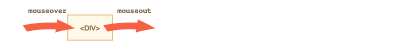
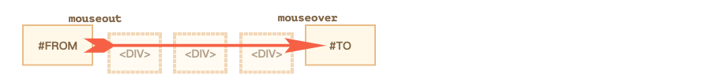
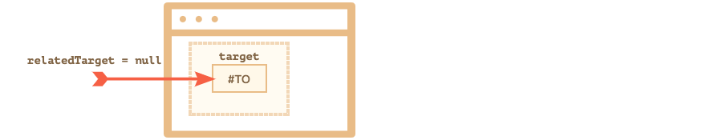
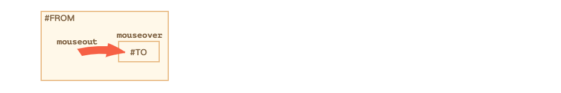
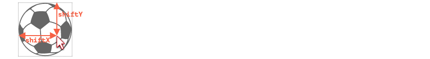

# 现代javascript教程

## 第2部分：浏览器：文档、事件和接口

### 第三章、事件细节

#### 3.1鼠标事件基础

鼠标事件不仅来自于 “mouse manipulators”，而且还在触摸设备上被模拟，以便可以让它们相互兼容。

在本章，我们将详细介绍鼠标事件及其属性。

##### [鼠标事件类型](https://zh.javascript.info/mouse-events-basics#shu-biao-shi-jian-lei-xing)

我们可以将鼠标事件分成两类：“简单”和“复杂”

###### [简单事件](https://zh.javascript.info/mouse-events-basics#jian-dan-shi-jian)

最常用的简单事件是：

- `mousedown/mouseup`

  在元素上单击/释放鼠标按钮。

- `mouseover/mouseout`

  鼠标指针从一个元素上移入/出。

- `mousemove`

  鼠标每次移动到元素上时都会触发事件。

…还有其他几种事件类型，我们稍后会讨论它们。

###### [复杂事件](https://zh.javascript.info/mouse-events-basics#fu-za-shi-jian)

- `click`

  如果使用鼠标左键，则在 `mousedown` 及 `mouseup` 相继触发后触发该事件。

- `contextmenu`

  如果使用鼠标右键，则在 `mousedown` 后触发。

- `dblclick`

  在对元素进行双击后触发。

复杂事件是由简单事件组成的，因此理论上我们可以没有它们而运转。但它们的存在却给我们提供了极大的便利。

###### [事件顺序](https://zh.javascript.info/mouse-events-basics#shi-jian-shun-xu)

一个动作可能会触发多个事件。

比如，在按下鼠标按钮时，单击会首先触发 `mousedown`，然后释放鼠标按钮时，会触发 `mouseup` 和 `click`。

在单个动作触发多个事件时，它们的顺序是固定的。也就是说会遵循 `mousedown` → `mouseup` → `click` 的顺序。事件按照相同的顺序被处理：`onmouseup` 在 `onclick` 运行之前完成。

单击以下按钮，你会看到事件。也可以尝试双击。

在测试台下面记录所有鼠标事件，如果它们之间有超过 1 秒的延迟，那么它们会被规则分开。

我们还可以看出 `which` 属性允许检测鼠标按钮。

##### [获取按钮：which](https://zh.javascript.info/mouse-events-basics#huo-qu-an-niu-which)

与单击相关的事件始终具有 `which` 属性，该属性允许获取准确的鼠标按钮。

它不用于 `click`和 `contextmenu` 事件，因为前者只发生在左键，而后者只发生在右击。

但如果我们跟踪 `mousedown` 和 `mouseup`，那么我们就需要它，因为这些事件在任意鼠标按钮按下时都会触发，所以 `which`允许区分 “right-mousedown” 和 “left-mousedown”。

有三个可能的值：

- `event.which == 1` —— 左按钮
- `event.which == 2` —— 中间按钮
- `event.which == 3` —— 右按钮

中间按钮现在有些特殊，所有很少被使用。

##### [组合键: shift、alt、ctrl 和 meta](https://zh.javascript.info/mouse-events-basics#zu-he-jian-shiftaltctrl-he-meta)

所有的鼠标事件都包含有关按下的组合键信息。

属性：

- `shiftKey`
- `altKey`
- `ctrlKey`
- `metaKey` (Cmd for Mac)

比如，下述按钮仅仅在 Alt+Shift+click 上有效：

```html
<button id="button">Alt+Shift+Click on me!</button>

<script>
  button.onclick = function(event) {
    if (event.altKey && event.shiftKey) {
      alert('Hooray!');
    }
  };
</script>
```

------

**注意：在 Mac 上我们通常使用 `Cmd` 而不是 `Ctrl`**

在 Windows 和 Linux 上修改键是 Alt、Shift 和 Ctrl。在 Mac 上还有：Cmd，它对应于属性 `metaKey`。

在大多数情况下，当 Windows/Linux 使用 Ctrl 时，Mac 的用户会使用 Cmd。因此当 Windows 用户按下 Ctrl+Enter 或 Ctrl+A 时，Mac 用户会按下 Cmd+Enter 或 Cmd+A 等，大多数 app 使用 Cmd 而不是 Ctrl。

因此如果我们想支持 Ctrl+click，那么对于 Mac 用户来说，使用 Cmd+click 也是有意义的。这对于 Mac 用户来说非常舒服。

即使我们想迫使 Mac 用户使用 Ctrl+click —— 也非常困难。问题在于：Mac 上左击 Ctrl 被解释为**右击**，它会生成 `contextmenu` 事件，而不是像 Windows/Linxu 的 `click` 事件。

因此如果我们想让所有操作系统的用户感觉舒适，那么我们应该和 `ctrlKey` 一起使用 `metaKey`。

对于 JS 代码，这意味着我们应该检查 `if (event.ctrlKey || event.metaKey)`。

##### [坐标：clientX/Y，pageX/Y](https://zh.javascript.info/mouse-events-basics#zuo-biao-clientxypagexy)

所有的鼠标事件都有两种形式的坐标：

1. 对于窗口而言：`clientX` 和 `clientY`。
2. 对于文档而言：`pageX` 和 `pageY`。

比如，如果我们有一个 500 x 500 的窗口，鼠标在左上方，那么 `clientX` 和 `clientY` 都是 `0`。如果鼠标在中间，那么 `clientX` 和 `clientY` 就是 `250`。和它在文档中的位置无关。它们类似于 `position:fixed`。

将鼠标移动到输入字段上，可以看到 `clientX/clientY`（它在 `iframe` 中，因此坐标是相对于 `iframe` 而言的）：

```html
<input onmousemove="this.value=event.clientX+':'+event.clientY" value="Mouse over me">
```

文档相对坐标是从文档的左上角而不是窗口中计算出来的。 坐标 `pageX`，`pageY` 与文档级别上的 `position:absolute` 非常相似。

你可以在本章中阅读到更多关于坐标的内容 [坐标](https://zh.javascript.info/coordinates)。

##### [Mousedown 没有选择](https://zh.javascript.info/mouse-events-basics#mousedown-mei-you-xuan-ze)

鼠标点击有一个让人不安的副作用。双击可以选择文本。

如果我们想自己处理点击事件，那么“额外”的选择就显得多余了。

比如，对下面的文本双击，除了我们的触发事件之外，还会选择文本：

```html
<b ondblclick="alert('dblclick')">Double-click me</b>
```

还有 CSS 方法可以终止选择：[CSS UI 草案](https://www.w3.org/TR/css-ui-4/) 中的 `user-select` 属性。

大多数浏览器都支持它的前缀：

```html
<style>
  b {
    -webkit-user-select: none;
    -moz-user-select: none;
    -ms-user-select: none;
    user-select: none;
  }
</style>

Before...
<b ondblclick="alert('Test')">
  Unselectable
</b>
...After
```

如果现在你双击“不可选”，它就不会被选中了。看起来好像起作用了。

…但有一个潜在的问题！文本变得无法被选中。即使用户从“之前”开始选择，“之后”结束，选择也会跳过“不可选择”部分。我们真的想让文本不可选么？

大部分时间，我们不会那么做。用户可能有合理的理由来选择文本，以便进行复制或其他需要。如果我们不让他那么做那么可能不太方便。所以这个解决方案没那么好。

我们只是想阻止双击进行选择，仅此而已。

文本选择是 `mousedown` 事件的默认浏览器操作。因此其他比较好的解决方案是处理 `mousedown` 并阻止它发生，就像这样：

```html
Before...
<b ondblclick="alert('Click!')" onmousedown="return false">
  Double-click me
</b>
...After
```

现在，在双击时不选择粗体元素。

内部文字仍然可以被选中。但选择却不应该从文本自身开始，而是应该在文字之前或之后开始。通常情况下，都是正常的。

------

**取消选择**

我们可以在事件处理器中用 “post-factum” 取消它，而不是**阻止**选择它。

这是方法：

```html
Before...
<b ondblclick="getSelection().removeAllRanges()">
  Double-click me
</b>
...After
```

如果你双击粗体元素，则会出现所选内容，然后立即删除，不过看起来不太好。

------

**防止复制**

如果我们想要禁用选择以保护内容不被复制粘贴，那么我们可以使用另一个事件：`oncopy`。

```html
<div oncopy="alert('Copying forbidden!');return false">
  Dear user,
  The copying is forbidden for you.
  If you know JS or HTML, then you can get everything from the page source though.
</div>
```

如果你试图在 `<div>` 中复制一段文本，这是行不通的，因为默认操作 `oncopy` 是被阻止的。

当然，这不能阻止用户打开 HTML 源代码，但并不是每个人都知道如何做到这一点。

##### [总结](https://zh.javascript.info/mouse-events-basics#zong-jie)

鼠标事件有如下属性：

- 按钮：`which`。
- 修饰符键（`true` 如果被按压）：`altKey`、`ctrlKey`、`shiftKey` 和 `metaKey`（Mac）。
  - 如果想要处理 Ctrl，那么不要忘记 Mac 用户，他们使用的是 Cmd，所以最好检查 `if (e.metaKey || e.ctrlKey)`。
- 窗口相对坐标：`clientX/clientY`。
- 文档相对坐标：`pageX/pageY`。

处理文本选择虽然也是不必要的点击副作用，但是却很重要。

还有几种可以做到这一点的方法，比如：

1. CSS 属性 `user-select:none`（带有浏览器前缀）完全禁用文本选择。
2. 使用 `getSelection().removeAllRanges()` 取消选择后的内容。
3. 处理 `mousedown` 并阻止默认操作（通常是最好的选择）。

#### 3.2移动：mouseover/out，mouseenter/leave

我们将深入研究鼠标在元素之间移动时所发生事件的更多细节。

##### [Mouseover/mouseout，relatedTarget](https://zh.javascript.info/mousemove-mouseover-mouseout-mouseenter-mouseleave#mouseovermouseoutrelatedtarget)

当鼠标指针出现在一个元素上时，`mouseover` 事件就会发生，而 `mouseout` 事件则发生在鼠标指针离开时。



这些事件很特别，因为它们有 `relatedTarget`。

对于 `mouseover`：

- `event.target` —— 是鼠标经过的那个元素。
- `event.relatedTarget` —— 是鼠标上一次经过的元素。

`mouseout` 则与之相反：

- `event.target` —— 是鼠标离开的元素。
- `event.relatedTarget` —— 是当前指针位置下的（鼠标进入的）元素。

------

**`relatedTarget` 可以为 `null`**

`relatedTarget` 属性可以为 `null`。

这很正常，而且意味着鼠标不是来源于另一个元素，而是窗口以外。或者是离开了窗口。

当我们在代码中使用 `event.relatedTarget` 时，我们应该记住这种可能性。如果我们访问 `event.relatedTarget.tagName`，那么就会出现错误。

##### [事件频率](https://zh.javascript.info/mousemove-mouseover-mouseout-mouseenter-mouseleave#shi-jian-pin-shuai)

当有鼠标移动时，`mousemove` 事件就会被触发。但是这不意味着每个像素都会产生一个事件。

浏览器会一直检查鼠标的位置。如果它注意到鼠标变化了，那么就会触发相应的事件。

这意味着如果访问者非常快地移动鼠标，那么 DOM 元素就会被跳过：



如果鼠标从上面的 `#FROM` 到 `#TO` 元素移动地非常快，那么中间的 `<div>`（或其中的一些）可能会被跳过。`mouseout` 事件可能会在 `#FROM` 上被触发，然后立即在 `#TO` 上触发 `mouseover`。

这在实践中是有用的，因为可能会有许多中间元素。我们并不是真的想要处理每一个进入离开的过程。

另一方面，我们应该记住，我们不能假设鼠标会缓慢地从一个事件移动到另一个事件。是的，它可以“跳”。

特别是，光标可能从窗口外跳进页面的中间。此时 `relatedTarget=null`，这是因为鼠标来自“窗口外（nowhere）”：



##### [进入子元素时的“额外” mouseout](https://zh.javascript.info/mousemove-mouseover-mouseout-mouseenter-mouseleave#jin-ru-zi-yuan-su-shi-de-ewai-mouseout)

想象一下 —— 鼠标指针进入一个元素。`mouseover` 被触发。然后光标进入一个子元素。有趣的是，在这种情况下 `mouseout`会被触发。光标仍然在元素中，但我们从它那儿接收到了 `mouseout` 事件！



这听起来很奇怪，但很容易解释。

**根据浏览器逻辑，鼠标光标在任意时间只会位于\*单个\*元素上 —— 嵌套最多的那个（而且是 z-index 最大的那个）。**

因此如果它转到另一个元素（甚至是一个子代），那么它将离开先前的那个。就这么简单。

##### [Mouseenter 和 mouseleave 事件](https://zh.javascript.info/mousemove-mouseover-mouseout-mouseenter-mouseleave#mouseenter-he-mouseleave-shi-jian)

`mouseenter/mouseleave` 事件类似于 `mouseover/mouseout`。当鼠标指针移入/移出元素时，它们也会被触发。

但有两个不同之处：

1. 元素内部的转换不会有影响。
2. `mouseenter/mouseleave` 事件不会冒泡。

这些事件在直觉上非常清晰。

当指针进入一个元素时 —— `mouseenter` 被触发，而它在元素内部的去向并不重要。只有当鼠标光标离开时，`mouseleave`事件才会被触发。

##### [事件委托](https://zh.javascript.info/mousemove-mouseover-mouseout-mouseenter-mouseleave#shi-jian-wei-tuo)

`mouseenter/leave` 事件非常简单，也非常容易使用。但它们不会冒泡。因此我们不能用它们来进行事件委托。

想象我们想要为表单元来处理鼠标的移入/移除。有几百个表单元。

通常的解决方案是 —— 在 `<table>` 中设置处理器，并在那里处理事件。但 `mouseenter/leave` 不会冒泡。因此如果类似事件发生在 `<td>` 上，那么只有 `<td>` 上的处理器才能捕获到它。

只有在移入/移出整个表单时才会触发处理器处理 `<table>` 上的 `mouseenter/leave`。在它内部转换的任何信息都无法获取。

没问题 —— 我们使用 `mouseover/mouseout`。

一个简单的处理器可能像这样：

```javascript
// 高亮鼠标下的单元
table.onmouseover = function(event) {
  let target = event.target;
  target.style.background = 'pink';
};

table.onmouseout = function(event) {
  let target = event.target;
  target.style.background = '';
};
```

进入到任何元素或者表格内的元素时，这些处理器都可以运行。

但我们只想处理整个 `<td>` 元素中的进出转换。高亮显示整个单元。我们不想处理 `<td>` 子级之间发生的转换。

其中一个解决方案：

- 记住在变量中高亮显示的 `<td>`。
- `mouseover` —— 如果我们仍然在当前 `<td>` 内，则忽略该事件。
- `mouseout` —— 如果没有离开 `<td>`，则忽略。

当我们在 ` 的子代间移动时，会过滤掉“额外”事件。

以下是包含所有细节的完整示例：

```javascript
// <td> under the mouse right now (if any)
let currentElem = null;

table.onmouseover = function(event) {
  if (currentElem) {
    // before entering a new element, the mouse always leaves the previous one
    // if we didn't leave <td> yet, then we're still inside it, so can ignore the event
    return;
  }

  let target = event.target.closest('td');
  if (!target || !table.contains(target)) return;

  // yeah we're inside <td> now
  currentElem = target;
  target.style.background = 'pink';
};


table.onmouseout = function(event) {
  // if we're outside of any <td> now, then ignore the event
  if (!currentElem) return;

  // we're leaving the element -- where to? Maybe to a child element?
  let relatedTarget = event.relatedTarget;
  if (relatedTarget) { // possible: relatedTarget = null
    while (relatedTarget) {
      // go up the parent chain and check -- if we're still inside currentElem
      // then that's an internal transition -- ignore it
      if (relatedTarget == currentElem) return;
      relatedTarget = relatedTarget.parentNode;
    }
  }

  // we left the element. really.
  currentElem.style.background = '';
  currentElem = null;
};
```

```css
#text {
  display: block;
  height: 100px;
  width: 456px;
}

#table th {
  text-align: center;
  font-weight: bold;
}

#table td {
  width: 150px;
  white-space: nowrap;
  text-align: center;
  vertical-align: bottom;
  padding-top: 5px;
  padding-bottom: 12px;
}

#table .nw {
  background: #999;
}

#table .n {
  background: #03f;
  color: #fff;
}

#table .ne {
  background: #ff6;
}

#table .w {
  background: #ff0;
}

#table .c {
  background: #60c;
  color: #fff;
}

#table .e {
  background: #09f;
  color: #fff;
}

#table .sw {
  background: #963;
  color: #fff;
}

#table .s {
  background: #f60;
  color: #fff;
}

#table .se {
  background: #0c3;
  color: #fff;
}

#table .highlight {
  background: red;
}
```

```html
<!DOCTYPE HTML>
<html>

<head>
  <meta charset="utf-8">
  <link rel="stylesheet" href="style.css">
</head>

<body>


  <table id="table">
    <tr>
      <th colspan="3"><em>Bagua</em> Chart: Direction, Element, Color, Meaning</th>
    </tr>
    <tr>
      <td class="nw"><strong>Northwest</strong>
        <br>Metal
        <br>Silver
        <br>Elders
      </td>
      <td class="n"><strong>North</strong>
        <br>Water
        <br>Blue
        <br>Change
      </td>
      <td class="ne"><strong>Northeast</strong>
        <br>Earth
        <br>Yellow
        <br>Direction
      </td>
    </tr>
    <tr>
      <td class="w"><strong>West</strong>
        <br>Metal
        <br>Gold
        <br>Youth
      </td>
      <td class="c"><strong>Center</strong>
        <br>All
        <br>Purple
        <br>Harmony
      </td>
      <td class="e"><strong>East</strong>
        <br>Wood
        <br>Blue
        <br>Future
      </td>
    </tr>
    <tr>
      <td class="sw"><strong>Southwest</strong>
        <br>Earth
        <br>Brown
        <br>Tranquility
      </td>
      <td class="s"><strong>South</strong>
        <br>Fire
        <br>Orange
        <br>Fame
      </td>
      <td class="se"><strong>Southeast</strong>
        <br>Wood
        <br>Green
        <br>Romance
      </td>
    </tr>

  </table>

  <script src="script.js"></script>

</body>
</html>

```

尝试在表格单元之间或内部移动光标，太快或太慢都有问题。与之前不同的是只有 ` 作为一个整体被高亮显示。

##### [总结](https://zh.javascript.info/mousemove-mouseover-mouseout-mouseenter-mouseleave#zong-jie)

我们讲述了 `mouseover`、`mouseout`、`mousemove`、`mouseenter` 和 `mouseleave` 事件。

值得注意的事情：

- 鼠标的快速移动可以使 `mouseover, mousemove, mouseout` 跳过一些中间元素。
- `mouseover/out` 事件和 `mouseenter/leave` 事件有一个额外的目标：`relatedTarget`。这是作为起点/终点的元素，是对 `target` 的补充。
- 即使从父元素转到子元素时，`mouseover/out` 也会被触发。它们假设鼠标一次只会移入一个元素 —— 最深的那个。
- `mouseenter/leave` 事件不会冒泡，而且当鼠标进入子元素时也不会被触发。它们只关注鼠标在整个元素的内部还是外部。

##### 任务

###### ["Smart" 工具提示](https://zh.javascript.info/mousemove-mouseover-mouseout-mouseenter-mouseleave#smart-gong-ju-ti-shi)

**我自闭了，好难。**

#### 3.3拖放鼠标事件

拖放是一个很好的界面解决方案。从复制和移动（参考文件管理）到排序（放入购物车），拖放是一种简洁明了的方法。

在现代 HTML 标准中，有一个[拖动事件的部分](https://html.spec.whatwg.org/multipage/interaction.html#dnd)。

这很有趣，因为它们允许轻松地解决一些简单的任务，而且允许处理“外部”文件拖放到浏览器中的事件。因此我们可以在 OS 文件管理中获取文件，并将其拖动到浏览器窗口。然后 JavaScript 获取对其内容的访问权限。

但是本地的拖动事件总是有局限性。比如，我们可以把拖动范围限制在某个区域内。而且我们也可以把它变成 “horizontal” 或 “vertical”。还有其他的拖放任务无法通过使用 API 实现。

在这里，我们将看到如何使用鼠标事件实现拖放。并不难。

##### [拖放算法](https://zh.javascript.info/mouse-drag-and-drop#tuo-fang-suan-fa)

拖放基础算法就像这样：

1. 在可拖动元素上捕获 `mousedown` 事件。
2. 准备要移动的元素（可能创建它的副本或其他任何东西）。
3. 然后在 `mousemove` 上，通过改变 `left/top` 和 `position:absolute` 来移动它。
4. 在 `mouseup`（释放按钮）中 —— 执行所有完成拖放相关的动作。

这些是基础。我们可以对其进行拓展，例如，当鼠标在可拖动元素上悬停时，高亮这个元素。

这是拖放球的算法：

```javascript
ball.onmousedown = function(event) { // (1) 启动进程

  // (2) 准备移动：确保 absolute，以及用 z-index 确保在顶部
  ball.style.position = 'absolute';
  ball.style.zIndex = 1000;
  // 将它从当前父亲中直接移到 body 中
  // 确保它的位置是相对于 body 的
  document.body.append(ball);
  // ...将绝对定位的球放在光标下

  moveAt(event.pageX, event.pageY);

  // 将球中心固定在 (pageX, pageY) 坐标上
  function moveAt(pageX, pageY) {
    ball.style.left = pageX - ball.offsetWidth / 2 + 'px';
    ball.style.top = pageY - ball.offsetHeight / 2 + 'px';
  }

  function onMouseMove(event) {
    moveAt(event.pageX, event.pageY);
  }

  // (3) 在 mousemove 事件中移动球
  document.addEventListener('mousemove', onMouseMove);

  // (4) 释放球，移除不需要的处理器
  ball.onmouseup = function() {
    document.removeEventListener('mousemove', onMouseMove);
    ball.onmouseup = null;
  };

};
```

如果我们运行代码，我们会发现一些奇怪的事情。在拖放的一开始，球会 “forks”：我们开始拖动它的 “clone”。

尝试拖放鼠标，你会看到奇怪的行为。

这是因为浏览器有自己拖放图像功能和其他一些自动运行可能与我们的产生冲突的元素。

如果禁用：

```javascript
ball.ondragstart = function() {
  return false;
};
```

现在一切都会好起来的。

另一个重要的方面是 —— 我们在 `document` 上跟踪 `mousemove`，而不是在 `ball` 上。第一眼看，鼠标似乎总是在球的上方，我们可以在上面放 `mousemove`。

正如我们记得的那样，`mousemove` 会经常被触发，但不会针对每个像素都如此。因此在快速移动之后，光标可以从文档中心的某个地方（甚至是窗口外）从球上跳出来。

因此为了捕获它，我们应该监听 `document`。

##### [修正定位](https://zh.javascript.info/mouse-drag-and-drop#xiu-zheng-ding-wei)

在上述例子中，球总是以指针为中心的：

```javascript
ball.style.left = pageX - ball.offsetWidth / 2 + 'px';
ball.style.top = pageY - ball.offsetHeight / 2 + 'px';
```

不错，但这存在副作用。我们可以在球的任何地方使用 `mousedown` 来开始拖放。如果在边缘那么做，那么球就会突然“跳”到以指针为中心的位置。

如果我们保持元素相对指针的初始位移，情况会更好。

例如，我们从球的边缘处开始拖动，那么光标在拖动时应该保持在边缘。



1. 当访问者按下按钮（`mousedown`）时 —— 我们可以使用变量 `shiftX/shiftY` 来记住光标到球左上角的距离。我们应该在拖动时保持这样的距离。

   我们可以减去坐标来获取位移：

   ```javascript
   // onmousedown
   let shiftX = event.clientX - ball.getBoundingClientRect().left;
   let shiftY = event.clientY - ball.getBoundingClientRect().top;
   ```

   请注意，在 JavaScript 中没有获取文档坐标的方法，因此我们在这里使用相对于窗口的坐标。

2. 然后，在拖动球时，我们将球放置在相对于指针移动的位置上，就像这样：

   ```javascript
                                         // onmousemove
   // ball has position:absoute
   ball.style.left = event.pageX - shiftX + 'px';
   ball.style.top = event.pageY - shiftY + 'px';
   ```

具有更好定位的最终代码：

```javascript
ball.onmousedown = function(event) {

  let shiftX = event.clientX - ball.getBoundingClientRect().left;
  let shiftY = event.clientY - ball.getBoundingClientRect().top;

  ball.style.position = 'absolute';
  ball.style.zIndex = 1000;
  document.body.append(ball);

  moveAt(event.pageX, event.pageY);

  // 将球中心固定在 考虑初始偏移的(pageX, pageY) 坐标上
  function moveAt(pageX, pageY) {
    ball.style.left = pageX - shiftX + 'px';
    ball.style.top = pageY - shiftY + 'px';
  }

  function onMouseMove(event) {
    moveAt(event.pageX, event.pageY);
  }

  // (3) 用 mousemove 移动球
  document.addEventListener('mousemove', onMouseMove);

  // (4) 释放球，移除不需要的处理器
  ball.onmouseup = function() {
    document.removeEventListener('mousemove', onMouseMove);
    ball.onmouseup = null;
  };

};

ball.ondragstart = function() {
  return false;
};
```

如果我们按在球的右下角进行拖动，这种差异就会特别明显。在前面的示例中，球在指针下“跳动”。现在，它从当前位置跟随鼠标会很流畅。

##### [检测是否可释放](https://zh.javascript.info/mouse-drag-and-drop#jian-ce-shi-fou-ke-shi-fang)

在之前的示例中，球可以停放到“任何地方”。在实际中，我们通常把一个元素放在另一个元素上。例如，将文件放入文件夹，或者用户放入回收站之类的操作。

抽象地，我们取一个（可拖放的）“draggable” 元素，并将其放在（可释放的）“droppable” 元素上。

我们需要知道拖放结束时的可释放目标 —— 执行相应的动作，最好是在拖动过程中高亮显示。

这个解决方案很有意思，只是有点麻烦，所以我们在这里提及相关内容。

第一个想法是什么？可能是将 `onmouseover/mouseup` 处理器放在潜在的可释放的元素上，然后检测鼠标指针出现在它们上面的时机。这样我们就知道了我们正在这个元素上进行拖/放操作

但这并不会运行。

问题是当我们拖动时，可拖动元素总是在其他元素之上。而且鼠标事件总是发生在顶部元素上，而不会在元素之下的其他元素上发生。

比如，下面有两个 `<div>` 元素，红色在蓝色顶部。没有方法可以在蓝色的事件中捕获到一个事件，因为红色在顶部：

```html
<style>
  div {
    width: 50px;
    height: 50px;
    position: absolute;
    top: 0;
  }
</style>
<div style="background:blue" onmouseover="alert('never works')"></div>
<div style="background:red" onmouseover="alert('over red!')"></div>
```

与一个可以拖动的元素相同。球总是在其他元素之上，因此事件会在其上发生。无论我们在低元素上如何设置处理器，它们都不会起作用。

这就是为什么起初将处理器放在潜在的可释放的元素中的想法，在实际操作中无效的原因。它们无法运行。

那么，该如何做？

有一个叫做 `document.elementFromPoint(clientX, clientY)` 的方法。它会根据给定的窗口相对坐标，返回该处嵌套最深的元素（其实是最顶层的元素，这里感觉写错了）（如果坐标在窗口之外，则返回 `null`）。

因此我们可以检测任何情况下的鼠标事件中，指针下面的潜在可释放元素，就像这样：

```javascript
// 在鼠标事件处理器中
ball.hidden = true; // (*)
let elemBelow = document.elementFromPoint(event.clientX, event.clientY);
ball.hidden = false;
// elemBelow 是球下面的元素。如果它是可释放的，那么我们就可以对它进行处理。
```

请注意：我们需要在调用 `(*)` 之前隐藏球。否则，我们通常会在这些坐标上有个球，因为它的是在指针下的顶部元素：`elemBelow=ball`。因此，我们将其隐藏并立即再次显示。

在任何时候，我们都可以使用该代码检测我们“掠过”的东西。当它发生时会进行释放处理。

拓展了 `onMouseMove` 方法，用来查找“可释放的”元素的代码：

```html
<!doctype html>
<html>

<head>
  <meta charset="UTF-8">
  <style type="text/css">
  	#gate {
      cursor: pointer;
      margin-bottom: 100px;
      width: 83px;
      height: 46px;
    }

    #ball {
      cursor: pointer;
      width: 40px;
      height: 40px;
    }
  </style>

</head>

<body>

  <p>Drag the ball.</p>

  

  

  <script>
    let currentDroppable = null; // 我们正在通过的可释放元素

    ball.onmousedown = function(event) {

      let shiftX = event.clientX - ball.getBoundingClientRect().left;
      let shiftY = event.clientY - ball.getBoundingClientRect().top;

      ball.style.position = 'absolute';
      ball.style.zIndex = 1000;
      document.body.append(ball);

      moveAt(event.pageX, event.pageY);

      function moveAt(pageX, pageY) {
        ball.style.left = pageX - shiftX + 'px';
        ball.style.top = pageY - shiftY + 'px';
      }

      function onMouseMove(event) {
        moveAt(event.pageX, event.pageY);

        ball.hidden = true;
        let elemBelow = document.elementFromPoint(event.clientX, event.clientY);
        ball.hidden = false;
				// mousemove 事件可能会在窗口外被触发（当球被拖出屏幕时）
 				// 如果 clientX/clientY 在窗口外，那么 elementfromPoint 会返回 null
        if (!elemBelow) return;
				// 潜在的可释放的将被标记为 "droppable" 类（可以是其他逻辑）
        let droppableBelow = elemBelow.closest('.droppable');
        if (currentDroppable != droppableBelow) { // 如果有任何改变
          if (currentDroppable) { // null when we were not over a droppable before this event
            leaveDroppable(currentDroppable);
          }
          currentDroppable = droppableBelow;
          if (currentDroppable) { // null if we're not coming over a droppable now
            // (maybe just left the droppable)
            enterDroppable(currentDroppable);
          }
        }
      }

      document.addEventListener('mousemove', onMouseMove);

      ball.onmouseup = function() {
        document.removeEventListener('mousemove', onMouseMove);
        ball.onmouseup = null;
      };

    };

    function enterDroppable(elem) {
      elem.style.background = 'pink';
    }

    function leaveDroppable(elem) {
      elem.style.background = '';
    }

    ball.ondragstart = function() {
      return false;
    };
  </script>


</body>
</html>
```

现在在整个过程中，我们在 `currentDroppable` 变量中存储了当前 “drop target”，并且可以使用它来高亮显示或任何其他内容。

##### [总结](https://zh.javascript.info/mouse-drag-and-drop#zong-jie)

我们考虑了一种基础的`拖放`算法。

关键部分：

1. 事件流：`ball.mousedown` → `document.mousemove` → `ball.mouseup`（取消原生 `ondragstart`）。
2. 在拖拽启动时 —— 记住指针相对于元素的初始位移：shiftX/shiftY` 并在拖动过程保持状态。
3. 使用 `document.elementFromPoint` 检测指针下可放置的元素。

我们可以在这个基础上做很多的工作。

- 在 `mouseup` 事件中我们可以完成释放：改变数据，移动元素
- 我们可以高亮我们涉及的元素。
- 我们可以把拖动范围限制在某个区域内
- 我们可以对 `mousedown/up` 使用事件委托。一个大范围事件处理器可以检查 `event.target`，它可以管理数百个元素的拖放。
- 等等。

有一些已经构建好架构的框架：`DragZone`、`Droppable`、`Draggable` 和其他类。它们中的大多数都做了类似的事情，所以现在应该很容易理解了。或者我们自己滚动，因为你已经了解了如何处理这个过程，它可能比适应其他东西更灵活。

##### 任务

###### [在领域周围拖动 superhero](https://zh.javascript.info/mouse-drag-and-drop#zai-ling-yu-zhou-wei-tuo-dong-superhero)

**自闭次数+1，笔者实在太菜了。**

#### 3.4键盘：按下键盘和释放按键

在我们开始键盘之前，请注意现代设备上还有其他方法可以“输入内容”。比如，人们可以使用语音识别（尤其是移动设备）或鼠标的复制/粘贴。

因此，如果我们想要跟踪 `<input>` 区域中的任何输入，键盘事件是不够的。无论如何，还需要一个名为 `input`的事件来处理 `<input>` 字段的变更。对于这样的任务来说，这可能是一个更好的选择。我们之后将在 [事件：change、input、cut、copy 和 paste](https://zh.javascript.info/events-change-input) 章节中讨论它们。

当我们想要处理键盘动作时，应使用键盘事件（虚拟键盘也算）。例如，对箭头键 Up 和 Down 或热键（包括键的组合）作出反应。

##### [Teststand](https://zh.javascript.info/keyboard-events#keyboard-test-stand)

**里面的东西蛮好玩的，笔记不太好搬运，大家可以自行前去娱乐，😁。**

##### [Keydown 和 keyup](https://zh.javascript.info/keyboard-events#keydown-he-keyup)

当键被按下时，`keydown` 事件会发生，而当键被释放时，`keyup` 事件会发生。

###### [event.code 和 event.key](https://zh.javascript.info/keyboard-events#eventcode-he-eventkey)

事件对象 `key` 属性允许获取字符，而事件对象的 `code` 属性允许获取“物理秘钥代码”。

例如，相同的键 Z 可以按下或者不按下 `Shift`。这给了我们两个不同的字符：小写的 `z` 和大写 `Z`。

`event.key` 正是这个字符，并且它将是不同的。但是，`event.code` 是相同的：

| Key     | `event.key` | `event.code` |
| :------ | :---------- | :----------- |
| Z       | `z`（小写） | `KeyZ`       |
| Shift+Z | `Z`（大写） | `KeyZ`       |

如果用户使用不同的语言，那么切换到另一种语言就会产生一个完全不同的字符，而不是 `"Z"`。这将成为 `event.key` 的值，而 `event.code` 则始终是一样的：`"KeyZ"`。

------

**“KeyZ” 和其他密钥代码**

每个键都有取决于其在键盘上位置的代码。[键值代码在 UI 事件代码规范中中的描述](https://www.w3.org/TR/uievents-code/)。

例如：

- 字符键有代码 `"Key<letter>"`：`"KeyA"` 和 `"KeyB"` 等。
- 数字键有代码：`"Digit<number>"`：`"Digit0"` 和 `"Digit1"` 等。
- 特殊秘钥按其名称编码：`"Enter"`、`"Backspace"` 和 `"Tab"` 等。

有几种通用的键盘布局，规范中为它们每个给出了键值代码。

有关更多代码，请参见[该规范的字母数字部分](https://www.w3.org/TR/uievents-code/#key-alphanumeric-section) 或者只是尝试上面的 [teststand](https://zh.javascript.info/keyboard-events#keyboard-test-stand)。

------

**Case matters: `"KeyZ"`, not `"keyZ"`**

显而易见的，但人们仍会搞错。

请避开错误类型：它是 `KeyZ` 而不是 `keyZ`。像 `event.code=="keyZ"` 这样的检查不起作用：`"Key"` 的第一个字母必须大写。

------

如果键没有给出任何字符呢？例如，Shift 或 F1 或其他的。对于那些键的 `event.key` 则与 `event.code`大致相同：

| Key       | `event.key` | `event.code`                |
| :-------- | :---------- | :-------------------------- |
| F1        | `F1`        | `F1`                        |
| Backspace | `Backspace` | `Backspace`                 |
| Shift     | `Shift`     | `ShiftRight` 或 `ShiftLeft` |

请注意 `event.code` 确切地标明了哪个键被按下。例如，大多数键盘有两个 Shift 键，一个在左边，一个在右边。`event.code` 确切地告诉我们按下了哪个键，并且 `event.key` 对键的含义负责：它是什么（一个"Shift"）。

比方说，我们想要处理一个热键：Ctrl+Z（或 Mac 上的 Cmd+Z）。大多数文本编辑器将“撤销”动作挂在上面。我们可以在 `keydown` 上设置一个监听者，检查哪个键被按下 —— 用来检测我们什么时候需要热键。

请回答问题 —— 在这样的监听者中，我们要监测的是 `event.key` 还是 `event.code` 的值？

请暂停并回答。

决定好了么？

如果你已经理解了，那么答案当然是 `event.code`，因为在那里我们不想要 `event.key`。`event.key` 的值会因为语言的不同或者 `CapsLock` 的使用而改变。`event.code` 的值被严格绑定到秘钥上，因此我们现在开始：

```javascript
document.addEventListener('keydown', function(event) {
  if (event.code == 'KeyZ' && (event.ctrlKey || event.metaKey)) {
    alert('Undo!')
  }
});
```

##### [自动重复](https://zh.javascript.info/keyboard-events#zi-dong-zhong-fu)

如果按键时间足够长，它就会开始重复：`keydown` 会被一次又一次触发，并且当它释放时我们终于得到 `keyup`。所以有很多的 `keydown` 却只有一个 `keyup` 很正常。

对于所有的重复键，事件对象的 `event.repeat` 属性都设置为 `true`。

##### [默认动作](https://zh.javascript.info/keyboard-events#mo-ren-dong-zuo)

默认动作各不相同，因为键盘可以开始许多可能的事情。

比如：

- 一个字符出现在屏幕上（最明显的结果）。
- 删除一个字符（Delete 键）。
- 滚动页面（PageDown 键）。
- 浏览器打开“保存页面”对话框（Ctrl+S）
- …等等。

阻止对 `keydown` 的默认动作可以取消其中的大多数操作，但基于操作系统的特殊键除外。例如在 Windows 里，Alt+F4 关闭当前浏览器窗口。也没有办法通过阻止 JavaScript 中的默认动作来阻止它。

例如，下述的 `<input>` 期望输入值是电话号码，因此他不会接受除数字、`+`、`()` 或 `-`以外的其他键：

```html
<script>
function checkPhoneKey(key) {
  return (key >= '0' && key <= '9') || key == '+' || key == '(' || key == ')' || key == '-';
}
</script>
<input onkeydown="return checkPhoneKey(event.key)" placeholder="Phone, please" type="tel">
```

请注意，像 Backspace、Left、Right、Ctrl+V 这样的特殊键在输入中无效。这是严格过滤器 `checkPhoneKey` 的副作用。

让我们放松一下：

```html
<script>
function checkPhoneKey(key) {
  return (key >= '0' && key <= '9') || key == '+' || key == '(' || key == ')' || key == '-' ||
    key == 'ArrowLeft' || key == 'ArrowRight' || key == 'Delete' || key == 'Backspace';
}
</script>
<input onkeydown="return checkPhoneKey(event.key)" placeholder="Phone, please" type="tel">
```

现在箭头和删除工作正常。

…但我们仍然可以使用鼠标右键 + 粘贴来输入任何内容。因此这个过滤器并不是 100% 可靠。我们可以让它这样做，因为大多数时候它是有效的。或者另一种方法是跟踪 `input` 事件 —— 在任何修改后被触发。这样我们可以监测新值并在其无效时高亮/修改它。

##### [遗存](https://zh.javascript.info/keyboard-events#yi-cun)

在过去，有一个 `keypress` 事件，还有事件对象属性 `keyCode`、`charCode` 和 `which`。

大多数的浏览器都不兼容，以至于开发者决定放弃这些。以前的代码仍然可以正常工作，因为浏览器还是支持它们的，但现在没有必要再使用这些代码了。

这章有包括了它们详细描述的时间。但现在我们可以忘记它们了。

##### [总结](https://zh.javascript.info/keyboard-events#zong-jie)

按一个键总是会产生一个键盘事件，无论是符号键还是特殊键，比如 Shift 或 Ctrl 等。唯一的例外是 Fn，它有时会出现在笔记本电脑键盘上。它没有键盘事件，因为它通常在比 OS 低的级别上实现的。

键盘事件：

- `keydown` —— 长久按键（如果按下长键则自动重复），
- `keyup` —— 释放按键时。

主键盘事件属性：

- `code` —— “按键代码”（`"KeyA"`、`"ArrowLeft"` 等），具体到键盘上键的物理位置。
- `key` —— 非字符键的字符（`"A"`、`"a"` 等），通常具有和 `code` 一样的值。

过去，键盘事件有时用于跟踪用户在表单字段中的输入。这很不可靠，因为输入源可以不同。我们有 `input` 和 `change` 事件来处理任何输入（之后我们会在 [事件：change、input、cut、copy 和 paste](https://zh.javascript.info/events-change-input) 章节中作进一步介绍）。它们在任何输入后触发，包括鼠标或语音识别。

当我们真正想要键盘时，我们应该使用键盘事件。比如，对热键或特殊键作出反应。

#### 3.5滚动

滚动事件允许在页面或元素上滚动时作出反应。我们可以在这里做一些有用的事情。

比如：

- 根据用户在文档中的位置显示/隐藏其他控件或信息。
- 当用户滚动到页面末尾时加载更多的数据。

下面是一个显示当前滚动的小函数：

```javascript
window.addEventListener('scroll', function() {
  document.getElementById('showScroll').innerHTML = pageYOffset + 'px';
});
```

`scroll` 事件在 `window` 和可滚动元素上都可以运行。

##### [防止滚动](https://zh.javascript.info/onscroll#fang-zhi-gun-dong)

我们怎样让某些东西不可滚动呢？我们不能在 `onscroll` 监听者中通过使用 `event.preventDefault()` 来阻止滚动，因为它在滚动发生**之后**才触发。

但我们可以在导致滚动的事件上使用 `event.preventDefault()` 来阻止滚动。

例如：

- `wheel` 事件 —— 鼠标滚轮（“滚动”触控板也会生成它）。
- pageUp 和 pageDown 的 `keydown` 事件。

有时可能会有帮助，但还有很多滚动方式，所以很难处理它们。因此，使用 CSS 让一些东西不可滚动更为可靠，比如 `overflow` 属性。

这里有几个你可以完成的练习，你也可以看它们关于 `onscroll` 的应用。

##### 任务

###### [加载可视化图像](https://zh.javascript.info/onscroll#jia-zai-ke-shi-hua-tu-xiang)

**这个不算难题，但是很有价值。**


