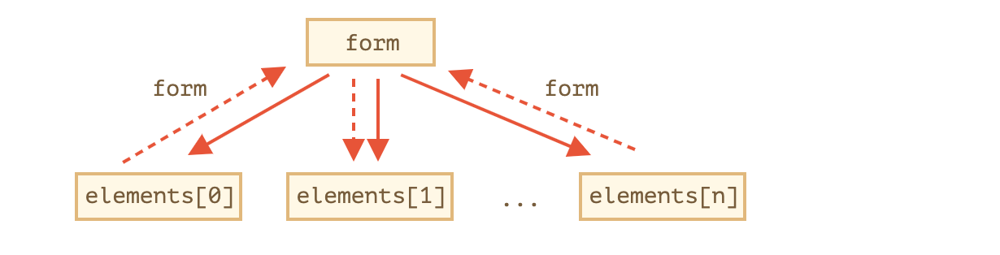

# 现代javascript教程

## 第2部分：浏览器：文档、事件和接口

### 第四章、表单，控件

#### 4.1表单属性和方法

表单以及例如 `<input>` 的控制元素有大量特殊的属性和事件。

如果我们知道这些，那么处理表单可以变得更加简单。

##### [导航：表单和元素](https://zh.javascript.info/form-elements#dao-hang-biao-dan-he-yuan-su)

文档中的表单是一个特殊集合 `document.forms` 中的成员。

`document.forms` 是一个**命名**集合：我们既可以使用名字也可以使用索引来获取表单。

```javascript
document.forms.my - 包含了 name="my" 的表单
document.forms[0] - 文档中的第一个表单
```

当我们有了一个表单，其中任何的元素都可以通过命名集合 `form.elements` 来获取到。

比如说：

```html
<form name="my">
  <input name="one" value="1">
  <input name="two" value="2">
</form>

<script>
  // 获取表单
  let form = document.forms.my; // <form name="my"> 元素

  // 获取表单中的元素
  let elem = form.elements.one; // <input name="one"> 元素

  alert(elem.value); // 1
</script>
```

可能会有多个名称相同的元素，这种情况经常在处理单选按钮中出现。

在那种情况下 `form.elements[name]` 将会是一个集合，比如说：

```html
<form>
  <input type="radio" name="age" value="10">
  <input type="radio" name="age" value="20">
</form>

<script>
let form = document.forms[0];

let ageElems = form.elements.age;

alert(ageElems[0].value); // 10，第一个单选按钮的 value 值
</script>
```

这些导航属性并不依赖于标签的结构。所有的元素，无论它们在表单中嵌套的有多么深，都可以通过 `form.elements` 获取到。

------

**Fieldsets 来作为 “subforms”**

一个表单会包含一个或者多个 `<fieldset>` 元素。它们也支持 `elements` 属性。

比如说：

```html
<body>
  <form id="form">
    <fieldset name="userFields">
      <legend>info</legend>
      <input name="login" type="text">
    </fieldset>
  </form>

  <script>
    alert(form.elements.login); // <input name="login">

    let fieldset = form.elements.userFields;
    alert(fieldset); // HTMLFieldSetElement

    // 我们可以从 form 或者 fieldset 中获取输入
    alert(fieldset.elements.login == form.elements.login); // true
  </script>
</body>
```

------

**更简短的表示方式：`form.name`**

还有一个更简短的表示方式：我们可以通过 `form[index/name]` 来访问元素。

使用这种表示方式我们可以写 `form.login` 而不是 `form.elements.login` 来访问输入元素。

这也有效，但是会有一个小问题：如果我们访问一个元素，然后修改它的 `name`，它仍然可以通过旧的 name 访问到（当然也能通过新的 name 访问）。

我们可以很容易在一个例子中看到这个情况：

```html
<form id="form">
  <input name="login">
</form>

<script>
  alert(form.elements.login == form.login); // true, the same <input>
  alert(form.elements.login == form.login); // true，同样的 <input>

  form.login.name = "username"; // 修改 input 的 name 属性

  // form.elements 更新 name 属性:
  alert(form.elements.login); // undefined
  alert(form.elements.username); // 输入

  // 直接访问可以同时使用 input 的两个 name：旧的以及新的
  alert(form.username == form.login); // true
</script>
```

这通常来说并不是一个问题，因为我们很少修改表单元素的 name。

##### [反向引用：element.form](https://zh.javascript.info/form-elements#fan-xiang-yin-yong-elementform)

对于任何元素，其对应的表单都可以通过 `element.form` 访问到。因此不仅表单可以引用所有元素，元素也可以引用表单。

这里有一个表示关系的图片：



比如说：

```html
<form id="form">
  <input type="text" name="login">
</form>

<script>
  // form -> element
  let login = form.login;

  // element -> form
  alert(login.form); // HTMLFormElement
</script>
```

##### [表单元素](https://zh.javascript.info/form-elements#biao-dan-yuan-su)

让我们来谈谈表单控件，主要关注于它们具体的特性。

###### [input 和 textarea](https://zh.javascript.info/form-elements#input-he-textarea)

通常来说，我们可以使用 `input.value` 或者 `input.checked` 来访问复选框的值。

就像下面这样：

```javascript
input.value = "New value";
textarea.value = "New text";

input.checked = true; // 用于复选框或者单选按钮
```

------

**使用 `textarea.value` 而不是 `textarea.innerHTML`**

请注意我们永远不应该使用 `textarea.innerHTML`：它只储存了最初在页面上的 HTML 内容，而不是当前的。

###### [select 和 option](https://zh.javascript.info/form-elements#select-he-option)

一个 `<select>` 元素有 3 个重要的属性：

1. `select.options` —— `<option>` 元素的集合，
2. `select.value` —— 所选选项的值，
3. `select.selectedIndex` —— 所选选项的索引。

所以我们会有三种方式来设置一个 `<select>` 元素的值：

1. 找到所需要的 `<option>` 元素之后设置 `option.selected` 为 `true`。
2. 设置 `select.value` 为对应的值。
3. 设置 `select.selectedIndex` 为对应选项的索引。

第一个方式是最显而易见的，但是 `(2)` 和 `(3)` 通常来说会更简便。

下面是一个例子：

```html
<select id="select">
  <option value="apple">Apple</option>
  <option value="pear">Pear</option>
  <option value="banana">Banana</option>
</select>

<script>
  // 所有这三行做的是同一件事
  select.options[2].selected = true;
  select.selectedIndex = 2;
  select.value = 'banana';
</script>
```

和大多数其它控件不同，`<select multiple>` 允许多选。在这种情况下，我们需要遍历 `select.options` 来获取所有选定的值。

就像下面这样：

```html
<select id="select" multiple>
  <option value="blues" selected>Blues</option>
  <option value="rock" selected>Rock</option>
  <option value="classic">Classic</option>
</select>

<script>
  // 从 multi-select 中获取所有选定的值
  let selected = Array.from(select.options)
    .filter(option => option.selected)
    .map(option => option.value);

  alert(selected); // blues，rock
</script>
```

`<select>` 元素完整的规范可以在 https://html.spec.whatwg.org/multipage/forms.html#the-select-element 上找到。

###### [新的选项](https://zh.javascript.info/form-elements#xin-de-xuan-xiang)

在[选项元素](https://html.spec.whatwg.org/multipage/forms.html#the-option-element)的规范中，有一个很不错的简短语法用来创建 `<option>` 元素：

```javascript
option = new Option(text, value, defaultSelected, selected);
```

该方法调用参数如下：

- `text` —— 选项中的文本，
- `value` —— 选项的默认值,
- `defaultSelected` —— 如果这个值是 `true`，那么 `selected` 属性就会默认创建，
- `selected` —— 如果这个值是`true`，那么这个选项就是已经被选择了。

比如说：

```javascript
let option = new Option("Text", "value");
// 创建 <option value="value">Text</option>
```

选择相同的元素：

```javascript
let option = new Option("Text", "value", true, true);
```

------

**`<option>` 的额外属性**

选项元素具有其它额外的属性：

- `selected`

  是否选择了该选项。

- `index`

  在该 option 所属的 `<select>` 其所对应的索引。

- `text`

  选项的文本内容（可以被任何访问者看到）

##### [总结](https://zh.javascript.info/form-elements#zong-jie)

表单导航：

- `document.forms`

  一个表单元素可以通过 `document.forms[name/index]` 访问到。

- `form.elements`

  表单元素以通过 `form.elements[name/index]` 的方式访问，或者也可以使用 `form[name/index]`。`elements` 属性也适用于 `<fieldset>`。

- `element.form`

  元素通过 `form` 属性来访问它们所属的表单。

值可以通过 `input.value`，`textarea.value`，`select.value` 等来获取到，对于单选框和复选框来说还可以使用 `input.checked`。

对于 `<select>` 元素我们可以通过索引 `select.selectedIndex` 来获取它的值，也可以使用选项集合 `select.options`。该元素和其它元素的完整规范可以看 https://html.spec.whatwg.org/multipage/forms.html。

这些是开始使用表单的基础知识。在下一章中，我们将会介绍可能在任何元素上出现的 `focus` 和 `blur` 事件，但主要是在表单上处理这些。

#### 4.2聚焦：focus/blur

当一个元素被用户点击或使用键盘上的 Tab 选中时，该元素会被聚焦。当网页加载时 HTML `autofocus` 属性也可以让一个焦点落在元素上，不仅如此，还有其它途径可以获取焦点。

聚焦通常表示：“这里准备好接受数据了”，而这也正是我们运行代码去初始化或加载一些东西的时候。

失去焦点的时刻可能更为重要。它可能发生在用户点击网页其它地方或者点击 Tab 跳转到下一个表单域，亦或是其它途径的时候。

失去焦点通常表示：“数据已经完成输入了”，所以我们可以运行代码来检查它，甚至可以是保存到服务器上。

当操作聚焦事件的时候有一些重要的特性需要注意。我们会尽量在这里介绍。

##### [focus/blur 事件](https://zh.javascript.info/focus-blur#focusblur-shi-jian)

当元素聚焦时它的 `focus` 事件被触发，还有当元素失去焦点的时候它的 `blur` 事件被触发。

让我们使用它们去校验一个输入字段。

在下面的例子中：

- `blur` 事件处理器会检查这个域有没有输入邮箱，如果没有的话展示一个错误信息。
- `focus` 事件处理器隐藏错误信息（当失去焦点的时候 `blur` 事件处理器还会再检查一遍）：

```html
<style>
  .invalid { border-color: red; }
  #error { color: red }
</style>

Your email please: <input type="email" id="input">

<div id="error"></div>

<script>
input.onblur = function() {
  if (!input.value.includes('@')) { // not email
    input.classList.add('invalid');
    error.innerHTML = 'Please enter a correct email.'
  }
};

input.onfocus = function() {
  if (this.classList.contains('invalid')) {
    // remove the "error" indication, because the user wants to re-enter something
    this.classList.remove('invalid');
    error.innerHTML = "";
  }
};
</script>
```

在现代的 HTML 中，可以使用 `required`、`pattern` 等诸多输入属性校验表单输入内容，并且这些属性在很多时候满足了我们的使用需求。JavaScript 可以让我们以更灵活的方式去实现。如果数据是正确的，我们可以把它自动发送到服务器上。

##### [focus/blur 方法](https://zh.javascript.info/focus-blur#focusblur-fang-fa)

方法 `elem.focus()` 和 `elem.blur()` 可以设置和移除元素上的焦点。

举个例子，如果输入值无效，我们可以让焦点一直保留在这个输入域上：

```html
<style>
  .error {
    background: red;
  }
</style>

Your email please: <input type="email" id="input">
<input type="text" style="width:220px" placeholder="make email invalid and try to focus here">

<script>
  input.onblur = function() {
    if (!this.value.includes('@')) { // not email
      // show the error
      this.classList.add("error");
      // ...and put the focus back
      input.focus();
    } else {
      this.classList.remove("error");
    }
  };
</script>
```

这在除了火狐（[bug](https://bugzilla.mozilla.org/show_bug.cgi?id=53579)）之外的其它浏览器都可以正常工作。

如果我们输入一些无效数据到这个输入域里，或者当我们尝试使用 Tab 和点击其它远离 `<input>` 的地方，那么 `onblur` 事件处理器会把焦点重新设置到这个输入域里。

请注意，我们不可以通过在 `onblur` 事件处理器里调用 `event.preventDefault()` 来“阻止失去焦点”，因为 `onblur` 事件处理器是在元素失去焦点的**之后**运行的。

------

**JavaScript 导致的焦点丢失**

很多种原因可以导致失去焦点。

其中之一是用户点击了其它的地方。当然 JavaScript 本身也会导致这种事情发生，举个例子：

- 一个 `alert` 对话框会争夺焦点，所以这会导致元素失去焦点（触发 `blur` 事件），还有当这个 `alert` 对话框消失的时候，焦点重新回到原元素上（触发`focus`事件）。
- 如果一个元素被移出 DOM，那么它会导致焦点丢失。就算它被重新添加到 DOM，焦点也不会回到它身上。

有时候这些特性导致发生的 `focus/blur` 事件处理器会让人苦恼 — 它们在不被需要的时候发生。

最好的秘诀就是当使用这些事件的时候小心点。如果我们想要追踪用户发起的去焦事件，那么我们自己应该避免去触发它们。

##### [允许在任何元素上聚焦：tabindex](https://zh.javascript.info/focus-blur#yun-xu-zai-ren-he-yuan-su-shang-ju-jiao-tabindex)

默认情况下，很多元素不支持获取焦点。

list 标签在不同的浏览器表现不同，但有一件事总是正确的：`focus/blur` 保证支持那些用户可以交互的元素：比如 `<button>`、`<input>`、`<select>` 和 `<a>` 等等。

从另一方面说，为了格式化某些东西而存在的元素像 `<div>`、`<span>` 和 `<table>` — 默认是不能被聚焦的。`elem.focus()` 方法不能作用于它们，而且 `focus/blur` 事件也绝不会被触发。

使用 HTML 属性 `tabindex` 可以改变这种默认情况。

这个属性的目的是当使用 Tab 在元素之间切换的时候指定它们的排列顺序。

也就是说：如果我们有两个元素，第一个有属性 `tabindex="1"`，第二个有 `tabindex="2"`，然后当焦点在第一个元素的时候，按下 Tab 键，会让焦点移动到第二个元素身上。

这里有两个特别的值：

- `tabindex="0"` 让元素成为最后一个。
- `tabindex="-1"` 意味着 Tab 应该忽略这个元素。

**任何元素如果有属性 `tabindex`，它将会支持聚焦。**

举个例子，这里有个列表。点击第一个项目然后按下 Tab：

```html
Click the first item and press Tab. Keep track of the order. Please note that many subsequent Tabs can move the focus out of the iframe with the example.
<ul>
  <li tabindex="1">One</li>
  <li tabindex="0">Zero</li>
  <li tabindex="2">Two</li>
  <li tabindex="-1">Minus one</li>
</ul>

<style>
  li { cursor: pointer; }
  :focus { outline: 1px dashed green; }
</style>
```

顺序就像这样：`1 - 2 - 0`（0 总是最后一个）。正常情况下，`<li>` 元素不支持被聚焦，但 `tabindex` 使这成为可能，顺带还会触发事件和使 `:focus` 样式生效。

------

**`elem.tabIndex` 也一样有效**

我们可以通过 JavaScript 使用 `elem.tabIndex` 来添加 `tabindex` 属性。效果是一样的。

##### [focus/blur 委托](https://zh.javascript.info/focus-blur#focusblur-wei-tuo)

`focus` 和 `blur` 事件是不会向上冒泡的。

举个例子，我们不可以为了高亮 `<form>` 而把 `onfocus` 事件处理器放在它身上，像这样：

```html
<!-- on focusing in the form -- add the class -->
<form onfocus="this.className='focused'">
  <input type="text" name="name" value="Name">
  <input type="text" name="surname" value="Surname">
</form>

<style> .focused { outline: 1px solid red; } </style>
```

上面的例子并不会如我们所愿，因为当用户使 `<input>` 元素聚焦的时候，这个 `focus` 事件只会在这个 input 元素上触发。它不会向上冒泡。所以 `form.onfocus` 永远不会触发。

有两个解决方案。

首先，有一个遗留下来的有趣的特性：`focus/blur` 不会向上冒泡，但是在捕获阶段会向下传播。

这样可以生效：

```html
<form id="form">
  <input type="text" name="name" value="Name">
  <input type="text" name="surname" value="Surname">
</form>

<style> .focused { outline: 1px solid red; } </style>

<script>
  // put the handler on capturing phase (last argument true)
  form.addEventListener("focus", () => form.classList.add('focused'), true); // 记得写最后一个参数哦
  form.addEventListener("blur", () => form.classList.remove('focused'), true);
</script>
```

其次，有 `focusin` 和 `focusout` 事件可以使用 — 恰好和 `focus/blur` 事件很像，只不过它们会向上冒泡。

值得注意的是它们必须使用 `elem.addEventListener` 来指定，而不是 `on`。

所以这里有另一个可以工作的版本：

```html
<form id="form">
  <input type="text" name="name" value="Name">
  <input type="text" name="surname" value="Surname">
</form>

<style> .focused { outline: 1px solid red; } </style>

<script>
  // put the handler on capturing phase (last argument true)
  form.addEventListener("focusin", () => form.classList.add('focused'));
  form.addEventListener("focusout", () => form.classList.remove('focused'));
</script>
```

##### [总结](https://zh.javascript.info/focus-blur#zong-jie)

元素获得/失去焦点会触发 `focus` 和 `blur` 事件。

它们的特性是：

- 它们不向上冒泡。但是可以在捕获阶段触发或者使用 `focusin/focusout`。
- 大多数元素默认不支持聚焦。使用 `tabindex` 可以让它们变成可聚焦的。

可以通过 `document.activeElement` 来访问正在被聚焦的元素。

#### 4.3事件：change、input、cut、copy 和 paste

下面让我们来讨论一下伴随数据更新的各种事件。

##### [事件：change](https://zh.javascript.info/events-change-input#shi-jian-change)

[change](http://www.w3.org/TR/html5/forms.html#event-input-change) 事件是在元素变化结束之后触发的。

对于文本输入框来说，当其失去焦点的时候就会触发 change 事件。

例如，当我们在下面的文本区域中输入的时候，`change` 事件不会被触发。但是当我们将焦点移到别处时，例如点击按钮，就会触发 `change` 事件：

```html
<input type="text" onchange="alert(this.value)">
<input type="button" value="Button">
```

对于其它元素：`select`，`input type=checkbox/radio`，`change` 事件会在选项变化后立即触发。

##### [事件：input](https://zh.javascript.info/events-change-input#shi-jian-input)

每当输入的值发生改变时，就会触发 `input` 事件。

例如：

```html
<input type="text" id="input"> oninput: <span id="result"></span>
<script>
  input.oninput = function() {
    result.innerHTML = input.value;
  };
</script>
```

------

**`oninput` 不能阻止任何事件**

当输入值变化之后，`input` 事件就会触发。

所以在这里我们无法使用 `event.preventDefault()` — 已经太迟了，不会有任何作用了。

##### [事件：cut、copy 和 paste](https://zh.javascript.info/events-change-input#shi-jian-cutcopy-he-paste)

这些事件发生于剪切/拷贝/粘贴一个值的时候。

它们属于 [ClipboardEvent](https://www.w3.org/TR/clipboard-apis/#clipboard-event-interfaces) 类，并且提供对拷贝/粘贴的数据的访问方法。

我们也可以使用 `event.preventDefault()` 来终止操作。

例如，下面的代码阻止了所有的这样的事件，然后展示出了我们尝试剪切/拷贝/粘贴的内容：

```html
<input type="text" id="input">
<script>
  input.oncut = input.oncopy = input.onpaste = function(event) {
    alert(event.type + ' - ' + event.clipboardData.getData('text/plain'));
    return false;
  };
</script>
```

从技术上来讲，我们可以拷贝/粘贴任何东西。例如，我们可以从资源管理器中拷贝一份文件，然后粘贴进来。

在[设计规范](https://www.w3.org/TR/clipboard-apis/#dfn-datatransfer)中有一系列的方法，可以作用于不同的数据类型，对剪贴板进行读写。

但是请注意，剪贴板是“全局”操作系统级别的。安全起见，大多数浏览器只在一些特定的用户行为下允许读写剪贴板。除了火狐浏览器，其它浏览器也都是禁止创建“自定义”剪贴板事件的。

##### [总结](https://zh.javascript.info/events-change-input#zong-jie)

数据变化事件:

| 事件             | 描述                   | 特性                                                       |
| :--------------- | :--------------------- | :--------------------------------------------------------- |
| `change`         | 值被改变。             | 对于文本输入框，当失去焦点时触发。                         |
| `input`          | 文本输入框的每次变化。 | 立即触发，与 `change` 不同。                               |
| `cut/copy/paste` | 剪贴/拷贝/粘贴行为。   | 行为可以被阻止。`event.clipboardData` 属性可以读写剪贴板。 |

#### 4.4表单提交：事件和方法提交

当提交表单时，`submit` 事件就会触发，它通常用于在将结果发送到服务器之前进行表单校验，或者中断提交，然后用 JavaScript 来处理。

`form.submit()` 方法允许从 JavaScript 里发送表单。使用此方法，我们可以动态地创建表单，并将其发送给服务器。

接下来我们来看更多的细节

##### [事件：submit](https://zh.javascript.info/forms-submit#shi-jian-submit)

提交表单有两种方法：

1. 第一种 — 点击 `<input type="submit">` 或者 `<input type="image">`。
2. 第二种 — 在输入框内按下 Enter 回车键。

两种行为都可以触发表单的 `submit` 事件。处理器可以检查数据，如果有错误，就显示出来，并且调用 `event.preventDefault()`，这样表单就不会再提交给服务端了。

在下面的表单中：

1. 在文本输入框内按下 Enter 回车键。
2. 点击 `<input type="submit">`。

两种操作都显示了 `alert`，而且因为代码中的 `return false`，表单没有被提交：

```html
<form onsubmit="alert('submit!');return false">
  First: Enter in the input field <input type="text" value="text"><br>
  Second: Click "submit": <input type="submit" value="Submit">
</form>
```

------

**`submit` 和 `click` 的关系**

当在输入框中使用 Enter 发送表单时，`click` 事件在 `<input type="submit">` 上也会触发。

这是相当有趣的，因为实际上我们没有点击任何元素。

这里有一个例子：

```html
<form onsubmit="return false">
 <input type="text" size="30" value="Focus here and press enter">
 <input type="submit" value="Submit" onclick="alert('click')">
</form>
```

##### [方法：submit](https://zh.javascript.info/forms-submit#fang-fa-submit)

如果要手动向服务器提交表单，我们可以调用 `form.submit()`。

这样的话 `submit` 事件就不会产生。这里的假设是如果开发人员调用 `form.submit()`，就意味着这段脚本已经做了所有相关的事情。

该方法有时被用来手动创建和发送表单，如下所示：

```javascript
let form = document.createElement('form');
form.action = 'https://google.com/search';
form.method = 'GET';

form.innerHTML = '<input name="q" value="test">';

// 要提交的表单元素必须处在 document 中
document.body.append(form);

form.submit();
```

